# Ikhtisar Entity Relationship

> Berkas ini dihasilkan otomatis oleh `pnpm docs:generate` dari hasil introspeksi
> PostgreSQL. Jangan diedit manual — perubahan akan hilang pada generate berikutnya.

- Dihasilkan: `2026-07-30T10:47:45.433Z`
- Schema control plane: `platform`, `platform__audit`
- Schema tenant contoh: `demo`, `demo__audit`

Diagram dipecah per domain agar tetap terbaca. Setiap panah menunjukkan foreign key dari tabel anak ke tabel induk beserta aturan ON DELETE.

## Schema `platform`

### Identitas dan Akses Platform

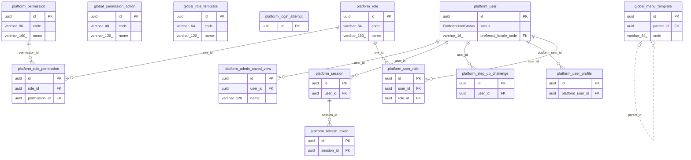
```mermaid
erDiagram
  global_menu_template {
    uuid id PK
    uuid parent_id FK
    varchar_64_ code
  }
  global_permission_action {
    uuid id PK
    varchar_48_ code
    varchar_120_ name
  }
  global_role_template {
    uuid id PK
    varchar_64_ code
    varchar_120_ name
  }
  platform_admin_saved_view {
    uuid id PK
    uuid user_id FK
    varchar_120_ name
  }
  platform_login_attempt {
    uuid id PK
  }
  platform_permission {
    uuid id PK
    varchar_96_ code
    varchar_160_ name
  }
  platform_refresh_token {
    uuid id PK
    uuid session_id FK
  }
  platform_role {
    uuid id PK
    varchar_64_ code
    varchar_160_ name
  }
  platform_role_permission {
    uuid id PK
    uuid role_id FK
    uuid permission_id FK
  }
  platform_session {
    uuid id PK
    uuid user_id FK
  }
  platform_step_up_challenge {
    uuid id PK
    uuid user_id FK
  }
  platform_user {
    uuid id PK
    PlatformUserStatus status
    varchar_16_ preferred_locale_code FK
  }
  platform_user_profile {
    uuid id PK
    uuid platform_user_id FK
  }
  platform_user_role {
    uuid id PK
    uuid user_id FK
    uuid role_id FK
  }
  global_menu_template |o..o{ global_menu_template : "parent_id"
  platform_user ||--o{ platform_admin_saved_view : "user_id"
  platform_session ||--o{ platform_refresh_token : "session_id"
  platform_permission ||--o{ platform_role_permission : "permission_id"
  platform_role ||--o{ platform_role_permission : "role_id"
  platform_user ||--o{ platform_session : "user_id"
  platform_user ||--o{ platform_step_up_challenge : "user_id"
  platform_user ||--o{ platform_user_profile : "platform_user_id"
  platform_role ||--o{ platform_user_role : "role_id"
  platform_user ||--o{ platform_user_role : "user_id"
```

### Tenancy dan Provisioning

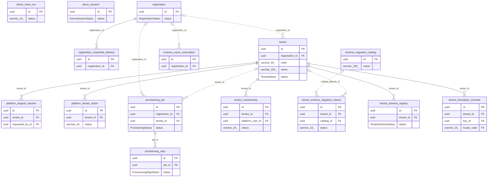
```mermaid
erDiagram
  demo_reset_run {
    uuid id PK
    varchar_24_ status
  }
  demo_session {
    uuid id PK
    DemoSessionStatus status
  }
  platform_support_session {
    uuid id PK
    uuid tenant_id FK
    uuid requested_by_id FK
  }
  platform_tenant_action {
    uuid id PK
    uuid tenant_id FK
    varchar_24_ status
  }
  provisioning_job {
    uuid id PK
    uuid registration_id FK
    uuid tenant_id FK
    ProvisioningStatus status
  }
  provisioning_step {
    uuid id PK
    uuid job_id FK
    ProvisioningStepStatus status
  }
  registration {
    uuid id PK
    RegistrationStatus status
  }
  registration_credential_delivery {
    uuid id PK
    uuid registration_id FK
  }
  schema_migration_catalog {
    uuid id PK
    varchar_160_ name
  }
  schema_name_reservation {
    uuid id PK
    uuid registration_id FK
  }
  tenant {
    uuid id PK
    uuid registration_id FK
    varchar_64_ code
    varchar_255_ name
    TenantStatus status
  }
  tenant_membership {
    uuid id PK
    uuid tenant_id FK
    uuid platform_user_id FK
    varchar_24_ status
  }
  tenant_schema_migration_history {
    uuid id PK
    uuid tenant_id FK
    uuid catalog_id FK
    varchar_24_ status
  }
  tenant_schema_registry {
    uuid id PK
    uuid tenant_id FK
    TenantSchemaStatus status
  }
  tenant_translation_override {
    uuid id PK
    uuid tenant_id FK
    uuid key_id FK
    varchar_16_ locale_code FK
  }
  tenant ||--o{ platform_support_session : "tenant_id"
  tenant ||--o{ platform_tenant_action : "tenant_id"
  registration |o..o{ provisioning_job : "registration_id"
  tenant |o..o{ provisioning_job : "tenant_id"
  provisioning_job ||--o{ provisioning_step : "job_id"
  registration ||--o{ registration_credential_delivery : "registration_id"
  registration |o..o{ schema_name_reservation : "registration_id"
  registration |o..o{ tenant : "registration_id"
  tenant ||--o{ tenant_membership : "tenant_id"
  schema_migration_catalog |o..o{ tenant_schema_migration_history : "catalog_id"
  tenant |o..o{ tenant_schema_migration_history : "tenant_id"
  tenant ||--o{ tenant_schema_registry : "tenant_id"
  tenant ||--o{ tenant_translation_override : "tenant_id"
```

### Katalog Produk dan Paket

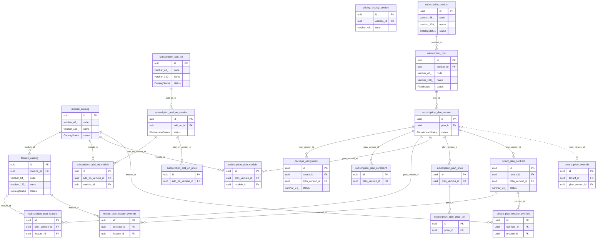
```mermaid
erDiagram
  feature_catalog {
    uuid id PK
    uuid module_id FK
    varchar_64_ code
    varchar_120_ name
    CatalogStatus status
  }
  module_catalog {
    uuid id PK
    varchar_48_ code
    varchar_120_ name
    CatalogStatus status
  }
  package_assignment {
    uuid id PK
    uuid tenant_id FK
    uuid plan_version_id FK
    varchar_24_ status
  }
  pricing_display_section {
    uuid id PK
    uuid website_id FK
    varchar_48_ code
  }
  subscription_add_on {
    uuid id PK
    varchar_48_ code
    varchar_120_ name
    CatalogStatus status
  }
  subscription_add_on_module {
    uuid id PK
    uuid add_on_version_id FK
    uuid module_id FK
  }
  subscription_add_on_price {
    uuid id PK
    uuid add_on_version_id FK
  }
  subscription_add_on_version {
    uuid id PK
    uuid add_on_id FK
    PlanVersionStatus status
  }
  subscription_plan {
    uuid id PK
    uuid product_id FK
    varchar_48_ code
    varchar_120_ name
    PlanStatus status
  }
  subscription_plan_constraint {
    uuid id PK
    uuid plan_version_id FK
  }
  subscription_plan_feature {
    uuid id PK
    uuid plan_version_id FK
    uuid feature_id FK
  }
  subscription_plan_module {
    uuid id PK
    uuid plan_version_id FK
    uuid module_id FK
  }
  subscription_plan_price {
    uuid id PK
    uuid plan_version_id FK
  }
  subscription_plan_price_tier {
    uuid id PK
    uuid price_id FK
  }
  subscription_plan_version {
    uuid id PK
    uuid plan_id FK
    PlanVersionStatus status
  }
  subscription_product {
    uuid id PK
    varchar_48_ code
    varchar_120_ name
    CatalogStatus status
  }
  tenant_plan_contract {
    uuid id PK
    uuid tenant_id FK
    uuid plan_version_id FK
    varchar_24_ status
  }
  tenant_plan_feature_override {
    uuid id PK
    uuid contract_id FK
    uuid feature_id FK
  }
  tenant_plan_module_override {
    uuid id PK
    uuid contract_id FK
    uuid module_id FK
  }
  tenant_price_override {
    uuid id PK
    uuid tenant_id FK
    uuid plan_version_id FK
  }
  module_catalog ||--o{ feature_catalog : "module_id"
  subscription_plan_version ||--o{ package_assignment : "plan_version_id"
  subscription_add_on_version ||--o{ subscription_add_on_module : "add_on_version_id"
  module_catalog ||--o{ subscription_add_on_module : "module_id"
  subscription_add_on_version ||--o{ subscription_add_on_price : "add_on_version_id"
  subscription_add_on ||--o{ subscription_add_on_version : "add_on_id"
  subscription_product ||--o{ subscription_plan : "product_id"
  subscription_plan_version ||--o{ subscription_plan_constraint : "plan_version_id"
  feature_catalog ||--o{ subscription_plan_feature : "feature_id"
  subscription_plan_version ||--o{ subscription_plan_feature : "plan_version_id"
  module_catalog ||--o{ subscription_plan_module : "module_id"
  subscription_plan_version ||--o{ subscription_plan_module : "plan_version_id"
  subscription_plan_version ||--o{ subscription_plan_price : "plan_version_id"
  subscription_plan_price ||--o{ subscription_plan_price_tier : "price_id"
  subscription_plan ||--o{ subscription_plan_version : "plan_id"
  subscription_plan_version ||--o{ tenant_plan_contract : "plan_version_id"
  tenant_plan_contract ||--o{ tenant_plan_feature_override : "contract_id"
  feature_catalog ||--o{ tenant_plan_feature_override : "feature_id"
  tenant_plan_contract ||--o{ tenant_plan_module_override : "contract_id"
  module_catalog ||--o{ tenant_plan_module_override : "module_id"
  subscription_plan_version |o..o{ tenant_price_override : "plan_version_id"
```

### Diskon dan Promo

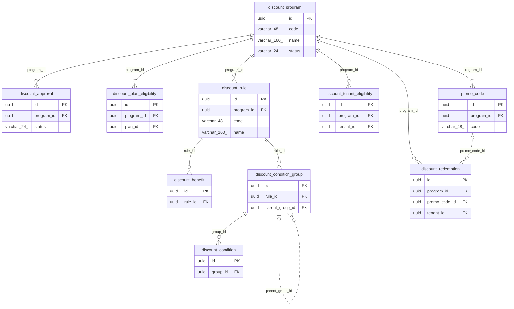
```mermaid
erDiagram
  discount_approval {
    uuid id PK
    uuid program_id FK
    varchar_24_ status
  }
  discount_benefit {
    uuid id PK
    uuid rule_id FK
  }
  discount_condition {
    uuid id PK
    uuid group_id FK
  }
  discount_condition_group {
    uuid id PK
    uuid rule_id FK
    uuid parent_group_id FK
  }
  discount_plan_eligibility {
    uuid id PK
    uuid program_id FK
    uuid plan_id FK
  }
  discount_program {
    uuid id PK
    varchar_48_ code
    varchar_160_ name
    varchar_24_ status
  }
  discount_redemption {
    uuid id PK
    uuid program_id FK
    uuid promo_code_id FK
    uuid tenant_id FK
  }
  discount_rule {
    uuid id PK
    uuid program_id FK
    varchar_48_ code
    varchar_160_ name
  }
  discount_tenant_eligibility {
    uuid id PK
    uuid program_id FK
    uuid tenant_id FK
  }
  promo_code {
    uuid id PK
    uuid program_id FK
    varchar_48_ code
  }
  discount_program ||--o{ discount_approval : "program_id"
  discount_rule ||--o{ discount_benefit : "rule_id"
  discount_condition_group ||--o{ discount_condition : "group_id"
  discount_condition_group |o..o{ discount_condition_group : "parent_group_id"
  discount_rule ||--o{ discount_condition_group : "rule_id"
  discount_program ||--o{ discount_plan_eligibility : "program_id"
  discount_program ||--o{ discount_redemption : "program_id"
  promo_code |o..o{ discount_redemption : "promo_code_id"
  discount_program ||--o{ discount_rule : "program_id"
  discount_program ||--o{ discount_tenant_eligibility : "program_id"
  discount_program ||--o{ promo_code : "program_id"
```

### Billing dan Langganan

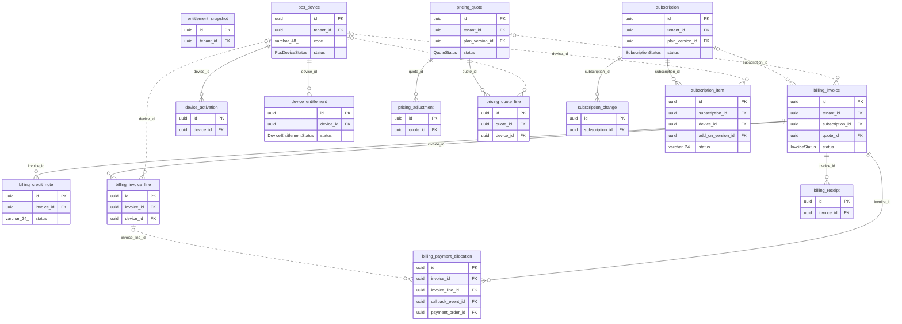
```mermaid
erDiagram
  billing_credit_note {
    uuid id PK
    uuid invoice_id FK
    varchar_24_ status
  }
  billing_invoice {
    uuid id PK
    uuid tenant_id FK
    uuid subscription_id FK
    uuid quote_id FK
    InvoiceStatus status
  }
  billing_invoice_line {
    uuid id PK
    uuid invoice_id FK
    uuid device_id FK
  }
  billing_payment_allocation {
    uuid id PK
    uuid invoice_id FK
    uuid invoice_line_id FK
    uuid callback_event_id FK
    uuid payment_order_id FK
  }
  billing_receipt {
    uuid id PK
    uuid invoice_id FK
  }
  device_activation {
    uuid id PK
    uuid device_id FK
  }
  device_entitlement {
    uuid id PK
    uuid device_id FK
    DeviceEntitlementStatus status
  }
  entitlement_snapshot {
    uuid id PK
    uuid tenant_id FK
  }
  pos_device {
    uuid id PK
    uuid tenant_id FK
    varchar_48_ code
    PosDeviceStatus status
  }
  pricing_adjustment {
    uuid id PK
    uuid quote_id FK
  }
  pricing_quote {
    uuid id PK
    uuid tenant_id FK
    uuid plan_version_id FK
    QuoteStatus status
  }
  pricing_quote_line {
    uuid id PK
    uuid quote_id FK
    uuid device_id FK
  }
  subscription {
    uuid id PK
    uuid tenant_id FK
    uuid plan_version_id FK
    SubscriptionStatus status
  }
  subscription_change {
    uuid id PK
    uuid subscription_id FK
  }
  subscription_item {
    uuid id PK
    uuid subscription_id FK
    uuid device_id FK
    uuid add_on_version_id FK
    varchar_24_ status
  }
  billing_invoice ||--o{ billing_credit_note : "invoice_id"
  pricing_quote |o..o{ billing_invoice : "quote_id"
  subscription |o..o{ billing_invoice : "subscription_id"
  pos_device |o..o{ billing_invoice_line : "device_id"
  billing_invoice ||--o{ billing_invoice_line : "invoice_id"
  billing_invoice ||--o{ billing_payment_allocation : "invoice_id"
  billing_invoice_line |o..o{ billing_payment_allocation : "invoice_line_id"
  billing_invoice ||--o{ billing_receipt : "invoice_id"
  pos_device ||--o{ device_activation : "device_id"
  pos_device ||--o{ device_entitlement : "device_id"
  pricing_quote ||--o{ pricing_adjustment : "quote_id"
  pos_device |o..o{ pricing_quote_line : "device_id"
  pricing_quote ||--o{ pricing_quote_line : "quote_id"
  subscription ||--o{ subscription_change : "subscription_id"
  pos_device |o..o{ subscription_item : "device_id"
  subscription ||--o{ subscription_item : "subscription_id"
```

### Pembayaran

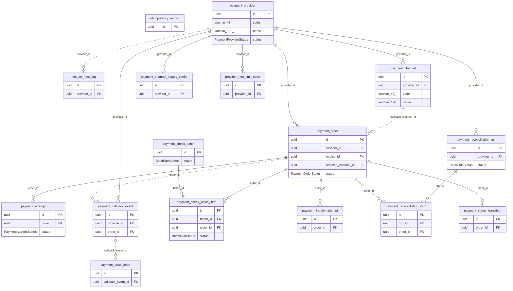
```mermaid
erDiagram
  host_to_host_log {
    uuid id PK
    uuid provider_id FK
  }
  idempotency_record {
    uuid id PK
  }
  payment_attempt {
    uuid id PK
    uuid order_id FK
    PaymentAttemptStatus status
  }
  payment_callback_event {
    uuid id PK
    uuid provider_id FK
    uuid order_id FK
  }
  payment_channel {
    uuid id PK
    uuid provider_id FK
    varchar_48_ code
    varchar_120_ name
  }
  payment_channel_legacy_config {
    uuid id PK
    uuid provider_id FK
  }
  payment_check_batch {
    uuid id PK
    BatchRunStatus status
  }
  payment_check_batch_item {
    uuid id PK
    uuid batch_id FK
    uuid order_id FK
    BatchRunStatus status
  }
  payment_dead_letter {
    uuid id PK
    uuid callback_event_id FK
  }
  payment_inquiry_attempt {
    uuid id PK
    uuid order_id FK
  }
  payment_order {
    uuid id PK
    uuid provider_id FK
    uuid invoice_id FK
    uuid selected_channel_id FK
    PaymentOrderStatus status
  }
  payment_provider {
    uuid id PK
    varchar_48_ code
    varchar_120_ name
    PaymentProviderStatus status
  }
  payment_reconciliation_item {
    uuid id PK
    uuid run_id FK
    uuid order_id FK
  }
  payment_reconciliation_run {
    uuid id PK
    uuid provider_id FK
    BatchRunStatus status
  }
  payment_status_transition {
    uuid id PK
    uuid order_id FK
  }
  provider_rate_limit_state {
    uuid id PK
    uuid provider_id FK
  }
  payment_provider |o..o{ host_to_host_log : "provider_id"
  payment_order ||--o{ payment_attempt : "order_id"
  payment_order |o..o{ payment_callback_event : "order_id"
  payment_provider ||--o{ payment_callback_event : "provider_id"
  payment_provider ||--o{ payment_channel : "provider_id"
  payment_provider ||--o{ payment_channel_legacy_config : "provider_id"
  payment_check_batch ||--o{ payment_check_batch_item : "batch_id"
  payment_order ||--o{ payment_check_batch_item : "order_id"
  payment_callback_event |o..o{ payment_dead_letter : "callback_event_id"
  payment_order ||--o{ payment_inquiry_attempt : "order_id"
  payment_provider ||--o{ payment_order : "provider_id"
  payment_channel |o..o{ payment_order : "selected_channel_id"
  payment_order ||--o{ payment_reconciliation_item : "order_id"
  payment_reconciliation_run ||--o{ payment_reconciliation_item : "run_id"
  payment_provider ||--o{ payment_reconciliation_run : "provider_id"
  payment_order ||--o{ payment_status_transition : "order_id"
  payment_provider ||--o{ provider_rate_limit_state : "provider_id"
```

### CMS dan Website

```mermaid
erDiagram
  announcement {
    uuid id PK
    varchar_48_ code
  }
  call_to_action {
    uuid id PK
    varchar_48_ code
  }
  cms_block {
    uuid id PK
    uuid page_version_id FK
    uuid parent_block_id FK
  }
  cms_block_translation {
    uuid id PK
    uuid block_id FK
    varchar_16_ locale_code FK
  }
  cms_footer_item {
    uuid id PK
    uuid footer_section_id FK
  }
  cms_footer_section {
    uuid id PK
    uuid website_id FK
    varchar_48_ code
  }
  cms_navigation {
    uuid id PK
    uuid website_id FK
    varchar_48_ code
    varchar_120_ name
  }
  cms_navigation_item {
    uuid id PK
    uuid navigation_id FK
    uuid parent_id FK
    uuid page_id FK
  }
  cms_page {
    uuid id PK
    uuid website_id FK
    uuid parent_id FK
    varchar_64_ code
    CmsStatus status
  }
  cms_page_translation {
    uuid id PK
    uuid page_version_id FK
    varchar_16_ locale_code FK
  }
  cms_page_version {
    uuid id PK
    uuid page_id FK
    CmsStatus status
  }
  cms_preview_token {
    uuid id PK
  }
  cms_publication_workflow {
    uuid id PK
    CmsStatus status
  }
  contact_message {
    uuid id PK
    varchar_160_ name
    ContactMessageStatus status
  }
  contact_office {
    uuid id PK
    varchar_48_ code
    varchar_160_ name
  }
  faq_category {
    uuid id PK
    varchar_48_ code
  }
  faq_item {
    uuid id PK
    uuid category_id FK
    varchar_64_ code
  }
  hero_slide {
    uuid id PK
    uuid website_id FK
    varchar_48_ code
    uuid background_asset_id FK
  }
  marketing_feature {
    uuid id PK
    varchar_48_ code
    uuid module_id FK
    uuid image_asset_id FK
  }
  media_asset {
    uuid id PK
    uuid folder_id FK
    varchar_96_ code
  }
  media_folder {
    uuid id PK
    uuid parent_id FK
    varchar_64_ code
    varchar_160_ name
  }
  news_article {
    uuid id PK
    uuid category_id FK
    uuid author_user_id FK
    varchar_64_ code
    CmsStatus status
    uuid featured_image_id FK
  }
  news_article_tag {
    uuid id PK
    uuid article_id FK
    uuid tag_id FK
  }
  news_article_translation {
    uuid id PK
    uuid article_version_id FK
    varchar_16_ locale_code FK
  }
  news_article_version {
    uuid id PK
    uuid article_id FK
    CmsStatus status
  }
  news_category {
    uuid id PK
    uuid parent_id FK
    varchar_48_ code
  }
  news_tag {
    uuid id PK
    varchar_48_ code
  }
  newsletter_subscriber {
    uuid id PK
    NewsletterStatus status
  }
  partner_logo {
    uuid id PK
    varchar_48_ code
    varchar_160_ name
    uuid logo_asset_id FK
  }
  redirect_rule {
    uuid id PK
    uuid website_id FK
  }
  seo_structured_data {
    uuid id PK
    uuid page_id FK
  }
  testimonial {
    uuid id PK
    varchar_48_ code
    uuid avatar_asset_id FK
  }
  website {
    uuid id PK
    varchar_48_ code
    varchar_160_ name
  }
  website_domain {
    uuid id PK
    uuid website_id FK
  }
  cms_page_version ||--o{ cms_block : "page_version_id"
  cms_block |o..o{ cms_block : "parent_block_id"
  cms_block ||--o{ cms_block_translation : "block_id"
  cms_footer_section ||--o{ cms_footer_item : "footer_section_id"
  website ||--o{ cms_footer_section : "website_id"
  website ||--o{ cms_navigation : "website_id"
  cms_navigation ||--o{ cms_navigation_item : "navigation_id"
  cms_page |o..o{ cms_navigation_item : "page_id"
  cms_navigation_item |o..o{ cms_navigation_item : "parent_id"
  cms_page |o..o{ cms_page : "parent_id"
  website ||--o{ cms_page : "website_id"
  cms_page_version ||--o{ cms_page_translation : "page_version_id"
  cms_page ||--o{ cms_page_version : "page_id"
  faq_category ||--o{ faq_item : "category_id"
  media_asset |o..o{ hero_slide : "background_asset_id"
  website ||--o{ hero_slide : "website_id"
  media_asset |o..o{ marketing_feature : "image_asset_id"
  media_folder |o..o{ media_asset : "folder_id"
  media_folder |o..o{ media_folder : "parent_id"
  news_category ||--o{ news_article : "category_id"
  media_asset |o..o{ news_article : "featured_image_id"
  news_article ||--o{ news_article_tag : "article_id"
  news_tag ||--o{ news_article_tag : "tag_id"
  news_article_version ||--o{ news_article_translation : "article_version_id"
  news_article ||--o{ news_article_version : "article_id"
  news_category |o..o{ news_category : "parent_id"
  media_asset |o..o{ partner_logo : "logo_asset_id"
  website ||--o{ redirect_rule : "website_id"
  cms_page ||--o{ seo_structured_data : "page_id"
  media_asset |o..o{ testimonial : "avatar_asset_id"
  website ||--o{ website_domain : "website_id"
```

### Internasionalisasi

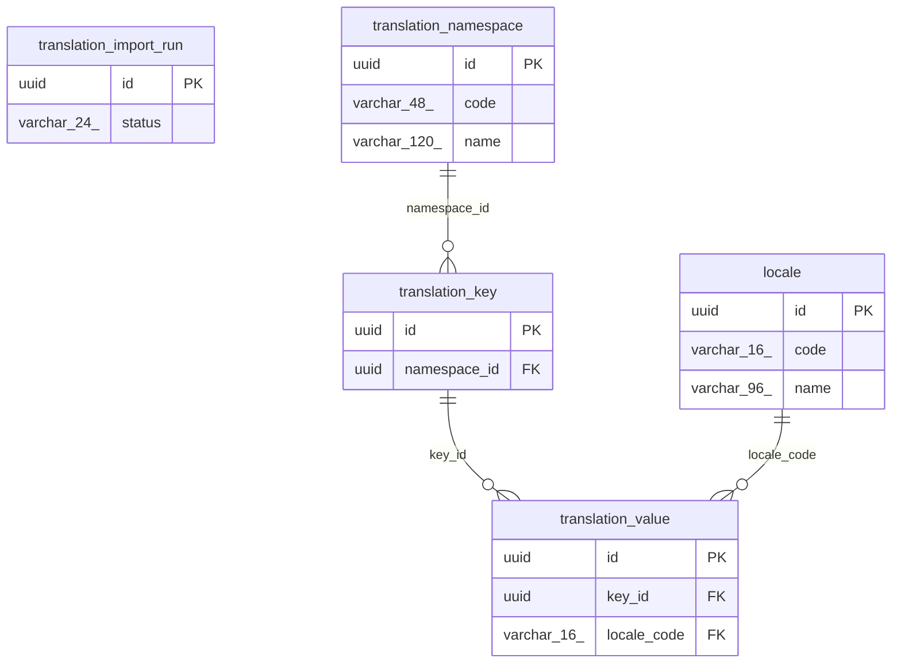
```mermaid
erDiagram
  locale {
    uuid id PK
    varchar_16_ code
    varchar_96_ name
  }
  translation_import_run {
    uuid id PK
    varchar_24_ status
  }
  translation_key {
    uuid id PK
    uuid namespace_id FK
  }
  translation_namespace {
    uuid id PK
    varchar_48_ code
    varchar_120_ name
  }
  translation_value {
    uuid id PK
    uuid key_id FK
    varchar_16_ locale_code FK
  }
  translation_namespace ||--o{ translation_key : "namespace_id"
  translation_key ||--o{ translation_value : "key_id"
  locale ||--o{ translation_value : "locale_code"
```

### Pengaturan Platform

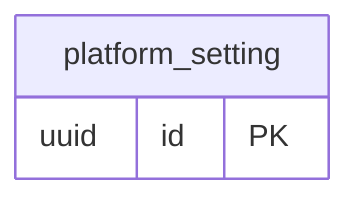
```mermaid
erDiagram
  platform_setting {
    uuid id PK
  }
```

### Relasi lintas domain `platform`

| Tabel anak | Kolom | Tabel induk | ON DELETE |
| --- | --- | --- | --- |
| `billing_invoice` | `tenant_id` | `tenant` | RESTRICT |
| `billing_payment_allocation` | `callback_event_id` | `payment_callback_event` | SET NULL |
| `billing_payment_allocation` | `payment_order_id` | `payment_order` | SET NULL |
| `cms_block_translation` | `locale_code` | `locale` | RESTRICT |
| `cms_page_translation` | `locale_code` | `locale` | RESTRICT |
| `discount_plan_eligibility` | `plan_id` | `subscription_plan` | CASCADE |
| `discount_redemption` | `tenant_id` | `tenant` | RESTRICT |
| `discount_tenant_eligibility` | `tenant_id` | `tenant` | CASCADE |
| `entitlement_snapshot` | `tenant_id` | `tenant` | CASCADE |
| `marketing_feature` | `module_id` | `module_catalog` | SET NULL |
| `news_article` | `author_user_id` | `platform_user` | SET NULL |
| `news_article_translation` | `locale_code` | `locale` | RESTRICT |
| `package_assignment` | `tenant_id` | `tenant` | CASCADE |
| `payment_order` | `invoice_id` | `billing_invoice` | RESTRICT |
| `platform_support_session` | `requested_by_id` | `platform_user` | RESTRICT |
| `platform_user` | `preferred_locale_code` | `locale` | SET NULL |
| `pos_device` | `tenant_id` | `tenant` | CASCADE |
| `pricing_display_section` | `website_id` | `website` | CASCADE |
| `pricing_quote` | `plan_version_id` | `subscription_plan_version` | RESTRICT |
| `pricing_quote` | `tenant_id` | `tenant` | RESTRICT |
| `subscription` | `plan_version_id` | `subscription_plan_version` | RESTRICT |
| `subscription` | `tenant_id` | `tenant` | RESTRICT |
| `subscription_item` | `add_on_version_id` | `subscription_add_on_version` | SET NULL |
| `tenant_membership` | `platform_user_id` | `platform_user` | CASCADE |
| `tenant_plan_contract` | `tenant_id` | `tenant` | CASCADE |
| `tenant_price_override` | `tenant_id` | `tenant` | CASCADE |
| `tenant_translation_override` | `key_id` | `translation_key` | CASCADE |
| `tenant_translation_override` | `locale_code` | `locale` | RESTRICT |

## Schema `demo`

### Organisasi dan Struktur

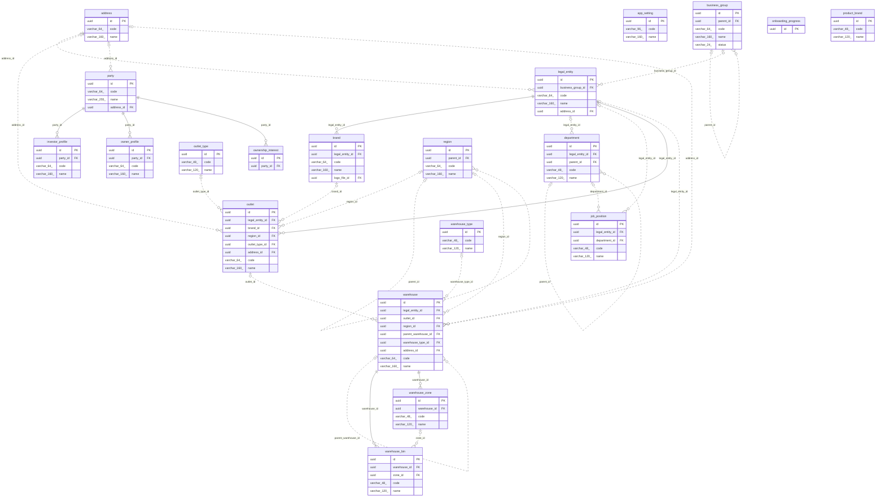
```mermaid
erDiagram
  address {
    uuid id PK
    varchar_64_ code
    varchar_160_ name
  }
  app_setting {
    uuid id PK
    varchar_96_ code
    varchar_160_ name
  }
  brand {
    uuid id PK
    uuid legal_entity_id FK
    varchar_64_ code
    varchar_160_ name
    uuid logo_file_id FK
  }
  business_group {
    uuid id PK
    uuid parent_id FK
    varchar_64_ code
    varchar_160_ name
    varchar_24_ status
  }
  department {
    uuid id PK
    uuid legal_entity_id FK
    uuid parent_id FK
    varchar_48_ code
    varchar_120_ name
  }
  investor_profile {
    uuid id PK
    uuid party_id FK
    varchar_64_ code
    varchar_160_ name
  }
  job_position {
    uuid id PK
    uuid legal_entity_id FK
    uuid department_id FK
    varchar_48_ code
    varchar_120_ name
  }
  legal_entity {
    uuid id PK
    uuid business_group_id FK
    varchar_64_ code
    varchar_160_ name
    uuid address_id FK
  }
  onboarding_progress {
    uuid id PK
  }
  outlet {
    uuid id PK
    uuid legal_entity_id FK
    uuid brand_id FK
    uuid region_id FK
    uuid outlet_type_id FK
    uuid address_id FK
    varchar_64_ code
    varchar_160_ name
  }
  outlet_type {
    uuid id PK
    varchar_48_ code
    varchar_120_ name
  }
  owner_profile {
    uuid id PK
    uuid party_id FK
    varchar_64_ code
    varchar_160_ name
  }
  ownership_interest {
    uuid id PK
    uuid party_id FK
  }
  party {
    uuid id PK
    varchar_64_ code
    varchar_255_ name
    uuid address_id FK
  }
  product_brand {
    uuid id PK
    varchar_48_ code
    varchar_120_ name
  }
  region {
    uuid id PK
    uuid parent_id FK
    varchar_64_ code
    varchar_160_ name
  }
  warehouse {
    uuid id PK
    uuid legal_entity_id FK
    uuid outlet_id FK
    uuid region_id FK
    uuid parent_warehouse_id FK
    uuid warehouse_type_id FK
    uuid address_id FK
    varchar_64_ code
    varchar_160_ name
  }
  warehouse_bin {
    uuid id PK
    uuid warehouse_id FK
    uuid zone_id FK
    varchar_48_ code
    varchar_120_ name
  }
  warehouse_type {
    uuid id PK
    varchar_48_ code
    varchar_120_ name
  }
  warehouse_zone {
    uuid id PK
    uuid warehouse_id FK
    varchar_48_ code
    varchar_120_ name
  }
  legal_entity ||--o{ brand : "legal_entity_id"
  business_group |o..o{ business_group : "parent_id"
  legal_entity |o..o{ department : "legal_entity_id"
  department |o..o{ department : "parent_id"
  party ||--o{ investor_profile : "party_id"
  department |o..o{ job_position : "department_id"
  legal_entity |o..o{ job_position : "legal_entity_id"
  address |o..o{ legal_entity : "address_id"
  business_group |o..o{ legal_entity : "business_group_id"
  address |o..o{ outlet : "address_id"
  brand |o..o{ outlet : "brand_id"
  legal_entity ||--o{ outlet : "legal_entity_id"
  outlet_type |o..o{ outlet : "outlet_type_id"
  region |o..o{ outlet : "region_id"
  party ||--o{ owner_profile : "party_id"
  party ||--o{ ownership_interest : "party_id"
  address |o..o{ party : "address_id"
  region |o..o{ region : "parent_id"
  address |o..o{ warehouse : "address_id"
  legal_entity |o..o{ warehouse : "legal_entity_id"
  outlet |o..o{ warehouse : "outlet_id"
  warehouse |o..o{ warehouse : "parent_warehouse_id"
  region |o..o{ warehouse : "region_id"
  warehouse_type |o..o{ warehouse : "warehouse_type_id"
  warehouse ||--o{ warehouse_bin : "warehouse_id"
  warehouse_zone |o..o{ warehouse_bin : "zone_id"
  warehouse ||--o{ warehouse_zone : "warehouse_id"
```

### Akses dan Menu

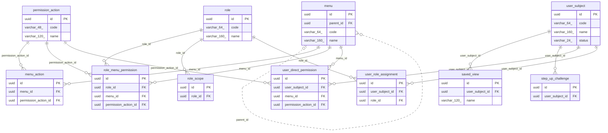
```mermaid
erDiagram
  menu {
    uuid id PK
    uuid parent_id FK
    varchar_64_ code
    varchar_160_ name
  }
  menu_action {
    uuid id PK
    uuid menu_id FK
    uuid permission_action_id FK
  }
  permission_action {
    uuid id PK
    varchar_48_ code
    varchar_120_ name
  }
  role {
    uuid id PK
    varchar_64_ code
    varchar_160_ name
  }
  role_menu_permission {
    uuid id PK
    uuid role_id FK
    uuid menu_id FK
    uuid permission_action_id FK
  }
  role_scope {
    uuid id PK
    uuid role_id FK
  }
  saved_view {
    uuid id PK
    uuid user_subject_id FK
    varchar_120_ name
  }
  step_up_challenge {
    uuid id PK
    uuid user_subject_id FK
  }
  user_direct_permission {
    uuid id PK
    uuid user_subject_id FK
    uuid menu_id FK
    uuid permission_action_id FK
  }
  user_role_assignment {
    uuid id PK
    uuid user_subject_id FK
    uuid role_id FK
  }
  user_subject {
    uuid id PK
    varchar_64_ code
    varchar_160_ name
    varchar_24_ status
  }
  menu |o..o{ menu : "parent_id"
  menu ||--o{ menu_action : "menu_id"
  permission_action ||--o{ menu_action : "permission_action_id"
  menu ||--o{ role_menu_permission : "menu_id"
  permission_action ||--o{ role_menu_permission : "permission_action_id"
  role ||--o{ role_menu_permission : "role_id"
  role ||--o{ role_scope : "role_id"
  user_subject ||--o{ saved_view : "user_subject_id"
  user_subject ||--o{ step_up_challenge : "user_subject_id"
  menu ||--o{ user_direct_permission : "menu_id"
  permission_action ||--o{ user_direct_permission : "permission_action_id"
  user_subject ||--o{ user_direct_permission : "user_subject_id"
  role ||--o{ user_role_assignment : "role_id"
  user_subject ||--o{ user_role_assignment : "user_subject_id"
```

### Katalog Produk

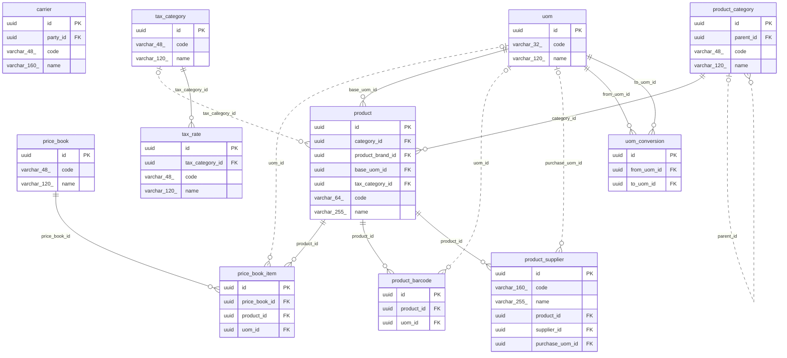
```mermaid
erDiagram
  carrier {
    uuid id PK
    uuid party_id FK
    varchar_48_ code
    varchar_160_ name
  }
  price_book {
    uuid id PK
    varchar_48_ code
    varchar_120_ name
  }
  price_book_item {
    uuid id PK
    uuid price_book_id FK
    uuid product_id FK
    uuid uom_id FK
  }
  product {
    uuid id PK
    uuid category_id FK
    uuid product_brand_id FK
    uuid base_uom_id FK
    uuid tax_category_id FK
    varchar_64_ code
    varchar_255_ name
  }
  product_barcode {
    uuid id PK
    uuid product_id FK
    uuid uom_id FK
  }
  product_category {
    uuid id PK
    uuid parent_id FK
    varchar_48_ code
    varchar_120_ name
  }
  product_supplier {
    uuid id PK
    varchar_160_ code
    varchar_255_ name
    uuid product_id FK
    uuid supplier_id FK
    uuid purchase_uom_id FK
  }
  tax_category {
    uuid id PK
    varchar_48_ code
    varchar_120_ name
  }
  tax_rate {
    uuid id PK
    uuid tax_category_id FK
    varchar_48_ code
    varchar_120_ name
  }
  uom {
    uuid id PK
    varchar_32_ code
    varchar_120_ name
  }
  uom_conversion {
    uuid id PK
    uuid from_uom_id FK
    uuid to_uom_id FK
  }
  price_book ||--o{ price_book_item : "price_book_id"
  product ||--o{ price_book_item : "product_id"
  uom |o..o{ price_book_item : "uom_id"
  uom ||--o{ product : "base_uom_id"
  product_category ||--o{ product : "category_id"
  tax_category |o..o{ product : "tax_category_id"
  product ||--o{ product_barcode : "product_id"
  uom |o..o{ product_barcode : "uom_id"
  product_category |o..o{ product_category : "parent_id"
  product ||--o{ product_supplier : "product_id"
  uom |o..o{ product_supplier : "purchase_uom_id"
  tax_category ||--o{ tax_rate : "tax_category_id"
  uom ||--o{ uom_conversion : "from_uom_id"
  uom ||--o{ uom_conversion : "to_uom_id"
```

### Mitra Bisnis

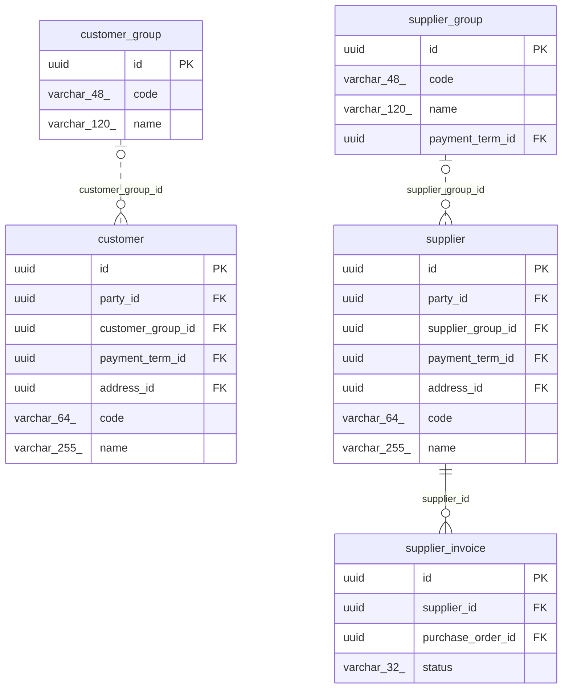
```mermaid
erDiagram
  customer {
    uuid id PK
    uuid party_id FK
    uuid customer_group_id FK
    uuid payment_term_id FK
    uuid address_id FK
    varchar_64_ code
    varchar_255_ name
  }
  customer_group {
    uuid id PK
    varchar_48_ code
    varchar_120_ name
  }
  supplier {
    uuid id PK
    uuid party_id FK
    uuid supplier_group_id FK
    uuid payment_term_id FK
    uuid address_id FK
    varchar_64_ code
    varchar_255_ name
  }
  supplier_group {
    uuid id PK
    varchar_48_ code
    varchar_120_ name
    uuid payment_term_id FK
  }
  supplier_invoice {
    uuid id PK
    uuid supplier_id FK
    uuid purchase_order_id FK
    varchar_32_ status
  }
  customer_group |o..o{ customer : "customer_group_id"
  supplier_group |o..o{ supplier : "supplier_group_id"
  supplier ||--o{ supplier_invoice : "supplier_id"
```

### Inventori

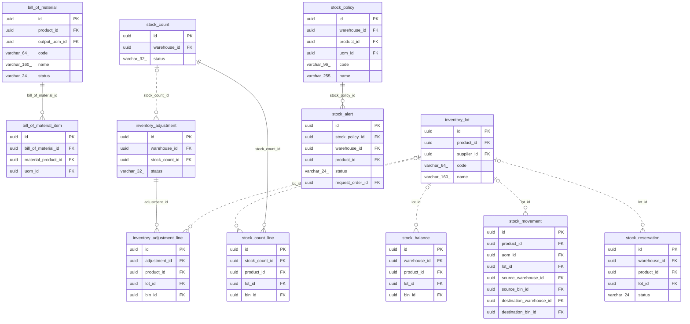
```mermaid
erDiagram
  bill_of_material {
    uuid id PK
    uuid product_id FK
    uuid output_uom_id FK
    varchar_64_ code
    varchar_160_ name
    varchar_24_ status
  }
  bill_of_material_item {
    uuid id PK
    uuid bill_of_material_id FK
    uuid material_product_id FK
    uuid uom_id FK
  }
  inventory_adjustment {
    uuid id PK
    uuid warehouse_id FK
    uuid stock_count_id FK
    varchar_32_ status
  }
  inventory_adjustment_line {
    uuid id PK
    uuid adjustment_id FK
    uuid product_id FK
    uuid lot_id FK
    uuid bin_id FK
  }
  inventory_lot {
    uuid id PK
    uuid product_id FK
    uuid supplier_id FK
    varchar_64_ code
    varchar_160_ name
  }
  stock_alert {
    uuid id PK
    uuid stock_policy_id FK
    uuid warehouse_id FK
    uuid product_id FK
    varchar_24_ status
    uuid request_order_id FK
  }
  stock_balance {
    uuid id PK
    uuid warehouse_id FK
    uuid product_id FK
    uuid lot_id FK
    uuid bin_id FK
  }
  stock_count {
    uuid id PK
    uuid warehouse_id FK
    varchar_32_ status
  }
  stock_count_line {
    uuid id PK
    uuid stock_count_id FK
    uuid product_id FK
    uuid lot_id FK
    uuid bin_id FK
  }
  stock_movement {
    uuid id PK
    uuid product_id FK
    uuid uom_id FK
    uuid lot_id FK
    uuid source_warehouse_id FK
    uuid source_bin_id FK
    uuid destination_warehouse_id FK
    uuid destination_bin_id FK
  }
  stock_policy {
    uuid id PK
    uuid warehouse_id FK
    uuid product_id FK
    uuid uom_id FK
    varchar_96_ code
    varchar_255_ name
  }
  stock_reservation {
    uuid id PK
    uuid warehouse_id FK
    uuid product_id FK
    uuid lot_id FK
    varchar_24_ status
  }
  bill_of_material ||--o{ bill_of_material_item : "bill_of_material_id"
  stock_count |o..o{ inventory_adjustment : "stock_count_id"
  inventory_adjustment ||--o{ inventory_adjustment_line : "adjustment_id"
  inventory_lot |o..o{ inventory_adjustment_line : "lot_id"
  stock_policy ||--o{ stock_alert : "stock_policy_id"
  inventory_lot |o..o{ stock_balance : "lot_id"
  inventory_lot |o..o{ stock_count_line : "lot_id"
  stock_count ||--o{ stock_count_line : "stock_count_id"
  inventory_lot |o..o{ stock_movement : "lot_id"
  inventory_lot |o..o{ stock_reservation : "lot_id"
```

### Pembelian dan Penerimaan

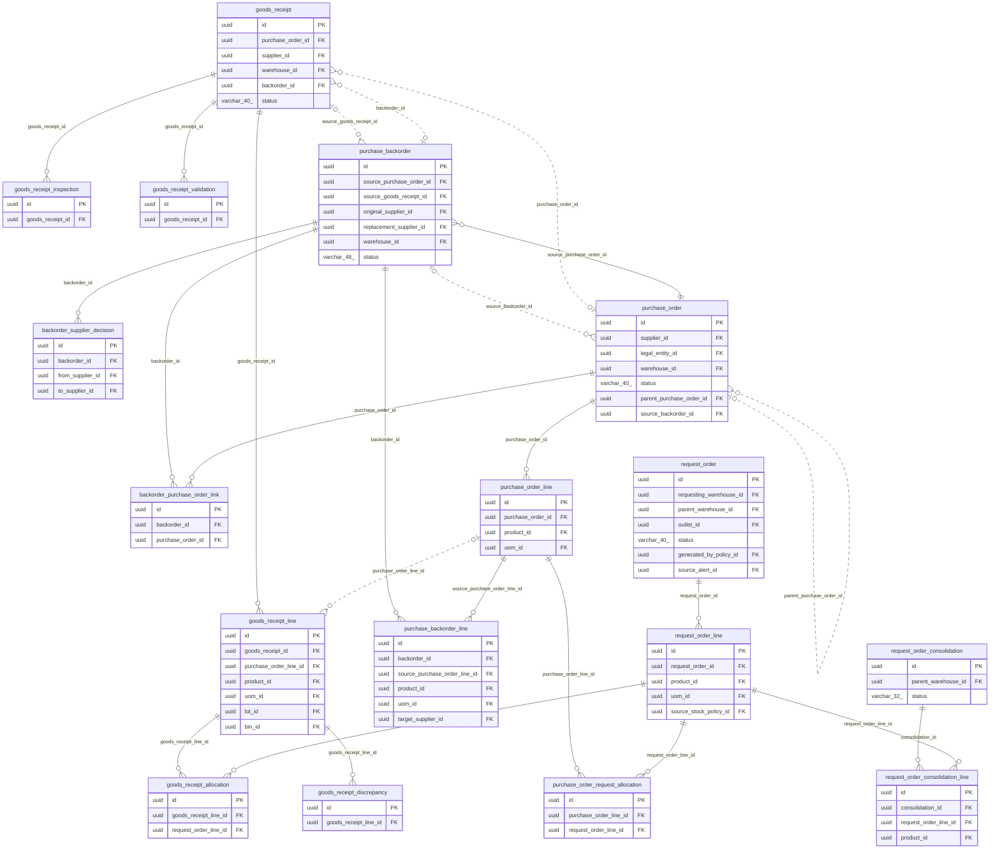
```mermaid
erDiagram
  backorder_purchase_order_link {
    uuid id PK
    uuid backorder_id FK
    uuid purchase_order_id FK
  }
  backorder_supplier_decision {
    uuid id PK
    uuid backorder_id FK
    uuid from_supplier_id FK
    uuid to_supplier_id FK
  }
  goods_receipt {
    uuid id PK
    uuid purchase_order_id FK
    uuid supplier_id FK
    uuid warehouse_id FK
    uuid backorder_id FK
    varchar_40_ status
  }
  goods_receipt_allocation {
    uuid id PK
    uuid goods_receipt_line_id FK
    uuid request_order_line_id FK
  }
  goods_receipt_discrepancy {
    uuid id PK
    uuid goods_receipt_line_id FK
  }
  goods_receipt_inspection {
    uuid id PK
    uuid goods_receipt_id FK
  }
  goods_receipt_line {
    uuid id PK
    uuid goods_receipt_id FK
    uuid purchase_order_line_id FK
    uuid product_id FK
    uuid uom_id FK
    uuid lot_id FK
    uuid bin_id FK
  }
  goods_receipt_validation {
    uuid id PK
    uuid goods_receipt_id FK
  }
  purchase_backorder {
    uuid id PK
    uuid source_purchase_order_id FK
    uuid source_goods_receipt_id FK
    uuid original_supplier_id FK
    uuid replacement_supplier_id FK
    uuid warehouse_id FK
    varchar_48_ status
  }
  purchase_backorder_line {
    uuid id PK
    uuid backorder_id FK
    uuid source_purchase_order_line_id FK
    uuid product_id FK
    uuid uom_id FK
    uuid target_supplier_id FK
  }
  purchase_order {
    uuid id PK
    uuid supplier_id FK
    uuid legal_entity_id FK
    uuid warehouse_id FK
    varchar_40_ status
    uuid parent_purchase_order_id FK
    uuid source_backorder_id FK
  }
  purchase_order_line {
    uuid id PK
    uuid purchase_order_id FK
    uuid product_id FK
    uuid uom_id FK
  }
  purchase_order_request_allocation {
    uuid id PK
    uuid purchase_order_line_id FK
    uuid request_order_line_id FK
  }
  request_order {
    uuid id PK
    uuid requesting_warehouse_id FK
    uuid parent_warehouse_id FK
    uuid outlet_id FK
    varchar_40_ status
    uuid generated_by_policy_id FK
    uuid source_alert_id FK
  }
  request_order_consolidation {
    uuid id PK
    uuid parent_warehouse_id FK
    varchar_32_ status
  }
  request_order_consolidation_line {
    uuid id PK
    uuid consolidation_id FK
    uuid request_order_line_id FK
    uuid product_id FK
  }
  request_order_line {
    uuid id PK
    uuid request_order_id FK
    uuid product_id FK
    uuid uom_id FK
    uuid source_stock_policy_id FK
  }
  purchase_backorder ||--o{ backorder_purchase_order_link : "backorder_id"
  purchase_order ||--o{ backorder_purchase_order_link : "purchase_order_id"
  purchase_backorder ||--o{ backorder_supplier_decision : "backorder_id"
  purchase_backorder |o..o{ goods_receipt : "backorder_id"
  purchase_order |o..o{ goods_receipt : "purchase_order_id"
  goods_receipt_line ||--o{ goods_receipt_allocation : "goods_receipt_line_id"
  request_order_line ||--o{ goods_receipt_allocation : "request_order_line_id"
  goods_receipt_line ||--o{ goods_receipt_discrepancy : "goods_receipt_line_id"
  goods_receipt ||--o{ goods_receipt_inspection : "goods_receipt_id"
  goods_receipt ||--o{ goods_receipt_line : "goods_receipt_id"
  purchase_order_line |o..o{ goods_receipt_line : "purchase_order_line_id"
  goods_receipt ||--o{ goods_receipt_validation : "goods_receipt_id"
  goods_receipt |o..o{ purchase_backorder : "source_goods_receipt_id"
  purchase_order ||--o{ purchase_backorder : "source_purchase_order_id"
  purchase_backorder ||--o{ purchase_backorder_line : "backorder_id"
  purchase_order_line ||--o{ purchase_backorder_line : "source_purchase_order_line_id"
  purchase_backorder |o..o{ purchase_order : "source_backorder_id"
  purchase_order |o..o{ purchase_order : "parent_purchase_order_id"
  purchase_order ||--o{ purchase_order_line : "purchase_order_id"
  purchase_order_line ||--o{ purchase_order_request_allocation : "purchase_order_line_id"
  request_order_line ||--o{ purchase_order_request_allocation : "request_order_line_id"
  request_order_consolidation ||--o{ request_order_consolidation_line : "consolidation_id"
  request_order_line ||--o{ request_order_consolidation_line : "request_order_line_id"
  request_order ||--o{ request_order_line : "request_order_id"
```

### Transfer Internal

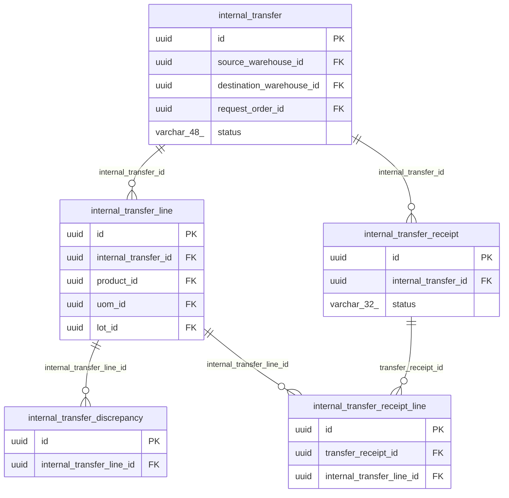
```mermaid
erDiagram
  internal_transfer {
    uuid id PK
    uuid source_warehouse_id FK
    uuid destination_warehouse_id FK
    uuid request_order_id FK
    varchar_48_ status
  }
  internal_transfer_discrepancy {
    uuid id PK
    uuid internal_transfer_line_id FK
  }
  internal_transfer_line {
    uuid id PK
    uuid internal_transfer_id FK
    uuid product_id FK
    uuid uom_id FK
    uuid lot_id FK
  }
  internal_transfer_receipt {
    uuid id PK
    uuid internal_transfer_id FK
    varchar_32_ status
  }
  internal_transfer_receipt_line {
    uuid id PK
    uuid transfer_receipt_id FK
    uuid internal_transfer_line_id FK
  }
  internal_transfer_line ||--o{ internal_transfer_discrepancy : "internal_transfer_line_id"
  internal_transfer ||--o{ internal_transfer_line : "internal_transfer_id"
  internal_transfer ||--o{ internal_transfer_receipt : "internal_transfer_id"
  internal_transfer_line ||--o{ internal_transfer_receipt_line : "internal_transfer_line_id"
  internal_transfer_receipt ||--o{ internal_transfer_receipt_line : "transfer_receipt_id"
```

### Penjualan dan POS

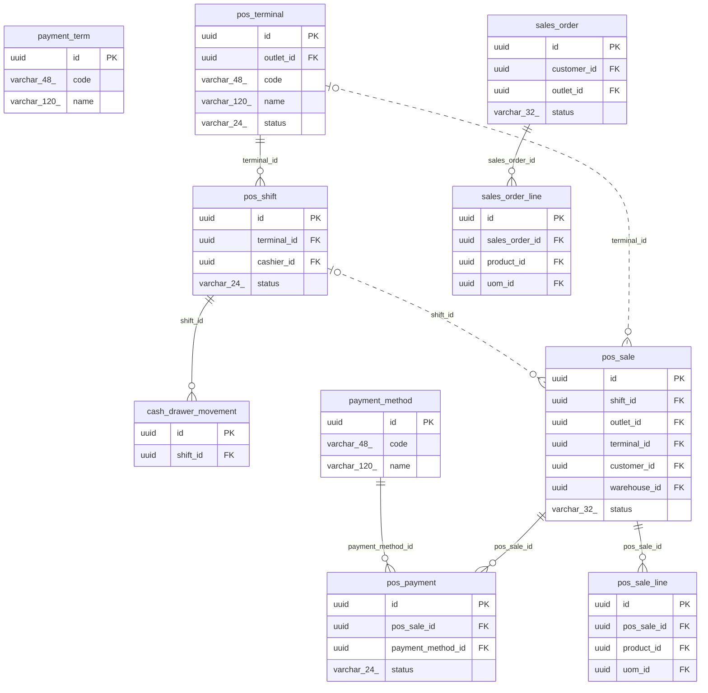
```mermaid
erDiagram
  cash_drawer_movement {
    uuid id PK
    uuid shift_id FK
  }
  payment_method {
    uuid id PK
    varchar_48_ code
    varchar_120_ name
  }
  payment_term {
    uuid id PK
    varchar_48_ code
    varchar_120_ name
  }
  pos_payment {
    uuid id PK
    uuid pos_sale_id FK
    uuid payment_method_id FK
    varchar_24_ status
  }
  pos_sale {
    uuid id PK
    uuid shift_id FK
    uuid outlet_id FK
    uuid terminal_id FK
    uuid customer_id FK
    uuid warehouse_id FK
    varchar_32_ status
  }
  pos_sale_line {
    uuid id PK
    uuid pos_sale_id FK
    uuid product_id FK
    uuid uom_id FK
  }
  pos_shift {
    uuid id PK
    uuid terminal_id FK
    uuid cashier_id FK
    varchar_24_ status
  }
  pos_terminal {
    uuid id PK
    uuid outlet_id FK
    varchar_48_ code
    varchar_120_ name
    varchar_24_ status
  }
  sales_order {
    uuid id PK
    uuid customer_id FK
    uuid outlet_id FK
    varchar_32_ status
  }
  sales_order_line {
    uuid id PK
    uuid sales_order_id FK
    uuid product_id FK
    uuid uom_id FK
  }
  pos_shift ||--o{ cash_drawer_movement : "shift_id"
  payment_method ||--o{ pos_payment : "payment_method_id"
  pos_sale ||--o{ pos_payment : "pos_sale_id"
  pos_shift |o..o{ pos_sale : "shift_id"
  pos_terminal |o..o{ pos_sale : "terminal_id"
  pos_sale ||--o{ pos_sale_line : "pos_sale_id"
  pos_terminal ||--o{ pos_shift : "terminal_id"
  sales_order ||--o{ sales_order_line : "sales_order_id"
```

### Keuangan

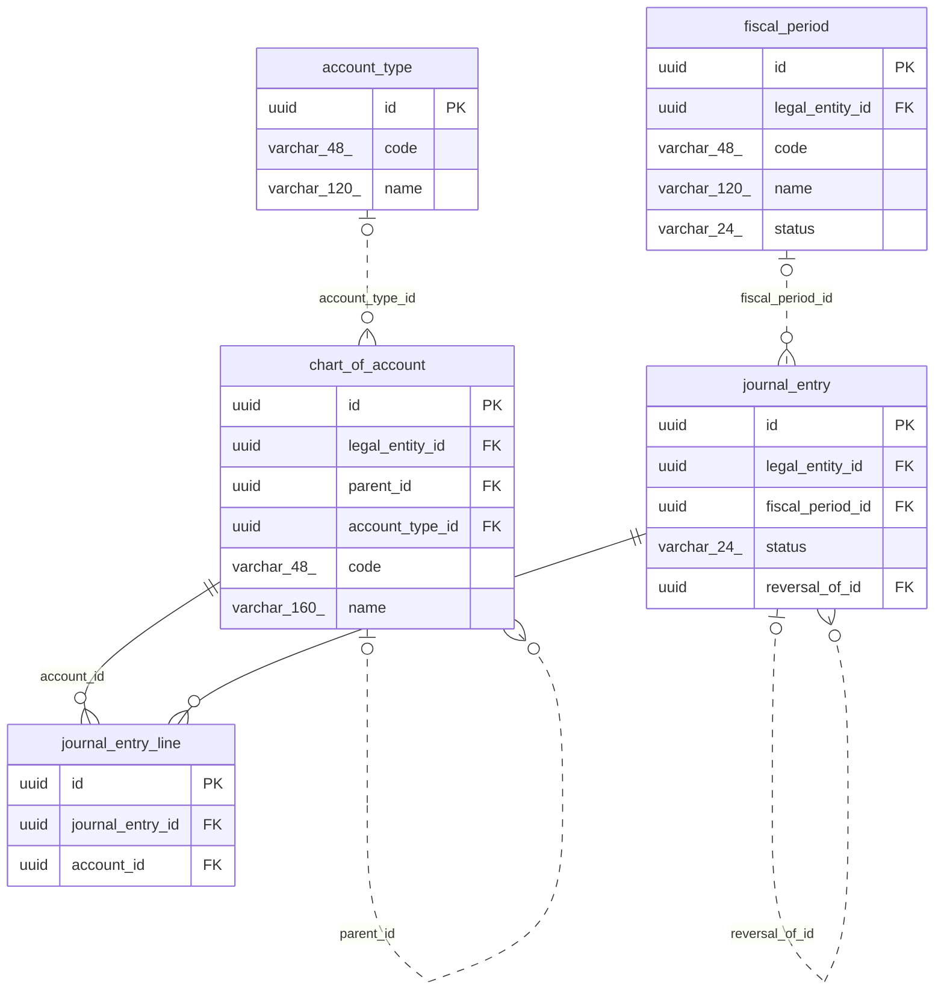
```mermaid
erDiagram
  account_type {
    uuid id PK
    varchar_48_ code
    varchar_120_ name
  }
  chart_of_account {
    uuid id PK
    uuid legal_entity_id FK
    uuid parent_id FK
    uuid account_type_id FK
    varchar_48_ code
    varchar_160_ name
  }
  fiscal_period {
    uuid id PK
    uuid legal_entity_id FK
    varchar_48_ code
    varchar_120_ name
    varchar_24_ status
  }
  journal_entry {
    uuid id PK
    uuid legal_entity_id FK
    uuid fiscal_period_id FK
    varchar_24_ status
    uuid reversal_of_id FK
  }
  journal_entry_line {
    uuid id PK
    uuid journal_entry_id FK
    uuid account_id FK
  }
  account_type |o..o{ chart_of_account : "account_type_id"
  chart_of_account |o..o{ chart_of_account : "parent_id"
  fiscal_period |o..o{ journal_entry : "fiscal_period_id"
  journal_entry |o..o{ journal_entry : "reversal_of_id"
  chart_of_account ||--o{ journal_entry_line : "account_id"
  journal_entry ||--o{ journal_entry_line : "journal_entry_id"
```

### SDM

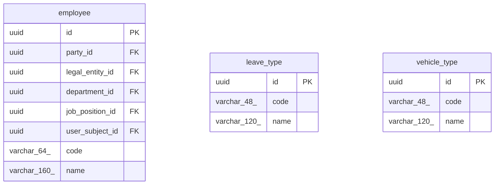
```mermaid
erDiagram
  employee {
    uuid id PK
    uuid party_id FK
    uuid legal_entity_id FK
    uuid department_id FK
    uuid job_position_id FK
    uuid user_subject_id FK
    varchar_64_ code
    varchar_160_ name
  }
  leave_type {
    uuid id PK
    varchar_48_ code
    varchar_120_ name
  }
  vehicle_type {
    uuid id PK
    varchar_48_ code
    varchar_120_ name
  }
```

### Workflow, Integrasi, dan Operasional

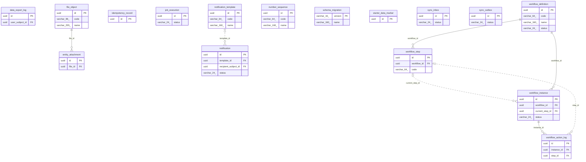
```mermaid
erDiagram
  data_export_log {
    uuid id PK
    uuid user_subject_id FK
  }
  entity_attachment {
    uuid id PK
    uuid file_id FK
  }
  file_object {
    uuid id PK
    varchar_96_ code
    varchar_255_ name
  }
  idempotency_record {
    uuid id PK
  }
  job_execution {
    uuid id PK
    varchar_24_ status
  }
  notification {
    uuid id PK
    uuid template_id FK
    uuid recipient_subject_id FK
    varchar_24_ status
  }
  notification_template {
    uuid id PK
    varchar_64_ code
    varchar_160_ name
  }
  number_sequence {
    uuid id PK
    varchar_64_ code
    varchar_160_ name
  }
  schema_migration {
    varchar_16_ version PK
    varchar_160_ name
  }
  starter_data_marker {
    uuid id PK
  }
  sync_inbox {
    uuid id PK
    varchar_24_ status
  }
  sync_outbox {
    uuid id PK
    varchar_24_ status
  }
  workflow_action_log {
    uuid id PK
    uuid instance_id FK
    uuid step_id FK
  }
  workflow_definition {
    uuid id PK
    varchar_64_ code
    varchar_160_ name
    varchar_24_ status
  }
  workflow_instance {
    uuid id PK
    uuid workflow_id FK
    uuid current_step_id FK
    varchar_24_ status
  }
  workflow_step {
    uuid id PK
    uuid workflow_id FK
    varchar_64_ code
  }
  file_object ||--o{ entity_attachment : "file_id"
  notification_template |o..o{ notification : "template_id"
  workflow_instance ||--o{ workflow_action_log : "instance_id"
  workflow_step |o..o{ workflow_action_log : "step_id"
  workflow_step |o..o{ workflow_instance : "current_step_id"
  workflow_definition ||--o{ workflow_instance : "workflow_id"
  workflow_definition ||--o{ workflow_step : "workflow_id"
```

### Relasi lintas domain `demo`

| Tabel anak | Kolom | Tabel induk | ON DELETE |
| --- | --- | --- | --- |
| `backorder_supplier_decision` | `from_supplier_id` | `supplier` | RESTRICT |
| `backorder_supplier_decision` | `to_supplier_id` | `supplier` | RESTRICT |
| `bill_of_material` | `output_uom_id` | `uom` | RESTRICT |
| `bill_of_material` | `product_id` | `product` | RESTRICT |
| `bill_of_material_item` | `material_product_id` | `product` | RESTRICT |
| `bill_of_material_item` | `uom_id` | `uom` | RESTRICT |
| `brand` | `logo_file_id` | `file_object` | SET NULL |
| `carrier` | `party_id` | `party` | RESTRICT |
| `chart_of_account` | `legal_entity_id` | `legal_entity` | RESTRICT |
| `customer` | `address_id` | `address` | RESTRICT |
| `customer` | `party_id` | `party` | RESTRICT |
| `customer` | `payment_term_id` | `payment_term` | RESTRICT |
| `data_export_log` | `user_subject_id` | `user_subject` | SET NULL |
| `employee` | `department_id` | `department` | RESTRICT |
| `employee` | `job_position_id` | `job_position` | RESTRICT |
| `employee` | `legal_entity_id` | `legal_entity` | RESTRICT |
| `employee` | `party_id` | `party` | RESTRICT |
| `employee` | `user_subject_id` | `user_subject` | SET NULL |
| `fiscal_period` | `legal_entity_id` | `legal_entity` | RESTRICT |
| `goods_receipt` | `supplier_id` | `supplier` | RESTRICT |
| `goods_receipt` | `warehouse_id` | `warehouse` | RESTRICT |
| `goods_receipt_line` | `bin_id` | `warehouse_bin` | RESTRICT |
| `goods_receipt_line` | `lot_id` | `inventory_lot` | RESTRICT |
| `goods_receipt_line` | `product_id` | `product` | RESTRICT |
| `goods_receipt_line` | `uom_id` | `uom` | RESTRICT |
| `internal_transfer` | `destination_warehouse_id` | `warehouse` | RESTRICT |
| `internal_transfer` | `request_order_id` | `request_order` | RESTRICT |
| `internal_transfer` | `source_warehouse_id` | `warehouse` | RESTRICT |
| `internal_transfer_line` | `lot_id` | `inventory_lot` | RESTRICT |
| `internal_transfer_line` | `product_id` | `product` | RESTRICT |
| `internal_transfer_line` | `uom_id` | `uom` | RESTRICT |
| `inventory_adjustment` | `warehouse_id` | `warehouse` | RESTRICT |
| `inventory_adjustment_line` | `bin_id` | `warehouse_bin` | RESTRICT |
| `inventory_adjustment_line` | `product_id` | `product` | RESTRICT |
| `inventory_lot` | `product_id` | `product` | RESTRICT |
| `inventory_lot` | `supplier_id` | `supplier` | RESTRICT |
| `journal_entry` | `legal_entity_id` | `legal_entity` | RESTRICT |
| `notification` | `recipient_subject_id` | `user_subject` | CASCADE |
| `pos_sale` | `customer_id` | `customer` | RESTRICT |
| `pos_sale` | `outlet_id` | `outlet` | RESTRICT |
| `pos_sale` | `warehouse_id` | `warehouse` | RESTRICT |
| `pos_sale_line` | `product_id` | `product` | RESTRICT |
| `pos_sale_line` | `uom_id` | `uom` | RESTRICT |
| `pos_shift` | `cashier_id` | `user_subject` | RESTRICT |
| `pos_terminal` | `outlet_id` | `outlet` | RESTRICT |
| `product` | `product_brand_id` | `product_brand` | RESTRICT |
| `product_supplier` | `supplier_id` | `supplier` | RESTRICT |
| `purchase_backorder` | `original_supplier_id` | `supplier` | RESTRICT |
| `purchase_backorder` | `replacement_supplier_id` | `supplier` | RESTRICT |
| `purchase_backorder` | `warehouse_id` | `warehouse` | RESTRICT |
| `purchase_backorder_line` | `product_id` | `product` | RESTRICT |
| `purchase_backorder_line` | `target_supplier_id` | `supplier` | RESTRICT |
| `purchase_backorder_line` | `uom_id` | `uom` | RESTRICT |
| `purchase_order` | `legal_entity_id` | `legal_entity` | RESTRICT |
| `purchase_order` | `supplier_id` | `supplier` | RESTRICT |
| `purchase_order` | `warehouse_id` | `warehouse` | RESTRICT |
| `purchase_order_line` | `product_id` | `product` | RESTRICT |
| `purchase_order_line` | `uom_id` | `uom` | RESTRICT |
| `request_order` | `generated_by_policy_id` | `stock_policy` | SET NULL |
| `request_order` | `outlet_id` | `outlet` | RESTRICT |
| `request_order` | `parent_warehouse_id` | `warehouse` | RESTRICT |
| `request_order` | `requesting_warehouse_id` | `warehouse` | RESTRICT |
| `request_order` | `source_alert_id` | `stock_alert` | SET NULL |
| `request_order_consolidation` | `parent_warehouse_id` | `warehouse` | RESTRICT |
| `request_order_consolidation_line` | `product_id` | `product` | RESTRICT |
| `request_order_line` | `product_id` | `product` | RESTRICT |
| `request_order_line` | `source_stock_policy_id` | `stock_policy` | SET NULL |
| `request_order_line` | `uom_id` | `uom` | RESTRICT |
| `sales_order` | `customer_id` | `customer` | RESTRICT |
| `sales_order` | `outlet_id` | `outlet` | RESTRICT |
| `sales_order_line` | `product_id` | `product` | RESTRICT |
| `sales_order_line` | `uom_id` | `uom` | RESTRICT |
| `stock_alert` | `request_order_id` | `request_order` | SET NULL |
| `stock_alert` | `product_id` | `product` | RESTRICT |
| `stock_alert` | `warehouse_id` | `warehouse` | RESTRICT |
| `stock_balance` | `bin_id` | `warehouse_bin` | RESTRICT |
| `stock_balance` | `product_id` | `product` | RESTRICT |
| `stock_balance` | `warehouse_id` | `warehouse` | RESTRICT |
| `stock_count` | `warehouse_id` | `warehouse` | RESTRICT |
| `stock_count_line` | `bin_id` | `warehouse_bin` | RESTRICT |
| `stock_count_line` | `product_id` | `product` | RESTRICT |
| `stock_movement` | `destination_bin_id` | `warehouse_bin` | RESTRICT |
| `stock_movement` | `destination_warehouse_id` | `warehouse` | RESTRICT |
| `stock_movement` | `product_id` | `product` | RESTRICT |
| `stock_movement` | `source_bin_id` | `warehouse_bin` | RESTRICT |
| `stock_movement` | `source_warehouse_id` | `warehouse` | RESTRICT |
| `stock_movement` | `uom_id` | `uom` | RESTRICT |
| `stock_policy` | `product_id` | `product` | RESTRICT |
| `stock_policy` | `uom_id` | `uom` | RESTRICT |
| `stock_policy` | `warehouse_id` | `warehouse` | RESTRICT |
| `stock_reservation` | `product_id` | `product` | RESTRICT |
| `stock_reservation` | `warehouse_id` | `warehouse` | RESTRICT |
| `supplier` | `address_id` | `address` | RESTRICT |
| `supplier` | `party_id` | `party` | RESTRICT |
| `supplier` | `payment_term_id` | `payment_term` | RESTRICT |
| `supplier_group` | `payment_term_id` | `payment_term` | RESTRICT |
| `supplier_invoice` | `purchase_order_id` | `purchase_order` | RESTRICT |

## Schema audit

Schema audit bersifat append-only dan tidak memiliki foreign key ke tabel data agar
penghapusan data tidak pernah menghapus jejak audit.

| Schema | Tabel |
| --- | --- |
| `demo__audit` | `audit_event` |
| `demo__audit` | `audit_export_event` |
| `demo__audit` | `audit_permission_change` |
| `demo__audit` | `audit_posting_event` |
| `demo__audit` | `audit_row_change` |
| `demo__audit` | `audit_schema_migration` |
| `demo__audit` | `audit_security_event` |
| `platform__audit` | `audit_event` |
| `platform__audit` | `audit_export_event` |
| `platform__audit` | `audit_permission_change` |
| `platform__audit` | `audit_row_change` |
| `platform__audit` | `audit_schema_migration` |
| `platform__audit` | `audit_security_event` |
