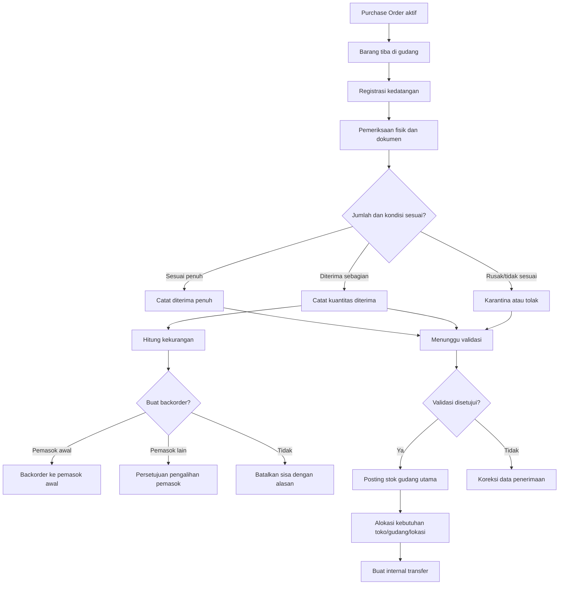
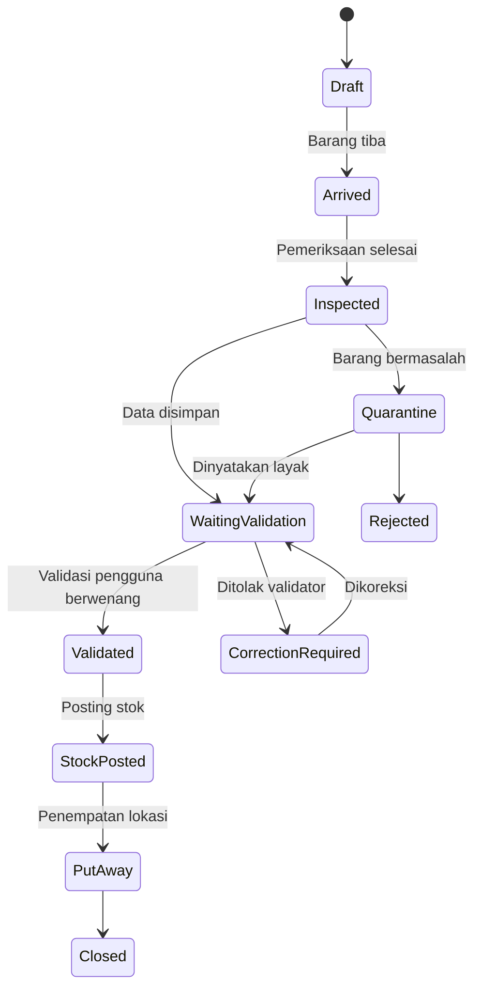
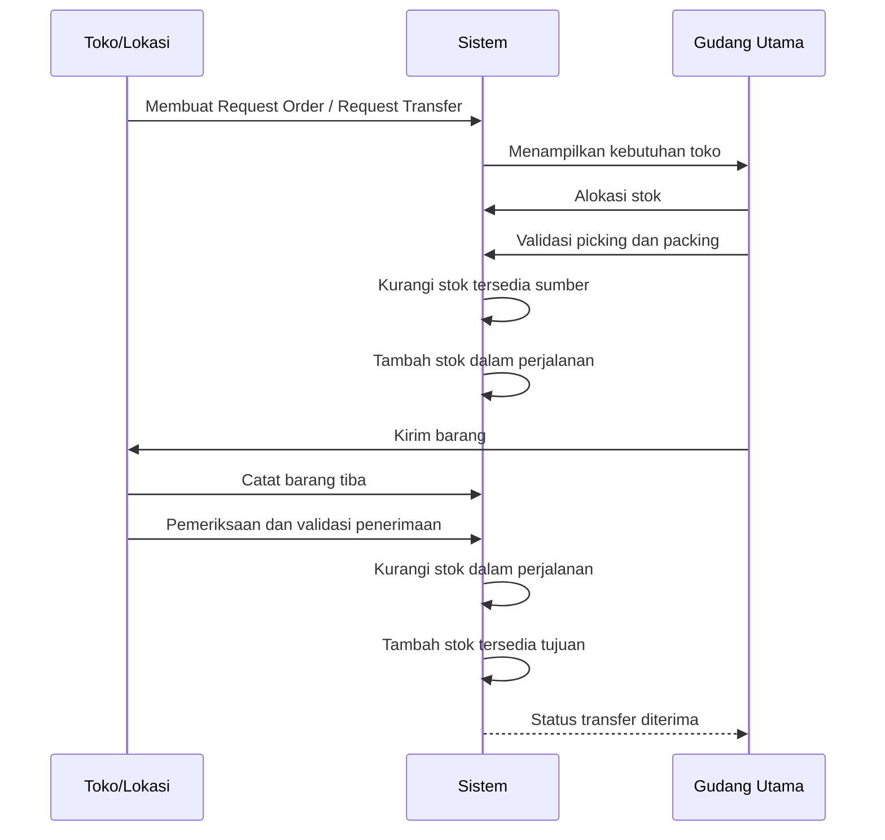
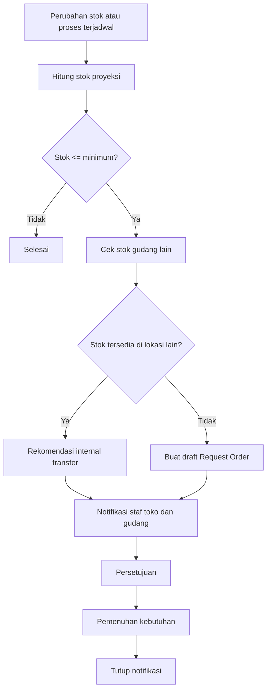
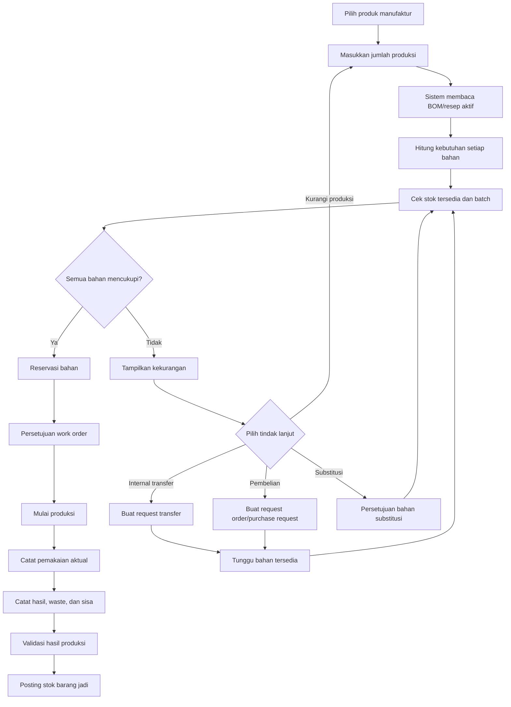

# STRUKTUR MENU EBISNIS.ID — VERSI ENHANCED V2

> Penyempurnaan khusus proses penerimaan barang dari pemasok, backorder, internal transfer, minimum stok, dan manufaktur.

## 1. Tujuan

Dokumen ini merupakan versi enhanced dari struktur menu **eBisnis.id** untuk:

- Desktop / Web
- Android
- iOS
- Aplikasi Kasir / POS
- Aplikasi Pemilik / Investor
- Aplikasi Manajemen
- Aplikasi Karyawan / Operasional

Dokumen ini disusun agar:

1. mudah dipetakan ke **master menu tree**;
2. mudah dipetakan ke **hak akses role**;
3. mudah diterapkan ke **struktur database menu**;
4. mudah dipakai pada **UI desktop** maupun **mobile**;
5. mudah diturunkan menjadi **seed data menu** dan **otorisasi API**.

---

# 2. Prinsip Penyusunan Menu

## 2.1. Prinsip umum

- Menu disusun dalam bentuk **tree / hierarchy**.
- **Kasir / POS** wajib berada di **root menu**.
- Parent menu yang hanya berfungsi sebagai pengelompokan **tidak harus memiliki CRUD**.
- Menu harus bisa diberi:
  - kode menu,
  - ikon,
  - urutan,
  - route / URL,
  - platform target,
  - modul pemilik,
  - status aktif / nonaktif,
  - kebutuhan subscription,
  - kebutuhan approval,
  - sensitivitas data.

## 2.2. Struktur level menu

```text
ROOT
└── MODUL
    └── SUBMODUL / KELOMPOK PROSES
        └── MENU
            └── SUBMENU / AKSI / LAPORAN
```

## 2.3. Prinsip hak akses

Minimal hak akses yang perlu dipertimbangkan:

```text
READ
CREATE
UPDATE
DELETE
SUBMIT
REVIEW
APPROVE
REJECT
CANCEL
PRINT
EXPORT
IMPORT
POST
CLOSE_PERIOD
REOPEN
VIEW_AMOUNT
VIEW_COST
VIEW_PROFIT
MANAGE_DEVICE
CHECK_ALL
```

---

# 3. Root Menu Utama

```text
01. Beranda
02. Kasir / POS
03. Penjualan
04. Produk dan Harga
05. Pelanggan dan CRM
06. Pembelian
07. Gudang dan Persediaan
08. Produksi
09. Quality Control
10. Distribusi dan Pengiriman
11. Keuangan dan Akuntansi
12. Investor dan Bagi Hasil
13. SDM dan Payroll
14. Aset dan Pemeliharaan
15. Workflow dan Persetujuan
16. Laporan dan Analitik
17. Langganan dan Perangkat
18. Master Data
19. Integrasi dan API
20. Administrasi Sistem
21. Bantuan dan Dukungan
```

---

# 4. Struktur Menu Lengkap

## 4.1. Beranda

```text
Beranda
├── Dashboard Saya
├── Dashboard Pemilik
├── Dashboard Investor
├── Dashboard Manajemen
├── Dashboard Operasional
├── Dashboard Penjualan
├── Dashboard Persediaan
├── Dashboard Produksi
├── Dashboard Keuangan
├── Dashboard SDM
├── Kotak Masuk Persetujuan
├── Tugas Saya
├── Notifikasi
├── Aktivitas Terakhir
├── Favorit
└── Pintasan
```

---

## 4.2. Kasir / POS

> Menu ini **langsung di root**.

```text
Kasir / POS
├── Buka Aplikasi Kasir
├── Pilih Outlet
├── Pilih Terminal POS
├── Buka Shift
├── Transaksi Baru
├── Pesanan Ditahan
├── Pesanan Aktif
├── Daftar Pesanan
├── Pembayaran
├── Retur Penjualan
├── Pembatalan Transaksi
├── Cetak Ulang Struk
├── Kirim Struk Digital
├── Kas Masuk
├── Kas Keluar
├── Mutasi Kas Kasir
├── Riwayat Transaksi Hari Ini
├── Ringkasan Shift
├── Tutup Shift
├── Sinkronisasi POS
├── Status Offline
├── Perangkat dan Printer
└── Pengaturan POS Lokal
```

### Struktur tampilan POS

```text
Header POS
├── Nama Outlet
├── Nama Terminal
├── Nama Kasir
├── Nomor Shift
├── Status Koneksi
├── Status Sinkronisasi
└── Tombol Keluar

Area Transaksi
├── Pencarian Produk
├── Pemindai Barcode
├── Kategori Produk
├── Daftar Produk
├── Keranjang
├── Pelanggan
├── Diskon
├── Pajak
└── Total

Area Tindakan
├── Tahan Pesanan
├── Bayar
├── Batalkan
├── Cetak
└── Otorisasi Supervisor
```

---

## 4.3. Penjualan

```text
Penjualan
├── Dashboard Penjualan
├── Transaksi
│   ├── Penawaran Penjualan
│   ├── Pesanan Penjualan
│   ├── Konfirmasi Pesanan
│   ├── Penjualan Langsung
│   ├── Penjualan Kredit
│   ├── Penjualan Konsinyasi
│   ├── Penjualan Grosir
│   ├── Penjualan Antarperusahaan
│   └── Penjualan Marketplace
├── Pemenuhan Pesanan
│   ├── Reservasi Stok
│   ├── Picking List
│   ├── Packing List
│   ├── Delivery Order
│   ├── Barang Siap Diambil
│   └── Bukti Serah Terima
├── Retur dan Pembatalan
│   ├── Permintaan Retur
│   ├── Retur Penjualan
│   ├── Penggantian Barang
│   ├── Pengembalian Dana
│   └── Pembatalan Pesanan
├── Invoice dan Piutang
│   ├── Invoice Penjualan
│   ├── Pembayaran Pelanggan
│   ├── Alokasi Pembayaran
│   ├── Uang Muka Pelanggan
│   ├── Piutang Pelanggan
│   └── Penagihan
├── Komisi Penjualan
│   ├── Pengaturan Komisi
│   ├── Perhitungan Komisi
│   ├── Persetujuan Komisi
│   └── Pembayaran Komisi
└── Laporan Penjualan
    ├── Penjualan Harian
    ├── Penjualan per Outlet
    ├── Penjualan per Produk
    ├── Penjualan per Pelanggan
    ├── Penjualan per Kasir
    ├── Penjualan per Kanal
    ├── Penjualan per Jam
    ├── Margin Penjualan
    ├── Retur Penjualan
    └── Target dan Realisasi
```

---

## 4.4. Produk dan Harga

```text
Produk dan Harga
├── Dashboard Produk
├── Master Produk
│   ├── Produk
│   ├── Produk Jasa
│   ├── Produk Paket
│   ├── Produk Komposit
│   ├── Produk Konsinyasi
│   ├── Bahan Baku
│   ├── Barang Setengah Jadi
│   └── Barang Jadi
├── Klasifikasi Produk
│   ├── Brand
│   ├── Kategori
│   ├── Subkategori
│   ├── Departemen Produk
│   ├── Tag Produk
│   └── Atribut Produk
├── Varian dan Barcode
│   ├── Varian Produk
│   ├── SKU
│   ├── Barcode
│   ├── GTIN
│   ├── Nomor Seri
│   └── Cetak Label
├── Satuan dan Konversi
│   ├── Satuan Dasar
│   ├── Satuan Pembelian
│   ├── Satuan Penjualan
│   ├── Konversi UOM
│   └── Pembulatan Satuan
├── Harga
│   ├── Harga Dasar
│   ├── Harga per Brand
│   ├── Harga per Outlet
│   ├── Harga per Wilayah
│   ├── Harga Grosir
│   ├── Harga Pelanggan
│   ├── Harga Anggota
│   ├── Harga Karyawan
│   ├── Harga Bertingkat
│   └── Riwayat Harga
├── Promosi
│   ├── Program Promosi
│   ├── Diskon Produk
│   ├── Diskon Transaksi
│   ├── Bundling
│   ├── Beli dan Gratis
│   ├── Cashback
│   ├── Voucher
│   ├── Kupon
│   ├── Promo Berdasarkan Waktu
│   └── Persetujuan Promosi
├── Pajak dan Biaya
│   ├── Kelompok Pajak
│   ├── Tarif Pajak
│   ├── Biaya Layanan
│   ├── Harga Termasuk Pajak
│   └── Pembulatan Harga
└── Laporan Produk
    ├── Daftar Produk
    ├── Produk Aktif
    ├── Produk Tidak Aktif
    ├── Produk Terlaris
    ├── Produk Tidak Bergerak
    ├── Analisis Harga
    └── Analisis Margin
```

---

## 4.5. Pelanggan dan CRM

```text
Pelanggan dan CRM
├── Dashboard CRM
├── Master Pelanggan
│   ├── Pelanggan Individu
│   ├── Pelanggan Perusahaan
│   ├── Pelanggan Grosir
│   ├── Anggota
│   ├── Grup Pelanggan
│   └── Segmentasi Pelanggan
├── Loyalitas
│   ├── Program Loyalitas
│   ├── Poin Pelanggan
│   ├── Tingkat Keanggotaan
│   ├── Penukaran Poin
│   ├── Voucher Loyalitas
│   └── Kedaluwarsa Poin
├── Prospek dan Penjualan
│   ├── Prospek
│   ├── Peluang Penjualan
│   ├── Aktivitas Tindak Lanjut
│   ├── Penawaran
│   └── Pipeline Penjualan
├── Kampanye
│   ├── Kampanye Pemasaran
│   ├── Daftar Penerima
│   ├── WhatsApp
│   ├── Surat Elektronik
│   ├── SMS
│   └── Hasil Kampanye
├── Layanan Pelanggan
│   ├── Keluhan Pelanggan
│   ├── Tiket Layanan
│   ├── Permintaan Pengembalian
│   ├── SLA Pelayanan
│   └── Survei Kepuasan
└── Analitik Pelanggan
    ├── Riwayat Pembelian
    ├── Pelanggan Aktif
    ├── Pelanggan Tidak Aktif
    ├── Retensi Pelanggan
    ├── Frekuensi Pembelian
    ├── Nilai Pelanggan
    └── Analisis RFM
```

---

## 4.6. Pembelian

```text
Pembelian
├── Dashboard Pembelian
│   ├── Ringkasan Permintaan Pembelian
│   ├── PO Aktif
│   ├── PO Terlambat
│   ├── Penerimaan Hari Ini
│   ├── Backorder Aktif
│   ├── Nilai Pembelian
│   └── Kinerja Pemasok
├── Perencanaan Pembelian
│   ├── Rekomendasi Pembelian
│   ├── Kebutuhan Berdasarkan Minimum Stok
│   ├── Kebutuhan Berdasarkan Reorder Point
│   ├── Kebutuhan Berdasarkan Pesanan Toko
│   ├── Kebutuhan Berdasarkan Produksi
│   ├── Konsolidasi Kebutuhan
│   └── Rencana Pembelian
├── Request Order
│   ├── Request Order dari Toko
│   ├── Request Order dari Gudang
│   ├── Request Order dari Lokasi
│   ├── Request Order Otomatis
│   ├── Request Order karena Stok Minimum
│   ├── Request Order karena Kekurangan Bahan Produksi
│   ├── Konsolidasi Request Order
│   ├── Persetujuan Request Order
│   └── Monitoring Pemenuhan Request Order
├── Permintaan Pembelian
│   ├── Pengajuan Permintaan
│   ├── Konversi dari Request Order
│   ├── Pemeriksaan Anggaran
│   ├── Persetujuan Permintaan
│   └── Daftar Permintaan
├── Penawaran Pemasok
│   ├── Request for Quotation
│   ├── Penawaran Pemasok
│   ├── Perbandingan Penawaran
│   ├── Negosiasi
│   ├── Penetapan Pemasok
│   └── Persetujuan Pemilihan Pemasok
├── Pesanan Pembelian
│   ├── Purchase Order
│   ├── PO dari Request Order
│   ├── PO dari Rekomendasi Minimum Stok
│   ├── PO dari Kekurangan Bahan Produksi
│   ├── Kontrak Pembelian
│   ├── Perubahan PO
│   ├── Persetujuan PO
│   ├── Pengiriman PO ke Pemasok
│   ├── Konfirmasi Pemasok
│   └── Pemantauan PO
├── Backorder
│   ├── Dashboard Backorder
│   ├── Daftar Backorder
│   ├── Buat Backorder dari Penerimaan Parsial
│   ├── Backorder ke Pemasok Awal
│   ├── Pengalihan Backorder ke Pemasok Lain
│   ├── Permintaan Penawaran untuk Kekurangan
│   ├── Pemilihan Pemasok Pengganti
│   ├── Persetujuan Pengalihan Pemasok
│   ├── PO Lanjutan Backorder
│   ├── Konfirmasi Jadwal Pemenuhan
│   ├── Penerimaan Backorder
│   ├── Pembatalan Sisa Backorder
│   ├── Penutupan Backorder
│   ├── Riwayat Perubahan Backorder
│   └── Monitoring Umur Backorder
├── Penerimaan
│   ├── Jadwal Kedatangan
│   ├── Registrasi Kedatangan Barang
│   ├── Penerimaan Barang
│   │   ├── Penerimaan Pembelian
│   │   ├── Penerimaan Backorder
│   │   ├── Penerimaan Transfer Masuk
│   │   ├── Penerimaan Hasil Produksi
│   │   ├── Penerimaan Retur Penjualan
│   │   ├── Penerimaan Barang Konsinyasi
│   │   └── Penerimaan Barang Bonus / Free Goods
│   ├── Pemeriksaan Fisik
│   │   ├── Pemeriksaan Jumlah
│   │   ├── Pemeriksaan Kondisi
│   │   ├── Pemeriksaan Kualitas
│   │   ├── Pemeriksaan Batch / Lot
│   │   ├── Pemeriksaan Tanggal Kedaluwarsa
│   │   ├── Pemeriksaan Nomor Seri
│   │   └── Pemeriksaan Dokumen
│   ├── Pencatatan Hasil Penerimaan
│   │   ├── Diterima Penuh
│   │   ├── Diterima Sebagian
│   │   ├── Ditolak Sebagian
│   │   ├── Ditolak Seluruhnya
│   │   ├── Ditempatkan di Karantina
│   │   └── Kekurangan untuk Backorder
│   ├── Validasi Penerimaan
│   │   ├── Menunggu Validasi
│   │   ├── Validasi Staf Gudang
│   │   ├── Persetujuan Supervisor
│   │   ├── Posting Stok Gudang Utama
│   │   └── Pembatalan Validasi
│   ├── Alokasi Pesanan Internal
│   │   ├── Alokasi ke Request Order Toko
│   │   ├── Alokasi ke Request Order Gudang
│   │   ├── Alokasi ke Request Order Lokasi
│   │   ├── Alokasi Berdasarkan Prioritas
│   │   └── Sisa Stok Bebas
│   ├── Put-away
│   │   ├── Penempatan ke Gudang
│   │   ├── Penempatan ke Area
│   │   ├── Penempatan ke Rak / Bin
│   │   ├── Penempatan ke Karantina
│   │   └── Penempatan ke Area Transit
│   ├── Selisih Penerimaan
│   │   ├── Kurang Kirim
│   │   ├── Lebih Kirim
│   │   ├── Barang Rusak
│   │   ├── Barang Salah
│   │   ├── Batch / Kedaluwarsa Tidak Sesuai
│   │   └── Backorder
│   └── Dokumen Penerimaan
│       ├── Goods Receipt Note
│       ├── Berita Acara Penerimaan
│       ├── Berita Acara Selisih
│       ├── Berita Acara Penolakan
│       └── Lampiran Foto / Dokumen
├── Retur Pembelian
│   ├── Permintaan Retur
│   ├── Retur ke Pemasok
│   ├── Penggantian Barang
│   ├── Nota Kredit Pemasok
│   └── Penyesuaian Utang
├── Invoice Pemasok
│   ├── Invoice Pembelian
│   ├── Pencocokan PO-GR-Invoice
│   ├── Uang Muka Pemasok
│   ├── Utang Pemasok
│   └── Jadwal Pembayaran
├── Pemasok
│   ├── Master Pemasok
│   ├── Produk Pemasok
│   ├── Harga Pemasok
│   ├── Kontrak Pemasok
│   ├── SLA Pemenuhan
│   ├── Evaluasi Pemasok
│   ├── Riwayat Backorder
│   └── Blacklist Pemasok
└── Laporan Pembelian
    ├── Pembelian per Pemasok
    ├── Pembelian per Produk
    ├── Pembelian per Outlet
    ├── PO Belum Selesai
    ├── PO Diterima Parsial
    ├── Keterlambatan Pemasok
    ├── Backorder Aktif
    ├── Umur Backorder
    ├── Pemenuhan Request Order
    ├── Selisih Penerimaan
    └── Analisis Harga Beli
```

### Aturan proses Backorder

1. Backorder hanya dibuat apabila kuantitas yang diterima lebih kecil daripada kuantitas PO.
2. Sistem harus menampilkan:
   - kuantitas PO;
   - kuantitas yang diterima;
   - kuantitas ditolak;
   - kuantitas kekurangan;
   - kuantitas yang akan dibuat sebagai backorder.
3. Kekurangan dapat:
   - tetap dipenuhi oleh pemasok awal;
   - dialihkan sebagian kepada pemasok lain;
   - dialihkan seluruhnya kepada pemasok lain;
   - dibatalkan dengan alasan dan persetujuan.
4. Pengalihan ke pemasok lain harus menghasilkan hubungan dokumen yang dapat ditelusuri dari PO awal.
5. Backorder tidak boleh menambah stok.
6. Stok hanya bertambah setelah penerimaan backorder divalidasi.
7. Backorder ditutup otomatis apabila seluruh kekurangan telah dipenuhi atau sisa kebutuhan dibatalkan secara resmi.

### Status Backorder

```text
DRAFT
WAITING_APPROVAL
APPROVED
WAITING_SUPPLIER_CONFIRMATION
CONFIRMED
PARTIALLY_FULFILLED
FULFILLED
REDIRECTED_TO_OTHER_SUPPLIER
CANCELLED
CLOSED
```

---
## 4.7. Gudang dan Persediaan

```text
Gudang dan Persediaan
├── Dashboard Persediaan
│   ├── Stok Gudang Utama
│   ├── Stok Toko / Outlet
│   ├── Stok dalam Perjalanan
│   ├── Penerimaan Belum Divalidasi
│   ├── Transfer Belum Diterima
│   ├── Stok di Bawah Minimum
│   ├── Backorder Aktif
│   └── Selisih Persediaan
├── Struktur Gudang
│   ├── Gudang
│   ├── Area
│   ├── Zona
│   ├── Lorong
│   ├── Rak
│   ├── Bin
│   └── Lokasi Penyimpanan
├── Penerimaan Barang
│   ├── Dashboard Penerimaan
│   ├── Daftar Kedatangan
│   ├── Penerimaan Pembelian
│   ├── Penerimaan Backorder
│   ├── Penerimaan Transfer Masuk
│   ├── Penerimaan Hasil Produksi
│   ├── Penerimaan Retur Penjualan
│   ├── Pemeriksaan Fisik
│   ├── Pemeriksaan Kualitas
│   ├── Pemeriksaan Batch / Kedaluwarsa
│   ├── Menunggu Validasi
│   ├── Validasi Penerimaan
│   ├── Posting Stok Gudang
│   ├── Put-away
│   ├── Barang Karantina
│   ├── Selisih Penerimaan
│   └── Berita Acara Penerimaan
├── Alokasi dan Distribusi Kebutuhan
│   ├── Daftar Pesanan Toko
│   ├── Daftar Pesanan Gudang
│   ├── Daftar Pesanan Lokasi
│   ├── Alokasi Barang Diterima
│   ├── Prioritas Alokasi
│   ├── Alokasi Parsial
│   ├── Sisa Kebutuhan
│   └── Konversi ke Internal Transfer
├── Pengeluaran Barang
│   ├── Pengeluaran Penjualan
│   ├── Pengeluaran Produksi
│   ├── Pengeluaran Operasional
│   ├── Picking
│   ├── Packing
│   ├── Delivery Staging
│   └── Pengeluaran Khusus
├── Internal Transfer
│   ├── Dashboard Internal Transfer
│   ├── Request Transfer dari Toko
│   ├── Request Transfer dari Gudang
│   ├── Request Transfer dari Lokasi
│   ├── Rekomendasi Transfer Otomatis
│   ├── Persetujuan Transfer
│   ├── Alokasi Stok Sumber
│   ├── Picking Transfer
│   ├── Packing Transfer
│   ├── Pengiriman Transfer
│   ├── Barang dalam Perjalanan
│   ├── Monitoring Status Pengiriman
│   ├── Penerimaan di Toko / Lokasi
│   ├── Validasi Penerimaan Tujuan
│   ├── Selisih Transfer
│   │   ├── Kurang Terima
│   │   ├── Lebih Terima
│   │   ├── Rusak di Perjalanan
│   │   ├── Salah Barang
│   │   └── Ditolak Tujuan
│   ├── Transfer Balik
│   ├── Pembatalan Transfer
│   ├── Penutupan Transfer
│   └── Riwayat Transfer
├── Monitoring Internal Transfer
│   ├── Menunggu Persetujuan
│   ├── Menunggu Picking
│   ├── Menunggu Pengiriman
│   ├── Dalam Perjalanan
│   ├── Tiba Belum Divalidasi
│   ├── Diterima Sebagian
│   ├── Diterima Penuh
│   ├── Bermasalah
│   ├── Terlambat
│   └── Selesai
├── Kontrol Persediaan
│   ├── Saldo Stok
│   ├── Kartu Stok
│   ├── Stok Tersedia
│   ├── Stok Dicadangkan
│   ├── Stok dalam Perjalanan
│   ├── Stok Karantina
│   ├── Stok Rusak
│   ├── Stok Kedaluwarsa
│   ├── Stok Konsinyasi
│   └── Stok Negatif
├── Minimum Stok dan Replenishment
│   ├── Pengaturan Minimum Stok
│   ├── Pengaturan Maximum Stok
│   ├── Reorder Point
│   ├── Safety Stock
│   ├── Lead Time Pemenuhan
│   ├── Monitoring Stok Minimum
│   ├── Notifikasi Stok Minimum
│   ├── Draft Request Order Otomatis
│   ├── Persetujuan Request Order
│   ├── Rekomendasi Internal Transfer
│   ├── Rekomendasi Pembelian
│   └── Eskalasi Kekurangan Stok
├── Stock Opname
│   ├── Jadwal Stock Opname
│   ├── Stock Opname Penuh
│   ├── Cycle Count
│   ├── Input Hasil Hitung
│   ├── Selisih Persediaan
│   └── Persetujuan Penyesuaian
├── Batch dan Kedaluwarsa
│   ├── Batch
│   ├── Lot
│   ├── Tanggal Produksi
│   ├── Tanggal Kedaluwarsa
│   ├── FIFO
│   └── FEFO
└── Laporan Persediaan
    ├── Posisi Stok
    ├── Mutasi Stok
    ├── Kartu Stok
    ├── Stok dalam Perjalanan
    ├── Transfer Belum Diterima
    ├── Umur Persediaan
    ├── Stok Mati
    ├── Fast Moving
    ├── Slow Moving
    ├── Stok di Bawah Minimum
    ├── Selisih Stock Opname
    ├── Nilai Persediaan
    ├── Backorder Persediaan
    └── Perputaran Persediaan
```

### Aturan validasi penerimaan stok

1. Registrasi kedatangan dan pemeriksaan fisik **belum menambah stok**.
2. Sebelum validasi, penerimaan berstatus `WAITING_VALIDATION`.
3. Stok gudang utama hanya bertambah setelah pengguna berwenang melakukan `VALIDATE`.
4. Validasi harus menyimpan:
   - pengguna;
   - waktu;
   - gudang;
   - lokasi penyimpanan;
   - jumlah diterima;
   - batch/lot;
   - tanggal kedaluwarsa;
   - hasil pemeriksaan;
   - dokumen pendukung.
5. Pembatalan validasi harus menggunakan reversal, bukan menghapus transaksi.
6. Barang yang gagal pemeriksaan tidak masuk stok tersedia; barang diarahkan ke karantina atau ditolak.

### Aturan perpindahan stok Internal Transfer

Model pencatatan yang direkomendasikan:

```text
Saat transfer dikirim:
Stok Tersedia Gudang Sumber berkurang
Stok Dalam Perjalanan bertambah

Saat tujuan memvalidasi penerimaan:
Stok Dalam Perjalanan berkurang
Stok Tersedia Gudang Tujuan bertambah
```

Model ini memastikan barang tidak tercatat tersedia secara bersamaan di gudang sumber dan gudang tujuan.

### Status Internal Transfer

```text
DRAFT
WAITING_APPROVAL
APPROVED
ALLOCATED
PICKING
PACKED
DISPATCHED
IN_TRANSIT
ARRIVED_WAITING_VALIDATION
PARTIALLY_RECEIVED
RECEIVED
DISCREPANCY
REJECTED
CANCELLED
CLOSED
```

### Aturan notifikasi minimum stok

1. Minimum stok ditentukan per:
   - produk;
   - outlet;
   - gudang;
   - lokasi;
   - satuan;
   - periode atau musim.
2. Ketika stok proyeksi mencapai atau di bawah minimum, sistem:
   - membuat notifikasi;
   - menghitung jumlah rekomendasi;
   - memeriksa stok di gudang lain;
   - merekomendasikan internal transfer jika tersedia;
   - membuat draft Request Order jika tidak tersedia.
3. Notifikasi tidak boleh dibuat berulang tanpa kontrol; sistem harus menggabungkan notifikasi yang masih aktif.
4. Notifikasi ditutup ketika kebutuhan telah dipenuhi atau dibatalkan dengan alasan.

---
## 4.8. Produksi

```text
Produksi
├── Dashboard Produksi
│   ├── Rencana Produksi
│   ├── Produksi Berjalan
│   ├── Produksi Tertunda
│   ├── Kekurangan Bahan
│   ├── Hasil Produksi Hari Ini
│   ├── Waste
│   └── Utilisasi Kapasitas
├── Master Produksi
│   ├── Produk Manufaktur
│   ├── Bill of Materials
│   ├── Resep
│   ├── Versi BOM / Resep
│   ├── Bahan Baku
│   ├── Bahan Penolong
│   ├── Bahan Kemasan
│   ├── Produk Sampingan
│   ├── Routing
│   ├── Work Center
│   ├── Mesin
│   ├── Kapasitas Produksi
│   └── Kalender Produksi
├── Perencanaan
│   ├── Forecast Produksi
│   ├── Master Production Schedule
│   ├── Material Requirement Planning
│   ├── Rencana Produksi
│   ├── Rencana Kapasitas
│   ├── Perhitungan Kebutuhan Bahan
│   └── Proyeksi Kekurangan Bahan
├── Ketersediaan Bahan
│   ├── Cek Ketersediaan Bahan
│   ├── Stok Bahan per Gudang
│   ├── Kebutuhan Berdasarkan BOM
│   ├── Kekurangan Bahan
│   ├── Reservasi Bahan
│   ├── Rekomendasi Internal Transfer
│   ├── Draft Request Order Otomatis
│   ├── Draft Permintaan Pembelian
│   └── Notifikasi Kekurangan Bahan
├── Perintah Produksi
│   ├── Work Order
│   ├── Batch Produksi
│   ├── Penjadwalan
│   ├── Penugasan Operator
│   ├── Pemilihan BOM / Resep
│   ├── Pemeriksaan Ketersediaan Bahan
│   ├── Persetujuan Work Order
│   └── Dokumen Produksi
├── Pelaksanaan Produksi
│   ├── Persiapan Produksi
│   ├── Permintaan Bahan
│   ├── Pengeluaran Bahan
│   ├── Penimbangan / Takar Bahan
│   ├── Mulai Produksi
│   ├── Work in Process
│   ├── Pencatatan Pemakaian Aktual
│   ├── Pengembalian Bahan
│   ├── Input Hasil Produksi
│   ├── Produk Sampingan
│   ├── Sisa Bahan
│   ├── Waste
│   ├── Rework
│   └── Penyelesaian Produksi
├── Penerimaan Hasil Produksi
│   ├── Hasil Menunggu Pemeriksaan
│   ├── Pemeriksaan Hasil
│   ├── Validasi Hasil Produksi
│   ├── Posting Stok Barang Jadi
│   ├── Put-away Barang Jadi
│   └── Penolakan / Karantina Hasil
├── Biaya Produksi
│   ├── Standard Cost
│   ├── Actual Cost
│   ├── Biaya Bahan
│   ├── Biaya Tenaga Kerja
│   ├── Overhead
│   └── Varians Produksi
├── Ketertelusuran
│   ├── Asal Bahan Baku
│   ├── Batch Bahan
│   ├── Batch Produksi
│   ├── Operator
│   ├── Mesin
│   ├── Hasil Produksi
│   └── Distribusi Batch
└── Laporan Produksi
    ├── Rencana dan Realisasi
    ├── Hasil Produksi
    ├── Pemakaian Bahan
    ├── Kekurangan Bahan
    ├── Request Order Produksi
    ├── Yield
    ├── Waste
    ├── WIP
    ├── Produktivitas Mesin
    └── Biaya Produksi
```

### Aturan BOM / Resep

1. Setiap produk manufaktur wajib memiliki satu atau lebih versi BOM/resep.
2. Setiap versi memuat:
   - produk hasil;
   - kuantitas hasil standar;
   - bahan baku;
   - jumlah kebutuhan;
   - satuan;
   - toleransi;
   - bahan substitusi;
   - tanggal mulai berlaku;
   - tanggal akhir berlaku.
3. Sistem harus menghitung kebutuhan bahan sesuai jumlah produksi.
4. Konversi satuan wajib dilakukan sebelum pemeriksaan ketersediaan.
5. BOM/resep yang sudah digunakan pada transaksi produksi tidak boleh diubah secara langsung; perubahan dilakukan melalui versi baru.

### Aturan pemeriksaan bahan sebelum produksi

```text
Kebutuhan Bahan = Jumlah Rencana Produksi × Kebutuhan Bahan per Unit
```

Sebelum Work Order dapat dimulai, sistem harus:

1. menampilkan seluruh bahan dan stoknya;
2. memeriksa stok tersedia setelah reservasi;
3. memperhitungkan batch, kedaluwarsa, dan lokasi;
4. menandai bahan yang mencukupi dan tidak mencukupi;
5. memblokir proses produksi apabila bahan wajib tidak mencukupi;
6. memberikan pilihan:
   - buat Request Order;
   - buat internal transfer;
   - buat permintaan pembelian;
   - gunakan bahan substitusi yang disetujui;
   - kurangi jumlah produksi.

### Status Work Order

```text
DRAFT
MATERIAL_CHECK
MATERIAL_SHORTAGE
WAITING_MATERIAL
READY
WAITING_APPROVAL
APPROVED
IN_PROGRESS
PAUSED
COMPLETED_WAITING_VALIDATION
COMPLETED
CANCELLED
CLOSED
```

---
## 4.9. Quality Control

```text
Quality Control
├── Dashboard Mutu
├── Master Parameter Mutu
├── Standar Mutu Produk
├── Pemeriksaan Bahan Masuk
├── Pemeriksaan Proses
├── Pemeriksaan Barang Jadi
├── Sampling
├── Hasil Pengujian
├── Karantina
├── Produk Tidak Sesuai
├── Tindakan Koreksi
├── Tindakan Pencegahan
├── Retur karena Mutu
├── Penarikan Produk
├── Sertifikat Analisis
└── Laporan Quality Control
```

---

## 4.10. Distribusi dan Pengiriman

```text
Distribusi dan Pengiriman
├── Dashboard Distribusi
├── Perencanaan Pengiriman
│   ├── Jadwal Pengiriman
│   ├── Rute Pengiriman
│   ├── Muatan Kendaraan
│   └── Penugasan Pengemudi
├── Dokumen Pengiriman
│   ├── Delivery Order
│   ├── Surat Jalan
│   ├── Packing List
│   ├── Manifest
│   └── Label Pengiriman
├── Ekspedisi
│   ├── Master Ekspedisi
│   ├── Tarif Ekspedisi
│   ├── Pemesanan Ekspedisi
│   ├── Nomor Resi
│   └── Pelacakan Pengiriman
├── Armada
│   ├── Kendaraan
│   ├── Pengemudi
│   ├── Jadwal Armada
│   ├── Biaya Perjalanan
│   └── Pemeliharaan Armada
├── Serah Terima
│   ├── Bukti Pengiriman
│   ├── Foto Penerimaan
│   ├── Tanda Tangan Digital
│   ├── Selisih Pengiriman
│   └── Pengiriman Gagal
├── Retur Distribusi
└── Laporan Pengiriman
```

---

## 4.11. Keuangan dan Akuntansi

```text
Keuangan dan Akuntansi
├── Dashboard Keuangan
├── Kas dan Bank
│   ├── Master Kas
│   ├── Master Rekening Bank
│   ├── Penerimaan Kas
│   ├── Pengeluaran Kas
│   ├── Transfer Antarbank
│   ├── Rekonsiliasi Bank
│   └── Proyeksi Kas
├── Piutang
│   ├── Daftar Piutang
│   ├── Umur Piutang
│   ├── Penerimaan Pelanggan
│   ├── Penagihan
│   ├── Penghapusan Piutang
│   └── Limit Kredit
├── Utang
│   ├── Daftar Utang
│   ├── Umur Utang
│   ├── Jadwal Pembayaran
│   ├── Pembayaran Pemasok
│   └── Potongan Pembayaran
├── Akuntansi
│   ├── Chart of Accounts
│   ├── Jurnal Umum
│   ├── Jurnal Otomatis
│   ├── Buku Besar
│   ├── Neraca Saldo
│   ├── Penyesuaian
│   ├── Jurnal Penutup
│   └── Tutup Periode
├── Anggaran
│   ├── Penyusunan Anggaran
│   ├── Persetujuan Anggaran
│   ├── Perubahan Anggaran
│   ├── Realisasi Anggaran
│   └── Kontrol Anggaran
├── Aset Tetap
│   ├── Perolehan Aset
│   ├── Kapitalisasi
│   ├── Penyusutan
│   ├── Revaluasi
│   ├── Pemindahan
│   └── Penghapusan
├── Pajak
│   ├── Konfigurasi Pajak
│   ├── Pajak Penjualan
│   ├── Pajak Pembelian
│   ├── Pajak Penghasilan
│   └── Rekonsiliasi Pajak
└── Laporan Keuangan
    ├── Laba Rugi
    ├── Neraca
    ├── Arus Kas
    ├── Perubahan Modal
    ├── Buku Besar
    ├── Laporan per Outlet
    ├── Laporan per Brand
    ├── Laporan per Perusahaan
    └── Konsolidasi
```

---

## 4.12. Investor dan Bagi Hasil

```text
Investor dan Bagi Hasil
├── Dashboard Investor
├── Master Investor
├── Kelompok Investor
├── Kepemilikan Usaha
├── Kontrak Kerja Sama
├── Penyertaan Modal
├── Penggunaan Modal
├── Skema Bagi Hasil
│   ├── Persentase Tetap
│   ├── Persentase Bertingkat
│   ├── Pembagian per Investor
│   ├── Prioritas Distribusi
│   └── Ketentuan Setelah BEP
├── Perhitungan Bagi Hasil
├── Simulasi Bagi Hasil
├── Persetujuan Bagi Hasil
├── Pembayaran Bagi Hasil
├── Pengembalian Modal
├── Riwayat Perubahan Kontrak
├── Portal Investor
└── Laporan Investor
```

---

## 4.13. SDM dan Payroll

```text
SDM dan Payroll
├── Dashboard SDM
├── Organisasi
│   ├── Struktur Organisasi
│   ├── Departemen
│   ├── Unit Kerja
│   ├── Jabatan
│   └── Posisi
├── Pegawai
│   ├── Data Pegawai
│   ├── Kontrak Kerja
│   ├── Penempatan
│   ├── Riwayat Jabatan
│   ├── Dokumen Pegawai
│   └── Status Kepegawaian
├── Rekrutmen
│   ├── Kebutuhan Pegawai
│   ├── Lowongan
│   ├── Pelamar
│   ├── Seleksi
│   ├── Wawancara
│   └── Onboarding
├── Kehadiran
│   ├── Jadwal Kerja
│   ├── Shift
│   ├── Presensi
│   ├── Keterlambatan
│   ├── Izin
│   ├── Cuti
│   └── Lembur
├── Kinerja
│   ├── Sasaran Kinerja
│   ├── Penilaian Kinerja
│   ├── KPI
│   ├── Kompetensi
│   └── Tindakan Disiplin
├── Pelatihan
│   ├── Program Pelatihan
│   ├── Peserta
│   ├── Sertifikasi
│   └── Riwayat Pelatihan
├── Payroll
│   ├── Periode Payroll
│   ├── Komponen Gaji
│   ├── Gaji Pokok
│   ├── Tunjangan
│   ├── Insentif
│   ├── Komisi
│   ├── Lembur
│   ├── Potongan
│   ├── BPJS
│   ├── Pajak
│   ├── Proses Payroll
│   ├── Persetujuan Payroll
│   ├── Slip Gaji
│   └── Transfer Bank
└── Laporan SDM dan Payroll
```

---

## 4.14. Aset dan Pemeliharaan

```text
Aset dan Pemeliharaan
├── Dashboard Aset
├── Master Aset
├── Kategori Aset
├── Lokasi Aset
├── Registrasi dan QR Aset
├── Penempatan Aset
├── Pemindahan Aset
├── Peminjaman Aset
├── Pengembalian Aset
├── Stock Opname Aset
├── Pemeliharaan
│   ├── Preventive Maintenance
│   ├── Corrective Maintenance
│   ├── Jadwal Pemeliharaan
│   ├── Work Order
│   ├── Teknisi
│   ├── Suku Cadang
│   └── Riwayat Perbaikan
├── Kerusakan Aset
├── Penghapusan Aset
└── Laporan Aset
```

---

## 4.15. Workflow dan Persetujuan

```text
Workflow dan Persetujuan
├── Kotak Masuk Persetujuan
├── Menunggu Persetujuan Saya
├── Pengajuan Saya
├── Sudah Disetujui
├── Ditolak
├── Dikembalikan untuk Revisi
├── Didelegasikan
├── Persetujuan Kedaluwarsa
├── Pengaturan Workflow
│   ├── Jenis Dokumen
│   ├── Tingkat Persetujuan
│   ├── Batas Nominal
│   ├── Persetujuan Paralel
│   ├── Persetujuan Berurutan
│   ├── Pengganti Pejabat
│   └── Eskalasi
└── Riwayat dan Audit Persetujuan
```

---

## 4.16. Laporan dan Analitik

```text
Laporan dan Analitik
├── Dashboard Eksekutif
├── Dashboard Operasional
├── Dashboard Keuangan
├── Dashboard Investor
├── Laporan Favorit
├── Laporan Terjadwal
├── Report Builder
├── Pivot dan Analitik
├── KPI
├── Target dan Realisasi
├── Perbandingan Outlet
├── Perbandingan Brand
├── Analisis Tren
├── Prediksi Penjualan
├── Prediksi Persediaan
├── Deteksi Anomali
├── Ekspor Data
└── Riwayat Ekspor
```

---

## 4.17. Langganan dan Perangkat

```text
Langganan dan Perangkat
├── Ringkasan Langganan
├── Paket Langganan
├── Perangkat POS
│   ├── Daftar Perangkat
│   ├── Aktivasi Perangkat
│   ├── QR Code Instalasi
│   ├── Kode Instalasi
│   ├── Pemindahan Perangkat
│   ├── Penggantian Perangkat
│   ├── Pencabutan Perangkat
│   └── Riwayat Perangkat
├── Masa Uji Coba
├── Perpanjangan
├── Tambah Perangkat
├── Invoice Langganan
├── Pembayaran Smartlink
├── Riwayat Pembayaran
├── Masa Tenggang
├── Promo dan Voucher
├── Penggunaan Penyimpanan
└── Log Aktivasi
```

---

## 4.18. Master Data

```text
Master Data
├── Organisasi
│   ├── Grup Usaha
│   ├── Perusahaan
│   ├── Brand
│   ├── Cabang
│   ├── Outlet
│   ├── Gudang
│   └── Departemen
├── Wilayah
│   ├── Negara
│   ├── Provinsi
│   ├── Kota / Kabupaten
│   ├── Kecamatan
│   ├── Kelurahan / Desa
│   └── Kode Pos
├── Kalender
│   ├── Kalender Kerja
│   ├── Hari Libur
│   ├── Periode Akuntansi
│   └── Zona Waktu
├── Keuangan
│   ├── Mata Uang
│   ├── Kurs
│   ├── Pajak
│   ├── Bank
│   └── Metode Pembayaran
├── Dokumen
│   ├── Jenis Dokumen
│   ├── Penomoran Dokumen
│   ├── Template Dokumen
│   └── Tanda Tangan
└── Referensi Umum
```

---

## 4.19. Integrasi dan API

```text
Integrasi dan API
├── Dashboard Integrasi
├── API Client
├── API Key
├── OAuth Client
├── Token Perangkat
├── Webhook
├── Log API
├── Log Webhook
├── Pembatasan API
├── Dokumentasi API
├── Sandbox API
├── Smartlink
├── Marketplace
├── Ekspedisi
├── Bank
├── Mesin Produksi
├── Timbangan
├── Printer
├── Barcode Scanner
├── Sistem Akuntansi Eksternal
├── Impor Data
├── Ekspor Data
└── Pemantauan Integrasi
```

---

## 4.20. Administrasi Sistem

```text
Administrasi Sistem
├── Pengguna
│   ├── Daftar Pengguna
│   ├── Undangan Pengguna
│   ├── Pengguna Aktif
│   ├── Pengguna Diblokir
│   ├── Perangkat Pengguna
│   └── Sesi Login
├── Peran dan Hak Akses
│   ├── Role
│   ├── Hak Akses Menu
│   ├── Hak Akses Data
│   ├── Batas Nilai Transaksi
│   ├── Delegasi
│   └── Simulasi Hak Akses
├── Keamanan
│   ├── Kebijakan Login
│   ├── OTP
│   ├── PIN
│   ├── Biometrik
│   ├── Autentikasi Dua Faktor
│   ├── Perangkat Terpercaya
│   ├── Daftar IP
│   └── Pencabutan Sesi
├── Audit
│   ├── Audit Login
│   ├── Audit Perubahan Data
│   ├── Audit Transaksi
│   ├── Audit Persetujuan
│   ├── Audit Ekspor
│   └── Audit API
├── Konfigurasi
│   ├── Identitas Perusahaan
│   ├── Bahasa
│   ├── Zona Waktu
│   ├── Mata Uang
│   ├── Format Tanggal
│   ├── Format Angka
│   ├── Logo
│   ├── Tema
│   └── Notifikasi
├── Data dan Penyimpanan
│   ├── Backup
│   ├── Restore
│   ├── Retensi Data
│   ├── Arsip
│   └── Penghapusan Data
└── Status Sistem
    ├── Versi Aplikasi
    ├── Status Layanan
    ├── Status Sinkronisasi
    ├── Penggunaan Sistem
    └── Informasi Lisensi
```

---

## 4.21. Bantuan dan Dukungan

```text
Bantuan dan Dukungan
├── Pusat Bantuan
├── Panduan Pengguna
├── Video Tutorial
├── Basis Pengetahuan
├── Tiket Dukungan
├── Riwayat Tiket
├── Status Layanan
├── Permintaan Fitur
├── Laporkan Gangguan
├── Hubungi Dukungan
└── Tentang eBisnis.id
```

---


# 5. Diagram Proses Bisnis Utama

## 5.1. Penerimaan Barang dan Backorder



## 5.2. Status Stok pada Penerimaan



## 5.3. Internal Transfer Gudang Utama ke Toko



## 5.4. Notifikasi Minimum Stok



## 5.5. Produksi Berbasis BOM / Resep



---

# 6. Matriks Perubahan Stok

| Proses | Stok tersedia sumber | Stok dalam perjalanan | Stok tersedia tujuan | Stok karantina |
|---|---:|---:|---:|---:|
| Registrasi kedatangan pemasok | Tidak berubah | Tidak berubah | Tidak berubah | Tidak berubah |
| Pemeriksaan sebelum validasi | Tidak berubah | Tidak berubah | Tidak berubah | Dapat dicatat secara administratif |
| Validasi penerimaan pemasok | Bertambah di gudang penerima | Tidak berubah | Tidak berubah | Bertambah jika hasil karantina |
| Pengiriman internal transfer | Berkurang | Bertambah | Tidak berubah | Tidak berubah |
| Validasi penerimaan transfer | Tidak berubah | Berkurang | Bertambah | Dapat bertambah bila bermasalah |
| Pengeluaran bahan produksi | Berkurang | Tidak berubah | Menjadi WIP/pemakaian produksi | Tidak berubah |
| Validasi hasil produksi | Tidak berubah | Tidak berubah | Stok barang jadi bertambah | Dapat bertambah bila tidak lulus QC |

---

# 7. Status Dokumen yang Wajib Disiapkan

## 7.1. Penerimaan Barang

```text
DRAFT
ARRIVED
INSPECTED
WAITING_VALIDATION
CORRECTION_REQUIRED
VALIDATED
STOCK_POSTED
PUT_AWAY
PARTIALLY_ACCEPTED
QUARANTINED
REJECTED
CANCELLED
CLOSED
```

## 7.2. Request Order

```text
DRAFT
AUTO_GENERATED
SUBMITTED
WAITING_APPROVAL
APPROVED
CONSOLIDATED
CONVERTED_TO_TRANSFER
CONVERTED_TO_PURCHASE_REQUEST
PARTIALLY_FULFILLED
FULFILLED
REJECTED
CANCELLED
CLOSED
```

## 7.3. Notifikasi Minimum Stok

```text
OPEN
ACKNOWLEDGED
TRANSFER_RECOMMENDED
REQUEST_ORDER_CREATED
PURCHASE_REQUEST_CREATED
IN_FULFILLMENT
RESOLVED
DISMISSED
CLOSED
```

---

# 8. Kebutuhan Hak Akses Tambahan

```text
RECEIVE_GOODS
INSPECT_GOODS
VALIDATE_RECEIPT
POST_RECEIPT_STOCK
CREATE_BACKORDER
REDIRECT_BACKORDER_SUPPLIER
APPROVE_BACKORDER
CANCEL_BACKORDER
ALLOCATE_RECEIVED_STOCK
CREATE_INTERNAL_TRANSFER
APPROVE_INTERNAL_TRANSFER
DISPATCH_INTERNAL_TRANSFER
RECEIVE_INTERNAL_TRANSFER
VALIDATE_INTERNAL_TRANSFER
CONFIGURE_MIN_STOCK
GENERATE_REQUEST_ORDER
APPROVE_REQUEST_ORDER
VIEW_BOM
MANAGE_BOM
CHECK_MATERIAL_AVAILABILITY
OVERRIDE_MATERIAL_SHORTAGE
START_PRODUCTION
VALIDATE_PRODUCTION_RESULT
POST_FINISHED_GOODS
```

---

# 9. Data Teknis Minimum yang Perlu Disiapkan

## 9.1. Header penerimaan barang

```text
receipt_id
tenant_id
company_id
warehouse_id
supplier_id
purchase_order_id
backorder_id
receipt_number
receipt_date
arrival_date
receipt_type
status
validation_status
validated_by
validated_at
notes
version
```

## 9.2. Detail penerimaan barang

```text
receipt_detail_id
receipt_id
purchase_order_detail_id
product_id
uom_id
ordered_qty
previously_received_qty
received_qty
accepted_qty
rejected_qty
backorder_qty
batch_number
serial_number
production_date
expiry_date
quality_status
warehouse_location_id
```

## 9.3. Backorder

```text
backorder_id
tenant_id
source_purchase_order_id
source_receipt_id
supplier_id
replacement_supplier_id
backorder_number
status
total_shortage_qty
fulfillment_due_date
redirect_reason
approval_status
created_by
approved_by
closed_at
```

## 9.4. Internal transfer

```text
transfer_id
tenant_id
source_warehouse_id
destination_warehouse_id
request_order_id
transfer_number
status
dispatch_date
arrival_date
received_date
validated_by
validated_at
```

## 9.5. Minimum stok

```text
stock_policy_id
tenant_id
product_id
warehouse_id
location_id
minimum_stock
maximum_stock
reorder_point
safety_stock
lead_time_days
recommended_order_qty
is_auto_request_enabled
```

## 9.6. BOM / Resep

```text
bom_id
tenant_id
product_id
bom_version
output_qty
output_uom_id
effective_from
effective_until
status
approved_by
approved_at
```

```text
bom_detail_id
bom_id
material_product_id
required_qty
uom_id
waste_tolerance
is_mandatory
substitute_group
sequence
```

---

# 10. Validasi Bisnis Wajib

1. Jumlah diterima tidak boleh melebihi sisa PO tanpa otorisasi.
2. `accepted_qty + rejected_qty` tidak boleh melebihi `received_qty`.
3. `backorder_qty` dihitung dari sisa PO yang belum dipenuhi.
4. Stok tidak boleh bertambah sebelum penerimaan berstatus `VALIDATED`.
5. Transfer tujuan tidak boleh menambah stok sebelum validasi penerimaan tujuan.
6. Sistem tidak boleh membuat dua backorder aktif untuk kekurangan PO yang sama tanpa hubungan split yang jelas.
7. Pengalihan pemasok harus memiliki persetujuan dan alasan.
8. Produk dengan batch atau kedaluwarsa wajib mengisi batch dan expiry.
9. Work Order tidak dapat dimulai bila bahan wajib kurang, kecuali ada hak override khusus.
10. Override kekurangan bahan wajib dicatat pada audit log.
11. Hasil produksi tidak menambah stok barang jadi sebelum divalidasi.
12. Semua posting stok harus menghasilkan kartu stok dan referensi dokumen sumber.

---


# 11. Struktur Navigasi per Platform

## 5.1. Desktop / Web

```text
Header
├── Logo eBisnis.id
├── Pemilih Perusahaan
├── Pemilih Brand
├── Pemilih Outlet
├── Pencarian Menu
├── Notifikasi
├── Persetujuan
└── Profil

Sidebar
├── Favorit
├── Kasir / POS
├── Beranda
├── Penjualan
├── Produk dan Harga
├── Pelanggan dan CRM
├── Pembelian
├── Gudang dan Persediaan
├── Produksi
├── Quality Control
├── Distribusi dan Pengiriman
├── Keuangan dan Akuntansi
├── Investor dan Bagi Hasil
├── SDM dan Payroll
├── Aset dan Pemeliharaan
├── Workflow dan Persetujuan
├── Laporan dan Analitik
├── Langganan dan Perangkat
├── Master Data
├── Integrasi dan API
├── Administrasi Sistem
└── Bantuan dan Dukungan
```

## 5.2. Android / iOS — Kasir

```text
Beranda
Kasir
Pesanan
Notifikasi
Lainnya
```

## 5.3. Android / iOS — Manajemen

```text
Beranda
Tugas
Persetujuan
Laporan
Lainnya
```

---

# 12. Struktur Menu Berdasarkan Jenis Pengguna

## 6.1. Pemilik / Investor

```text
Beranda
Dashboard Pemilik
Dashboard Investor
Penjualan
Persediaan
Keuangan
Investor dan Bagi Hasil
Laporan
Persetujuan
Langganan
```

## 6.2. Manajemen

```text
Beranda
Kasir / POS
Penjualan
Produk dan Harga
Pelanggan dan CRM
Pembelian
Gudang dan Persediaan
Produksi
Quality Control
Distribusi dan Pengiriman
Keuangan dan Akuntansi
Investor dan Bagi Hasil
SDM dan Payroll
Aset dan Pemeliharaan
Workflow dan Persetujuan
Laporan dan Analitik
```

## 6.3. Kasir

```text
Kasir / POS
Buka Shift
Transaksi Baru
Pesanan Aktif
Pembayaran
Retur dengan Otorisasi
Riwayat Transaksi Hari Ini
Ringkasan Shift
Tutup Shift
Notifikasi
Profil
```

## 6.4. Petugas Gudang

```text
Beranda
Penerimaan Barang
Put-away
Picking
Packing
Transfer Persediaan
Stock Opname
Kartu Stok
Notifikasi
```

## 6.5. Karyawan

```text
Beranda
Profil Saya
Presensi
Jadwal
Cuti dan Izin
Lembur
Slip Gaji
Tugas
Notifikasi
```

---

# 13. Catatan Enhancement Versi Ini

Perbaikan utama pada versi enhanced ini:

1. Struktur **Penerimaan Barang** dibuat lebih rinci.
2. **Backorder** ditempatkan lebih tepat sebagai bagian dari:
   - selisih penerimaan,
   - monitoring pembelian,
   - laporan backorder.
3. Pemisahan lebih jelas antara:
   - penerimaan,
   - pemeriksaan,
   - put-away,
   - selisih,
   - berita acara.
4. Struktur tree lebih konsisten agar lebih mudah dipetakan ke:
   - menu database,
   - permission matrix,
   - seed menu,
   - UI tree control seperti pada screenshot role access.
5. Dokumen lebih siap dijadikan dasar untuk:
   - tabel `menu`,
   - tabel `role_menu`,
   - tabel `menu_action`,
   - generator sidebar,
   - mobile navigation.

---

# 14. Rekomendasi File Turunan Berikutnya

Dari dokumen ini, tahap berikut yang disarankan:

1. **Seed data menu SQL**
2. **Template tabel menu dan role**
3. **File JSON master menu**
4. **Matrix hak akses per role**
5. **Struktur icon dan route**
6. **Versi khusus mobile**
7. **Versi khusus POS**
