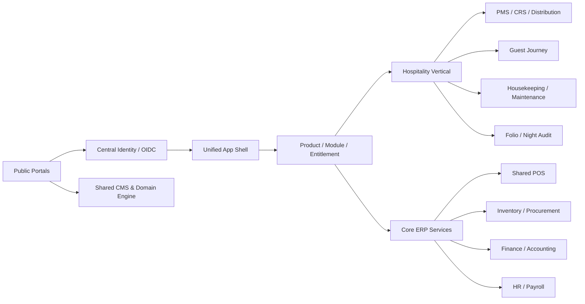
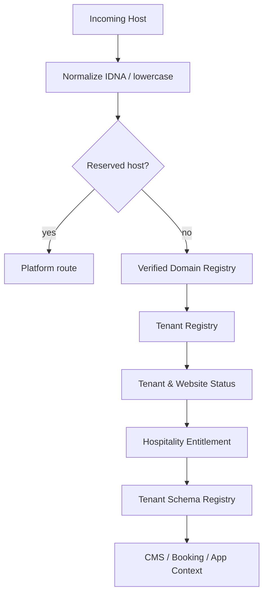
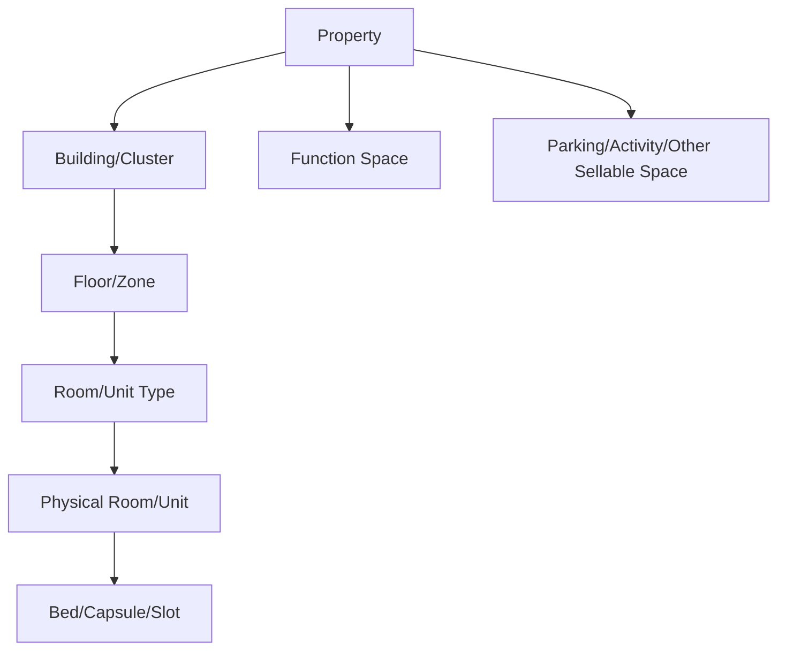
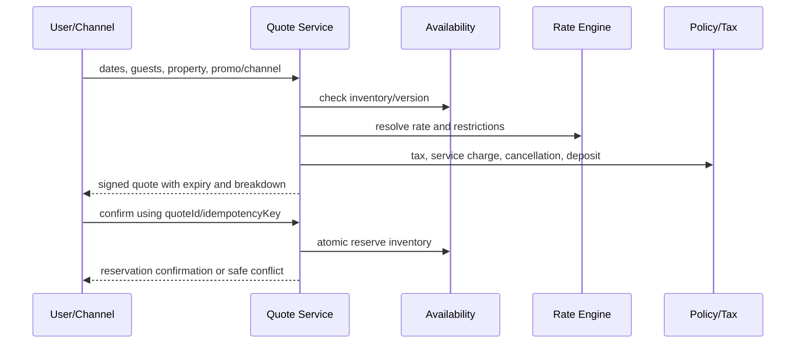
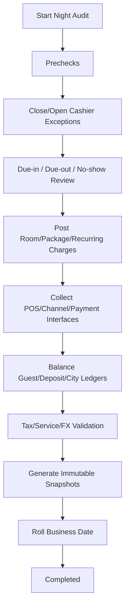
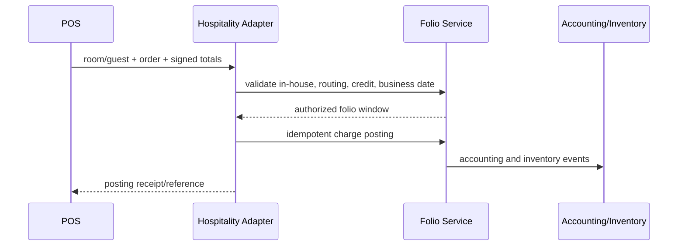

# BUSINESS REQUIREMENTS DOCUMENT (BRD)
# eBisnis.id Versi 14 — MitraInap.id Hospitality Platform
# PMS, CRS, Booking Engine, Channel Manager, Revenue Management, Front Office,
# Housekeeping, Maintenance, Night Audit, Guest CRM, Hotel POS, MICE, Long Stay,
# Website Tenant, Mobile Operations, dan Integrasi ERP Terpadu

**Versi:** 14.0  
**Tanggal:** 6 Agustus 2026  
**Status:** Baseline lengkap dan delta additive untuk vertical Hospitality; seluruh kemampuan Versi 5–13 tetap dipertahankan  
**Portal publik utama:** `https://mitrainap.id`  
**Application entry yang disarankan:** `https://app.mitrainap.id`  
**Demo resmi:** `https://demo.mitrainap.id`  
**Pola website tenant:** `https://{PUBLIC_TENANT_SLUG}.mitrainap.id`  
**Repository sumber kebenaran:** `https://github.com/Zishof/eBisnis`  
**Workspace core:** `C:\opt\eBisnisGithub\`  
**Worktree khusus yang disarankan:** `C:\opt\eBisnisGithub-mitrainap\`  
**Branch khusus yang disarankan:** `feature/v14-mitrainap-hospitality`  
**VCS:** Git-only  
**Stack existing:** NestJS, TypeScript strict, Prisma/PostgreSQL, React/Vite/Refine/shadcn/Tailwind, TanStack Query/Table, React Hook Form, Zod, React Router, Orval, worker/queue, event/outbox, modular tenant schema, shared CMS, identity, billing, notification, AI, observability, audit, workflow, Help/Excel/PDF, POS, inventory, finance, accounting, HR, procurement, marketplace, dan ticketing.

---

## Kontrol Dokumen

| Atribut | Nilai |
|---|---|
| Pemilik Produk | eBisnis.id / CV ZISHOF |
| Nama Produk Baru | MitraInap.id |
| Product Family | Hospitality |
| Portal Code | `MITRAINAP` |
| Vertical Code | `HOSPITALITY` |
| Klasifikasi | Internal — Product and Engineering Baseline |
| Audiens | Product owner, manajemen hotel, operator penginapan, business analyst, architect, developer, QA, DevOps, security, auditor, trainer, support, dan mitra integrasi |
| Bahasa Utama | Indonesia; mendukung English dan bahasa lain melalui translation key |
| Pola Tenant | Satu control plane, tenant username global, schema modular per tenant, audit terpisah |
| Pola Operasi | Multi-property, multi-brand, multi-legal-entity, multi-currency, multi-timezone, business-date aware |
| Prinsip Implementasi | Reuse → extend → adapter → create; bukan membangun platform kedua |

---

# 0. STATUS DOKUMEN DAN SUMBER KEBENARAN

Dokumen ini adalah **BRD Versi 14** untuk menambahkan `mitrainap.id` ke ekosistem eBisnis. Dokumen ini tidak menghapus atau menggantikan kemampuan Versi 5–13. Seluruh modul Core ERP, POS, marketplace, workflow, surat, notification hub, AI, observability, eMedik, eKoperasi, info-desa, Enterprise Education, eSchool, eCampus, dan ePesantren tetap menjadi baseline bersama.

Urutan sumber kebenaran apabila terdapat konflik:

```text
1. Kebutuhan pengguna terbaru mengenai mitrainap.id.
2. BRD Versi 14 ini.
3. Perintah master sesi MitraInap Versi 14.
4. Dokumen platform kolaboratif multi-portal terbaru.
5. BRD/Prompt Versi 13, 12, 11, 10, dan baseline sebelumnya.
6. Source code, migration, database, OpenAPI, test, dan konfigurasi aktual.
7. Standar industri dan dokumentasi vendor resmi sebagai best-practice reference.
```

Status requirement wajib:

```text
DONE
PARTIAL
MISSING
BROKEN
CONFLICTING
BLOCKED
NOT_APPLICABLE
UNKNOWN
```

Requirement hanya berstatus `DONE` apabila model/migration, domain service, API, OpenAPI, client, UI, permission backend, audit, test, Help, laporan, dokumentasi, build, dan smoke test yang relevan benar-benar lulus.

---

# 1. RINGKASAN EKSEKUTIF

`mitrainap.id` adalah portal dan product family hospitality yang menyatukan pengelolaan hotel, penginapan, losmen, guest house, hostel, homestay, resort, villa, cottage, bungalow, serviced apartment, rumah sewa, kos-kosan, co-living, glamping, camping, capsule hotel, dan bentuk akomodasi lain ke dalam satu ekosistem eBisnis.

MitraInap bukan aplikasi terpisah. MitraInap menggunakan:

```text
satu repository
satu control plane
satu identity dan SSO
satu tenant registry
satu username tenant global
satu product/module catalog
satu pricing/contract/billing engine
satu entitlement dan provisioning orchestrator
satu app shell
satu API gateway
satu event/outbox platform
satu workflow engine
satu notification hub
satu AI gateway
satu observability dan audit platform
satu CMS/domain engine
satu Help/Excel/PDF framework
satu POS, inventory, procurement, finance, accounting, HR, payroll, asset, dan investor engine
```

Fokus vertical hospitality:

```text
Property Management System (PMS)
Central Reservation System (CRS)
Booking Engine langsung pada website
Channel Manager dan distribusi OTA/GDS/metasearch
Rate, restriction, inventory, dan revenue management
Guest profile, CRM, consent, loyalty, preference, dan incident history
Front office: pre-arrival, check-in, in-house, room move, check-out
Housekeeping, linen, laundry, minibar, lost-and-found
Maintenance, engineering, preventive maintenance, OOO/OOS
Folio, deposit, cashiering, city ledger, night audit, income audit
POS khusus hospitality dan posting charge ke kamar
Group booking, corporate account, allotment, MICE, banquet, catering
Spa, recreation, transport, concierge, activity, parking, dan ancillary revenue
Long stay, kos, serviced apartment, recurring rent, utility meter, dan deposit
Website tenant, guest portal, mobile operations, kiosk, digital key, dan IoT adapter
Analytics, forecasting, audit, security, privacy, sustainability, dan reporting
```

Target utama adalah satu alur yang benar-benar berjalan dari pencarian kamar sampai laporan keuangan:

```text
Cari Ketersediaan
-> Pilih Unit/Rate/Package
-> Reservasi dan Jaminan Pembayaran
-> Sinkronisasi Channel
-> Pre-arrival
-> Check-in
-> Layanan Selama Menginap
-> Posting POS/Minibar/Layanan ke Folio
-> Housekeeping dan Maintenance
-> Check-out dan Settlement
-> Night Audit
-> Accounting, Inventory, Payroll, Investor, dan Management Reporting
-> Post-stay CRM dan Reputasi
```

---

# 2. VISI, MISI, DAN NILAI PRODUK

## 2.1. Visi

Menjadi platform hospitality terpadu yang dapat digunakan dari penginapan skala mikro hingga jaringan hotel multi-property, tanpa kehilangan kesederhanaan operasional, kontrol keuangan, pengalaman tamu, dan integrasi ERP.

## 2.2. Misi

1. Menghilangkan pemisahan data antara reservasi, kamar, tamu, POS, stok, housekeeping, pembayaran, dan akuntansi.
2. Mengurangi overbooking melalui availability dan inventory yang authoritative serta sinkronisasi channel yang idempotent.
3. Mempercepat pelayanan front desk dan housekeeping melalui workspace real-time yang responsif.
4. Meningkatkan direct booking melalui website tenant dan booking engine mobile-first.
5. Mendukung berbagai model usaha: harian, day-use, mingguan, bulanan, sewa unit, bed-based hostel, villa, dan rumah sewa.
6. Memberikan kontrol rate, revenue, channel cost, dan profitability sampai tingkat property, room type, channel, segment, dan reservation.
7. Memungkinkan tenant mengaktifkan modul Core ERP tanpa membangun sistem paralel.
8. Menyediakan keamanan dan privasi guest data dengan prinsip least privilege, data minimization, masking, retention, dan audit.

## 2.3. Nilai Utama

```text
Satu Data
Satu Guest Journey
Satu Availability
Satu Folio dan Payment Truth
Satu Operational Workspace
Satu ERP Terpadu
Multi-Property
Mobile-First Operations
API-First dan Integration-Ready
Security, Privacy, Audit, dan Recoverability by Default
```

---

# 3. TUJUAN BISNIS DAN KPI

## 3.1. Tujuan Bisnis

- Meningkatkan rasio reservasi langsung dan menurunkan ketergantungan pada proses manual.
- Mengurangi reservation error, duplicate booking, rate mismatch, dan stock/room discrepancy.
- Mempercepat waktu check-in, check-out, room assignment, room cleaning, dan penyelesaian work order.
- Menjamin seluruh charge dari kamar, restoran, minibar, spa, laundry, transport, dan fasilitas lain masuk ke folio serta accounting event yang benar.
- Menyediakan night audit yang aman, repeatable, exception-driven, dan dapat direkonsiliasi.
- Menyediakan laporan operasional dan finansial yang konsisten dari source transaction yang sama.
- Mendukung ekspansi tenant dari satu property menjadi chain tanpa migrasi aplikasi.

## 3.2. KPI Operasional Minimum

| Area | KPI |
|---|---|
| Reservasi | conversion, cancellation rate, no-show rate, booking lead time, average length of stay |
| Distribusi | channel production, channel cost, rate parity exception, sync latency, overbooking incident |
| Front Office | average check-in time, average check-out time, queue time, room move, walk guest |
| Housekeeping | turnaround time, rooms cleaned per attendant, inspection failure, DND backlog, linen discrepancy |
| Maintenance | response time, resolution time, preventive maintenance compliance, OOO/OOS room nights |
| Revenue | occupancy, ADR, RevPAR, TRevPAR, GOPPAR, RevPOR, NetRevPAR, pickup, pace, forecast accuracy |
| POS/F&B | average check, covers, table turn, void/refund, food cost, contribution margin |
| Guest | repeat guest, preference fulfillment, complaint resolution, service recovery, survey/review trend |
| Finance | guest ledger balance, deposit ledger, city ledger aging, cash variance, unbalanced journal, night-audit exception |
| Sustainability | energy/water per occupied room, waste, linen reuse, maintenance efficiency |

## 3.3. Formula KPI Utama

```text
Occupancy = Sold Room Nights / Available Room Nights
ADR = Net Room Revenue / Sold Room Nights
RevPAR = Net Room Revenue / Available Room Nights
TRevPAR = Total Property Revenue / Available Room Nights
GOPPAR = Gross Operating Profit / Available Room Nights
RevPOR = Total Revenue / Occupied Room Nights
NetRevPAR = (Room Revenue - Distribution Cost) / Available Room Nights
Average Length of Stay = Occupied Room Nights / Checked-in Reservations
Cancellation Rate = Cancelled Reservations / Confirmed Reservations
No-show Rate = No-show Reservations / Due-in Reservations
Direct Booking Share = Direct Confirmed Revenue / Total Confirmed Revenue
```

Formula wajib versioned, tenant-aware, tax/service-charge aware, dan mempunyai data dictionary agar angka dashboard, Excel, PDF, dan API selalu konsisten.

---

# 4. RUANG LINGKUP PROPERTY DAN MODEL USAHA

## 4.1. Jenis Property

```text
HOTEL
BOUTIQUE_HOTEL
RESORT
HOSTEL
GUEST_HOUSE
HOMESTAY
MOTEL
INN_LOSMEN
LODGE
VILLA
COTTAGE
BUNGALOW
SERVICED_APARTMENT
APART_HOTEL
BOARDING_HOUSE_KOS
CO_LIVING
RENTAL_HOUSE
VACATION_RENTAL
GLAMPING
CAMPING
CAPSULE_HOTEL
DORMITORY
SHARIA_HOTEL
TRANSIT_HOTEL
EVENT_ACCOMMODATION
OTHER
```

## 4.2. Model Penjualan Unit

```text
ROOM_TYPE_POOL
SPECIFIC_ROOM
BED_BASED
WHOLE_PROPERTY
SPACE_OR_SLOT
DAY_USE
HOURLY_POLICY_CONTROLLED
NIGHTLY
WEEKLY
MONTHLY
CONTRACT_TERM
PACKAGE_BASED
ALLOTMENT_BASED
MEMBERSHIP_BASED
```

`HOURLY_POLICY_CONTROLLED` tidak aktif secara default dan hanya dapat diaktifkan sesuai kebijakan tenant, ketentuan hukum, klasifikasi usaha, dan approval platform/tenant yang berlaku.

## 4.3. Multi-Property dan Chain

Satu tenant dapat memiliki:

```text
Organization
-> Legal Entity
-> Hospitality Chain
-> Brand
-> Property
-> Building/Tower/Villa Cluster
-> Floor/Zone
-> Room Type/Unit Type
-> Physical Room/Bed/Unit
-> Outlet/Restaurant/Spa/Event Space/Parking
```

Central office dapat mengelola central guest profile, central rate strategy, cross-property availability, call-center reservation, corporate account, loyalty, procurement, finance, HR, dan consolidated reporting sesuai entitlement.

---

# 5. STAKEHOLDER DAN PERSONA

| Persona | Kebutuhan Utama |
|---|---|
| Platform Super Admin | portal, product, price catalog, tenant, domain, provisioning, security, audit, release |
| Tenant Owner | subscription, property portfolio, module activation, consolidated KPI, finance |
| Corporate/Chain Admin | brand standards, central rate, distribution, shared guest, portfolio analytics |
| General Manager | daily operation, revenue, guest satisfaction, risk, profitability |
| Front Office Manager | arrivals, departures, queue, room assignment, cashier, exceptions |
| Reservation Agent | availability, quote, booking, modification, cancellation, group/corporate |
| Revenue Manager | forecast, rate, restriction, inventory control, channel mix, displacement |
| Night Auditor | end-of-day, ledger balance, room charge, cashier close, exception resolution |
| Receptionist | walk-in, check-in/out, room move, key, folio, service request |
| Concierge/Guest Service | transport, activity, guest request, complaint, service recovery |
| Housekeeping Manager | room status, assignment, workload, inspection, linen, minibar |
| Room Attendant | mobile task list, room status, supplies, issue escalation, offline |
| Chief Engineer | assets, work order, preventive maintenance, OOO/OOS, vendor, parts |
| F&B Manager | menu, outlet, shift, recipe, inventory, profitability |
| Cashier/Waiter | table/order/payment, room charge, receipt, shift, void request |
| Banquet/MICE Sales | lead, quotation, room block, function space, BEO, deposit, billing |
| Finance/Accountant | ledger, AR, AP, bank, tax, settlement, journal, reconciliation |
| HR/Scheduler | roster, shift, attendance, payroll, training, certification |
| Owner/Investor | owner statement, property performance, capital, settlement, document |
| Guest | search, book, pay, manage stay, request service, check-in/out, invoice |
| Long-stay Tenant | contract, recurring bill, utility, deposit, maintenance, notice, portal |
| Auditor | immutable history, access, financial trail, rate override, room move, print/export |
| Support | ticket, diagnostics, sanitized observability, tenant-approved assistance |

---

# 6. LANDASAN BEST PRACTICE GLOBAL

Desain MitraInap menggunakan referensi berikut sebagai arah, bukan klaim sertifikasi otomatis:

1. **OpenTravel Alliance** untuk interoperabilitas distribusi, guest, offer/order, availability, rate, dan reservation melalui struktur API modern.
2. **AHLA/HTNG** untuk integrasi PMS, guest-room system, event notification, folio detail, food-and-beverage ordering, frictionless check-in, payment capture, privacy, device, dan operational technology.
3. **ISO 22483:2020** sebagai referensi kualitas layanan hotel terkait staf, pelayanan, event, keamanan, maintenance, kebersihan, supply, dan kepuasan tamu.
4. **ISO 21401:2018** dan amendment climate action sebagai referensi sustainability management untuk akomodasi.
5. **ISO 21902:2021** sebagai referensi accessible tourism.
6. **PCI DSS v4.0.1, P2PE, dan Secure Software** sebagai dasar perlindungan data pembayaran.
7. **WCAG 2.2 Level AA** serta panduan mobile accessibility untuk website, booking engine, kiosk, dan aplikasi staf.
8. **OWASP ASVS 5.0 dan API Security Top 10 2023** untuk security verification, object authorization, authentication, field-level authorization, rate limits, dan integration safety.
9. **UU Nomor 27 Tahun 2022 tentang Pelindungan Data Pribadi** untuk pemrosesan data tamu di Indonesia.
10. **Permenpar Nomor 6 Tahun 2025** dan ketentuan usaha pariwisata yang berlaku untuk konfigurasi compliance Indonesia.

Kaidah penerapan:

```text
standard-aware, bukan hard-code satu negara
configuration-driven
versioned dan effective-dated
legal review per tenant/jurisdiction
no false certification claim
evidence dan audit tersedia
```

---

# 7. ARSITEKTUR EKOSISTEM DAN PORTAL

## 7.1. Portal Baru

```text
portalCode = MITRAINAP
portalName = MitraInap.id
primaryDomain = mitrainap.id
applicationDomain = app.mitrainap.id
demoDomain = demo.mitrainap.id
verticalCode = HOSPITALITY
preferredProductCode = MITRAINAP_PMS
```

Portal ekosistem menjadi:

```text
ebisnis.id
enterprise-education.id
santri.info
emedik.id
ekoperasi.id
info-desa.id
mitrainap.id
```

## 7.2. Satu Platform, Banyak Portal



## 7.3. Shared Services yang Dilarang Digandakan

```text
Identity and Access
Tenant and Organization
Pricing and Billing
Subscription and Entitlement
Provisioning and Schema Registry
Domain and CMS
Workflow/SOP
Notification Hub
AI Gateway
Observability and Audit
Help/Excel/PDF
File Storage and Search
Ticketing
Payment orchestration
POS
Inventory and Procurement
Finance and Accounting
HR and Payroll
Asset and Maintenance foundation
Marketplace
Investor and Revenue Sharing
Correspondence/Surat
```

Hospitality membuat bounded context dan adapter, bukan salinan engine.

---

# 8. DOMAIN, SUBDOMAIN, USERNAME, DAN TENANT RESOLUTION

## 8.1. Host yang Didukung

```text
mitrainap.id                         public portal
www.mitrainap.id                     canonical redirect
app.mitrainap.id                     shared application shell, portal context MITRAINAP
demo.mitrainap.id                    demo tenant/platform sandbox
{PUBLIC_TENANT_SLUG}.mitrainap.id    website dan booking engine tenant
booking.{custom-domain}              custom booking domain opsional
{custom-domain}                      website tenant terverifikasi
```

## 8.2. Global Username Tenant

`tenantUsername` tetap mengikuti kontrak platform:

```text
lowercase
regex ^[a-z][a-z0-9_]{2,47}$
global unique secara case-insensitive
immutable setelah reservation/provisioning
reserved-name protected
no rename endpoint
no admin override
atomic reservation dan unique lock
```

Keunikan berlaku di seluruh ekosistem, bukan hanya MitraInap. Username yang sudah dipakai tenant eBisnis, eMedik, eKoperasi, info-desa, Enterprise Education, santri.info, atau portal lain tidak dapat dipakai lagi.

## 8.3. DNS-safe Public Slug

DNS tidak mengizinkan underscore. Oleh sebab itu:

```text
tenantUsername = hotel_jaya
publicTenantSlug = hotel-jaya
public URL = hotel-jaya.mitrainap.id
```

Aturan:

- mapping satu-ke-satu dan tersimpan di Domain Registry;
- default slug dibentuk dengan `_` menjadi `-`, tetapi harus tetap melewati global slug reservation;
- username dan slug tidak pernah dipakai untuk menentukan schema secara langsung;
- perubahan slug setelah publikasi menggunakan workflow, cooling period, redirect history, SEO redirect, dan audit;
- perubahan slug tidak mengubah username atau physical schema;
- apabila username tidak memakai underscore, URL dapat identik dengan username.

## 8.4. Reserved Hosts dan Slugs

```text
www app auth api admin console support status docs assets cdn media static mail
demo sandbox staging dev test booking payments pay guest staff owner investor
```

## 8.5. Resolution Flow



Unknown host tidak boleh fallback ke tenant lain.

---

# 9. ORGANISASI, PROPERTY, DAN ACTIVE CONTEXT

## 9.1. Struktur Organisasi

```text
PlatformOrganization
Tenant
LegalEntity
HospitalityChain
HospitalityBrand
Property
Building
Floor/Zone
RoomType/UnitType
PhysicalRoom/Bed/Unit
Department
Outlet
CostCenter
ProfitCenter
Warehouse
Cashier/Register
```

## 9.2. Active Context

Session minimum:

```text
activeTenantId
activeVerticalCode = HOSPITALITY
activeProductCode
activeRoleId
activeDataScope
activeLegalEntityId
activeBrandId optional
activePropertyId
activeDepartmentId optional
activeOutletId optional
activeRegisterId optional
activeBusinessDate
activeTimezone
activeCurrency
purposeOfUse optional
```

`businessDate` berbeda dari timestamp kalender. Night audit yang menggeser business date; server clock tidak boleh dipalsukan untuk menyelesaikan operasi harian.

## 9.3. Data Scope

```text
PLATFORM
TENANT
LEGAL_ENTITY
CHAIN
BRAND
PROPERTY_CLUSTER
PROPERTY
BUILDING
FLOOR_ZONE
DEPARTMENT
OUTLET
REGISTER
ROOM_TYPE
ROOM_OR_UNIT
COST_CENTER
PROFIT_CENTER
CORPORATE_ACCOUNT
ASSIGNED_RESERVATION
ASSIGNED_TASK
OWN_GUEST_PROFILE
OWN_LONG_STAY_CONTRACT
```

---

# 10. PRODUCT, MODULE, PACKAGE, DAN ENTITLEMENT

## 10.1. Product Code

```text
MITRAINAP_PMS
MITRAINAP_CRS
MITRAINAP_BOOKING_ENGINE
MITRAINAP_CHANNEL_MANAGER
MITRAINAP_REVENUE_MANAGEMENT
MITRAINAP_GUEST_CRM
MITRAINAP_HOUSEKEEPING
MITRAINAP_ENGINEERING
MITRAINAP_CASHIERING_NIGHT_AUDIT
MITRAINAP_HOSPITALITY_POS_ADAPTER
MITRAINAP_MICE_BANQUET
MITRAINAP_LONG_STAY
MITRAINAP_OWNER_MANAGEMENT
MITRAINAP_GUEST_PORTAL
MITRAINAP_MOBILE_OPERATIONS
MITRAINAP_IOT_DIGITAL_KEY
MITRAINAP_ANALYTICS
```

## 10.2. Offering yang Direkomendasikan

```text
MITRAINAP_STARTER
MITRAINAP_STANDARD
MITRAINAP_PRO
MITRAINAP_LONG_STAY
MITRAINAP_RESORT
MITRAINAP_MULTI_PROPERTY
MITRAINAP_ENTERPRISE
CUSTOM_CONTRACT
```

Nilai harga tidak ditetapkan dalam dokumen ini karena pengguna belum menentukan harga komersial. Price catalog awal harus berstatus `PRICE_CONFIGURATION_REQUIRED` sampai Platform Pricing Admin menerbitkan version yang disetujui.

## 10.3. Module Manifest

Setiap module mempunyai:

```text
moduleCode
verticalCode
productCode
version
displayName
description
schemaSuffix
routes
menus
roles
permissions
dependencies
conflicts
eligibility
billingMetrics
migrations
seedProfiles
helpTopics
eventsPublished
eventsConsumed
portsRequired
dataClassification
retention
healthChecks
sampleDataProfile
```

## 10.4. Dependency Contoh

```text
CHANNEL_MANAGER requires PMS + CRS + IntegrationPort
BOOKING_ENGINE requires CRS + CMS + PaymentPort
HOSPITALITY_POS_ADAPTER requires Core POS entitlement
NIGHT_AUDIT requires PMS + Cashiering + AccountingEventPort
LONG_STAY requires PMS foundation + Billing/AR + Contract workflow
MICE requires CRS + Function Space + POS/Inventory optional
DIGITAL_KEY requires PMS + verified DoorLockPort + device security policy
```

---

# 11. ONBOARDING TENANT DAN PROVISIONING

## 11.1. Tenant Baru

```text
mitrainap.id
-> Daftar sebagai Mitra
-> Buat Platform Account
-> Verifikasi Email/Telepon sesuai policy
-> Buat Organization/Legal Entity
-> Pilih Jenis Property
-> Reservasi Tenant Username global
-> Reservasi Public Tenant Slug
-> Pilih Package/Module
-> Simulasi Harga
-> Quote/Contract/Consent
-> Trial atau Payment sesuai policy
-> Provision Core + Hospitality
-> Seed Role/Menu/Help
-> Buat Website dan Booking Engine Tenant
-> Optional Sample Data
-> Guided Property Setup
-> Import/Migrasi
-> UAT
-> Go-Live
```

## 11.2. Tenant Existing eBisnis

```text
Login
-> Ekosistem dan Modul
-> Pilih MitraInap/Hospitality
-> Dependency dan Data Impact Check
-> Quote/Contract Amendment
-> Approval/Payment
-> Provision Hospitality Schema
-> Assign Property Admin
-> Setup Property
-> Smoke Test
-> Activate
```

## 11.3. Provisioning State

```text
DRAFT
VALIDATING
USERNAME_RESERVED
WAITING_CONTRACT
WAITING_PAYMENT
APPROVED
QUEUED
PROVISIONING_SCHEMA
MIGRATING
SEEDING
CONFIGURING_PROPERTY
CONFIGURING_CMS
CONFIGURING_BOOKING_ENGINE
CONFIGURING_USAGE_METER
TESTING
ACTIVE
FAILED
ROLLING_BACK
SUSPENDED
TERMINATING
TERMINATED
```

Setiap langkah idempotent, retryable, audited, observable, dan compensatable.

## 11.4. Guided Setup Checklist

```text
Legal entity dan property
Alamat, timezone, currency, locale
Building/floor/room type/room
Bed configuration
Occupancy dan child policy
Tax/service charge
Rate plan dan cancellation policy
Payment/deposit guarantee
Cashier/register
Housekeeping status dan task schedule
Maintenance assets
Website/CMS/booking engine
Email/WhatsApp template
Channel mapping
Finance/account mapping
User/role/shift
Night audit preflight
Backup dan go-live checklist
```

---

# 12. PRICING, CONTRACT, USAGE, DAN BILLING PLATFORM

## 12.1. Prinsip

- Harga tidak boleh hard-coded pada controller atau frontend.
- Harga versioned, effective-dated, approval-controlled, dan tersimpan sebagai snapshot pada quote/invoice.
- Sample/demo/test/training tidak billable.
- Payment subscription platform dipisahkan dari pembayaran operasional tamu.
- Tenant override dan negotiated contract didukung.

## 12.2. Billing Metric yang Dapat Dipilih

```text
PROPERTY_MONTH
ACTIVE_SELLABLE_UNIT_MONTH
ACTIVE_BED_MONTH
CONFIRMED_RESERVATION
DIRECT_BOOKING_RESERVATION
CHANNEL_CONNECTION_MONTH
POS_REGISTER_MONTH
ACTIVE_STAFF_MONTH
API_USAGE
MESSAGE_USAGE
STORAGE_USAGE
CUSTOM_CONTRACT_METRIC
```

Default metric belum diputuskan dan harus `CONTRACT_DEFINED`.

## 12.3. Model Komersial

```text
PlatformPriceCatalog
PlatformPriceCatalogVersion
PlatformPriceBook
PlatformPackageOffering
PlatformPackageVersion
PlatformPackageModule
PricingMetricDefinition
PricingTier
TenantCommercialContract
TenantContractVersion
TenantContractLine
TenantPriceOverride
TenantDiscount
TenantMinimumCommitment
TenantPriceCap
Quote
QuoteLine
Subscription
SubscriptionLine
UsageMeter
UsageEvent
UsageAggregation
Invoice
InvoiceLine
CreditNote
BillingAdjustment
```

## 12.4. Pemisahan Pembayaran

```text
Platform Subscription Payment
!= Guest Deposit
!= Guest Folio Settlement
!= Long-stay Rent
!= POS Payment
!= OTA Virtual Card/Collect Payment
!= Owner/Investor Settlement
```

Credential, rekening, reconciliation, tax, dan accounting scope harus berbeda.

---

# 13. MODEL DATA FOUNDATION HOSPITALITY

Entity minimum dikelompokkan sebagai berikut.

## 13.1. Property Foundation

```text
HospitalityTenantProfile
HospitalityChain
HospitalityBrand
Property
PropertyType
PropertyClassification
PropertyLicenseReference
PropertyAddress
PropertyContact
PropertyPolicy
PropertyBusinessDate
PropertyCalendar
PropertyHoliday
PropertyAmenity
PropertyFacility
Building
Floor
Zone
SellableSpace
RoomType
RoomTypeFeature
PhysicalRoom
Bed
UnitAttribute
AccessibilityFeature
OccupancyPolicy
ChildPolicy
ExtraBedPolicy
MealPlan
```

## 13.2. Guest and CRM

```text
GuestProfile
GuestIdentifier
GuestNameHistory
GuestAddress
GuestContact
GuestCompanyLink
GuestTravelDocument
GuestCompanion
GuestRelationship
GuestPreference
GuestConsent
GuestCommunicationPreference
GuestVIPStatus
GuestLoyaltyAccount
GuestStayHistory
GuestIncident
GuestAlert
GuestDoNotRent
GuestDuplicateCandidate
GuestMerge
GuestDataRequest
```

## 13.3. Reservation and Availability

```text
Reservation
ReservationStay
ReservationGuest
ReservationRoomAssignment
ReservationStatusHistory
ReservationSource
ReservationSegment
ReservationChannel
ReservationGuarantee
ReservationDepositSchedule
ReservationCancellationPolicySnapshot
ReservationRateSnapshot
ReservationTaxSnapshot
ReservationPackage
ReservationAddon
ReservationTrace
ReservationNote
ReservationAttachment
ReservationShare
ReservationSplit
ReservationLink
ReservationWaitlist
ReservationOption
ReservationNoShow
ReservationWalk
AvailabilityInventory
AvailabilityAdjustment
OverbookingLimit
RoomBlock
Allotment
GroupReservation
```

## 13.4. Rate and Distribution

```text
RatePlan
RatePlanVersion
RateCode
RateCalendar
RateAmount
RateOccupancyAdjustment
RateDerivedRule
RatePackage
RateRestriction
StopSell
MinimumStay
MaximumStay
ClosedToArrival
ClosedToDeparture
InventoryControl
Channel
ChannelConnection
ChannelCredentialVersion
ChannelMapping
ChannelRateMapping
ChannelRoomMapping
ChannelSyncJob
ChannelSyncMessage
ChannelReservationMessage
ChannelReconciliation
DistributionCostRule
CommissionRule
RevenueForecast
RevenueRecommendation
RevenueOverride
```

## 13.5. Front Office and Folio

```text
RegistrationCard
CheckIn
CheckOut
RoomMove
KeyIssue
KeyReturn
DigitalKeyGrant
GuestLedgerAccount
Folio
FolioWindow
FolioTransaction
FolioRoutingRule
FolioTransfer
FolioAdjustment
FolioAllowance
FolioCorrection
FolioPayment
DepositLedger
GuestLedger
CityLedger
HouseAccount
Cashier
CashierShift
CashierClose
CashMovement
ExchangeRateSnapshot
Invoice
Receipt
Refund
Chargeback
PaymentTokenReference
```

## 13.6. Operations

```text
RoomStatus
HousekeepingTask
HousekeepingTaskAssignment
HousekeepingWorkloadPoint
HousekeepingInspection
TurndownTask
LinenItem
LinenMovement
LaundryOrder
MinibarInventory
MinibarConsumption
LostAndFoundItem
GuestServiceRequest
Complaint
ServiceRecovery
MaintenanceAsset
WorkOrder
PreventiveMaintenancePlan
RoomOutOfOrder
RoomOutOfService
MaintenanceInspection
EnergyMeter
WaterMeter
UtilityReading
```

## 13.7. Night Audit

```text
BusinessDateControl
NightAuditRun
NightAuditStep
NightAuditException
NightAuditPrecheck
NightAuditPosting
NightAuditReportSnapshot
IncomeAuditReview
LedgerReconciliation
InterfaceReconciliation
BusinessDateRoll
NightAuditRollbackPlan
```

## 13.8. MICE, POS, Long Stay, Owner

```text
EventLead
EventOpportunity
FunctionSpace
FunctionSpaceSetup
RoomBlock
EventQuotation
EventContract
BanquetEventOrder
EventSchedule
EventMenu
EventEquipment
EventDeposit
EventBillingInstruction
LongStayContract
LongStayOccupant
LongStayRecurringCharge
SecurityDeposit
UtilityBilling
MoveIn
MoveOut
Renewal
Notice
DamageAssessment
OwnerProfile
OwnerPropertyAgreement
OwnerStatement
OwnerRevenueShare
OwnerPayout
```

Semua uang, rate, tax, quantity, occupancy, percentage, dan exchange rate menggunakan Decimal/value object, bukan floating point.

---

# 14. PROPERTY, ROOM, BED, SPACE, DAN SELLABLE INVENTORY

## 14.1. Inventory Hierarchy



## 14.2. Prinsip Inventory

- Physical room tidak sama dengan room type inventory.
- Hostel dapat menjual bed, private room, atau seluruh dormitory tanpa oversell.
- Villa dapat dijual per kamar atau seluruh property sesuai configuration dan mutual-exclusion rules.
- Room status operasional tidak otomatis sama dengan availability komersial.
- OOO mengurangi sellable inventory sesuai policy; OOS dapat tetap dihitung berbeda untuk statistik.
- House use, complimentary, owner use, maintenance, and staff room mempunyai status dan accounting treatment terpisah.
- Inventory update concurrency-safe, idempotent, dan mempunyai source/version.

## 14.3. Room Status

```text
VACANT_DIRTY
VACANT_CLEAN
VACANT_INSPECTED
OCCUPIED_DIRTY
OCCUPIED_CLEAN
PICKUP
DO_NOT_DISTURB
MAKE_UP_ROOM
SLEEP
SKIP
OUT_OF_ORDER
OUT_OF_SERVICE
HOUSE_USE
OWNER_USE
BLOCKED
```

Front-office status dan housekeeping condition disimpan terpisah tetapi direkonsiliasi.

---

# 15. GUEST IDENTITY, CRM, LOYALTY, DAN PRIVACY

## 15.1. Golden Guest Profile

Sistem mendeteksi duplicate berdasarkan kombinasi data yang aman, tetapi merge selalu terkontrol. Satu guest dapat mempunyai banyak identifier, contact, travel document, company link, loyalty account, preference, dan stay history.

## 15.2. Guest Preference

```text
room/floor preference
bed type
smoking policy
pillow
allergy/dietary
accessibility need
language
communication channel
arrival transport
housekeeping time
turndown
minibar
amenity
invoice preference
```

Preference tidak boleh menjadi alasan diskriminasi yang melanggar hukum. Data sensitif hanya tampil kepada role dan purpose yang sah.

## 15.3. Consent dan Communication

Consent dikelola per purpose:

```text
reservation fulfillment
payment
identity verification
marketing
loyalty
personalization
analytics
third-party transfer
review request
biometric/digital key if applicable
```

## 15.4. Incident dan Do-Not-Rent

Do-not-rent, fraud alert, dan security incident memerlukan reason, evidence, expiry/review date, limited visibility, approval, dan audit. Label tidak boleh tampil pada portal tamu atau staf yang tidak berhak.

---

# 16. RESERVATION, CRS, DAN BOOKING LIFECYCLE

## 16.1. Reservation Status

```text
INQUIRY
QUOTED
OPTION
HOLD
WAITLIST
PENDING_GUARANTEE
PENDING_PAYMENT
CONFIRMED
PRE_ARRIVAL
DUE_IN
CHECKED_IN
IN_HOUSE
DUE_OUT
CHECKED_OUT
CANCELLED
NO_SHOW
WALKED
REINSTATED
```

Client tidak boleh mengubah status bebas. Semua transition melalui command service dengan precondition, permission, idempotency, payment/guarantee validation, room/inventory check, dan audit.

## 16.2. Availability and Quote Flow



## 16.3. Reservation Functions

```text
create/modify/cancel/reinstate
split/share/link
room assignment/unassignment
room move before/in stay
extend/shorten stay
upgrade/downgrade
waitlist and option expiry
walk-in
day use
complimentary/house use
corporate/group/allotment
multi-room and multi-property
package and add-on
special request and trace
prepayment and guarantee
confirmation/resend
```

## 16.4. Overbooking dan Walk

Overbooking limit configurable per property, room type, date, channel, dan approval threshold. Jika tidak dapat mengakomodasi tamu, `WalkGuest` mencatat alternate property, transport, compensation, approval, cost, guest communication, dan audit.

---

# 17. RATE, RESTRICTION, AVAILABILITY, DAN REVENUE MANAGEMENT

## 17.1. Rate Plan

```text
BAR
CORPORATE
WHOLESALE
GOVERNMENT
MEMBER
LOYALTY
PACKAGE
PROMOTIONAL
WEEKLY
MONTHLY
DAY_USE
GROUP
CREW
COMPLIMENTARY
OWNER
NEGOTIATED
```

## 17.2. Restriction

```text
stop sell
open/close
minimum/maximum length of stay
closed to arrival/departure
advance purchase
lead time
last-room availability
occupancy based pricing
extra person/child/bed
minimum price/floor
maximum inventory by channel
release days
cutoff
cancellation/no-show policy
deposit schedule
```

## 17.3. Revenue Management Workspace

Menampilkan:

```text
occupancy on books
forecast occupancy
pickup and pace
ADR/RevPAR/TRevPAR/NetRevPAR
channel mix and acquisition cost
market segment mix
group block pickup/wash
cancellation/no-show trend
length-of-stay pattern
rate shopping/competitor data only through approved provider
recommended rate/restriction
override reason and approval
forecast accuracy
```

AI atau algorithm menghasilkan `RECOMMENDATION`; publish massal rate/restriction memerlukan human review, permission, effective date, audit, dan rollback snapshot.

## 17.4. Displacement Analysis

Group/MICE quote dapat dibandingkan dengan transient demand berdasarkan expected room revenue, ancillary revenue, variable cost, channel cost, wash probability, dan function-space value. Formula harus transparan dan dapat diuji.

---

# 18. CHANNEL MANAGER, OTA, GDS, METASEARCH, DAN DISTRIBUSI

## 18.1. Channel Types

```text
DIRECT_WEB
DIRECT_MOBILE
PHONE
WALK_IN
EMAIL
OTA
WHOLESALER
GDS
TRAVEL_AGENT
METASEARCH
CORPORATE_PORTAL
AFFILIATE
SOCIAL_COMMERCE
```

## 18.2. ARI Synchronization

ARI = Availability, Rates, Inventory/Restrictions. Setiap update:

```text
sourceVersion
propertyId
roomType/ratePlan mapping
date range
quantity/rate/restriction
idempotencyKey
correlationId
sentAt/acknowledgedAt
provider status
retry count
error code
payload hash
```

## 18.3. Reservation Delivery

Channel reservation masuk melalui webhook/polling/adapter, divalidasi, dideduplikasi, dipetakan, disimpan raw message tersanitasi, lalu diproses ke reservation service. Duplicate callback tidak boleh membuat reservasi kedua.

## 18.4. Reconciliation Queue

Exception queue mencakup:

```text
unmapped room/rate
invalid occupancy
rate mismatch
unknown tax/fee
payment/virtual card issue
modification out of order
duplicate reservation
cancel conflict
availability negative
provider timeout
webhook signature failure
```

## 18.5. Integrasi Standard-aware

Gunakan OpenTravel/HTNG mapping dan adapter versioning. Jangan menyalin payload satu provider menjadi canonical domain model.

---

# 19. WEBSITE UTAMA MITRAINAP.ID DAN WEBSITE TENANT

## 19.1. Website Utama

Navigasi minimum:

```text
Beranda
Solusi
  Hotel dan Resort
  Guest House dan Homestay
  Hostel dan Capsule
  Villa dan Cottage
  Kos dan Long Stay
  Multi-Property
Fitur
  Reservasi dan PMS
  Booking Engine
  Channel Manager
  Housekeeping
  POS Penginapan
  Finance dan Accounting
  Guest Experience
Harga
Demo
Mitra
Artikel
Bantuan
Tentang Kami
Masuk
Daftar Mitra
```

## 19.2. Hero

```text
Eyebrow: Platform Penginapan Terpadu
Headline: Kelola Reservasi, Kamar, Tamu, Operasional, dan Keuangan dalam Satu Sistem.
Subheadline: MitraInap.id menghubungkan website, booking online, front office, housekeeping,
POS, stok, pembayaran, night audit, dan ERP eBisnis untuk berbagai jenis penginapan.
CTA utama: Coba Demo
CTA kedua: Daftarkan Properti
CTA ketiga: Jadwalkan Presentasi
```

## 19.3. Website Tenant

Tenant dapat mengelola:

```text
logo, favicon, brand, warna, typography
hero dan promotion
property profile, room/unit, amenity, facility
photo/video gallery
rates from booking engine
package, add-on, activity, restaurant, spa
news, article, event, announcement
location, map, transport, nearby attraction
policy, FAQ, contact, review projection
SEO, sitemap, canonical, redirects
multi-language and currency display
booking widget and guest portal
custom domain
```

CMS memakai draft/review/approve/schedule/publish. Tenant tidak dapat menjalankan JavaScript arbitrary.

---

# 20. DIRECT BOOKING ENGINE

## 20.1. Guest Flow

```text
Search dates/guests
-> View availability and transparent total
-> Compare room/unit and rate plan
-> Select extras/package
-> Enter guest details
-> Sign/accept policy and consent
-> Pay/deposit/guarantee
-> Confirmation
-> Self-service manage booking
```

## 20.2. UX Requirements

- mobile-first, fast, accessible, no horizontal scroll;
- date and guest selector tetap terlihat pada result;
- total price, tax, service charge, cancellation, deposit, dan inclusions transparan sebelum payment;
- room photo, bed, occupancy, accessibility, meal plan, amenity, dan remaining inventory jelas;
- sticky booking summary pada desktop dan mobile bottom summary;
- guest checkout tidak wajib membuat account jika policy mengizinkan;
- progress indicator maksimal beberapa langkah yang jelas;
- save/recover quote dan retry payment idempotent;
- no dark patterns, no hidden fees, no preselected paid extras tanpa consent;
- multi-language, currency display, locale date, and RTL-ready;
- promo code tidak mengungkap rate yang tidak berhak;
- analytics consent-aware.

## 20.3. Booking Engine Security

```text
rate limit and bot protection
quote signature and expiry
server-authoritative total
inventory concurrency lock
idempotent reservation/payment
CSRF and secure session
PII minimization
payment tokenization
webhook verification
fraud/risk signal
safe error messages
```

---

# 21. FRONT OFFICE DAN GUEST JOURNEY

## 21.1. Pre-Arrival

```text
arrival review
ETA and transport
online registration
ID/travel document upload with secure retention
pre-arrival message
upsell room/add-on
special request
deposit balance
room pre-assignment
housekeeping priority
digital key eligibility
VIP/incident/preference review
```

## 21.2. Check-In


Check-in harus memvalidasi room readiness, occupancy, identity field, payment guarantee, deposit, duplicate in-house, key access, companion, child policy, dan data wajib berdasarkan jurisdiction/property type.

## 21.3. In-House

```text
room move
extend/shorten stay
add/remove companion
share/split reservation
change rate with approval
routing instruction
post charge/payment
credit limit monitoring
wake-up call
guest request/complaint
DND/make-up room
maintenance issue
lost key/rekey
visitor/access record
amenity and package fulfillment
```

## 21.4. Check-Out

```text
review folio/windows
resolve pending POS/interface postings
apply allowance/correction with permission
settle payment/refund
issue invoice/receipt
return/deactivate key
capture forwarding/contact preference
mark room dirty
create lost-and-found/maintenance follow-up
post-stay survey/review request
close reservation
```

## 21.5. Express and Mobile Checkout

Guest dapat melihat provisional folio, memilih payment method yang tersedia, menyetujui final charge, menerima invoice, dan menyelesaikan checkout tanpa front desk bila policy dan risk control mengizinkan.

---

# 22. HOUSEKEEPING, LINEN, LAUNDRY, MINIBAR, DAN LOST-AND-FOUND

## 22.1. Housekeeping Board

Menampilkan property/floor/zone, room condition, front-office status, due-in/out, stayover, DND, VIP, priority, service time, attendant, task, inspection, and maintenance alert.

## 22.2. Assignment

Assignment dapat manual atau auto berdasarkan:

```text
workload points
room type/size
stayover vs checkout
floor/zone
attendant skill
shift and availability
priority and due-in ETA
turndown
accessibility/safety rule
```

## 22.3. Mobile Task

Room attendant dapat:

```text
start/pause/complete task
update condition
record supplies/linen/minibar
add photo/issue/note
respect DND
escalate maintenance
request inspection
work offline with idempotent queue
```

## 22.4. Linen and Laundry

Track par level, issue, return, dirty, clean, damaged, missing, vendor laundry, weight/count discrepancy, cost, and write-off.

## 22.5. Lost and Found

Item mempunyai found location/time, finder, category, secure storage, photo, claimant verification, release/shipping, expiry/disposal, and audit.

---

# 23. MAINTENANCE, ENGINEERING, ASSET, OOO/OOS

## 23.1. Work Order

```text
NEW -> TRIAGED -> ASSIGNED -> IN_PROGRESS -> WAITING_PART -> WAITING_VENDOR
-> READY_FOR_INSPECTION -> COMPLETED -> VERIFIED -> CLOSED
Alternatif: CANCELLED, DUPLICATE, DEFERRED
```

## 23.2. Sources

```text
housekeeping issue
guest complaint
front desk
preventive maintenance
IoT alert
energy anomaly
inspection
asset lifecycle
safety incident
```

## 23.3. Room OOO/OOS

- OOO/OOS memerlukan start/end, reason, impact, owner, approval threshold, maintenance link, and audit.
- Availability impact dihitung server-side.
- Room tidak boleh dijual/ditugaskan selama blocked period kecuali approved override.
- Release room memerlukan verification/inspection sesuai policy.

## 23.4. Preventive Maintenance

Jadwal berdasarkan kalender, usage meter, operating hours, condition, manufacturer guidance, atau compliance. Missed maintenance menghasilkan escalation.

---

# 24. FOLIO, CASHIERING, PAYMENT, CITY LEDGER, DAN NIGHT AUDIT

## 24.1. Folio

Reservation dapat mempunyai banyak folio windows untuk pemisahan guest/company/group/agent. Routing rules dapat memindahkan charge berdasarkan transaction code, date, limit, percentage, atau payor.

## 24.2. Payment

Mendukung:

```text
cash
card via tokenized provider
bank transfer
QR/online
virtual account
OTA collect/virtual card
company credit/city ledger
voucher/gift card
deposit
mixed payment
refund and chargeback
```

Aplikasi tidak menyimpan PAN/CVV mentah. Payment provider dan token reference berada pada scope terpisah.

## 24.3. Ledger

```text
Deposit Ledger
Guest Ledger
City Ledger / Accounts Receivable
House Account
Advance Deposit
Unallocated Payment
Chargeback/Dispute
```

## 24.4. Night Audit



Precheck minimum:

```text
unresolved due-in/due-out
open cashier
unbalanced folio
pending payment
unprocessed POS/interface charge
invalid room status
rate missing
negative/invalid deposit
outstanding no-show decision
journal/accounting failure
channel sync backlog beyond policy
backup/health condition
```

Night audit:

- mempunyai immutable run ID, step status, retry checkpoint, idempotency key, correlation ID;
- tidak boleh dijalankan dua kali untuk property/business date yang sama;
- kegagalan tidak boleh menggulung business date;
- correction setelah close memakai adjustment/reversal atau income-audit workflow;
- menghasilkan manager report, trial balance, occupancy/revenue snapshot, cashier summary, tax, ledger, exception, and interface reconciliation.

---

# 25. POS KHUSUS HOSPITALITY DAN F&B

## 25.1. Outlet

```text
restaurant
bar
cafe
room service
banquet
minibar
spa
laundry
gift shop
parking
activity/recreation
other service outlet
```

## 25.2. POS Capability

Reuse Core POS untuk register, shift, product, recipe, tax, promotion, inventory, payment, receipt, void, return, and accounting. Hospitality adapter menambah:

```text
post charge to room/folio
validate in-house guest and credit limit
search by room, guest, reservation, QR, or wristband
guest signature/confirmation
routing instruction
meal-plan entitlement
package inclusion
service charge/tip/gratuity
room service delivery tracking
banquet/event link
minibar auto posting
```

## 25.3. Room Charge Flow



Completed POS transaction tidak dapat diedit; correction menggunakan void/return/refund/reversal sesuai status dan SoD.

---

# 26. GROUP, CORPORATE, ALLOTMENT, MICE, BANQUET, DAN CATERING

## 26.1. Group and Corporate

```text
corporate profile and negotiated rate
group lead/opportunity
room block and allotment
cutoff/release
pickup/wash
rooming list
master folio/routing
billing instruction
commission
credit approval
contract/document
```

## 26.2. MICE

```text
lead
availability of function space
quotation/package
option/tentative/definite
contract and e-sign
room block
function schedule
setup style/capacity
menu and dietary
AV/equipment
staff and vendor
BEO
change order
on-site operation
consumption/posting
invoice and settlement
post-event profitability
```

## 26.3. Event Space Conflict

Function space, setup/teardown time, room block, equipment, and staff schedule harus mempunyai conflict detection dan override approval.

---

# 27. GUEST SERVICE, CONCIERGE, TRANSPORT, SPA, DAN ANCILLARY

Capability:

```text
airport transfer
shuttle/vehicle/driver
concierge request
wake-up call
luggage storage
visitor
parcel/package
activity/tour booking
spa/wellness appointment
golf/recreation
childcare policy controlled
parking
pet service
amenity delivery
restaurant reservation
service request tracking
complaint and service recovery
```

Setiap request memiliki SLA, owner, status, priority, guest communication, cost/charge, fulfillment evidence, and audit.

---

# 28. LONG STAY, KOS, SERVICED APARTMENT, RENTAL HOUSE, DAN OWNER MANAGEMENT

## 28.1. Long Stay Contract

```text
prospect/application
screening/reference according law
unit offer
contract and term
occupants
security deposit
recurring rent
utility and service charge
move-in inspection
monthly billing/payment
late fee policy
maintenance request
room/unit transfer
renewal
notice
move-out inspection
damage/settlement
refund deposit
archive
```

## 28.2. Utility Meter

Electricity, water, gas, internet, parking, laundry, and other recurring charges support meter reading, estimated reading policy, photo/evidence, tariff version, minimum charge, adjustment, and tenant statement.

## 28.3. Owner/Villa Management

```text
owner agreement
owner use/block
revenue and cost allocation
cleaning/maintenance fee
channel commission
management fee
tax withholding policy
owner statement
owner payout
capital/maintenance reserve
damage claim
```

Gunakan shared investor/revenue-sharing/accounting engine bila semantics sesuai; jangan membuat ledger kedua.

---

# 29. INTEGRASI ERP EBISNIS

## 29.1. Inventory dan Procurement

```text
amenity
linen
cleaning supplies
food and beverage
minibar
maintenance spare part
uniform
guest supplies
central warehouse
requisition
purchase order
receiving
issue/consumption
transfer
stock opname
waste/spoilage
recipe/HPP
```

## 29.2. Finance dan Accounting

Accounting event minimum:

```text
ROOM_REVENUE_POSTED
PACKAGE_REVENUE_POSTED
FNB_REVENUE_POSTED
ANCILLARY_REVENUE_POSTED
GUEST_DEPOSIT_RECEIVED
GUEST_PAYMENT_RECEIVED
CITY_LEDGER_TRANSFERRED
REFUND_PROCESSED
CHARGEBACK_RECORDED
OTA_COMMISSION_ACCRUED
TRAVEL_AGENT_COMMISSION_ACCRUED
TAX_SERVICE_CHARGE_POSTED
MINIBAR_CONSUMPTION
HOUSEKEEPING_SUPPLY_CONSUMED
ROOM_OOO_COST
LONG_STAY_RENT_BILLED
UTILITY_BILLED
OWNER_SETTLEMENT
CASHIER_VARIANCE
NIGHT_AUDIT_CLOSED
```

Debit/credit ditentukan Accounting Event Rule Engine, bukan controller hospitality.

## 29.3. HR dan Payroll

```text
employee and role
shift/roster
attendance
overtime
service charge distribution policy
tip/gratuity allocation
training/certification
uniform/assets
performance and task productivity
payroll
```

## 29.4. Asset dan Investor

Room, building, equipment, kitchen, HVAC, lock, vehicle, laundry machine, and furniture dapat terhubung ke asset lifecycle. Property/outlet dapat terhubung ke multi-investor sesuai entitlement.

---

# 30. GUEST PORTAL, STAFF MOBILE, KIOSK, DIGITAL KEY, DAN IOT

## 30.1. Guest Portal

```text
view/modify/cancel reservation according policy
pre-arrival registration
upload document securely
pay deposit/balance
request transport/service
select ETA
view folio
mobile/express checkout
invoice/receipt
loyalty/profile/consent
chat/message
post-stay feedback
```

## 30.2. Staff Mobile

Task-specific, bukan menyalin seluruh desktop:

```text
housekeeping task
maintenance work order
front-desk arrival/queue
concierge request
manager approval
inventory issue/count
POS mobile where permitted
```

## 30.3. Kiosk

Self check-in/out membutuhkan identity verification, reservation lookup, payment, registration card, key issuance adapter, printer, privacy screen, session wipe, remote device management, and fallback to staff.

## 30.4. Digital Key

Digital key tidak diaktifkan tanpa verified provider contract. Grant harus time-bound, device-bound, revocable, room/stay scoped, audited, and synchronized with room move/check-out.

## 30.5. IoT

Adapter dapat menerima:

```text
door lock events
energy management
occupancy sensor
HVAC
minibar sensor
water leak
smoke/fire system reference
panic/staff alert
smart TV/guest room control
```

Safety-critical system tetap mempunyai independent certified controls; MitraInap tidak boleh menjadi single point of failure untuk fire/life safety.

---

# 31. NOTIFICATION, OMNICHANNEL COMMUNICATION, DAN REPUTATION

## 31.1. Communication Journey

```text
booking confirmation
payment/deposit reminder
pre-arrival
online check-in invitation
arrival/transport
welcome
service status
checkout reminder
invoice
post-stay survey
review request
win-back/loyalty with consent
```

## 31.2. Channel

```text
in-app
email
WhatsApp via approved provider
SMS
web push
mobile push
voice/PBX adapter optional
```

Template localized, tenant-branded, preference-aware, quiet-hour-aware, idempotent, and audited.

## 31.3. Reputation

Review import/publish hanya melalui approved provider. Sistem menyimpan source, review, response draft, sentiment/issue taxonomy, response approval, and trend. AI boleh membantu draft; publikasi tetap human-controlled.

---

# 32. AI UNTUK HOSPITALITY

## 32.1. Use Case yang Diizinkan

```text
forecast narrative
rate/restriction recommendation
pickup and pace explanation
channel cost anomaly
arrival/departure summary
VIP/preference summary with permission
housekeeping workload suggestion
maintenance anomaly and root-cause candidate
guest message/reply draft
review response draft
upsell recommendation
inventory reorder suggestion
night audit exception explanation
owner/GM report narrative
knowledge/help assistant
```

## 32.2. Risk Class

```text
READ_ONLY
DRAFT_ONLY
PROPOSE_CHANGE
EXECUTE_WITH_CONFIRMATION for low-risk typed actions
FORBIDDEN_AUTONOMOUS
```

## 32.3. Dilarang Autonomous

```text
confirm/cancel reservation
publish rate/restriction
charge/refund card
post/void folio
close night audit
issue digital key
open door
change room assignment
change guest do-not-rent status
post journal
approve payment
change role/permission
send sensitive guest data to unapproved model
```

AI context permission-aware, tenant-isolated, minimized, redacted, evidence-linked, and audited.

---

# 33. REPORTING, DASHBOARD, DAN ANALYTICS

## 33.1. Daily Operations Dashboard

```text
business date
occupancy today/tomorrow
arrivals/departures/in-house
rooms clean/dirty/inspected/OOO/OOS
unassigned arrivals
queue rooms
VIP/special requests
open folio balance
open cashier
night audit readiness
channel sync exception
open service request/work order
```

## 33.2. Revenue Dashboard

```text
occupancy, ADR, RevPAR, TRevPAR, GOPPAR, RevPOR, NetRevPAR
on-books vs forecast vs budget
pickup/pace
segment/channel/source
rate plan
LOS and lead time
cancellation/no-show
channel commission and acquisition cost
room type profitability
package/add-on conversion
```

## 33.3. Reports

```text
reservation detail and statistics
arrival/departure/in-house
room diary/tape chart
room status and discrepancy
housekeeping assignment/productivity
maintenance/OOO/OOS
guest profile/stay/preferences with masking
folio/transaction code/cashier
deposit/guest/city ledger
night audit manager report
trial balance and reconciliation
channel production and commission
corporate/group/allotment
MICE/BEO/profitability
POS/F&B
inventory/procurement/HPP
long-stay rent/utilities/deposit
owner statement
sustainability indicators
security/audit/access/export
```

Report snapshot menyimpan canonical parameter JSON, business date/period, source version, row count, totals, hash, creator, approval, print/reprint, and watermark.

---

# 34. SECURITY, PRIVACY, PAYMENT, DAN COMPLIANCE

## 34.1. Security Baseline

```text
OIDC Authorization Code + PKCE
HttpOnly Secure SameSite session
CSRF protection
MFA/step-up privileged action
tenant/property isolation
object and field-level authorization
rate limit and bot protection
signed webhook and replay protection
idempotency
secret vault
payment tokenization/P2PE where supported
no raw PAN/CVV storage
encryption in transit and at rest
attachment malware validation
structured audit and correlation
backup/restore/DR
retention/legal hold
```

## 34.2. Sensitive Data

```text
passport/ID
contact
travel itinerary
room/stay history
payment token and masked account
incident/do-not-rent
access/key event
biometric where applicable
child/minor data
health/accessibility request
long-stay financial data
```

Field masking dan purpose-of-use diterapkan.

## 34.3. API Security

Setiap endpoint yang menerima ID memvalidasi tenant, property, role, data scope, object ownership/access, and field permission. DTO allowlist mencegah mass assignment terhadap rate, total, tax, payment, room, dan status internal.

## 34.4. Compliance Configuration

Sediakan policy registry untuk:

```text
data retention
guest registration fields
foreign guest reporting reference
invoice/tax/service charge
consumer disclosure
cancellation/refund
accessibility
payment compliance
privacy rights request
marketing consent
CCTV/access log reference
local tourism/business licensing evidence
```

Compliance module membantu evidence; tidak menggantikan penasihat hukum atau sertifikasi.

---

# 35. API, PORT, EVENT, DAN INTEGRASI

## 35.1. Public Ports

```text
IdentityPort
OrganizationPort
EntitlementPort
PricingPort
BillingPort
PaymentPort
AccountingEventPort
InventoryPort
PosPort
ProcurementPort
HrPayrollPort
WorkflowPort
NotificationPort
AiGatewayPort
AuditPort
FileStoragePort
SearchPort
CmsPort
DomainPort
TicketingPort
ChannelDistributionPort
RevenueManagementPort
DoorLockPort
IdVerificationPort
GuestMessagingPort
PbxPort
IptvPort
IoTPort
EnergyManagementPort
ReputationPort
GovernmentReportingPort
```

## 35.2. API Namespace

```text
/api/v1/hospitality/**
/api/v1/public/mitrainap/**
/api/v1/guest/**
/api/v1/hospitality-integrations/**
```

Endpoint minimum:

```text
GET/POST/PATCH /hospitality/properties
GET/POST/PATCH /hospitality/room-types
GET/POST/PATCH /hospitality/rooms
POST /hospitality/availability/search
POST /hospitality/quotes
GET/POST/PATCH /hospitality/reservations
POST /hospitality/reservations/:id/confirm
POST /hospitality/reservations/:id/cancel
POST /hospitality/reservations/:id/check-in
POST /hospitality/reservations/:id/room-move
POST /hospitality/reservations/:id/check-out
GET/POST/PATCH /hospitality/rates
GET/POST/PATCH /hospitality/restrictions
POST /hospitality/distribution/sync
GET /hospitality/distribution/exceptions
GET/POST/PATCH /hospitality/housekeeping/tasks
GET/POST/PATCH /hospitality/maintenance/work-orders
GET /hospitality/folios/:id
POST /hospitality/folios/:id/postings
POST /hospitality/folios/:id/payments
POST /hospitality/folios/:id/refunds
POST /hospitality/night-audit/precheck
POST /hospitality/night-audit/runs
POST /hospitality/pos/room-charge
GET/POST/PATCH /hospitality/groups
GET/POST/PATCH /hospitality/events
GET/POST/PATCH /hospitality/long-stay/contracts
GET /hospitality/reports/**
GET/POST/PATCH /hospitality/configuration/**
```

## 35.3. Domain Events

```text
hospitality.property.created
hospitality.inventory.changed
hospitality.rate.published
hospitality.reservation.created
hospitality.reservation.confirmed
hospitality.reservation.cancelled
hospitality.guest.checked_in
hospitality.guest.room_moved
hospitality.folio.charge_posted
hospitality.payment.recorded
hospitality.housekeeping.completed
hospitality.room.out_of_order
hospitality.guest.checked_out
hospitality.night_audit.completed
hospitality.long_stay.invoice_requested
hospitality.owner.statement_ready
```

Event versioned, idempotent, tenant/property-aware, traceable, privacy-classified, retryable, and dead-letter monitored.

---

# 36. UI/UX DAN DESIGN SYSTEM

UI/UX rinci terdapat pada dokumen terpisah `SPESIFIKASI_UI_UX_RESPONSIVE_MITRAINAP_V14.md`. Prinsip BRD:

## 36.1. Public Website

```text
visual hospitality premium tetapi ringan
CMS-driven
mobile-first
clear CTA
high-quality property imagery with optimization
trust, transparency, accessibility
fast booking entry
no autoplay intrusive media
```

## 36.2. Admin App

```text
role-based workspace
Today Operations dashboard
tape chart/property calendar
sticky context bar: tenant/property/business date
quick actions
search/command palette
notification and exception inbox
status color + icon + text
responsive table/card/detail drawer
unsaved changes guard
contextual Help and guided tour
```

## 36.3. Mobile

Mobile menampilkan task yang paling relevan. Tabel lebar berubah menjadi card atau priority columns. Tindakan utama sticky di bawah. Filter menjadi bottom sheet/drawer. Room/guest detail menjadi full-screen route.

## 36.4. Accessibility

Target WCAG 2.2 AA. Keyboard, screen reader, focus, text alternatives, contrast, error association, touch target, reduced motion, timezone/date clarity, and no color-only state wajib.

---

# 37. NON-FUNCTIONAL REQUIREMENTS

## 37.1. Availability dan Recoverability

- Target layanan production ditetapkan per contract/SLA; desain mendukung high availability.
- Reservation, payment, folio, room charge, night audit, dan channel sync memiliki idempotency.
- Backup encrypted, restore drill, point-in-time recovery sesuai environment.
- Queue/outbox mempunyai retry, dead-letter, and replay tooling.

## 37.2. Performance Target Awal

```text
availability search P95 < 1.5 s untuk property normal
quote/reprice P95 < 1.0 s
reservation confirm P95 < 2.5 s excluding payment provider
calendar initial load P95 < 3 s
room/guest search P95 < 700 ms
housekeeping task update P95 < 1 s online
POS room-charge authorization P95 < 1.5 s
night audit progress observable; no silent long-running operation
public page Core Web Vitals within approved budget
```

Target harus divalidasi pada baseline dan load profile aktual.

## 37.3. Scalability

Mendukung tenant satu property kecil hingga chain multi-property. Semua list server-side paginated/filterable; heavy report/forecast/import berjalan sebagai background job.

## 37.4. Internationalization

Locale, currency, timezone, tax, business date, address, name, phone, language, RTL, and translation key. Tanggal API ISO; UI locale-aware.

## 37.5. Offline

Offline diperbolehkan untuk housekeeping, maintenance, stock count, selected guest-service tasks, and POS sesuai policy. Check-in, payment, digital key, rate publish, and night audit memerlukan online authority kecuali desain khusus disetujui.

---

# 38. MIGRATION, IMPORT, DAN DATA QUALITY

## 38.1. Sumber Migrasi

```text
legacy PMS export
Excel/CSV
OTA/channel export
guest profile
room/rate inventory
reservation
folio/payment summary
housekeeping/maintenance
long-stay contract
POS/inventory/finance
```

## 38.2. Proses

```text
source manifest and hash
mapping and data dictionary
staging/quarantine
validation
preview
duplicate detection
crosswalk IDs
trial import
reconciliation
UAT
cutover freeze
final delta
post-cutover verification
rollback/compensation
```

## 38.3. Reconciliation

```text
room type/room count
availability by date
active/future reservation count
room nights
reservation value/deposit/balance
guest duplicate/orphan
folio/ledger totals
cashier and payment totals
channel mapping
rate/restriction calendar
long-stay AR/deposit
inventory quantity/value
journal debit = credit
```

Tidak ada import langsung ke production table tanpa preview dan audit.

---

# 39. DEMO.MITRAINAP.ID DAN SAMPLE DATA

## 39.1. Prinsip Demo

`demo.mitrainap.id` adalah reserved platform tenant, tidak dapat didaftarkan oleh tenant. Data sepenuhnya sample, tidak billable, tidak memakai identitas orang nyata, dan dapat di-reset/regenerate.

## 39.2. Demo Scenarios

```text
DEMO_CITY_HOTEL
DEMO_BOUTIQUE_HOTEL
DEMO_RESORT
DEMO_HOSTEL
DEMO_KOS_LONG_STAY
DEMO_VILLA_OWNER_MANAGEMENT
DEMO_MULTI_PROPERTY
```

## 39.3. Sample Volume Standard

```text
3-5 properties
10-20 room types
100-250 rooms/units/beds across scenarios
500-1500 guest profiles
500-1500 reservations across past/current/future
100-300 in-house/arrival/departure scenarios
5000+ folio postings
500+ housekeeping tasks
200+ maintenance work orders
500+ POS checks
50+ group/MICE records
100+ long-stay contracts
channel sync success/error examples
night audit history and exception examples
```

Semua sample mempunyai `isSampleData`, `sampleBatchId`, dan registry. Real user tidak boleh memasukkan PII nyata; banner dan terms demo harus jelas. Demo dapat menggunakan read-only guided mode atau isolated ephemeral workspace.

---

# 40. TEST MATRIX DAN UAT

## 40.1. Test Layers

```text
unit
service/domain
integration database
API contract/OpenAPI
frontend component
E2E Playwright
mobile/widget/integration
security
performance/load
migration/reconciliation
visual regression
accessibility
UAT persona
```

## 40.2. Critical Scenarios

```text
availability concurrency and last room
quote expiry/reprice
single/multi-room booking
OTA duplicate webhook
modification out of order
cancellation/no-show/reinstate
walk-in/check-in/room move/extend/check-out
room not clean at arrival
housekeeping offline retry
OOO/OOS inventory impact
POS room charge duplicate prevention
folio routing/split/transfer
cash/card/mixed/deposit/refund
night audit precheck/failure/retry/complete
group block/cutoff/pickup
MICE conflict and BEO change
long-stay recurring bill/utility/deposit
cross-tenant/property authorization
payment token and field masking
public booking accessibility and mobile
```

## 40.3. UAT Persona

```text
Tenant Owner
General Manager
Reservation Agent
Revenue Manager
Front Office Manager
Receptionist
Night Auditor
Housekeeping Manager
Room Attendant
Chief Engineer
F&B Manager
POS Cashier
MICE Sales
Finance/Accountant
Long-stay Manager
Owner/Investor
Guest
Platform Support
Auditor
```

Setiap persona mempunyai script, expected result, evidence, defect classification, and sign-off.

---

# 41. FASE IMPLEMENTASI VERSI 14

```text
MI-0   Audit source, database, docs, modules, and baseline
MI-1   Portal registry MITRAINAP and cross-portal integration
MI-2   mitrainap.id homepage, CMS, SEO, lead/demo/registration
MI-3   Domain, demo.mitrainap.id, tenant subdomain, custom domain
MI-4   Product/module manifest, entitlement, pricing placeholder, provisioning
MI-5   Property foundation, organization, room/unit/bed master
MI-6   Guest profile, consent, preference, duplicate/merge
MI-7   Availability, quote, rate, restriction, inventory
MI-8   Reservation/CRS lifecycle
MI-9   Direct booking engine and guest self-service
MI-10  Channel manager, OTA/GDS/metasearch adapters and reconciliation
MI-11  Front office: pre-arrival, check-in, in-house, room move, check-out
MI-12  Housekeeping, linen, laundry, minibar, lost-and-found
MI-13  Maintenance, engineering, OOO/OOS, preventive maintenance
MI-14  Folio, cashiering, deposit, payment, city ledger
MI-15  Night audit and income audit
MI-16  Hospitality POS adapter, room charge, F&B/ancillary
MI-17  Group, corporate, allotment, MICE, banquet
MI-18  Long stay, kos, serviced apartment, utility, deposit, owner management
MI-19  Guest service, transport, spa, activity, parking
MI-20  ERP adapters: inventory, procurement, finance, accounting, HR, asset, investor
MI-21  Guest portal, staff mobile, kiosk, digital key, IoT contracts
MI-22  Notification, reputation, AI, analytics, reports
MI-23  Security, privacy, PCI scope, accessibility, performance, DR
MI-24  Migration, demo data, UAT, rollout, release
```

Setiap fase harus vertical slice: migration additive, model, service, API/OpenAPI, client, UI, permission, audit, Help, test, docs, changelog, commit, push, and CI evidence.

---

# 42. RISIKO DAN MITIGASI

| Risiko | Mitigasi |
|---|---|
| Overbooking akibat concurrency/channel delay | atomic inventory, pooled inventory, idempotency, reconciliation, alert, safe compensation |
| Double charge/payment | idempotency key, provider transaction uniqueness, state machine, ledger reconciliation |
| Night audit gagal atau double run | property/business-date lock, step checkpoint, immutable run, retry, no date roll on failure |
| Guest data leakage | tenant/property scope, BOLA/BOPLA tests, masking, purpose, audit, retention |
| Raw card data masuk sistem | hosted/tokenized payment, PCI scope control, redaction, no PAN/CVV storage |
| UI terlalu rumit | role workspace, progressive disclosure, quick action, mobile task focus, Help/tour |
| Integrasi OTA berbeda-beda | canonical domain model, adapter, mapping UI, versioned contract, exception queue |
| Rate atau total dihitung di frontend | server-authoritative quote, signed snapshot, expiry, reprice flow |
| Konflik branch dengan vertical lain | dedicated worktree/branch, integration requests, modular catalogs |
| Harga SaaS belum ditentukan | `PRICE_CONFIGURATION_REQUIRED`, no hard-code, contract workflow |
| Klaim compliance/sertifikasi berlebihan | capability/evidence language, legal review, no automatic certification claim |

---

# 43. DEFINITION OF DONE VERSI 14

Implementasi MitraInap tidak dianggap selesai sebelum kondisi relevan berikut terpenuhi:

```text
MITRAINAP terdaftar sebagai portal aktif
mitrainap.id dirender dari shared CMS/portal engine
app.mitrainap.id memakai unified app shell dan central SSO
demo.mitrainap.id tersedia dengan sample-only, resettable, non-billable data
global tenant username uniqueness berlaku di seluruh ekosistem
public slug mapping aman dan tidak menentukan schema langsung
website tenant dan custom domain terverifikasi
product/module manifests hospitality tersedia
pricing tidak hard-coded dan contract/override siap
property/room/unit/bed master bekerja
availability/rate/restriction authoritative dan concurrency-safe
reservation/CRS end-to-end bekerja
booking engine mobile/accessibility/transparent pricing lulus
channel manager idempotent dan mempunyai reconciliation queue
guest profile, consent, duplicate/merge, preference, and privacy controls bekerja
check-in/in-house/room move/check-out bekerja
housekeeping/mobile task/inspection bekerja
maintenance/OOO/OOS bekerja
folio/cashier/deposit/payment/refund/city ledger bekerja
night audit precheck, retry, balance, report, and business-date roll bekerja
POS room charge terintegrasi Core POS/accounting/inventory
group/MICE dan long-stay vertical slices bekerja sesuai entitlement
ERP adapters tidak menggandakan shared engine
guest portal/mobile/kiosk/provider contracts tersedia
notification, AI, observability, audit, Help, Excel, PDF tersedia
permission/data scope/field mask/SoD enforced server-side
PCI-sensitive data tidak disimpan mentah
tenant/property isolation and API authorization tests green
migration additive and reconciliation evidence complete
OpenAPI/Orval synchronized
unit/integration/E2E/security/performance/accessibility/visual tests green
UAT persona signed
CI green
branch pushed
worktree clean
release notes, runbook, backup, rollback, and DR plan complete
```

---

# 44. REFERENSI RESMI DAN BAHAN RISET

Referensi berikut dipakai untuk memperluas kebutuhan dari dokumen internal eBisnis. Semua diakses pada 6 Agustus 2026.

```text
OpenTravel Alliance — Hospitality and Open Travel Foundation
https://opentravel.org/hospitality/
https://opentravel.org/open-travel-foundation-preview/

AHLA / HTNG — Technical Specifications, Workgroups, PMS integration, privacy, guest-room systems
https://www.ahla.com/htng-technical-specifications
https://www.ahla.com/htng-workgroups
https://www.ahla.com/htng-completed-workgroups

Oracle Hospitality OPERA Cloud Documentation — reservations, room management, housekeeping, cashiering, end-of-day/night audit
https://docs.oracle.com/en/industries/hospitality/opera-cloud/

W3C — WCAG 2.2 and mobile accessibility guidance
https://www.w3.org/TR/WCAG22/
https://www.w3.org/TR/wcag2mobile-22/

PCI Security Standards Council — PCI DSS v4.0.1, P2PE, Secure Software
https://www.pcisecuritystandards.org/standards/

OWASP — ASVS 5.0 and API Security Top 10 2023
https://owasp.org/www-project-application-security-verification-standard/
https://owasp.org/API-Security/

ISO — ISO 22483, ISO 21401, ISO 21902
https://www.iso.org/standard/73315.html
https://www.iso.org/standard/70869.html
https://www.iso.org/standard/72126.html

Indonesia — UU 27/2022 Pelindungan Data Pribadi and Permenpar 6/2025
https://peraturan.bpk.go.id/Details/229798/uu-no-27-tahun-2022
https://peraturan.bpk.go.id/Download/393675/permenparekraf-no-6-tahun-2025.pdf
```

# AKHIR BRD EBISNIS.ID VERSI 14 — MITRAINAP.ID
