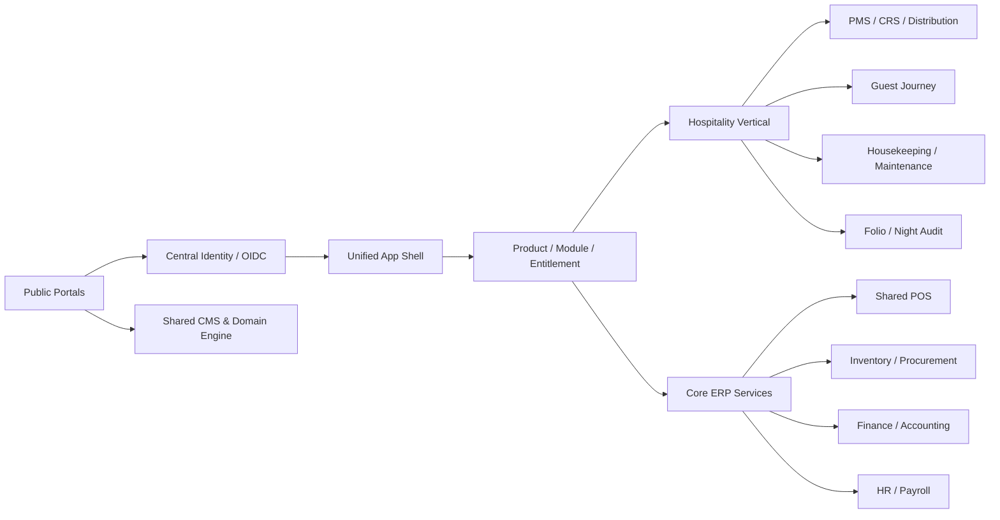
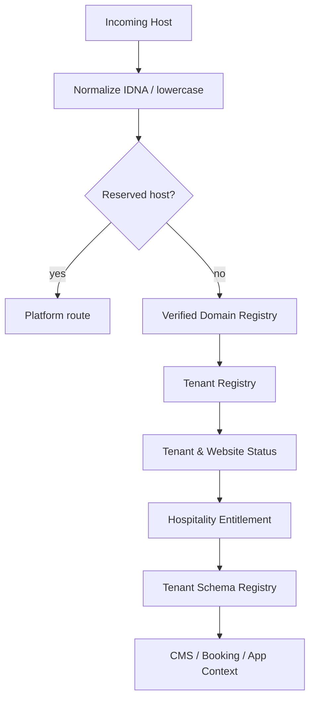
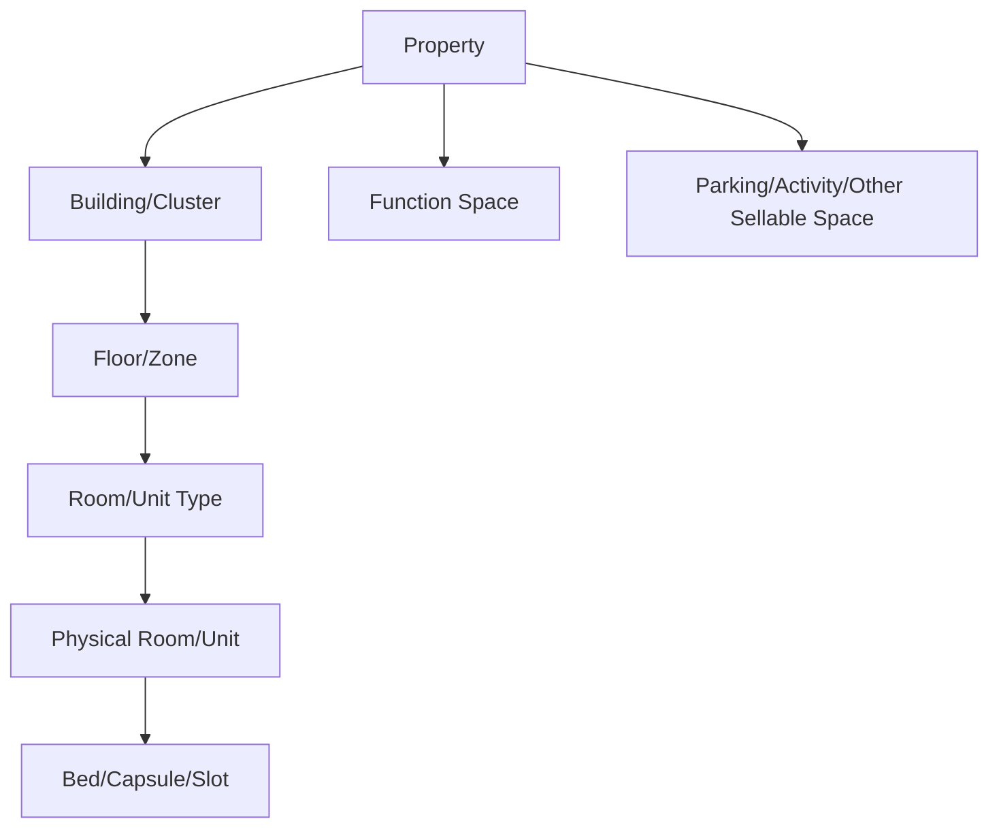
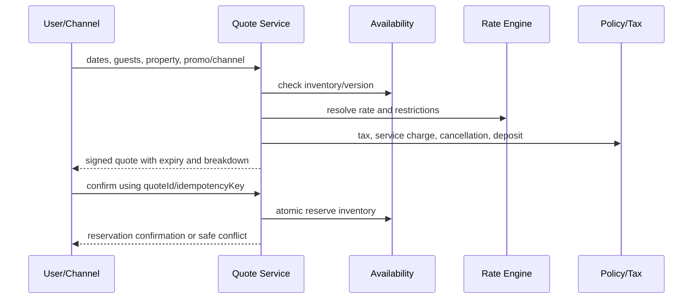
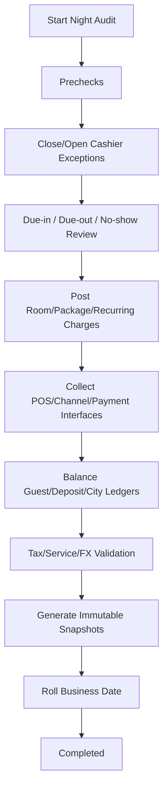
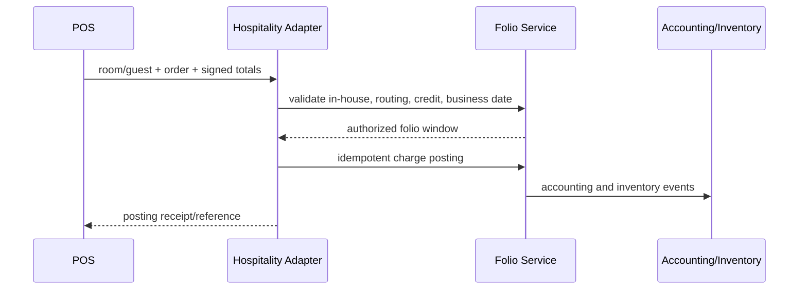

# PAKET MASTER GABUNGAN MITRAINAP.ID — EBISNIS VERSI 14

> Dokumen gabungan untuk kemudahan pembacaan atau unggah ke satu sesi Claude Code/Codex. Sumber authoritative tetap masing-masing file terpisah di dalam paket.


---

# BAGIAN 1 — `BRD_eBisnis_ID_Versi_14_MitraInap_Hospitality_Lengkap.md`

# BUSINESS REQUIREMENTS DOCUMENT (BRD)
# eBisnis.id Versi 14 — MitraInap.id Hospitality Platform
# PMS, CRS, Booking Engine, Channel Manager, Revenue Management, Front Office,
# Housekeeping, Maintenance, Night Audit, Guest CRM, Hotel POS, MICE, Long Stay,
# Website Tenant, Mobile Operations, dan Integrasi ERP Terpadu

**Versi:** 14.0  
**Tanggal:** 6 Agustus 2026  
**Status:** Baseline lengkap dan delta additive untuk vertical Hospitality; seluruh kemampuan Versi 5–13 tetap dipertahankan  
**Portal publik utama:** `https://mitrainap.id`  
**Application entry yang disarankan:** `https://app.mitrainap.id`  
**Demo resmi:** `https://demo.mitrainap.id`  
**Pola website tenant:** `https://{PUBLIC_TENANT_SLUG}.mitrainap.id`  
**Repository sumber kebenaran:** `https://github.com/Zishof/eBisnis`  
**Workspace core:** `C:\opt\eBisnisGithub\`  
**Worktree khusus yang disarankan:** `C:\opt\eBisnisGithub-mitrainap\`  
**Branch khusus yang disarankan:** `feature/v14-mitrainap-hospitality`  
**VCS:** Git-only  
**Stack existing:** NestJS, TypeScript strict, Prisma/PostgreSQL, React/Vite/Refine/shadcn/Tailwind, TanStack Query/Table, React Hook Form, Zod, React Router, Orval, worker/queue, event/outbox, modular tenant schema, shared CMS, identity, billing, notification, AI, observability, audit, workflow, Help/Excel/PDF, POS, inventory, finance, accounting, HR, procurement, marketplace, dan ticketing.

---

## Kontrol Dokumen

| Atribut | Nilai |
|---|---|
| Pemilik Produk | eBisnis.id / CV ZISHOF |
| Nama Produk Baru | MitraInap.id |
| Product Family | Hospitality |
| Portal Code | `MITRAINAP` |
| Vertical Code | `HOSPITALITY` |
| Klasifikasi | Internal — Product and Engineering Baseline |
| Audiens | Product owner, manajemen hotel, operator penginapan, business analyst, architect, developer, QA, DevOps, security, auditor, trainer, support, dan mitra integrasi |
| Bahasa Utama | Indonesia; mendukung English dan bahasa lain melalui translation key |
| Pola Tenant | Satu control plane, tenant username global, schema modular per tenant, audit terpisah |
| Pola Operasi | Multi-property, multi-brand, multi-legal-entity, multi-currency, multi-timezone, business-date aware |
| Prinsip Implementasi | Reuse → extend → adapter → create; bukan membangun platform kedua |

---

# 0. STATUS DOKUMEN DAN SUMBER KEBENARAN

Dokumen ini adalah **BRD Versi 14** untuk menambahkan `mitrainap.id` ke ekosistem eBisnis. Dokumen ini tidak menghapus atau menggantikan kemampuan Versi 5–13. Seluruh modul Core ERP, POS, marketplace, workflow, surat, notification hub, AI, observability, eMedik, eKoperasi, info-desa, Enterprise Education, eSchool, eCampus, dan ePesantren tetap menjadi baseline bersama.

Urutan sumber kebenaran apabila terdapat konflik:

```text
1. Kebutuhan pengguna terbaru mengenai mitrainap.id.
2. BRD Versi 14 ini.
3. Perintah master sesi MitraInap Versi 14.
4. Dokumen platform kolaboratif multi-portal terbaru.
5. BRD/Prompt Versi 13, 12, 11, 10, dan baseline sebelumnya.
6. Source code, migration, database, OpenAPI, test, dan konfigurasi aktual.
7. Standar industri dan dokumentasi vendor resmi sebagai best-practice reference.
```

Status requirement wajib:

```text
DONE
PARTIAL
MISSING
BROKEN
CONFLICTING
BLOCKED
NOT_APPLICABLE
UNKNOWN
```

Requirement hanya berstatus `DONE` apabila model/migration, domain service, API, OpenAPI, client, UI, permission backend, audit, test, Help, laporan, dokumentasi, build, dan smoke test yang relevan benar-benar lulus.

---

# 1. RINGKASAN EKSEKUTIF

`mitrainap.id` adalah portal dan product family hospitality yang menyatukan pengelolaan hotel, penginapan, losmen, guest house, hostel, homestay, resort, villa, cottage, bungalow, serviced apartment, rumah sewa, kos-kosan, co-living, glamping, camping, capsule hotel, dan bentuk akomodasi lain ke dalam satu ekosistem eBisnis.

MitraInap bukan aplikasi terpisah. MitraInap menggunakan:

```text
satu repository
satu control plane
satu identity dan SSO
satu tenant registry
satu username tenant global
satu product/module catalog
satu pricing/contract/billing engine
satu entitlement dan provisioning orchestrator
satu app shell
satu API gateway
satu event/outbox platform
satu workflow engine
satu notification hub
satu AI gateway
satu observability dan audit platform
satu CMS/domain engine
satu Help/Excel/PDF framework
satu POS, inventory, procurement, finance, accounting, HR, payroll, asset, dan investor engine
```

Fokus vertical hospitality:

```text
Property Management System (PMS)
Central Reservation System (CRS)
Booking Engine langsung pada website
Channel Manager dan distribusi OTA/GDS/metasearch
Rate, restriction, inventory, dan revenue management
Guest profile, CRM, consent, loyalty, preference, dan incident history
Front office: pre-arrival, check-in, in-house, room move, check-out
Housekeeping, linen, laundry, minibar, lost-and-found
Maintenance, engineering, preventive maintenance, OOO/OOS
Folio, deposit, cashiering, city ledger, night audit, income audit
POS khusus hospitality dan posting charge ke kamar
Group booking, corporate account, allotment, MICE, banquet, catering
Spa, recreation, transport, concierge, activity, parking, dan ancillary revenue
Long stay, kos, serviced apartment, recurring rent, utility meter, dan deposit
Website tenant, guest portal, mobile operations, kiosk, digital key, dan IoT adapter
Analytics, forecasting, audit, security, privacy, sustainability, dan reporting
```

Target utama adalah satu alur yang benar-benar berjalan dari pencarian kamar sampai laporan keuangan:

```text
Cari Ketersediaan
-> Pilih Unit/Rate/Package
-> Reservasi dan Jaminan Pembayaran
-> Sinkronisasi Channel
-> Pre-arrival
-> Check-in
-> Layanan Selama Menginap
-> Posting POS/Minibar/Layanan ke Folio
-> Housekeeping dan Maintenance
-> Check-out dan Settlement
-> Night Audit
-> Accounting, Inventory, Payroll, Investor, dan Management Reporting
-> Post-stay CRM dan Reputasi
```

---

# 2. VISI, MISI, DAN NILAI PRODUK

## 2.1. Visi

Menjadi platform hospitality terpadu yang dapat digunakan dari penginapan skala mikro hingga jaringan hotel multi-property, tanpa kehilangan kesederhanaan operasional, kontrol keuangan, pengalaman tamu, dan integrasi ERP.

## 2.2. Misi

1. Menghilangkan pemisahan data antara reservasi, kamar, tamu, POS, stok, housekeeping, pembayaran, dan akuntansi.
2. Mengurangi overbooking melalui availability dan inventory yang authoritative serta sinkronisasi channel yang idempotent.
3. Mempercepat pelayanan front desk dan housekeeping melalui workspace real-time yang responsif.
4. Meningkatkan direct booking melalui website tenant dan booking engine mobile-first.
5. Mendukung berbagai model usaha: harian, day-use, mingguan, bulanan, sewa unit, bed-based hostel, villa, dan rumah sewa.
6. Memberikan kontrol rate, revenue, channel cost, dan profitability sampai tingkat property, room type, channel, segment, dan reservation.
7. Memungkinkan tenant mengaktifkan modul Core ERP tanpa membangun sistem paralel.
8. Menyediakan keamanan dan privasi guest data dengan prinsip least privilege, data minimization, masking, retention, dan audit.

## 2.3. Nilai Utama

```text
Satu Data
Satu Guest Journey
Satu Availability
Satu Folio dan Payment Truth
Satu Operational Workspace
Satu ERP Terpadu
Multi-Property
Mobile-First Operations
API-First dan Integration-Ready
Security, Privacy, Audit, dan Recoverability by Default
```

---

# 3. TUJUAN BISNIS DAN KPI

## 3.1. Tujuan Bisnis

- Meningkatkan rasio reservasi langsung dan menurunkan ketergantungan pada proses manual.
- Mengurangi reservation error, duplicate booking, rate mismatch, dan stock/room discrepancy.
- Mempercepat waktu check-in, check-out, room assignment, room cleaning, dan penyelesaian work order.
- Menjamin seluruh charge dari kamar, restoran, minibar, spa, laundry, transport, dan fasilitas lain masuk ke folio serta accounting event yang benar.
- Menyediakan night audit yang aman, repeatable, exception-driven, dan dapat direkonsiliasi.
- Menyediakan laporan operasional dan finansial yang konsisten dari source transaction yang sama.
- Mendukung ekspansi tenant dari satu property menjadi chain tanpa migrasi aplikasi.

## 3.2. KPI Operasional Minimum

| Area | KPI |
|---|---|
| Reservasi | conversion, cancellation rate, no-show rate, booking lead time, average length of stay |
| Distribusi | channel production, channel cost, rate parity exception, sync latency, overbooking incident |
| Front Office | average check-in time, average check-out time, queue time, room move, walk guest |
| Housekeeping | turnaround time, rooms cleaned per attendant, inspection failure, DND backlog, linen discrepancy |
| Maintenance | response time, resolution time, preventive maintenance compliance, OOO/OOS room nights |
| Revenue | occupancy, ADR, RevPAR, TRevPAR, GOPPAR, RevPOR, NetRevPAR, pickup, pace, forecast accuracy |
| POS/F&B | average check, covers, table turn, void/refund, food cost, contribution margin |
| Guest | repeat guest, preference fulfillment, complaint resolution, service recovery, survey/review trend |
| Finance | guest ledger balance, deposit ledger, city ledger aging, cash variance, unbalanced journal, night-audit exception |
| Sustainability | energy/water per occupied room, waste, linen reuse, maintenance efficiency |

## 3.3. Formula KPI Utama

```text
Occupancy = Sold Room Nights / Available Room Nights
ADR = Net Room Revenue / Sold Room Nights
RevPAR = Net Room Revenue / Available Room Nights
TRevPAR = Total Property Revenue / Available Room Nights
GOPPAR = Gross Operating Profit / Available Room Nights
RevPOR = Total Revenue / Occupied Room Nights
NetRevPAR = (Room Revenue - Distribution Cost) / Available Room Nights
Average Length of Stay = Occupied Room Nights / Checked-in Reservations
Cancellation Rate = Cancelled Reservations / Confirmed Reservations
No-show Rate = No-show Reservations / Due-in Reservations
Direct Booking Share = Direct Confirmed Revenue / Total Confirmed Revenue
```

Formula wajib versioned, tenant-aware, tax/service-charge aware, dan mempunyai data dictionary agar angka dashboard, Excel, PDF, dan API selalu konsisten.

---

# 4. RUANG LINGKUP PROPERTY DAN MODEL USAHA

## 4.1. Jenis Property

```text
HOTEL
BOUTIQUE_HOTEL
RESORT
HOSTEL
GUEST_HOUSE
HOMESTAY
MOTEL
INN_LOSMEN
LODGE
VILLA
COTTAGE
BUNGALOW
SERVICED_APARTMENT
APART_HOTEL
BOARDING_HOUSE_KOS
CO_LIVING
RENTAL_HOUSE
VACATION_RENTAL
GLAMPING
CAMPING
CAPSULE_HOTEL
DORMITORY
SHARIA_HOTEL
TRANSIT_HOTEL
EVENT_ACCOMMODATION
OTHER
```

## 4.2. Model Penjualan Unit

```text
ROOM_TYPE_POOL
SPECIFIC_ROOM
BED_BASED
WHOLE_PROPERTY
SPACE_OR_SLOT
DAY_USE
HOURLY_POLICY_CONTROLLED
NIGHTLY
WEEKLY
MONTHLY
CONTRACT_TERM
PACKAGE_BASED
ALLOTMENT_BASED
MEMBERSHIP_BASED
```

`HOURLY_POLICY_CONTROLLED` tidak aktif secara default dan hanya dapat diaktifkan sesuai kebijakan tenant, ketentuan hukum, klasifikasi usaha, dan approval platform/tenant yang berlaku.

## 4.3. Multi-Property dan Chain

Satu tenant dapat memiliki:

```text
Organization
-> Legal Entity
-> Hospitality Chain
-> Brand
-> Property
-> Building/Tower/Villa Cluster
-> Floor/Zone
-> Room Type/Unit Type
-> Physical Room/Bed/Unit
-> Outlet/Restaurant/Spa/Event Space/Parking
```

Central office dapat mengelola central guest profile, central rate strategy, cross-property availability, call-center reservation, corporate account, loyalty, procurement, finance, HR, dan consolidated reporting sesuai entitlement.

---

# 5. STAKEHOLDER DAN PERSONA

| Persona | Kebutuhan Utama |
|---|---|
| Platform Super Admin | portal, product, price catalog, tenant, domain, provisioning, security, audit, release |
| Tenant Owner | subscription, property portfolio, module activation, consolidated KPI, finance |
| Corporate/Chain Admin | brand standards, central rate, distribution, shared guest, portfolio analytics |
| General Manager | daily operation, revenue, guest satisfaction, risk, profitability |
| Front Office Manager | arrivals, departures, queue, room assignment, cashier, exceptions |
| Reservation Agent | availability, quote, booking, modification, cancellation, group/corporate |
| Revenue Manager | forecast, rate, restriction, inventory control, channel mix, displacement |
| Night Auditor | end-of-day, ledger balance, room charge, cashier close, exception resolution |
| Receptionist | walk-in, check-in/out, room move, key, folio, service request |
| Concierge/Guest Service | transport, activity, guest request, complaint, service recovery |
| Housekeeping Manager | room status, assignment, workload, inspection, linen, minibar |
| Room Attendant | mobile task list, room status, supplies, issue escalation, offline |
| Chief Engineer | assets, work order, preventive maintenance, OOO/OOS, vendor, parts |
| F&B Manager | menu, outlet, shift, recipe, inventory, profitability |
| Cashier/Waiter | table/order/payment, room charge, receipt, shift, void request |
| Banquet/MICE Sales | lead, quotation, room block, function space, BEO, deposit, billing |
| Finance/Accountant | ledger, AR, AP, bank, tax, settlement, journal, reconciliation |
| HR/Scheduler | roster, shift, attendance, payroll, training, certification |
| Owner/Investor | owner statement, property performance, capital, settlement, document |
| Guest | search, book, pay, manage stay, request service, check-in/out, invoice |
| Long-stay Tenant | contract, recurring bill, utility, deposit, maintenance, notice, portal |
| Auditor | immutable history, access, financial trail, rate override, room move, print/export |
| Support | ticket, diagnostics, sanitized observability, tenant-approved assistance |

---

# 6. LANDASAN BEST PRACTICE GLOBAL

Desain MitraInap menggunakan referensi berikut sebagai arah, bukan klaim sertifikasi otomatis:

1. **OpenTravel Alliance** untuk interoperabilitas distribusi, guest, offer/order, availability, rate, dan reservation melalui struktur API modern.
2. **AHLA/HTNG** untuk integrasi PMS, guest-room system, event notification, folio detail, food-and-beverage ordering, frictionless check-in, payment capture, privacy, device, dan operational technology.
3. **ISO 22483:2020** sebagai referensi kualitas layanan hotel terkait staf, pelayanan, event, keamanan, maintenance, kebersihan, supply, dan kepuasan tamu.
4. **ISO 21401:2018** dan amendment climate action sebagai referensi sustainability management untuk akomodasi.
5. **ISO 21902:2021** sebagai referensi accessible tourism.
6. **PCI DSS v4.0.1, P2PE, dan Secure Software** sebagai dasar perlindungan data pembayaran.
7. **WCAG 2.2 Level AA** serta panduan mobile accessibility untuk website, booking engine, kiosk, dan aplikasi staf.
8. **OWASP ASVS 5.0 dan API Security Top 10 2023** untuk security verification, object authorization, authentication, field-level authorization, rate limits, dan integration safety.
9. **UU Nomor 27 Tahun 2022 tentang Pelindungan Data Pribadi** untuk pemrosesan data tamu di Indonesia.
10. **Permenpar Nomor 6 Tahun 2025** dan ketentuan usaha pariwisata yang berlaku untuk konfigurasi compliance Indonesia.

Kaidah penerapan:

```text
standard-aware, bukan hard-code satu negara
configuration-driven
versioned dan effective-dated
legal review per tenant/jurisdiction
no false certification claim
evidence dan audit tersedia
```

---

# 7. ARSITEKTUR EKOSISTEM DAN PORTAL

## 7.1. Portal Baru

```text
portalCode = MITRAINAP
portalName = MitraInap.id
primaryDomain = mitrainap.id
applicationDomain = app.mitrainap.id
demoDomain = demo.mitrainap.id
verticalCode = HOSPITALITY
preferredProductCode = MITRAINAP_PMS
```

Portal ekosistem menjadi:

```text
ebisnis.id
enterprise-education.id
santri.info
emedik.id
ekoperasi.id
info-desa.id
mitrainap.id
```

## 7.2. Satu Platform, Banyak Portal



## 7.3. Shared Services yang Dilarang Digandakan

```text
Identity and Access
Tenant and Organization
Pricing and Billing
Subscription and Entitlement
Provisioning and Schema Registry
Domain and CMS
Workflow/SOP
Notification Hub
AI Gateway
Observability and Audit
Help/Excel/PDF
File Storage and Search
Ticketing
Payment orchestration
POS
Inventory and Procurement
Finance and Accounting
HR and Payroll
Asset and Maintenance foundation
Marketplace
Investor and Revenue Sharing
Correspondence/Surat
```

Hospitality membuat bounded context dan adapter, bukan salinan engine.

---

# 8. DOMAIN, SUBDOMAIN, USERNAME, DAN TENANT RESOLUTION

## 8.1. Host yang Didukung

```text
mitrainap.id                         public portal
www.mitrainap.id                     canonical redirect
app.mitrainap.id                     shared application shell, portal context MITRAINAP
demo.mitrainap.id                    demo tenant/platform sandbox
{PUBLIC_TENANT_SLUG}.mitrainap.id    website dan booking engine tenant
booking.{custom-domain}              custom booking domain opsional
{custom-domain}                      website tenant terverifikasi
```

## 8.2. Global Username Tenant

`tenantUsername` tetap mengikuti kontrak platform:

```text
lowercase
regex ^[a-z][a-z0-9_]{2,47}$
global unique secara case-insensitive
immutable setelah reservation/provisioning
reserved-name protected
no rename endpoint
no admin override
atomic reservation dan unique lock
```

Keunikan berlaku di seluruh ekosistem, bukan hanya MitraInap. Username yang sudah dipakai tenant eBisnis, eMedik, eKoperasi, info-desa, Enterprise Education, santri.info, atau portal lain tidak dapat dipakai lagi.

## 8.3. DNS-safe Public Slug

DNS tidak mengizinkan underscore. Oleh sebab itu:

```text
tenantUsername = hotel_jaya
publicTenantSlug = hotel-jaya
public URL = hotel-jaya.mitrainap.id
```

Aturan:

- mapping satu-ke-satu dan tersimpan di Domain Registry;
- default slug dibentuk dengan `_` menjadi `-`, tetapi harus tetap melewati global slug reservation;
- username dan slug tidak pernah dipakai untuk menentukan schema secara langsung;
- perubahan slug setelah publikasi menggunakan workflow, cooling period, redirect history, SEO redirect, dan audit;
- perubahan slug tidak mengubah username atau physical schema;
- apabila username tidak memakai underscore, URL dapat identik dengan username.

## 8.4. Reserved Hosts dan Slugs

```text
www app auth api admin console support status docs assets cdn media static mail
demo sandbox staging dev test booking payments pay guest staff owner investor
```

## 8.5. Resolution Flow



Unknown host tidak boleh fallback ke tenant lain.

---

# 9. ORGANISASI, PROPERTY, DAN ACTIVE CONTEXT

## 9.1. Struktur Organisasi

```text
PlatformOrganization
Tenant
LegalEntity
HospitalityChain
HospitalityBrand
Property
Building
Floor/Zone
RoomType/UnitType
PhysicalRoom/Bed/Unit
Department
Outlet
CostCenter
ProfitCenter
Warehouse
Cashier/Register
```

## 9.2. Active Context

Session minimum:

```text
activeTenantId
activeVerticalCode = HOSPITALITY
activeProductCode
activeRoleId
activeDataScope
activeLegalEntityId
activeBrandId optional
activePropertyId
activeDepartmentId optional
activeOutletId optional
activeRegisterId optional
activeBusinessDate
activeTimezone
activeCurrency
purposeOfUse optional
```

`businessDate` berbeda dari timestamp kalender. Night audit yang menggeser business date; server clock tidak boleh dipalsukan untuk menyelesaikan operasi harian.

## 9.3. Data Scope

```text
PLATFORM
TENANT
LEGAL_ENTITY
CHAIN
BRAND
PROPERTY_CLUSTER
PROPERTY
BUILDING
FLOOR_ZONE
DEPARTMENT
OUTLET
REGISTER
ROOM_TYPE
ROOM_OR_UNIT
COST_CENTER
PROFIT_CENTER
CORPORATE_ACCOUNT
ASSIGNED_RESERVATION
ASSIGNED_TASK
OWN_GUEST_PROFILE
OWN_LONG_STAY_CONTRACT
```

---

# 10. PRODUCT, MODULE, PACKAGE, DAN ENTITLEMENT

## 10.1. Product Code

```text
MITRAINAP_PMS
MITRAINAP_CRS
MITRAINAP_BOOKING_ENGINE
MITRAINAP_CHANNEL_MANAGER
MITRAINAP_REVENUE_MANAGEMENT
MITRAINAP_GUEST_CRM
MITRAINAP_HOUSEKEEPING
MITRAINAP_ENGINEERING
MITRAINAP_CASHIERING_NIGHT_AUDIT
MITRAINAP_HOSPITALITY_POS_ADAPTER
MITRAINAP_MICE_BANQUET
MITRAINAP_LONG_STAY
MITRAINAP_OWNER_MANAGEMENT
MITRAINAP_GUEST_PORTAL
MITRAINAP_MOBILE_OPERATIONS
MITRAINAP_IOT_DIGITAL_KEY
MITRAINAP_ANALYTICS
```

## 10.2. Offering yang Direkomendasikan

```text
MITRAINAP_STARTER
MITRAINAP_STANDARD
MITRAINAP_PRO
MITRAINAP_LONG_STAY
MITRAINAP_RESORT
MITRAINAP_MULTI_PROPERTY
MITRAINAP_ENTERPRISE
CUSTOM_CONTRACT
```

Nilai harga tidak ditetapkan dalam dokumen ini karena pengguna belum menentukan harga komersial. Price catalog awal harus berstatus `PRICE_CONFIGURATION_REQUIRED` sampai Platform Pricing Admin menerbitkan version yang disetujui.

## 10.3. Module Manifest

Setiap module mempunyai:

```text
moduleCode
verticalCode
productCode
version
displayName
description
schemaSuffix
routes
menus
roles
permissions
dependencies
conflicts
eligibility
billingMetrics
migrations
seedProfiles
helpTopics
eventsPublished
eventsConsumed
portsRequired
dataClassification
retention
healthChecks
sampleDataProfile
```

## 10.4. Dependency Contoh

```text
CHANNEL_MANAGER requires PMS + CRS + IntegrationPort
BOOKING_ENGINE requires CRS + CMS + PaymentPort
HOSPITALITY_POS_ADAPTER requires Core POS entitlement
NIGHT_AUDIT requires PMS + Cashiering + AccountingEventPort
LONG_STAY requires PMS foundation + Billing/AR + Contract workflow
MICE requires CRS + Function Space + POS/Inventory optional
DIGITAL_KEY requires PMS + verified DoorLockPort + device security policy
```

---

# 11. ONBOARDING TENANT DAN PROVISIONING

## 11.1. Tenant Baru

```text
mitrainap.id
-> Daftar sebagai Mitra
-> Buat Platform Account
-> Verifikasi Email/Telepon sesuai policy
-> Buat Organization/Legal Entity
-> Pilih Jenis Property
-> Reservasi Tenant Username global
-> Reservasi Public Tenant Slug
-> Pilih Package/Module
-> Simulasi Harga
-> Quote/Contract/Consent
-> Trial atau Payment sesuai policy
-> Provision Core + Hospitality
-> Seed Role/Menu/Help
-> Buat Website dan Booking Engine Tenant
-> Optional Sample Data
-> Guided Property Setup
-> Import/Migrasi
-> UAT
-> Go-Live
```

## 11.2. Tenant Existing eBisnis

```text
Login
-> Ekosistem dan Modul
-> Pilih MitraInap/Hospitality
-> Dependency dan Data Impact Check
-> Quote/Contract Amendment
-> Approval/Payment
-> Provision Hospitality Schema
-> Assign Property Admin
-> Setup Property
-> Smoke Test
-> Activate
```

## 11.3. Provisioning State

```text
DRAFT
VALIDATING
USERNAME_RESERVED
WAITING_CONTRACT
WAITING_PAYMENT
APPROVED
QUEUED
PROVISIONING_SCHEMA
MIGRATING
SEEDING
CONFIGURING_PROPERTY
CONFIGURING_CMS
CONFIGURING_BOOKING_ENGINE
CONFIGURING_USAGE_METER
TESTING
ACTIVE
FAILED
ROLLING_BACK
SUSPENDED
TERMINATING
TERMINATED
```

Setiap langkah idempotent, retryable, audited, observable, dan compensatable.

## 11.4. Guided Setup Checklist

```text
Legal entity dan property
Alamat, timezone, currency, locale
Building/floor/room type/room
Bed configuration
Occupancy dan child policy
Tax/service charge
Rate plan dan cancellation policy
Payment/deposit guarantee
Cashier/register
Housekeeping status dan task schedule
Maintenance assets
Website/CMS/booking engine
Email/WhatsApp template
Channel mapping
Finance/account mapping
User/role/shift
Night audit preflight
Backup dan go-live checklist
```

---

# 12. PRICING, CONTRACT, USAGE, DAN BILLING PLATFORM

## 12.1. Prinsip

- Harga tidak boleh hard-coded pada controller atau frontend.
- Harga versioned, effective-dated, approval-controlled, dan tersimpan sebagai snapshot pada quote/invoice.
- Sample/demo/test/training tidak billable.
- Payment subscription platform dipisahkan dari pembayaran operasional tamu.
- Tenant override dan negotiated contract didukung.

## 12.2. Billing Metric yang Dapat Dipilih

```text
PROPERTY_MONTH
ACTIVE_SELLABLE_UNIT_MONTH
ACTIVE_BED_MONTH
CONFIRMED_RESERVATION
DIRECT_BOOKING_RESERVATION
CHANNEL_CONNECTION_MONTH
POS_REGISTER_MONTH
ACTIVE_STAFF_MONTH
API_USAGE
MESSAGE_USAGE
STORAGE_USAGE
CUSTOM_CONTRACT_METRIC
```

Default metric belum diputuskan dan harus `CONTRACT_DEFINED`.

## 12.3. Model Komersial

```text
PlatformPriceCatalog
PlatformPriceCatalogVersion
PlatformPriceBook
PlatformPackageOffering
PlatformPackageVersion
PlatformPackageModule
PricingMetricDefinition
PricingTier
TenantCommercialContract
TenantContractVersion
TenantContractLine
TenantPriceOverride
TenantDiscount
TenantMinimumCommitment
TenantPriceCap
Quote
QuoteLine
Subscription
SubscriptionLine
UsageMeter
UsageEvent
UsageAggregation
Invoice
InvoiceLine
CreditNote
BillingAdjustment
```

## 12.4. Pemisahan Pembayaran

```text
Platform Subscription Payment
!= Guest Deposit
!= Guest Folio Settlement
!= Long-stay Rent
!= POS Payment
!= OTA Virtual Card/Collect Payment
!= Owner/Investor Settlement
```

Credential, rekening, reconciliation, tax, dan accounting scope harus berbeda.

---

# 13. MODEL DATA FOUNDATION HOSPITALITY

Entity minimum dikelompokkan sebagai berikut.

## 13.1. Property Foundation

```text
HospitalityTenantProfile
HospitalityChain
HospitalityBrand
Property
PropertyType
PropertyClassification
PropertyLicenseReference
PropertyAddress
PropertyContact
PropertyPolicy
PropertyBusinessDate
PropertyCalendar
PropertyHoliday
PropertyAmenity
PropertyFacility
Building
Floor
Zone
SellableSpace
RoomType
RoomTypeFeature
PhysicalRoom
Bed
UnitAttribute
AccessibilityFeature
OccupancyPolicy
ChildPolicy
ExtraBedPolicy
MealPlan
```

## 13.2. Guest and CRM

```text
GuestProfile
GuestIdentifier
GuestNameHistory
GuestAddress
GuestContact
GuestCompanyLink
GuestTravelDocument
GuestCompanion
GuestRelationship
GuestPreference
GuestConsent
GuestCommunicationPreference
GuestVIPStatus
GuestLoyaltyAccount
GuestStayHistory
GuestIncident
GuestAlert
GuestDoNotRent
GuestDuplicateCandidate
GuestMerge
GuestDataRequest
```

## 13.3. Reservation and Availability

```text
Reservation
ReservationStay
ReservationGuest
ReservationRoomAssignment
ReservationStatusHistory
ReservationSource
ReservationSegment
ReservationChannel
ReservationGuarantee
ReservationDepositSchedule
ReservationCancellationPolicySnapshot
ReservationRateSnapshot
ReservationTaxSnapshot
ReservationPackage
ReservationAddon
ReservationTrace
ReservationNote
ReservationAttachment
ReservationShare
ReservationSplit
ReservationLink
ReservationWaitlist
ReservationOption
ReservationNoShow
ReservationWalk
AvailabilityInventory
AvailabilityAdjustment
OverbookingLimit
RoomBlock
Allotment
GroupReservation
```

## 13.4. Rate and Distribution

```text
RatePlan
RatePlanVersion
RateCode
RateCalendar
RateAmount
RateOccupancyAdjustment
RateDerivedRule
RatePackage
RateRestriction
StopSell
MinimumStay
MaximumStay
ClosedToArrival
ClosedToDeparture
InventoryControl
Channel
ChannelConnection
ChannelCredentialVersion
ChannelMapping
ChannelRateMapping
ChannelRoomMapping
ChannelSyncJob
ChannelSyncMessage
ChannelReservationMessage
ChannelReconciliation
DistributionCostRule
CommissionRule
RevenueForecast
RevenueRecommendation
RevenueOverride
```

## 13.5. Front Office and Folio

```text
RegistrationCard
CheckIn
CheckOut
RoomMove
KeyIssue
KeyReturn
DigitalKeyGrant
GuestLedgerAccount
Folio
FolioWindow
FolioTransaction
FolioRoutingRule
FolioTransfer
FolioAdjustment
FolioAllowance
FolioCorrection
FolioPayment
DepositLedger
GuestLedger
CityLedger
HouseAccount
Cashier
CashierShift
CashierClose
CashMovement
ExchangeRateSnapshot
Invoice
Receipt
Refund
Chargeback
PaymentTokenReference
```

## 13.6. Operations

```text
RoomStatus
HousekeepingTask
HousekeepingTaskAssignment
HousekeepingWorkloadPoint
HousekeepingInspection
TurndownTask
LinenItem
LinenMovement
LaundryOrder
MinibarInventory
MinibarConsumption
LostAndFoundItem
GuestServiceRequest
Complaint
ServiceRecovery
MaintenanceAsset
WorkOrder
PreventiveMaintenancePlan
RoomOutOfOrder
RoomOutOfService
MaintenanceInspection
EnergyMeter
WaterMeter
UtilityReading
```

## 13.7. Night Audit

```text
BusinessDateControl
NightAuditRun
NightAuditStep
NightAuditException
NightAuditPrecheck
NightAuditPosting
NightAuditReportSnapshot
IncomeAuditReview
LedgerReconciliation
InterfaceReconciliation
BusinessDateRoll
NightAuditRollbackPlan
```

## 13.8. MICE, POS, Long Stay, Owner

```text
EventLead
EventOpportunity
FunctionSpace
FunctionSpaceSetup
RoomBlock
EventQuotation
EventContract
BanquetEventOrder
EventSchedule
EventMenu
EventEquipment
EventDeposit
EventBillingInstruction
LongStayContract
LongStayOccupant
LongStayRecurringCharge
SecurityDeposit
UtilityBilling
MoveIn
MoveOut
Renewal
Notice
DamageAssessment
OwnerProfile
OwnerPropertyAgreement
OwnerStatement
OwnerRevenueShare
OwnerPayout
```

Semua uang, rate, tax, quantity, occupancy, percentage, dan exchange rate menggunakan Decimal/value object, bukan floating point.

---

# 14. PROPERTY, ROOM, BED, SPACE, DAN SELLABLE INVENTORY

## 14.1. Inventory Hierarchy



## 14.2. Prinsip Inventory

- Physical room tidak sama dengan room type inventory.
- Hostel dapat menjual bed, private room, atau seluruh dormitory tanpa oversell.
- Villa dapat dijual per kamar atau seluruh property sesuai configuration dan mutual-exclusion rules.
- Room status operasional tidak otomatis sama dengan availability komersial.
- OOO mengurangi sellable inventory sesuai policy; OOS dapat tetap dihitung berbeda untuk statistik.
- House use, complimentary, owner use, maintenance, and staff room mempunyai status dan accounting treatment terpisah.
- Inventory update concurrency-safe, idempotent, dan mempunyai source/version.

## 14.3. Room Status

```text
VACANT_DIRTY
VACANT_CLEAN
VACANT_INSPECTED
OCCUPIED_DIRTY
OCCUPIED_CLEAN
PICKUP
DO_NOT_DISTURB
MAKE_UP_ROOM
SLEEP
SKIP
OUT_OF_ORDER
OUT_OF_SERVICE
HOUSE_USE
OWNER_USE
BLOCKED
```

Front-office status dan housekeeping condition disimpan terpisah tetapi direkonsiliasi.

---

# 15. GUEST IDENTITY, CRM, LOYALTY, DAN PRIVACY

## 15.1. Golden Guest Profile

Sistem mendeteksi duplicate berdasarkan kombinasi data yang aman, tetapi merge selalu terkontrol. Satu guest dapat mempunyai banyak identifier, contact, travel document, company link, loyalty account, preference, dan stay history.

## 15.2. Guest Preference

```text
room/floor preference
bed type
smoking policy
pillow
allergy/dietary
accessibility need
language
communication channel
arrival transport
housekeeping time
turndown
minibar
amenity
invoice preference
```

Preference tidak boleh menjadi alasan diskriminasi yang melanggar hukum. Data sensitif hanya tampil kepada role dan purpose yang sah.

## 15.3. Consent dan Communication

Consent dikelola per purpose:

```text
reservation fulfillment
payment
identity verification
marketing
loyalty
personalization
analytics
third-party transfer
review request
biometric/digital key if applicable
```

## 15.4. Incident dan Do-Not-Rent

Do-not-rent, fraud alert, dan security incident memerlukan reason, evidence, expiry/review date, limited visibility, approval, dan audit. Label tidak boleh tampil pada portal tamu atau staf yang tidak berhak.

---

# 16. RESERVATION, CRS, DAN BOOKING LIFECYCLE

## 16.1. Reservation Status

```text
INQUIRY
QUOTED
OPTION
HOLD
WAITLIST
PENDING_GUARANTEE
PENDING_PAYMENT
CONFIRMED
PRE_ARRIVAL
DUE_IN
CHECKED_IN
IN_HOUSE
DUE_OUT
CHECKED_OUT
CANCELLED
NO_SHOW
WALKED
REINSTATED
```

Client tidak boleh mengubah status bebas. Semua transition melalui command service dengan precondition, permission, idempotency, payment/guarantee validation, room/inventory check, dan audit.

## 16.2. Availability and Quote Flow



## 16.3. Reservation Functions

```text
create/modify/cancel/reinstate
split/share/link
room assignment/unassignment
room move before/in stay
extend/shorten stay
upgrade/downgrade
waitlist and option expiry
walk-in
day use
complimentary/house use
corporate/group/allotment
multi-room and multi-property
package and add-on
special request and trace
prepayment and guarantee
confirmation/resend
```

## 16.4. Overbooking dan Walk

Overbooking limit configurable per property, room type, date, channel, dan approval threshold. Jika tidak dapat mengakomodasi tamu, `WalkGuest` mencatat alternate property, transport, compensation, approval, cost, guest communication, dan audit.

---

# 17. RATE, RESTRICTION, AVAILABILITY, DAN REVENUE MANAGEMENT

## 17.1. Rate Plan

```text
BAR
CORPORATE
WHOLESALE
GOVERNMENT
MEMBER
LOYALTY
PACKAGE
PROMOTIONAL
WEEKLY
MONTHLY
DAY_USE
GROUP
CREW
COMPLIMENTARY
OWNER
NEGOTIATED
```

## 17.2. Restriction

```text
stop sell
open/close
minimum/maximum length of stay
closed to arrival/departure
advance purchase
lead time
last-room availability
occupancy based pricing
extra person/child/bed
minimum price/floor
maximum inventory by channel
release days
cutoff
cancellation/no-show policy
deposit schedule
```

## 17.3. Revenue Management Workspace

Menampilkan:

```text
occupancy on books
forecast occupancy
pickup and pace
ADR/RevPAR/TRevPAR/NetRevPAR
channel mix and acquisition cost
market segment mix
group block pickup/wash
cancellation/no-show trend
length-of-stay pattern
rate shopping/competitor data only through approved provider
recommended rate/restriction
override reason and approval
forecast accuracy
```

AI atau algorithm menghasilkan `RECOMMENDATION`; publish massal rate/restriction memerlukan human review, permission, effective date, audit, dan rollback snapshot.

## 17.4. Displacement Analysis

Group/MICE quote dapat dibandingkan dengan transient demand berdasarkan expected room revenue, ancillary revenue, variable cost, channel cost, wash probability, dan function-space value. Formula harus transparan dan dapat diuji.

---

# 18. CHANNEL MANAGER, OTA, GDS, METASEARCH, DAN DISTRIBUSI

## 18.1. Channel Types

```text
DIRECT_WEB
DIRECT_MOBILE
PHONE
WALK_IN
EMAIL
OTA
WHOLESALER
GDS
TRAVEL_AGENT
METASEARCH
CORPORATE_PORTAL
AFFILIATE
SOCIAL_COMMERCE
```

## 18.2. ARI Synchronization

ARI = Availability, Rates, Inventory/Restrictions. Setiap update:

```text
sourceVersion
propertyId
roomType/ratePlan mapping
date range
quantity/rate/restriction
idempotencyKey
correlationId
sentAt/acknowledgedAt
provider status
retry count
error code
payload hash
```

## 18.3. Reservation Delivery

Channel reservation masuk melalui webhook/polling/adapter, divalidasi, dideduplikasi, dipetakan, disimpan raw message tersanitasi, lalu diproses ke reservation service. Duplicate callback tidak boleh membuat reservasi kedua.

## 18.4. Reconciliation Queue

Exception queue mencakup:

```text
unmapped room/rate
invalid occupancy
rate mismatch
unknown tax/fee
payment/virtual card issue
modification out of order
duplicate reservation
cancel conflict
availability negative
provider timeout
webhook signature failure
```

## 18.5. Integrasi Standard-aware

Gunakan OpenTravel/HTNG mapping dan adapter versioning. Jangan menyalin payload satu provider menjadi canonical domain model.

---

# 19. WEBSITE UTAMA MITRAINAP.ID DAN WEBSITE TENANT

## 19.1. Website Utama

Navigasi minimum:

```text
Beranda
Solusi
  Hotel dan Resort
  Guest House dan Homestay
  Hostel dan Capsule
  Villa dan Cottage
  Kos dan Long Stay
  Multi-Property
Fitur
  Reservasi dan PMS
  Booking Engine
  Channel Manager
  Housekeeping
  POS Penginapan
  Finance dan Accounting
  Guest Experience
Harga
Demo
Mitra
Artikel
Bantuan
Tentang Kami
Masuk
Daftar Mitra
```

## 19.2. Hero

```text
Eyebrow: Platform Penginapan Terpadu
Headline: Kelola Reservasi, Kamar, Tamu, Operasional, dan Keuangan dalam Satu Sistem.
Subheadline: MitraInap.id menghubungkan website, booking online, front office, housekeeping,
POS, stok, pembayaran, night audit, dan ERP eBisnis untuk berbagai jenis penginapan.
CTA utama: Coba Demo
CTA kedua: Daftarkan Properti
CTA ketiga: Jadwalkan Presentasi
```

## 19.3. Website Tenant

Tenant dapat mengelola:

```text
logo, favicon, brand, warna, typography
hero dan promotion
property profile, room/unit, amenity, facility
photo/video gallery
rates from booking engine
package, add-on, activity, restaurant, spa
news, article, event, announcement
location, map, transport, nearby attraction
policy, FAQ, contact, review projection
SEO, sitemap, canonical, redirects
multi-language and currency display
booking widget and guest portal
custom domain
```

CMS memakai draft/review/approve/schedule/publish. Tenant tidak dapat menjalankan JavaScript arbitrary.

---

# 20. DIRECT BOOKING ENGINE

## 20.1. Guest Flow

```text
Search dates/guests
-> View availability and transparent total
-> Compare room/unit and rate plan
-> Select extras/package
-> Enter guest details
-> Sign/accept policy and consent
-> Pay/deposit/guarantee
-> Confirmation
-> Self-service manage booking
```

## 20.2. UX Requirements

- mobile-first, fast, accessible, no horizontal scroll;
- date and guest selector tetap terlihat pada result;
- total price, tax, service charge, cancellation, deposit, dan inclusions transparan sebelum payment;
- room photo, bed, occupancy, accessibility, meal plan, amenity, dan remaining inventory jelas;
- sticky booking summary pada desktop dan mobile bottom summary;
- guest checkout tidak wajib membuat account jika policy mengizinkan;
- progress indicator maksimal beberapa langkah yang jelas;
- save/recover quote dan retry payment idempotent;
- no dark patterns, no hidden fees, no preselected paid extras tanpa consent;
- multi-language, currency display, locale date, and RTL-ready;
- promo code tidak mengungkap rate yang tidak berhak;
- analytics consent-aware.

## 20.3. Booking Engine Security

```text
rate limit and bot protection
quote signature and expiry
server-authoritative total
inventory concurrency lock
idempotent reservation/payment
CSRF and secure session
PII minimization
payment tokenization
webhook verification
fraud/risk signal
safe error messages
```

---

# 21. FRONT OFFICE DAN GUEST JOURNEY

## 21.1. Pre-Arrival

```text
arrival review
ETA and transport
online registration
ID/travel document upload with secure retention
pre-arrival message
upsell room/add-on
special request
deposit balance
room pre-assignment
housekeeping priority
digital key eligibility
VIP/incident/preference review
```

## 21.2. Check-In

```mermaid
flowchart LR
  DueIn[Due-in Reservation] --> Verify[Verify Guest & Companions]
  Verify --> Guarantee[Guarantee / Deposit / Credit]
  Guarantee --> Assign[Assign Ready Room]
  Assign --> Reg[Registration Card / Consent]
  Reg --> Key[Physical or Digital Key]
  Key --> Folio[Open Folio / Routing]
  Folio --> InHouse[IN_HOUSE]
```



Check-in harus memvalidasi room readiness, occupancy, identity field, payment guarantee, deposit, duplicate in-house, key access, companion, child policy, dan data wajib berdasarkan jurisdiction/property type.

## 21.3. In-House

```text
room move
extend/shorten stay
add/remove companion
share/split reservation
change rate with approval
routing instruction
post charge/payment
credit limit monitoring
wake-up call
guest request/complaint
DND/make-up room
maintenance issue
lost key/rekey
visitor/access record
amenity and package fulfillment
```

## 21.4. Check-Out

```text
review folio/windows
resolve pending POS/interface postings
apply allowance/correction with permission
settle payment/refund
issue invoice/receipt
return/deactivate key
capture forwarding/contact preference
mark room dirty
create lost-and-found/maintenance follow-up
post-stay survey/review request
close reservation
```

## 21.5. Express and Mobile Checkout

Guest dapat melihat provisional folio, memilih payment method yang tersedia, menyetujui final charge, menerima invoice, dan menyelesaikan checkout tanpa front desk bila policy dan risk control mengizinkan.

---

# 22. HOUSEKEEPING, LINEN, LAUNDRY, MINIBAR, DAN LOST-AND-FOUND

## 22.1. Housekeeping Board

Menampilkan property/floor/zone, room condition, front-office status, due-in/out, stayover, DND, VIP, priority, service time, attendant, task, inspection, and maintenance alert.

## 22.2. Assignment

Assignment dapat manual atau auto berdasarkan:

```text
workload points
room type/size
stayover vs checkout
floor/zone
attendant skill
shift and availability
priority and due-in ETA
turndown
accessibility/safety rule
```

## 22.3. Mobile Task

Room attendant dapat:

```text
start/pause/complete task
update condition
record supplies/linen/minibar
add photo/issue/note
respect DND
escalate maintenance
request inspection
work offline with idempotent queue
```

## 22.4. Linen and Laundry

Track par level, issue, return, dirty, clean, damaged, missing, vendor laundry, weight/count discrepancy, cost, and write-off.

## 22.5. Lost and Found

Item mempunyai found location/time, finder, category, secure storage, photo, claimant verification, release/shipping, expiry/disposal, and audit.

---

# 23. MAINTENANCE, ENGINEERING, ASSET, OOO/OOS

## 23.1. Work Order

```text
NEW -> TRIAGED -> ASSIGNED -> IN_PROGRESS -> WAITING_PART -> WAITING_VENDOR
-> READY_FOR_INSPECTION -> COMPLETED -> VERIFIED -> CLOSED
Alternatif: CANCELLED, DUPLICATE, DEFERRED
```

## 23.2. Sources

```text
housekeeping issue
guest complaint
front desk
preventive maintenance
IoT alert
energy anomaly
inspection
asset lifecycle
safety incident
```

## 23.3. Room OOO/OOS

- OOO/OOS memerlukan start/end, reason, impact, owner, approval threshold, maintenance link, and audit.
- Availability impact dihitung server-side.
- Room tidak boleh dijual/ditugaskan selama blocked period kecuali approved override.
- Release room memerlukan verification/inspection sesuai policy.

## 23.4. Preventive Maintenance

Jadwal berdasarkan kalender, usage meter, operating hours, condition, manufacturer guidance, atau compliance. Missed maintenance menghasilkan escalation.

---

# 24. FOLIO, CASHIERING, PAYMENT, CITY LEDGER, DAN NIGHT AUDIT

## 24.1. Folio

Reservation dapat mempunyai banyak folio windows untuk pemisahan guest/company/group/agent. Routing rules dapat memindahkan charge berdasarkan transaction code, date, limit, percentage, atau payor.

## 24.2. Payment

Mendukung:

```text
cash
card via tokenized provider
bank transfer
QR/online
virtual account
OTA collect/virtual card
company credit/city ledger
voucher/gift card
deposit
mixed payment
refund and chargeback
```

Aplikasi tidak menyimpan PAN/CVV mentah. Payment provider dan token reference berada pada scope terpisah.

## 24.3. Ledger

```text
Deposit Ledger
Guest Ledger
City Ledger / Accounts Receivable
House Account
Advance Deposit
Unallocated Payment
Chargeback/Dispute
```

## 24.4. Night Audit



Precheck minimum:

```text
unresolved due-in/due-out
open cashier
unbalanced folio
pending payment
unprocessed POS/interface charge
invalid room status
rate missing
negative/invalid deposit
outstanding no-show decision
journal/accounting failure
channel sync backlog beyond policy
backup/health condition
```

Night audit:

- mempunyai immutable run ID, step status, retry checkpoint, idempotency key, correlation ID;
- tidak boleh dijalankan dua kali untuk property/business date yang sama;
- kegagalan tidak boleh menggulung business date;
- correction setelah close memakai adjustment/reversal atau income-audit workflow;
- menghasilkan manager report, trial balance, occupancy/revenue snapshot, cashier summary, tax, ledger, exception, and interface reconciliation.

---

# 25. POS KHUSUS HOSPITALITY DAN F&B

## 25.1. Outlet

```text
restaurant
bar
cafe
room service
banquet
minibar
spa
laundry
gift shop
parking
activity/recreation
other service outlet
```

## 25.2. POS Capability

Reuse Core POS untuk register, shift, product, recipe, tax, promotion, inventory, payment, receipt, void, return, and accounting. Hospitality adapter menambah:

```text
post charge to room/folio
validate in-house guest and credit limit
search by room, guest, reservation, QR, or wristband
guest signature/confirmation
routing instruction
meal-plan entitlement
package inclusion
service charge/tip/gratuity
room service delivery tracking
banquet/event link
minibar auto posting
```

## 25.3. Room Charge Flow



Completed POS transaction tidak dapat diedit; correction menggunakan void/return/refund/reversal sesuai status dan SoD.

---

# 26. GROUP, CORPORATE, ALLOTMENT, MICE, BANQUET, DAN CATERING

## 26.1. Group and Corporate

```text
corporate profile and negotiated rate
group lead/opportunity
room block and allotment
cutoff/release
pickup/wash
rooming list
master folio/routing
billing instruction
commission
credit approval
contract/document
```

## 26.2. MICE

```text
lead
availability of function space
quotation/package
option/tentative/definite
contract and e-sign
room block
function schedule
setup style/capacity
menu and dietary
AV/equipment
staff and vendor
BEO
change order
on-site operation
consumption/posting
invoice and settlement
post-event profitability
```

## 26.3. Event Space Conflict

Function space, setup/teardown time, room block, equipment, and staff schedule harus mempunyai conflict detection dan override approval.

---

# 27. GUEST SERVICE, CONCIERGE, TRANSPORT, SPA, DAN ANCILLARY

Capability:

```text
airport transfer
shuttle/vehicle/driver
concierge request
wake-up call
luggage storage
visitor
parcel/package
activity/tour booking
spa/wellness appointment
golf/recreation
childcare policy controlled
parking
pet service
amenity delivery
restaurant reservation
service request tracking
complaint and service recovery
```

Setiap request memiliki SLA, owner, status, priority, guest communication, cost/charge, fulfillment evidence, and audit.

---

# 28. LONG STAY, KOS, SERVICED APARTMENT, RENTAL HOUSE, DAN OWNER MANAGEMENT

## 28.1. Long Stay Contract

```text
prospect/application
screening/reference according law
unit offer
contract and term
occupants
security deposit
recurring rent
utility and service charge
move-in inspection
monthly billing/payment
late fee policy
maintenance request
room/unit transfer
renewal
notice
move-out inspection
damage/settlement
refund deposit
archive
```

## 28.2. Utility Meter

Electricity, water, gas, internet, parking, laundry, and other recurring charges support meter reading, estimated reading policy, photo/evidence, tariff version, minimum charge, adjustment, and tenant statement.

## 28.3. Owner/Villa Management

```text
owner agreement
owner use/block
revenue and cost allocation
cleaning/maintenance fee
channel commission
management fee
tax withholding policy
owner statement
owner payout
capital/maintenance reserve
damage claim
```

Gunakan shared investor/revenue-sharing/accounting engine bila semantics sesuai; jangan membuat ledger kedua.

---

# 29. INTEGRASI ERP EBISNIS

## 29.1. Inventory dan Procurement

```text
amenity
linen
cleaning supplies
food and beverage
minibar
maintenance spare part
uniform
guest supplies
central warehouse
requisition
purchase order
receiving
issue/consumption
transfer
stock opname
waste/spoilage
recipe/HPP
```

## 29.2. Finance dan Accounting

Accounting event minimum:

```text
ROOM_REVENUE_POSTED
PACKAGE_REVENUE_POSTED
FNB_REVENUE_POSTED
ANCILLARY_REVENUE_POSTED
GUEST_DEPOSIT_RECEIVED
GUEST_PAYMENT_RECEIVED
CITY_LEDGER_TRANSFERRED
REFUND_PROCESSED
CHARGEBACK_RECORDED
OTA_COMMISSION_ACCRUED
TRAVEL_AGENT_COMMISSION_ACCRUED
TAX_SERVICE_CHARGE_POSTED
MINIBAR_CONSUMPTION
HOUSEKEEPING_SUPPLY_CONSUMED
ROOM_OOO_COST
LONG_STAY_RENT_BILLED
UTILITY_BILLED
OWNER_SETTLEMENT
CASHIER_VARIANCE
NIGHT_AUDIT_CLOSED
```

Debit/credit ditentukan Accounting Event Rule Engine, bukan controller hospitality.

## 29.3. HR dan Payroll

```text
employee and role
shift/roster
attendance
overtime
service charge distribution policy
tip/gratuity allocation
training/certification
uniform/assets
performance and task productivity
payroll
```

## 29.4. Asset dan Investor

Room, building, equipment, kitchen, HVAC, lock, vehicle, laundry machine, and furniture dapat terhubung ke asset lifecycle. Property/outlet dapat terhubung ke multi-investor sesuai entitlement.

---

# 30. GUEST PORTAL, STAFF MOBILE, KIOSK, DIGITAL KEY, DAN IOT

## 30.1. Guest Portal

```text
view/modify/cancel reservation according policy
pre-arrival registration
upload document securely
pay deposit/balance
request transport/service
select ETA
view folio
mobile/express checkout
invoice/receipt
loyalty/profile/consent
chat/message
post-stay feedback
```

## 30.2. Staff Mobile

Task-specific, bukan menyalin seluruh desktop:

```text
housekeeping task
maintenance work order
front-desk arrival/queue
concierge request
manager approval
inventory issue/count
POS mobile where permitted
```

## 30.3. Kiosk

Self check-in/out membutuhkan identity verification, reservation lookup, payment, registration card, key issuance adapter, printer, privacy screen, session wipe, remote device management, and fallback to staff.

## 30.4. Digital Key

Digital key tidak diaktifkan tanpa verified provider contract. Grant harus time-bound, device-bound, revocable, room/stay scoped, audited, and synchronized with room move/check-out.

## 30.5. IoT

Adapter dapat menerima:

```text
door lock events
energy management
occupancy sensor
HVAC
minibar sensor
water leak
smoke/fire system reference
panic/staff alert
smart TV/guest room control
```

Safety-critical system tetap mempunyai independent certified controls; MitraInap tidak boleh menjadi single point of failure untuk fire/life safety.

---

# 31. NOTIFICATION, OMNICHANNEL COMMUNICATION, DAN REPUTATION

## 31.1. Communication Journey

```text
booking confirmation
payment/deposit reminder
pre-arrival
online check-in invitation
arrival/transport
welcome
service status
checkout reminder
invoice
post-stay survey
review request
win-back/loyalty with consent
```

## 31.2. Channel

```text
in-app
email
WhatsApp via approved provider
SMS
web push
mobile push
voice/PBX adapter optional
```

Template localized, tenant-branded, preference-aware, quiet-hour-aware, idempotent, and audited.

## 31.3. Reputation

Review import/publish hanya melalui approved provider. Sistem menyimpan source, review, response draft, sentiment/issue taxonomy, response approval, and trend. AI boleh membantu draft; publikasi tetap human-controlled.

---

# 32. AI UNTUK HOSPITALITY

## 32.1. Use Case yang Diizinkan

```text
forecast narrative
rate/restriction recommendation
pickup and pace explanation
channel cost anomaly
arrival/departure summary
VIP/preference summary with permission
housekeeping workload suggestion
maintenance anomaly and root-cause candidate
guest message/reply draft
review response draft
upsell recommendation
inventory reorder suggestion
night audit exception explanation
owner/GM report narrative
knowledge/help assistant
```

## 32.2. Risk Class

```text
READ_ONLY
DRAFT_ONLY
PROPOSE_CHANGE
EXECUTE_WITH_CONFIRMATION for low-risk typed actions
FORBIDDEN_AUTONOMOUS
```

## 32.3. Dilarang Autonomous

```text
confirm/cancel reservation
publish rate/restriction
charge/refund card
post/void folio
close night audit
issue digital key
open door
change room assignment
change guest do-not-rent status
post journal
approve payment
change role/permission
send sensitive guest data to unapproved model
```

AI context permission-aware, tenant-isolated, minimized, redacted, evidence-linked, and audited.

---

# 33. REPORTING, DASHBOARD, DAN ANALYTICS

## 33.1. Daily Operations Dashboard

```text
business date
occupancy today/tomorrow
arrivals/departures/in-house
rooms clean/dirty/inspected/OOO/OOS
unassigned arrivals
queue rooms
VIP/special requests
open folio balance
open cashier
night audit readiness
channel sync exception
open service request/work order
```

## 33.2. Revenue Dashboard

```text
occupancy, ADR, RevPAR, TRevPAR, GOPPAR, RevPOR, NetRevPAR
on-books vs forecast vs budget
pickup/pace
segment/channel/source
rate plan
LOS and lead time
cancellation/no-show
channel commission and acquisition cost
room type profitability
package/add-on conversion
```

## 33.3. Reports

```text
reservation detail and statistics
arrival/departure/in-house
room diary/tape chart
room status and discrepancy
housekeeping assignment/productivity
maintenance/OOO/OOS
guest profile/stay/preferences with masking
folio/transaction code/cashier
deposit/guest/city ledger
night audit manager report
trial balance and reconciliation
channel production and commission
corporate/group/allotment
MICE/BEO/profitability
POS/F&B
inventory/procurement/HPP
long-stay rent/utilities/deposit
owner statement
sustainability indicators
security/audit/access/export
```

Report snapshot menyimpan canonical parameter JSON, business date/period, source version, row count, totals, hash, creator, approval, print/reprint, and watermark.

---

# 34. SECURITY, PRIVACY, PAYMENT, DAN COMPLIANCE

## 34.1. Security Baseline

```text
OIDC Authorization Code + PKCE
HttpOnly Secure SameSite session
CSRF protection
MFA/step-up privileged action
tenant/property isolation
object and field-level authorization
rate limit and bot protection
signed webhook and replay protection
idempotency
secret vault
payment tokenization/P2PE where supported
no raw PAN/CVV storage
encryption in transit and at rest
attachment malware validation
structured audit and correlation
backup/restore/DR
retention/legal hold
```

## 34.2. Sensitive Data

```text
passport/ID
contact
travel itinerary
room/stay history
payment token and masked account
incident/do-not-rent
access/key event
biometric where applicable
child/minor data
health/accessibility request
long-stay financial data
```

Field masking dan purpose-of-use diterapkan.

## 34.3. API Security

Setiap endpoint yang menerima ID memvalidasi tenant, property, role, data scope, object ownership/access, and field permission. DTO allowlist mencegah mass assignment terhadap rate, total, tax, payment, room, dan status internal.

## 34.4. Compliance Configuration

Sediakan policy registry untuk:

```text
data retention
guest registration fields
foreign guest reporting reference
invoice/tax/service charge
consumer disclosure
cancellation/refund
accessibility
payment compliance
privacy rights request
marketing consent
CCTV/access log reference
local tourism/business licensing evidence
```

Compliance module membantu evidence; tidak menggantikan penasihat hukum atau sertifikasi.

---

# 35. API, PORT, EVENT, DAN INTEGRASI

## 35.1. Public Ports

```text
IdentityPort
OrganizationPort
EntitlementPort
PricingPort
BillingPort
PaymentPort
AccountingEventPort
InventoryPort
PosPort
ProcurementPort
HrPayrollPort
WorkflowPort
NotificationPort
AiGatewayPort
AuditPort
FileStoragePort
SearchPort
CmsPort
DomainPort
TicketingPort
ChannelDistributionPort
RevenueManagementPort
DoorLockPort
IdVerificationPort
GuestMessagingPort
PbxPort
IptvPort
IoTPort
EnergyManagementPort
ReputationPort
GovernmentReportingPort
```

## 35.2. API Namespace

```text
/api/v1/hospitality/**
/api/v1/public/mitrainap/**
/api/v1/guest/**
/api/v1/hospitality-integrations/**
```

Endpoint minimum:

```text
GET/POST/PATCH /hospitality/properties
GET/POST/PATCH /hospitality/room-types
GET/POST/PATCH /hospitality/rooms
POST /hospitality/availability/search
POST /hospitality/quotes
GET/POST/PATCH /hospitality/reservations
POST /hospitality/reservations/:id/confirm
POST /hospitality/reservations/:id/cancel
POST /hospitality/reservations/:id/check-in
POST /hospitality/reservations/:id/room-move
POST /hospitality/reservations/:id/check-out
GET/POST/PATCH /hospitality/rates
GET/POST/PATCH /hospitality/restrictions
POST /hospitality/distribution/sync
GET /hospitality/distribution/exceptions
GET/POST/PATCH /hospitality/housekeeping/tasks
GET/POST/PATCH /hospitality/maintenance/work-orders
GET /hospitality/folios/:id
POST /hospitality/folios/:id/postings
POST /hospitality/folios/:id/payments
POST /hospitality/folios/:id/refunds
POST /hospitality/night-audit/precheck
POST /hospitality/night-audit/runs
POST /hospitality/pos/room-charge
GET/POST/PATCH /hospitality/groups
GET/POST/PATCH /hospitality/events
GET/POST/PATCH /hospitality/long-stay/contracts
GET /hospitality/reports/**
GET/POST/PATCH /hospitality/configuration/**
```

## 35.3. Domain Events

```text
hospitality.property.created
hospitality.inventory.changed
hospitality.rate.published
hospitality.reservation.created
hospitality.reservation.confirmed
hospitality.reservation.cancelled
hospitality.guest.checked_in
hospitality.guest.room_moved
hospitality.folio.charge_posted
hospitality.payment.recorded
hospitality.housekeeping.completed
hospitality.room.out_of_order
hospitality.guest.checked_out
hospitality.night_audit.completed
hospitality.long_stay.invoice_requested
hospitality.owner.statement_ready
```

Event versioned, idempotent, tenant/property-aware, traceable, privacy-classified, retryable, and dead-letter monitored.

---

# 36. UI/UX DAN DESIGN SYSTEM

UI/UX rinci terdapat pada dokumen terpisah `SPESIFIKASI_UI_UX_RESPONSIVE_MITRAINAP_V14.md`. Prinsip BRD:

## 36.1. Public Website

```text
visual hospitality premium tetapi ringan
CMS-driven
mobile-first
clear CTA
high-quality property imagery with optimization
trust, transparency, accessibility
fast booking entry
no autoplay intrusive media
```

## 36.2. Admin App

```text
role-based workspace
Today Operations dashboard
tape chart/property calendar
sticky context bar: tenant/property/business date
quick actions
search/command palette
notification and exception inbox
status color + icon + text
responsive table/card/detail drawer
unsaved changes guard
contextual Help and guided tour
```

## 36.3. Mobile

Mobile menampilkan task yang paling relevan. Tabel lebar berubah menjadi card atau priority columns. Tindakan utama sticky di bawah. Filter menjadi bottom sheet/drawer. Room/guest detail menjadi full-screen route.

## 36.4. Accessibility

Target WCAG 2.2 AA. Keyboard, screen reader, focus, text alternatives, contrast, error association, touch target, reduced motion, timezone/date clarity, and no color-only state wajib.

---

# 37. NON-FUNCTIONAL REQUIREMENTS

## 37.1. Availability dan Recoverability

- Target layanan production ditetapkan per contract/SLA; desain mendukung high availability.
- Reservation, payment, folio, room charge, night audit, dan channel sync memiliki idempotency.
- Backup encrypted, restore drill, point-in-time recovery sesuai environment.
- Queue/outbox mempunyai retry, dead-letter, and replay tooling.

## 37.2. Performance Target Awal

```text
availability search P95 < 1.5 s untuk property normal
quote/reprice P95 < 1.0 s
reservation confirm P95 < 2.5 s excluding payment provider
calendar initial load P95 < 3 s
room/guest search P95 < 700 ms
housekeeping task update P95 < 1 s online
POS room-charge authorization P95 < 1.5 s
night audit progress observable; no silent long-running operation
public page Core Web Vitals within approved budget
```

Target harus divalidasi pada baseline dan load profile aktual.

## 37.3. Scalability

Mendukung tenant satu property kecil hingga chain multi-property. Semua list server-side paginated/filterable; heavy report/forecast/import berjalan sebagai background job.

## 37.4. Internationalization

Locale, currency, timezone, tax, business date, address, name, phone, language, RTL, and translation key. Tanggal API ISO; UI locale-aware.

## 37.5. Offline

Offline diperbolehkan untuk housekeeping, maintenance, stock count, selected guest-service tasks, and POS sesuai policy. Check-in, payment, digital key, rate publish, and night audit memerlukan online authority kecuali desain khusus disetujui.

---

# 38. MIGRATION, IMPORT, DAN DATA QUALITY

## 38.1. Sumber Migrasi

```text
legacy PMS export
Excel/CSV
OTA/channel export
guest profile
room/rate inventory
reservation
folio/payment summary
housekeeping/maintenance
long-stay contract
POS/inventory/finance
```

## 38.2. Proses

```text
source manifest and hash
mapping and data dictionary
staging/quarantine
validation
preview
duplicate detection
crosswalk IDs
trial import
reconciliation
UAT
cutover freeze
final delta
post-cutover verification
rollback/compensation
```

## 38.3. Reconciliation

```text
room type/room count
availability by date
active/future reservation count
room nights
reservation value/deposit/balance
guest duplicate/orphan
folio/ledger totals
cashier and payment totals
channel mapping
rate/restriction calendar
long-stay AR/deposit
inventory quantity/value
journal debit = credit
```

Tidak ada import langsung ke production table tanpa preview dan audit.

---

# 39. DEMO.MITRAINAP.ID DAN SAMPLE DATA

## 39.1. Prinsip Demo

`demo.mitrainap.id` adalah reserved platform tenant, tidak dapat didaftarkan oleh tenant. Data sepenuhnya sample, tidak billable, tidak memakai identitas orang nyata, dan dapat di-reset/regenerate.

## 39.2. Demo Scenarios

```text
DEMO_CITY_HOTEL
DEMO_BOUTIQUE_HOTEL
DEMO_RESORT
DEMO_HOSTEL
DEMO_KOS_LONG_STAY
DEMO_VILLA_OWNER_MANAGEMENT
DEMO_MULTI_PROPERTY
```

## 39.3. Sample Volume Standard

```text
3-5 properties
10-20 room types
100-250 rooms/units/beds across scenarios
500-1500 guest profiles
500-1500 reservations across past/current/future
100-300 in-house/arrival/departure scenarios
5000+ folio postings
500+ housekeeping tasks
200+ maintenance work orders
500+ POS checks
50+ group/MICE records
100+ long-stay contracts
channel sync success/error examples
night audit history and exception examples
```

Semua sample mempunyai `isSampleData`, `sampleBatchId`, dan registry. Real user tidak boleh memasukkan PII nyata; banner dan terms demo harus jelas. Demo dapat menggunakan read-only guided mode atau isolated ephemeral workspace.

---

# 40. TEST MATRIX DAN UAT

## 40.1. Test Layers

```text
unit
service/domain
integration database
API contract/OpenAPI
frontend component
E2E Playwright
mobile/widget/integration
security
performance/load
migration/reconciliation
visual regression
accessibility
UAT persona
```

## 40.2. Critical Scenarios

```text
availability concurrency and last room
quote expiry/reprice
single/multi-room booking
OTA duplicate webhook
modification out of order
cancellation/no-show/reinstate
walk-in/check-in/room move/extend/check-out
room not clean at arrival
housekeeping offline retry
OOO/OOS inventory impact
POS room charge duplicate prevention
folio routing/split/transfer
cash/card/mixed/deposit/refund
night audit precheck/failure/retry/complete
group block/cutoff/pickup
MICE conflict and BEO change
long-stay recurring bill/utility/deposit
cross-tenant/property authorization
payment token and field masking
public booking accessibility and mobile
```

## 40.3. UAT Persona

```text
Tenant Owner
General Manager
Reservation Agent
Revenue Manager
Front Office Manager
Receptionist
Night Auditor
Housekeeping Manager
Room Attendant
Chief Engineer
F&B Manager
POS Cashier
MICE Sales
Finance/Accountant
Long-stay Manager
Owner/Investor
Guest
Platform Support
Auditor
```

Setiap persona mempunyai script, expected result, evidence, defect classification, and sign-off.

---

# 41. FASE IMPLEMENTASI VERSI 14

```text
MI-0   Audit source, database, docs, modules, and baseline
MI-1   Portal registry MITRAINAP and cross-portal integration
MI-2   mitrainap.id homepage, CMS, SEO, lead/demo/registration
MI-3   Domain, demo.mitrainap.id, tenant subdomain, custom domain
MI-4   Product/module manifest, entitlement, pricing placeholder, provisioning
MI-5   Property foundation, organization, room/unit/bed master
MI-6   Guest profile, consent, preference, duplicate/merge
MI-7   Availability, quote, rate, restriction, inventory
MI-8   Reservation/CRS lifecycle
MI-9   Direct booking engine and guest self-service
MI-10  Channel manager, OTA/GDS/metasearch adapters and reconciliation
MI-11  Front office: pre-arrival, check-in, in-house, room move, check-out
MI-12  Housekeeping, linen, laundry, minibar, lost-and-found
MI-13  Maintenance, engineering, OOO/OOS, preventive maintenance
MI-14  Folio, cashiering, deposit, payment, city ledger
MI-15  Night audit and income audit
MI-16  Hospitality POS adapter, room charge, F&B/ancillary
MI-17  Group, corporate, allotment, MICE, banquet
MI-18  Long stay, kos, serviced apartment, utility, deposit, owner management
MI-19  Guest service, transport, spa, activity, parking
MI-20  ERP adapters: inventory, procurement, finance, accounting, HR, asset, investor
MI-21  Guest portal, staff mobile, kiosk, digital key, IoT contracts
MI-22  Notification, reputation, AI, analytics, reports
MI-23  Security, privacy, PCI scope, accessibility, performance, DR
MI-24  Migration, demo data, UAT, rollout, release
```

Setiap fase harus vertical slice: migration additive, model, service, API/OpenAPI, client, UI, permission, audit, Help, test, docs, changelog, commit, push, and CI evidence.

---

# 42. RISIKO DAN MITIGASI

| Risiko | Mitigasi |
|---|---|
| Overbooking akibat concurrency/channel delay | atomic inventory, pooled inventory, idempotency, reconciliation, alert, safe compensation |
| Double charge/payment | idempotency key, provider transaction uniqueness, state machine, ledger reconciliation |
| Night audit gagal atau double run | property/business-date lock, step checkpoint, immutable run, retry, no date roll on failure |
| Guest data leakage | tenant/property scope, BOLA/BOPLA tests, masking, purpose, audit, retention |
| Raw card data masuk sistem | hosted/tokenized payment, PCI scope control, redaction, no PAN/CVV storage |
| UI terlalu rumit | role workspace, progressive disclosure, quick action, mobile task focus, Help/tour |
| Integrasi OTA berbeda-beda | canonical domain model, adapter, mapping UI, versioned contract, exception queue |
| Rate atau total dihitung di frontend | server-authoritative quote, signed snapshot, expiry, reprice flow |
| Konflik branch dengan vertical lain | dedicated worktree/branch, integration requests, modular catalogs |
| Harga SaaS belum ditentukan | `PRICE_CONFIGURATION_REQUIRED`, no hard-code, contract workflow |
| Klaim compliance/sertifikasi berlebihan | capability/evidence language, legal review, no automatic certification claim |

---

# 43. DEFINITION OF DONE VERSI 14

Implementasi MitraInap tidak dianggap selesai sebelum kondisi relevan berikut terpenuhi:

```text
MITRAINAP terdaftar sebagai portal aktif
mitrainap.id dirender dari shared CMS/portal engine
app.mitrainap.id memakai unified app shell dan central SSO
demo.mitrainap.id tersedia dengan sample-only, resettable, non-billable data
global tenant username uniqueness berlaku di seluruh ekosistem
public slug mapping aman dan tidak menentukan schema langsung
website tenant dan custom domain terverifikasi
product/module manifests hospitality tersedia
pricing tidak hard-coded dan contract/override siap
property/room/unit/bed master bekerja
availability/rate/restriction authoritative dan concurrency-safe
reservation/CRS end-to-end bekerja
booking engine mobile/accessibility/transparent pricing lulus
channel manager idempotent dan mempunyai reconciliation queue
guest profile, consent, duplicate/merge, preference, and privacy controls bekerja
check-in/in-house/room move/check-out bekerja
housekeeping/mobile task/inspection bekerja
maintenance/OOO/OOS bekerja
folio/cashier/deposit/payment/refund/city ledger bekerja
night audit precheck, retry, balance, report, and business-date roll bekerja
POS room charge terintegrasi Core POS/accounting/inventory
group/MICE dan long-stay vertical slices bekerja sesuai entitlement
ERP adapters tidak menggandakan shared engine
guest portal/mobile/kiosk/provider contracts tersedia
notification, AI, observability, audit, Help, Excel, PDF tersedia
permission/data scope/field mask/SoD enforced server-side
PCI-sensitive data tidak disimpan mentah
tenant/property isolation and API authorization tests green
migration additive and reconciliation evidence complete
OpenAPI/Orval synchronized
unit/integration/E2E/security/performance/accessibility/visual tests green
UAT persona signed
CI green
branch pushed
worktree clean
release notes, runbook, backup, rollback, and DR plan complete
```

---

# 44. REFERENSI RESMI DAN BAHAN RISET

Referensi berikut dipakai untuk memperluas kebutuhan dari dokumen internal eBisnis. Semua diakses pada 6 Agustus 2026.

```text
OpenTravel Alliance — Hospitality and Open Travel Foundation
https://opentravel.org/hospitality/
https://opentravel.org/open-travel-foundation-preview/

AHLA / HTNG — Technical Specifications, Workgroups, PMS integration, privacy, guest-room systems
https://www.ahla.com/htng-technical-specifications
https://www.ahla.com/htng-workgroups
https://www.ahla.com/htng-completed-workgroups

Oracle Hospitality OPERA Cloud Documentation — reservations, room management, housekeeping, cashiering, end-of-day/night audit
https://docs.oracle.com/en/industries/hospitality/opera-cloud/

W3C — WCAG 2.2 and mobile accessibility guidance
https://www.w3.org/TR/WCAG22/
https://www.w3.org/TR/wcag2mobile-22/

PCI Security Standards Council — PCI DSS v4.0.1, P2PE, Secure Software
https://www.pcisecuritystandards.org/standards/

OWASP — ASVS 5.0 and API Security Top 10 2023
https://owasp.org/www-project-application-security-verification-standard/
https://owasp.org/API-Security/

ISO — ISO 22483, ISO 21401, ISO 21902
https://www.iso.org/standard/73315.html
https://www.iso.org/standard/70869.html
https://www.iso.org/standard/72126.html

Indonesia — UU 27/2022 Pelindungan Data Pribadi and Permenpar 6/2025
https://peraturan.bpk.go.id/Details/229798/uu-no-27-tahun-2022
https://peraturan.bpk.go.id/Download/393675/permenparekraf-no-6-tahun-2025.pdf
```

# AKHIR BRD EBISNIS.ID VERSI 14 — MITRAINAP.ID


---

# BAGIAN 2 — `STRUKTUR_MENU_ROLE_PERMISSION_MITRAINAP_V14.md`

# STRUKTUR MENU, ROLE, DUTY, PRIVILEGE, DATA SCOPE, DAN SEGREGATION OF DUTIES
# MITRAINAP.ID — HOSPITALITY VERSI 14

**Status:** Delta additive terhadap role dan menu eBisnis Versi 5–13.  
**Portal:** `mitrainap.id`  
**Vertical:** `HOSPITALITY`  
**Permission prefix:** `HOSPITALITY.*`  
**API namespace:** `/api/v1/hospitality/**`  
**Prinsip:** menu yang tidak berhak tidak ditampilkan, tetapi backend authorization tetap authoritative.

---

# A. PRINSIP RBAC MITRAINAP

```text
PlatformPerson
-> PlatformUser
-> TenantMembership
-> Active Role
-> Duty
-> Privilege
-> Resource Action
-> Data Scope
-> Field Mask
-> Approval Threshold
-> Property/Outlet/Business Date Context
-> Segregation of Duties
-> Effective Menu
```

Ketentuan:

1. Satu user dapat mempunyai banyak role, tetapi hanya satu `activeRoleId` pada active context.
2. Role tidak otomatis memberi akses ke semua property. Scope property/cluster harus eksplisit.
3. Permission frontend hanya untuk UX; backend memvalidasi ulang resource, property, state, threshold, dan field.
4. Data tamu, dokumen identitas, payment token, rate cost, commission, incident, dan do-not-rent memakai field mask.
5. Aksi finansial, rate publish, night audit, refund, room override, digital key, dan user access dapat memerlukan step-up/MFA.
6. Tenant custom role tidak dihapus oleh seed. Seed idempotent dan additive.
7. Role demo/sample hanya tersedia pada environment/tenant demo dan tidak mempunyai akses production.

---

# B. ROOT MENU APLIKASI

```text
Beranda
Pusat Operasi Hari Ini
Reservasi dan CRS
Front Office
Tamu dan CRM
Kamar dan Ketersediaan
Harga dan Revenue
Distribusi dan Channel
Housekeeping
Engineering dan Maintenance
Folio, Kasir, dan Night Audit
POS dan F&B
Group, Corporate, dan MICE
Layanan Tamu dan Fasilitas
Long Stay, Kos, dan Sewa
Owner dan Investor
Inventory dan Procurement
Finance dan Accounting
HR dan Workforce
Website, Booking Engine, dan CMS
Guest Portal dan Mobile
Analytics dan Laporan
Workflow dan Tugas
Notifikasi
Dokumen
AI dan Insight
Help Center
Administrasi Property
Administrasi Tenant
Ekosistem dan Modul
```

Menu Core ERP seperti POS, Inventory, Finance, Accounting, HR, Payroll, Asset, Investor, Marketplace, Ticketing, Surat, dan Workflow tetap menggunakan engine dan menu shared; MitraInap menambahkan deep-link dan workspace hospitality, bukan duplikasi.

---

# C. STRUKTUR MENU LENGKAP

## C.1. Beranda dan Pusat Operasi

```text
Beranda
├── Ringkasan Portfolio
├── Ringkasan Property Aktif
├── KPI Operasional
├── KPI Revenue
├── KPI Guest Experience
├── KPI Housekeeping
├── KPI Maintenance
├── KPI F&B/POS
├── KPI Finance
└── Exception dan Risiko

Pusat Operasi Hari Ini
├── Today Dashboard
├── Arrivals
├── Departures
├── In-House
├── Due-In Belum Siap
├── Due-Out Belum Selesai
├── Unassigned Rooms
├── Queue Rooms
├── VIP dan Special Request
├── Open Folio/High Balance
├── Open Cashier
├── Room Status Discrepancy
├── Housekeeping Backlog
├── Maintenance Critical
├── Channel Sync Exception
├── Payment Exception
├── Night Audit Readiness
└── Manager Logbook
```

## C.2. Reservasi dan CRS

```text
Reservasi dan CRS
├── Tape Chart / Room Diary
├── Kalender Property
├── Cari Ketersediaan
├── Buat Reservasi
├── Daftar Reservasi
├── Reservation Workspace
├── Quote dan Penawaran
├── Option/Hold
├── Waitlist
├── Walk-In
├── Day Use
├── Multi-Room Booking
├── Multi-Property Search
├── Share/Split/Link Reservation
├── Modification
├── Cancellation
├── Reinstate
├── No-Show
├── Walk Guest
├── Reservation Trace
├── Confirmation dan Resend
├── Deposit Schedule
├── Guarantee
├── Package dan Add-On
├── Transport/Arrival
├── Reservation Audit
└── Reservation Import/Export
```

## C.3. Front Office

```text
Front Office
├── Front Desk Workspace
├── Pre-Arrival
├── Online Registration Review
├── Due-In
├── Check-In
├── Room Assignment
├── Queue Room
├── Registration Card
├── Physical Key
├── Digital Key
├── In-House Guest
├── Room Move
├── Extend/Shorten Stay
├── Change Occupants
├── Guest Messages/Traces
├── Wake-Up Call
├── Visitor and Access
├── Luggage Storage
├── Due-Out
├── Check-Out
├── Express Checkout
├── Post-Stay Follow-Up
├── Front Desk Logbook
└── Shift Handover
```

## C.4. Tamu dan CRM

```text
Tamu dan CRM
├── Guest Profiles
├── Guest Search
├── Duplicate Candidates
├── Merge/Unmerge
├── Identity and Travel Document
├── Contact and Address
├── Companion/Relationship
├── Company/Corporate Link
├── Preferences
├── Accessibility Needs
├── Consent and Communication Preference
├── VIP and Loyalty
├── Stay History
├── Incident and Alert
├── Do-Not-Rent Review
├── Guest Data Request
├── Marketing Segment
├── Campaign/Audience
├── Feedback and Survey
├── Review/Reputation
└── Guest Audit
```

## C.5. Kamar dan Ketersediaan

```text
Kamar dan Ketersediaan
├── Property Structure
├── Building/Tower/Cluster
├── Floor/Zone
├── Room/Unit Type
├── Physical Room/Unit
├── Bed/Capsule/Slot
├── Room Feature/Amenity
├── Accessibility Feature
├── Occupancy Policy
├── Child/Extra Bed Policy
├── Meal Plan
├── Availability Calendar
├── Inventory Control
├── Availability Adjustment
├── Overbooking Limit
├── House Use/Owner Use
├── OOO/OOS Impact
├── Room Type Mapping
├── Room Status Reconciliation
└── Room/Unit Audit
```

## C.6. Harga dan Revenue

```text
Harga dan Revenue
├── Revenue Dashboard
├── Rate Plan
├── Rate Code
├── Rate Calendar
├── Rate Grid
├── Derived Rate
├── Occupancy Pricing
├── Package Rate
├── Corporate/Negotiated Rate
├── Weekly/Monthly Rate
├── Tax and Service Charge
├── Cancellation Policy
├── Deposit Policy
├── Restriction Calendar
├── Stop Sell
├── Min/Max Stay
├── CTA/CTD
├── Channel Allocation
├── Forecast
├── Pickup and Pace
├── Rate Recommendation
├── Restriction Recommendation
├── Publish/Approval Queue
├── Displacement Analysis
├── Budget/Target
├── Competitor/Market Data Adapter
├── Rate Override Audit
└── Revenue Report
```

## C.7. Distribusi dan Channel

```text
Distribusi dan Channel
├── Channel Dashboard
├── Channel Catalog
├── Channel Connection
├── Credential/Environment
├── Room Mapping
├── Rate Mapping
├── Tax/Fee Mapping
├── ARI Sync
├── Reservation Delivery
├── Modification/Cancellation Queue
├── Webhook/Polling Health
├── Sync History
├── Error and Exception Queue
├── Reconciliation
├── Commission Rule
├── Channel Cost
├── OTA Virtual Card
├── GDS/Travel Agent
├── Metasearch
├── Direct Channel
├── Distribution Performance
└── Channel Audit
```

## C.8. Housekeeping

```text
Housekeeping
├── Housekeeping Board
├── Room Condition
├── Assignment
├── Auto Assignment
├── Workload Points
├── Task Sheet
├── Mobile Task Companion
├── Stayover/Checkout Cleaning
├── Turndown
├── DND/Make-Up Room
├── Inspection
├── Room Discrepancy
├── Supplies/Amenity Consumption
├── Linen
├── Laundry
├── Minibar
├── Lost and Found
├── Housekeeping Maintenance Escalation
├── Productivity
├── Shift Handover
└── Housekeeping Audit
```

## C.9. Engineering dan Maintenance

```text
Engineering dan Maintenance
├── Engineering Dashboard
├── Asset/Equipment
├── Work Order
├── Work Request
├── Preventive Maintenance
├── Inspection Checklist
├── Room OOO
├── Room OOS
├── Room Release/Verification
├── Spare Part
├── Vendor/Contractor
├── Meter Reading
├── Energy/Water Alert
├── Safety Incident Reference
├── SLA/Escalation
├── Cost and Downtime
├── Mobile Engineering Task
├── Maintenance Calendar
└── Engineering Audit
```

## C.10. Folio, Kasir, dan Night Audit

```text
Folio, Kasir, dan Night Audit
├── Guest Folio
├── Folio Windows
├── Posting Charge
├── Routing Instruction
├── Transfer Transaction
├── Adjustment/Allowance/Correction
├── Deposit
├── Payment
├── Refund
├── Chargeback/Dispute
├── Cashier
├── Open/Close Cashier
├── Cash Movement
├── Cash Count/Variance
├── Guest Ledger
├── Deposit Ledger
├── City Ledger/AR
├── House Account
├── Invoice/Receipt
├── Exchange Rate
├── Night Audit Readiness
├── Night Audit Run
├── Night Audit Exception
├── Night Audit Reports
├── Income Audit Review
├── Ledger Reconciliation
├── Interface Reconciliation
├── Business Date Control
└── Financial Audit
```

## C.11. POS dan F&B

```text
POS dan F&B
├── POS Workspace
├── Outlet/Register/Shift
├── Restaurant/Table
├── Quick Service
├── Bar/Cafe
├── Room Service
├── Banquet Posting
├── Minibar Posting
├── Spa/Laundry/Parking/Gift Shop
├── Menu/Recipe/HPP
├── Kitchen Display/Printer
├── Order and Course
├── Meal Plan/Package Entitlement
├── Room Charge Authorization
├── Payment/Mixed Payment
├── Tip/Gratuity/Service Charge
├── Void/Return/Refund
├── Daily Sales
├── Outlet Profitability
└── POS Audit
```

## C.12. Group, Corporate, dan MICE

```text
Group, Corporate, dan MICE
├── Corporate Account
├── Negotiated Rate
├── Travel Agent
├── Commission
├── Group Lead
├── Group Profile
├── Room Block
├── Allotment
├── Cutoff/Release
├── Pickup/Wash
├── Rooming List
├── Master Folio/Routing
├── Group Contract
├── Function Space
├── Event Lead/Opportunity
├── Event Calendar
├── Quotation
├── Package/Menu/Equipment
├── Setup/Teardown
├── BEO
├── Change Order
├── Event Deposit
├── Event Billing
├── Event Profitability
└── MICE Audit
```

## C.13. Layanan Tamu dan Fasilitas

```text
Layanan Tamu dan Fasilitas
├── Guest Request
├── Concierge
├── Complaint
├── Service Recovery
├── Airport Transfer
├── Shuttle/Transport
├── Vehicle/Driver
├── Activity/Tour
├── Spa/Wellness
├── Recreation/Golf
├── Restaurant Reservation
├── Parking
├── Pet Service
├── Parcel/Package
├── Amenity Delivery
├── Luggage
├── Visitor
├── SLA and Escalation
└── Guest Service Report
```

## C.14. Long Stay, Kos, dan Sewa

```text
Long Stay, Kos, dan Sewa
├── Long-Stay Dashboard
├── Prospect/Application
├── Unit Offer
├── Contract
├── Occupant
├── Move-In
├── Security Deposit
├── Recurring Rent
├── Utility Meter
├── Utility Billing
├── Service Charge
├── Monthly Statement
├── Payment/AR
├── Late Fee
├── Maintenance Request
├── Unit Transfer
├── Renewal
├── Notice
├── Move-Out
├── Inspection/Damage
├── Deposit Settlement
└── Long-Stay Audit
```

## C.15. Owner dan Investor

```text
Owner dan Investor
├── Owner Profile
├── Property Agreement
├── Owner Use/Block
├── Revenue Allocation
├── Cost Allocation
├── Management Fee
├── Maintenance Reserve
├── Owner Statement
├── Owner Payout
├── Damage Claim
├── Investor Structure
├── Capital/Settlement
├── Owner Portal
└── Owner/Investor Audit
```

## C.16. Website, Booking Engine, dan CMS

```text
Website, Booking Engine, dan CMS
├── Website Dashboard
├── Theme/Brand
├── Domain/Subdomain
├── Custom Domain
├── Navigation/Footer
├── Page/Section/Block
├── Property/Room Content
├── Gallery/Media
├── Package/Promotion
├── News/Article/Event
├── FAQ/Policy
├── SEO/Sitemap/Redirect
├── Booking Widget
├── Booking Engine Settings
├── Guest Checkout Settings
├── Payment/Deposit Settings
├── Multi-language
├── Analytics/Consent
├── Publication Workflow
└── Website Audit
```

## C.17. Guest Portal dan Mobile

```text
Guest Portal dan Mobile
├── My Booking
├── Pre-Arrival Registration
├── Payment/Deposit
├── Guest Details/Consent
├── Service Request
├── Transport/Activity
├── Folio
├── Express Checkout
├── Invoice/Receipt
├── Loyalty/Profile
├── Message/Chat
├── Feedback
├── Digital Key
├── Kiosk Device
├── Staff Mobile Device
├── Offline Queue
└── Device Audit
```

## C.18. Analytics, Workflow, AI, Help, Administrasi

```text
Analytics dan Laporan
├── Daily Operations
├── Revenue
├── Distribution
├── Guest
├── Housekeeping
├── Maintenance
├── POS/F&B
├── Finance
├── Group/MICE
├── Long Stay
├── Owner/Investor
├── Sustainability
├── Saved Views
├── Report Snapshot
└── Export/Print History

Administrasi Property
├── Property Profile
├── Business Date/Calendar
├── Department/Outlet
├── Tax/Service Charge
├── Transaction Code
├── Payment Method
├── Cashier/Register
├── Room/Rate/Policy
├── Housekeeping Configuration
├── Maintenance Configuration
├── Night Audit Sequence
├── Numbering
├── Document Template
├── Communication Template
├── Integration
├── Role Assignment
├── Data Retention
└── Health Check
```

---

# D. ROLE PLATFORM

```text
SUPER_ADMIN_PLATFORM
ADMIN_PORTAL_MITRAINAP
ADMIN_PRODUCT_HOSPITALITY
ADMIN_MODULE_HOSPITALITY
ADMIN_PRICING_PLATFORM
ADMIN_CONTRACT_PLATFORM
ADMIN_BILLING_PLATFORM
ADMIN_ENTITLEMENT
ADMIN_PROVISIONING
ADMIN_DOMAIN
ADMIN_CMS_PLATFORM
ADMIN_SECURITY_PLATFORM
ADMIN_INTEGRATION_PLATFORM
AUDITOR_PLATFORM
SALES_ACCOUNT_MANAGER
CUSTOMER_SUCCESS
SUPPORT_PLATFORM_READ_ONLY
```

Role platform tidak otomatis mendapat akses operasional tenant. Support access harus explicit, time-bound, approved, purpose-bound, masked, and audited.

---

# E. ROLE TENANT/CORPORATE/PROPERTY

## E.1. Leadership dan Administration

```text
TENANT_OWNER
CORPORATE_HOSPITALITY_ADMIN
CHAIN_ADMIN
PROPERTY_ADMIN
GENERAL_MANAGER
RESIDENT_MANAGER
OPERATIONS_MANAGER
AUDITOR_HOSPITALITY
COMPLIANCE_PRIVACY_OFFICER
SECURITY_MANAGER
```

## E.2. Reservation, Revenue, Distribution

```text
RESERVATION_MANAGER
RESERVATION_AGENT
CENTRAL_RESERVATION_AGENT
REVENUE_MANAGER
REVENUE_ANALYST
DISTRIBUTION_MANAGER
CHANNEL_MANAGER_OPERATOR
CORPORATE_SALES_MANAGER
TRAVEL_AGENT_COMMISSION_OFFICER
```

## E.3. Front Office dan Guest Service

```text
FRONT_OFFICE_MANAGER
FRONT_DESK_SUPERVISOR
RECEPTIONIST
GUEST_RELATION_OFFICER
CONCIERGE
BELL_DOOR_ATTENDANT
TRANSPORT_DISPATCHER
NIGHT_MANAGER
NIGHT_AUDITOR
```

## E.4. Housekeeping dan Engineering

```text
EXECUTIVE_HOUSEKEEPER
HOUSEKEEPING_SUPERVISOR
ROOM_ATTENDANT
PUBLIC_AREA_ATTENDANT
LINEN_LAUNDRY_OFFICER
MINIBAR_ATTENDANT
LOST_FOUND_CUSTODIAN
CHIEF_ENGINEER
MAINTENANCE_SUPERVISOR
TECHNICIAN
ENERGY_SUSTAINABILITY_OFFICER
```

## E.5. F&B, POS, MICE

```text
FNB_DIRECTOR
OUTLET_MANAGER
POS_CASHIER
WAITER_SERVER
KITCHEN_MANAGER
ROOM_SERVICE_OPERATOR
BANQUET_MANAGER
MICE_SALES_MANAGER
EVENT_COORDINATOR
SPA_RECREATION_MANAGER
```

## E.6. Finance dan Back Office

```text
FINANCE_CONTROLLER
INCOME_AUDITOR
GENERAL_CASHIER
ACCOUNTS_RECEIVABLE_OFFICER
ACCOUNTS_PAYABLE_OFFICER
ACCOUNTANT
PURCHASING_MANAGER
STOREKEEPER
COST_CONTROLLER
HR_MANAGER
WORKFORCE_SCHEDULER
PAYROLL_OFFICER
```

## E.7. Long Stay dan Owner

```text
LONG_STAY_MANAGER
LEASING_OFFICER
UTILITY_BILLING_OFFICER
PROPERTY_OWNER
OWNER_RELATION_OFFICER
INVESTOR_VIEWER
```

## E.8. External/Self-Service

```text
GUEST_SELF_SERVICE
LONG_STAY_TENANT_SELF_SERVICE
CORPORATE_BOOKER
TRAVEL_AGENT_USER
OWNER_PORTAL_USER
SERVICE_ACCOUNT_CHANNEL
SERVICE_ACCOUNT_DOOR_LOCK
SERVICE_ACCOUNT_IOT
```

---

# F. PERMISSION NAMING

Pola:

```text
HOSPITALITY.<RESOURCE>.<ACTION>
```

Action standar:

```text
READ
CREATE
UPDATE
DEACTIVATE
DELETE_DRAFT
RESTORE
SUBMIT
APPROVE
REJECT
POST
VOID
CANCEL
REINSTATE
CHECK_IN
CHECK_OUT
ROOM_MOVE
ASSIGN
PUBLISH
SYNC
RECONCILE
REFUND
REVERSE
PRINT
EXPORT
IMPORT
AUDIT_READ
VIEW_SENSITIVE
MANAGE_OFFLINE
CONFIGURE
```

Contoh permission kritis:

```text
HOSPITALITY.RESERVATION.CREATE
HOSPITALITY.RESERVATION.MODIFY
HOSPITALITY.RESERVATION.CANCEL
HOSPITALITY.RESERVATION.REINSTATE
HOSPITALITY.RESERVATION.VIEW_RATE
HOSPITALITY.RESERVATION.VIEW_COST
HOSPITALITY.FRONT_DESK.CHECK_IN
HOSPITALITY.FRONT_DESK.CHECK_OUT
HOSPITALITY.FRONT_DESK.ROOM_MOVE
HOSPITALITY.FRONT_DESK.OVERRIDE_ROOM_STATUS
HOSPITALITY.RATE.UPDATE
HOSPITALITY.RATE.PUBLISH
HOSPITALITY.RATE.OVERRIDE_FLOOR
HOSPITALITY.INVENTORY.OVERBOOK
HOSPITALITY.CHANNEL.CONFIGURE
HOSPITALITY.CHANNEL.SYNC
HOSPITALITY.CHANNEL.RECONCILE
HOSPITALITY.GUEST.VIEW_IDENTITY
HOSPITALITY.GUEST.VIEW_INCIDENT
HOSPITALITY.GUEST.MANAGE_DNR
HOSPITALITY.FOLIO.POST
HOSPITALITY.FOLIO.ADJUST
HOSPITALITY.FOLIO.VOID
HOSPITALITY.PAYMENT.RECORD
HOSPITALITY.PAYMENT.REFUND
HOSPITALITY.CASHIER.OPEN
HOSPITALITY.CASHIER.CLOSE
HOSPITALITY.NIGHT_AUDIT.PRECHECK
HOSPITALITY.NIGHT_AUDIT.RUN
HOSPITALITY.NIGHT_AUDIT.RESOLVE_EXCEPTION
HOSPITALITY.NIGHT_AUDIT.ROLL_BUSINESS_DATE
HOSPITALITY.HOUSEKEEPING.ASSIGN
HOSPITALITY.HOUSEKEEPING.UPDATE_ROOM_STATUS
HOSPITALITY.HOUSEKEEPING.INSPECT
HOSPITALITY.MAINTENANCE.CREATE_OOO
HOSPITALITY.MAINTENANCE.RELEASE_ROOM
HOSPITALITY.POS.POST_ROOM_CHARGE
HOSPITALITY.DIGITAL_KEY.ISSUE
HOSPITALITY.DIGITAL_KEY.REVOKE
```

---

# G. DATA SCOPE DAN FIELD MASK

## G.1. Data Scope

```text
PLATFORM
TENANT
LEGAL_ENTITY
CHAIN
BRAND
PROPERTY_CLUSTER
PROPERTY
BUILDING
FLOOR_ZONE
DEPARTMENT
OUTLET
REGISTER
ROOM_TYPE
ROOM_OR_UNIT
COST_CENTER
PROFIT_CENTER
CORPORATE_ACCOUNT
ASSIGNED_RESERVATION
ASSIGNED_TASK
OWN_PROFILE
OWN_BOOKING
OWN_CONTRACT
```

## G.2. Field Mask

| Data | Default Mask/Control |
|---|---|
| Passport/ID | masked; full only for authorized purpose |
| Phone/email | partial mask outside operational role |
| Address | property/role scoped |
| Payment card | token + last digits only; CVV never stored |
| Bank account | masked, step-up for full view/change |
| Rate cost/margin | revenue/finance permission only |
| OTA commission | distribution/finance permission |
| Incident/DNR | security/manager limited |
| Guest preference sensitive | purpose-bound |
| Digital key/access event | security/front-office limited |
| Salary/payroll | HR/payroll only |
| Owner/investor financial | assigned owner/investor scope |

---

# H. APPROVAL THRESHOLD

Configurable threshold:

```text
rate override below floor
complimentary/house use
manual overbooking
walk guest compensation
room status override
late checkout waiver
early check-in waiver
folio adjustment/allowance/void
refund
cash variance
city ledger credit
OOO/OOS duration
maintenance vendor cost
MICE discount
long-stay discount/late fee waiver
deposit refund
owner payout
night audit forced exception resolution
```

Threshold dapat berdasarkan amount, percentage, room nights, property class, segment, user role, and risk level.

---

# I. SEGREGATION OF DUTIES

```text
Reservation creator tidak otomatis dapat publish rate.
Revenue recommendation creator tidak final approve rekomendasi sendiri jika dual control aktif.
Front desk tidak boleh mengubah room menjadi clean/inspected tanpa housekeeping privilege.
Room attendant tidak dapat me-release OOO/OOS.
POS cashier tidak dapat approve refund sendiri.
Cashier tidak dapat approve cash variance sendiri.
Folio adjustment creator tidak final approve adjustment di atas threshold.
Night auditor tidak boleh mengubah source transaction untuk menyeimbangkan ledger secara tersembunyi.
Night audit forced exception memerlukan supervisor/manager sesuai policy.
Payment recorder tidak dapat mengubah token/provider result.
Do-not-rent creator tidak final approve dan tidak dapat menghapus histori.
Digital-key issuer tidak dapat memperpanjang stay atau room assignment tanpa front-office authority.
Purchaser tidak dapat menerima dan membayar PO sendiri bila SoD aktif.
Owner statement preparer tidak release payout sendiri.
Long-stay deposit collector tidak final approve refund sendiri.
CMS editor tidak otomatis publisher.
Channel credential administrator tidak otomatis dapat melihat guest identity.
AI tidak menjadi approver, cashier, rate publisher, night auditor, atau door controller.
Support platform tidak mempunyai standing tenant access.
```

---

# J. ROLE-TO-WORKSPACE RINGKAS

| Role | Workspace Utama | Aksi Kritis |
|---|---|---|
| General Manager | Portfolio/Property KPI, exception | approve high-risk operational exceptions |
| Reservation Agent | Availability, quote, reservation | create/modify/cancel within policy |
| Revenue Manager | Forecast, rate, restriction | publish rate/restriction with threshold |
| Front Desk | arrivals, check-in/out, folio | room assignment, key, payment within role |
| Night Auditor | precheck, ledger, EOD | execute night audit; no hidden source edit |
| Housekeeping | board, assignments, inspection | room condition and task completion |
| Engineering | work order, OOO/OOS | maintenance and room release by authority |
| POS Cashier | POS outlet/register | sell, room charge, request void/refund |
| Finance Controller | ledgers, journal, reconciliation | approve adjustment/refund/close exceptions |
| MICE Sales | lead, block, event, BEO | quote/contract within threshold |
| Long Stay Manager | contract, rent, utility, deposit | approve contract and settlement policy |
| Guest | own booking/folio/service | only own authorized data and actions |
| Owner | owner statement | read own property/statement only |
| Auditor | read-only audit/report | no mutation |

---

# K. SAMPLE USER POLICY

Sample account hanya untuk `demo.mitrainap.id`, development, test, atau tenant demo yang disetujui.

Wajib:

```text
isSampleAccount = true
random one-time password or magic demo session
expiresAt
mustChangePassword when applicable
no production tenant membership
no real payment credential
no real messaging recipient
no unrestricted export
reset/regenerate support
banner DEMO
```

Tidak boleh menuliskan password sample permanen di repository atau dokumen publik.

---

# L. AUTHORIZATION TEST MATRIX

Setiap resource minimum diuji:

```text
allowed role and scope
wrong tenant
wrong property
wrong outlet/register
wrong business state
wrong amount threshold
field mask
IDOR/BOLA
mass assignment/BOPLA
hidden menu direct API
role switch
session expiry
step-up required
service account scope
support time-bound access
export/print masking
audit event
```

---

# M. DEFINITION OF DONE MENU/RBAC

```text
seluruh menu mempunyai route/resource/help code
menu catalog modular hospitality tersedia
role catalog modular hospitality tersedia
permission catalog modular hospitality tersedia
seed idempotent dan tidak menghapus custom role
backend guards tenant/property/object/field/action
active role dan active property context tervalidasi
data scope dan field mask teruji
SoD rules teruji
approval threshold teruji
sample accounts hanya demo/test
negative API tests green
menu visibility tests green
audit access and denial tersedia
```

# AKHIR STRUKTUR MENU, ROLE, DAN HAK AKSES MITRAINAP V14


---

# BAGIAN 3 — `SPESIFIKASI_UI_UX_RESPONSIVE_MITRAINAP_V14.md`

# SPESIFIKASI UI/UX RESPONSIVE
# MITRAINAP.ID HOSPITALITY VERSI 14
# Public Portal, Direct Booking Engine, PMS Workspace, Mobile Operations, dan Design System Terpadu

**Versi:** 14.0  
**Tanggal:** 6 Agustus 2026  
**Portal:** `mitrainap.id`  
**Aplikasi:** `app.mitrainap.id`  
**Demo:** `demo.mitrainap.id`  
**Vertical:** `HOSPITALITY`  
**Status:** Kontrak desain dan implementasi; seluruh komponen harus mempunyai aksi nyata, state lengkap, permission, audit, serta test.

---

# 0. TUJUAN DOKUMEN

Dokumen ini menetapkan pengalaman pengguna MitraInap untuk:

```text
website pemasaran mitrainap.id
website publik tenant
booking engine langsung
aplikasi PMS/CRS dan back-office
front desk desktop/tablet
housekeeping dan engineering mobile
POS hospitality
revenue dan distribution workspace
night audit dan finance workspace
guest portal, kiosk, dan self-service
```

Desain tidak boleh berhenti sebagai mockup. Setiap tombol, menu, kartu, tabel, filter, kalender, drawer, dialog, shortcut, notifikasi, dan indikator harus terhubung ke capability backend atau tampil `disabled` dengan alasan yang dapat dipahami.

Prinsip dasar:

```text
Guest-first untuk kanal publik
Operation-first untuk staff
Exception-first untuk supervisor
Revenue-aware untuk manajemen
Mobile-first untuk pekerjaan lapangan
Keyboard-efficient untuk front desk dan kasir
Accessible by default
Tenant/property aware
Business-date aware
Permission and privacy aware
No dark patterns
No fake action
```

---

# 1. SASARAN DESAIN

1. Membuat petugas front desk dapat melihat keadaan property hari ini dalam beberapa detik.
2. Mengurangi perpindahan halaman untuk reservasi, check-in, room move, folio, dan check-out.
3. Membuat housekeeping dan engineering dapat menyelesaikan tugas dari ponsel dengan satu tangan.
4. Membuat tamu dapat memesan kamar tanpa kebingungan, biaya tersembunyi, atau alur login yang memaksa.
5. Membuat manajer dapat menemukan exception—overbooking, room discrepancy, unpaid folio, failed channel sync, late checkout, dan maintenance risk—sebelum menjadi insiden.
6. Mempertahankan konsistensi komponen dengan design system eBisnis, tetapi menyediakan brand variant hospitality yang lebih hangat, visual, dan berorientasi perjalanan.
7. Menjamin seluruh layar bekerja pada desktop besar, laptop, tablet landscape/portrait, serta ponsel.
8. Menjamin informasi sensitif hanya tampil sesuai permission dan kebutuhan kerja.

---

# 2. PERSONA DAN KONTEKS PERANGKAT

| Persona | Perangkat Utama | Kebutuhan UX |
|---|---|---|
| Tamu calon pemesan | Mobile browser | Pencarian cepat, harga transparan, foto berkualitas, checkout singkat |
| Tamu in-house | Mobile browser/kiosk | Layanan, chat, tagihan, checkout, permintaan fasilitas |
| Reservation agent | Desktop/laptop | Search cepat, multi-property availability, quote, modification |
| Front desk agent | Desktop/tablet | Arrivals, check-in, room assignment, folio, key, checkout |
| Night auditor | Desktop | Precheck, exception queue, posting, report, business-date roll |
| Housekeeper | Android/iOS | Daftar kamar, prioritas, timer, checklist, foto, issue |
| Housekeeping supervisor | Tablet/desktop | Room board, assignment, discrepancy, inspection |
| Engineer | Mobile/tablet | Work order, asset history, spare part, photo, downtime |
| Revenue manager | Desktop besar | Calendar grid, rate/restriction, pickup, forecast, channel comparison |
| F&B cashier | Touch desktop/tablet | POS cepat, table/room lookup, payment, room charge |
| General manager | Desktop/mobile | KPI, exception, alerts, drill-down |
| Tenant admin | Desktop | Property, role, integration, CMS, policy, audit |
| Platform admin | Desktop | Portal, tenant, entitlement, provisioning, billing, health |

---

# 3. IDENTITAS VISUAL DAN BRAND VARIANT

MitraInap menggunakan shared design token eBisnis dengan variant `HOSPITALITY`. Jangan membuat component library kedua.

## 3.1. Karakter Visual

```text
ramah dan terpercaya
bersih dan tenang
data-dense tanpa terlihat sesak
foto properti menjadi pendukung, bukan dekorasi berlebihan
status operasional mudah dikenali
warna bukan satu-satunya penanda
motion ringan dan purposeful
```

## 3.2. Token Semantik

Gunakan token semantik, bukan warna literal berulang:

```text
--surface-canvas
--surface-panel
--surface-elevated
--surface-muted
--text-primary
--text-secondary
--text-disabled
--border-default
--border-strong
--brand-primary
--brand-secondary
--brand-accent
--status-success
--status-warning
--status-danger
--status-info
--status-neutral
--focus-ring
--shadow-panel
--radius-card
--radius-control
```

Tenant dapat mengubah logo, warna utama, aksen, tipografi yang diizinkan, favicon, cover, dan tone melalui CMS/theme configuration. Kontras tetap divalidasi otomatis.

## 3.3. Typography

```text
Display: hero dan halaman pemasaran
Heading: page/section title
Body: 16px equivalent untuk kanal publik
Operational body: 14–16px sesuai density mode
Numeric/KPI: tabular numerals
Code/reference: monospaced hanya untuk reservation code, room number, dan technical ID
```

Nomor kamar, tanggal, occupancy, rate, amount, dan business date harus memakai angka tabular agar kolom stabil.

---

# 4. BREAKPOINT DAN DENSITY

Gunakan breakpoint design system existing; bila belum tersedia, baseline:

```text
xs  < 480px
sm  480–767px
md  768–1023px
lg  1024–1279px
xl  1280–1535px
2xl >= 1536px
```

Density mode:

```text
Comfortable  — default guest/public dan tablet
Compact      — front desk, reservation, revenue, report desktop
Touch        — POS, kiosk, housekeeping tablet
```

Pengguna operasional dapat menyimpan density preference per perangkat, tetapi tidak boleh membuat kontrol lebih kecil dari batas aksesibilitas.

---

# 5. APP SHELL DAN NAVIGASI

## 5.1. Desktop Shell

```text
Top Context Bar
├── Portal/brand
├── Tenant
├── Property/cluster
├── Business date
├── Shift/register bila relevan
├── Global search
├── Quick action
├── Task/notification
├── AI assistant
├── Help
└── User/active role

Left Navigation
├── Favorite/pinned
├── Operational modules
├── Back-office modules
├── Analytics
└── Administration

Main Workspace
├── Breadcrumb
├── Page title + context badge
├── Primary actions
├── Filter/search
├── Content
└── Audit/help/status drawer
```

Sidebar dapat collapse. Pada layar kurang dari `lg`, gunakan navigation drawer. Jangan menyisakan ruang kosong setelah collapse.

## 5.2. Mobile Shell

```text
Top bar: Back / title / contextual action
Bottom navigation: Hari Ini / Reservasi / Kamar-Tugas / Notifikasi / Lainnya
Primary action: sticky bottom button atau floating action sesuai screen
Filter: bottom sheet
Detail: full-screen route
Secondary action: overflow/bottom sheet
```

Bottom navigation berubah menurut role. Housekeeper tidak melihat menu Revenue; revenue manager tidak melihat tombol `Selesaikan Kamar` kecuali mempunyai role terkait.

## 5.3. Global Search

Search universal mengenali:

```text
reservation number
confirmation number
guest name
phone/email dengan masking
room number
folio number
group/block
company/travel agent
work order
lost-and-found
invoice/payment reference
menu/help topic
```

Hasil dikelompokkan, permission-filtered, tenant/property scoped, dan keyboard navigable.

## 5.4. Quick Actions

Contoh:

```text
Reservasi Baru
Walk-in
Check-in Cepat
Buat Guest Request
Buat Work Order
Posting Charge
Buka POS
Room Move
Cari Folio
Mulai Night Audit
```

Quick action hanya muncul jika precondition, context, dan permission terpenuhi.

---

# 6. KOMPONEN SHARED WAJIB

Gunakan komponen existing atau buat sekali pada shared hospitality UI package:

```text
HospitalityAppShell
PropertyContextBar
BusinessDateBadge
OperationalClock
ConnectionStatusBadge
SyncStatusBadge
ShiftStatusBadge
PageHeader
ActionToolbar
SmartCommandPalette
GlobalGuestSearch
ReservationSearch
AvailabilitySearchPanel
StayDateRangePicker
GuestOccupancySelector
PropertySelector
RoomTypeSelector
RatePlanSelector
ChannelBadge
GuaranteeBadge
ReservationStatusBadge
RoomStatusBadge
HousekeepingStatusBadge
MaintenanceStatusBadge
FolioBalanceBadge
PaymentStatusBadge
TapeChart
OccupancyCalendar
RateCalendar
RestrictionEditor
RoomRack
RoomCard
ArrivalDepartureList
GuestProfileSummary
StayTimeline
ReservationTimeline
FolioWorkspace
ChargeComposer
PaymentComposer
RoomAssignmentDrawer
RoomMoveWizard
CheckInWizard
CheckOutWizard
NightAuditChecklist
ExceptionQueue
HousekeepingBoard
HousekeepingTaskCard
MaintenanceBoard
WorkOrderCard
LostAndFoundCard
GroupBlockGrid
FunctionSpaceCalendar
BanquetEventOrderViewer
ChannelHealthPanel
AriSyncStatus
DirectBookingSummary
TransparentPriceBreakdown
GuestMessageTimeline
AuditTimeline
PermissionGate
SensitiveField
ReasonRequiredDialog
ApprovalDialog
UnsavedChangesGuard
ContextualHelpButton
GuidedTourAnchor
OfflineQueuePanel
ConflictResolutionDialog
ReportParameterPanel
ReportSnapshotPanel
```

Komponen wajib mempunyai loading, empty, error, stale, offline, permission denied, and success state.

---

# 7. ARSITEKTUR INFORMASI PUBLIC PORTAL MITRAINAP.ID

## 7.1. Navigasi Utama

```text
Beranda
Solusi
├── Hotel dan Resort
├── Penginapan, Losmen, dan Guest House
├── Villa, Cottage, Homestay, dan Glamping
├── Hostel dan Capsule
├── Kos, Co-living, dan Long Stay
└── Multi-Property dan Chain
Fitur
├── PMS dan Front Office
├── Booking Engine
├── Channel dan OTA
├── Housekeeping
├── POS dan F&B
├── Revenue
├── Finance dan ERP
└── Guest Experience
Harga
Demo
Mitra
Artikel
Bantuan
Hubungi Kami
Masuk
Daftarkan Properti
```

## 7.2. Homepage Structure

```text
Ecosystem top bar
Header
Hero dengan pencarian demo/CTA
Trust/value strip
Masalah yang diselesaikan
Property type solutions
Core operation journey
Direct booking and distribution
ERP integration
Mobile operations
Dashboard preview
Security and reliability
Implementation journey
Pricing/consultation
FAQ
Final CTA
Cross-portal footer
```

Homepage harus CMS-driven, cepat, SEO-ready, dan tidak mengklaim capability yang belum tersedia. Status fitur menggunakan `Tersedia`, `Pilot`, `Segera Hadir`, `Berdasarkan Aktivasi`, atau `Integrasi Khusus`.

## 7.3. Hero Copy Baseline

```text
Eyebrow:
Platform Operasional Penginapan Terpadu

Headline:
Satu Properti. Satu Sistem. Semua Operasional Terhubung.

Subheadline:
Kelola reservasi, kamar, tamu, housekeeping, pembayaran, POS, channel penjualan,
dan laporan bisnis melalui MitraInap.id yang terintegrasi dengan ERP eBisnis.

Primary CTA:
Daftarkan Properti

Secondary CTA:
Coba Demo

Tertiary CTA:
Jadwalkan Konsultasi
```

Copy dapat diubah CMS. Jangan hard-code angka harga yang belum ditetapkan.

---

# 8. WEBSITE PUBLIK TENANT

Template tenant harus mendukung:

```text
Beranda
Kamar/Unit
Paket dan Promo
Fasilitas
Galeri
Restoran/Spa/Aktivitas
Meeting dan Acara
Lokasi
Ulasan terverifikasi bila tersedia
Kebijakan
FAQ
Kontak
Booking Engine
Guest Portal
```

## 8.1. Mobile Public Website

- Header ringkas dengan CTA `Pesan Sekarang` sticky.
- Foto memakai responsive image, lazy loading, aspect ratio konsisten, dan alt text.
- Search bar dapat dibuka dari sticky bottom area tanpa menutupi keyboard.
- Harga awal selalu menjelaskan unit periode, pajak/fee, refundable/non-refundable, dan occupancy.
- Map, WhatsApp/contact, dan direction tidak mengganggu booking flow.

## 8.2. Desktop Public Website

- Hero visual dapat memakai carousel terbatas, tetapi tidak auto-rotate tanpa kontrol.
- Availability search visible above fold.
- Room cards mudah dibandingkan.
- Booking summary sticky di sisi kanan pada checkout.
- Social proof dan kebijakan diletakkan dekat keputusan pemesanan, bukan disembunyikan.

---

# 9. DIRECT BOOKING ENGINE UX

## 9.1. Alur Utama

```text
Pilih properti bila multi-property
-> tanggal menginap
-> jumlah kamar/tamu/anak
-> promo/corporate code optional
-> lihat ketersediaan
-> pilih kamar/unit
-> pilih rate plan/paket
-> add-on
-> data pemesan dan tamu
-> kebijakan dan consent
-> deposit/payment/guarantee
-> konfirmasi
-> manage booking
```

## 9.2. Prinsip Kepercayaan

```text
harga total terlihat sebelum payment
pajak, service charge, deposit, dan fee dipisahkan jelas
kebijakan pembatalan tampil sebelum memilih rate
sisa kamar hanya ditampilkan jika berasal dari data nyata
urgency message tidak boleh palsu
preselected add-on dilarang kecuali benar-benar wajib
opt-in marketing tidak boleh dicentang otomatis
guest checkout tersedia jika policy mengizinkan
error tidak menghapus pilihan pengguna
```

## 9.3. Search Result Card

Setiap card minimum:

```text
foto utama + jumlah foto
nama room type/unit
kapasitas dan bed configuration
luas/fasilitas utama
availability
rate plan
meal/package inclusion
cancellation policy
payment/guarantee policy
tax/fee indicator
price per night dan total stay
badge recommendation dengan alasan nyata
compare/select action
```

## 9.4. Mobile Checkout

```text
step indicator ringkas
sticky total + Lanjutkan
summary collapsible
input autocomplete
country/phone selector accessible
payment hosted/redirect sesuai provider
back navigation mempertahankan state
```

## 9.5. Error Recovery

```text
rate changed -> tampilkan old/new price dan minta konfirmasi
inventory lost -> rekomendasikan alternatif tanggal/room type
payment pending -> jangan membuat booking kedua
callback lost -> inquiry status
session expired -> restore cart/quote jika masih valid
invalid promo -> jelaskan tanpa menghapus booking
```

---

# 10. LOGIN, ACTIVE CONTEXT, DAN START PAGE

Setelah login:

```text
Resolve tenant memberships
-> pilih active role bila >1
-> pilih property/cluster bila >1
-> pilih business date/shift bila relevan
-> load effective menu
-> buka role-specific start page
```

Start page per role:

```text
Front Desk          -> Pusat Operasi Hari Ini
Reservation Agent   -> Reservation Workspace
Housekeeper          -> Tugas Saya
HK Supervisor       -> Housekeeping Board
Engineer             -> Work Order Saya
Revenue Manager      -> Rate and Revenue Calendar
Night Auditor        -> Night Audit Control
F&B Cashier          -> POS Register
General Manager      -> Executive Dashboard
Tenant Admin         -> Setup and Health Center
```

Context switch wajib membersihkan cache yang tidak relevan dan menutup detail sensitif dari property sebelumnya.

---

# 11. TODAY COMMAND CENTER

`Pusat Operasi Hari Ini` adalah layar utama operasional, bukan dashboard dekoratif.

## 11.1. Desktop Layout

```text
Top KPI strip
├── Occupancy
├── Arrivals
├── Departures
├── Stayovers
├── Rooms Ready
├── Dirty/Inspect
├── OOO/OOS
├── Open Balance
└── Exceptions

Main columns
├── Arrivals timeline/list
├── Departures timeline/list
├── In-house alerts
└── Room/housekeeping snapshot

Bottom
├── Channel/system health
├── Pending approval
├── Guest request SLA
└── Shift/night audit readiness
```

## 11.2. Mobile Layout

KPI menjadi horizontally scrollable summary cards dengan teks, bukan warna saja. Bagian default disesuaikan role. Card mempunyai quick action seperti `Check-in`, `Assign Room`, `Mark Ready`, `Open Folio`, atau `Resolve`.

## 11.3. Exception First

Exception minimum:

```text
overbooking risk
unassigned arrival dekat waktu check-in
room not ready
VIP/special request
deposit missing
payment failed/pending
duplicate guest candidate
room discrepancy
late checkout conflict
open folio balance
channel sync failure
maintenance blocking arrival
night audit blocker
```

Setiap exception mempunyai severity, owner, SLA, reason, suggested next action, dan audit trail.

---

# 12. TAPE CHART / RESERVATION CALENDAR

Tape chart adalah workspace data-dense paling kritis.

## 12.1. Desktop

```text
Sticky property/date toolbar
Sticky room/room-type columns
Horizontal date timeline
Reservation bars
Room status overlay
Maintenance/OOO overlay
Group/allotment overlay
Drag/resize dengan server validation
Context menu
Detail drawer
Mini-map/scroll navigator
```

## 12.2. Interaksi

- Drag reservation hanya membuat proposal; server memvalidasi room type, rate, restriction, clean status, lock, dan conflict sebelum commit.
- Resize stay menampilkan perubahan rate/tax/availability sebelum simpan.
- Klik cell kosong membuka availability-aware reservation drawer.
- Klik bar membuka reservation quick view; double-click atau `Enter` membuka full workspace.
- Multi-select dibatasi permission dan mempunyai confirmation summary.
- Keyboard: arrow untuk navigasi, Enter detail, Shift+arrow range, `/` search, `N` reservation baru bila tidak konflik input.

## 12.3. Visual Semantics

Bar menampilkan:

```text
guest/group name sesuai masking
status icon
arrival/departure marker
channel
VIP/special request
balance/guarantee warning
room move link
```

Warna status disertai pattern/icon/label. Do-not-rent atau incident tidak boleh ditampilkan sebagai label terbuka pada board umum.

## 12.4. Mobile

Tape chart penuh tidak dipaksakan ke layar kecil. Gunakan:

```text
room/date card list
horizontal 3–7 day mini-calendar
filter room type/floor/status
reservation full-screen detail
quick move wizard
```

Tidak ada data hilang; detail lengkap tersedia melalui route.

---

# 13. RESERVATION WORKSPACE

Gunakan satu workspace dengan tab/panel, bukan banyak popup lepas.

```text
Header
├── confirmation number
├── status
├── property/stay dates
├── guest
├── channel/source
├── guarantee/deposit
├── balance
└── primary actions

Tabs
├── Stay and Rooms
├── Guests
├── Rate and Packages
├── Add-ons
├── Payment/Deposit
├── Folio Preview
├── Requests/Notes
├── Communication
├── Documents
├── History/Audit
└── Related Reservations
```

Primary actions berubah sesuai state:

```text
Quote
Hold
Confirm
Modify
Cancel
No-show
Reinstate
Assign room
Pre-register
Check-in
Room move
Extend/shorten
Check-out
```

Action yang tidak tersedia disabled dengan alasan, misalnya `Tidak dapat check-in: kamar masih DIRTY dan override tidak diizinkan`.

---

# 14. GUEST PROFILE UX

Guest profile adalah golden profile, bukan hanya alamat.

```text
Identity summary
Contact and consent
Stay history
Preference
Loyalty/membership
Company/travel agent link
Communication timeline
Service request
Feedback
Payment token reference masked
Incident/restriction highly restricted
Duplicate/merge review
Privacy request and retention
```

Sensitive area memakai `SensitiveField`, reveal sementara, reason, permission, dan audit. Merge guest menampilkan side-by-side survivorship preview dan tidak boleh dilakukan otomatis hanya dari kemiripan nama.

---

# 15. ARRIVAL, CHECK-IN, IN-HOUSE, DAN DEPARTURE

## 15.1. Arrival List

Filter cepat:

```text
belum assign
room not ready
VIP
special request
deposit missing
online check-in complete
early arrival
group
channel
```

Row/card action:

```text
Open
Assign Room
Pre-authorize/Collect Deposit
Send Message
Check-in
Create Task
```

## 15.2. Check-In Wizard

```text
1. Verifikasi reservasi dan guest
2. Registrasi guest/companion
3. Dokumen/consent sesuai policy
4. Verifikasi payment/guarantee/deposit
5. Assign room dan readiness
6. Key/digital key
7. Informasi fasilitas dan request
8. Konfirmasi check-in
```

Wizard mendukung express mode untuk reservation lengkap, tetapi tidak melewati kontrol wajib.

## 15.3. In-House Workspace

```text
current room and stay
companion
folio and credit limit
service requests
housekeeping preference
maintenance issue
message
key access
extension/room move
incident restricted
```

## 15.4. Check-Out Wizard

```text
late charge check
open POS charge check
folio review
split/route adjustment
payment/refund
invoice/receipt
key deactivate
room status transition
feedback/next stay
```

Final checkout boundary harus atomik/idempotent. Jika payment sukses tetapi response hilang, user diarahkan ke status inquiry, bukan menekan bayar ulang.

---

# 16. ROOM RACK DAN ROOM DETAIL

Room rack menampilkan kartu per kamar dengan:

```text
room number/name
room type/floor/zone
front-office status
housekeeping status
inspection status
maintenance status
current/next guest masked
arrival/departure time
open request
last cleaned/inspected
```

Quick actions:

```text
Assign
Block
Mark OOO/OOS
Create Work Order
Open Task
Inspect
View History
```

Room detail drawer/full-screen memiliki tab `Overview`, `Stay Timeline`, `Housekeeping`, `Maintenance`, `Asset`, `Minibar`, `History`.

---

# 17. HOUSEKEEPING BOARD DAN MOBILE TASK

## 17.1. Supervisor Board

Views:

```text
Kanban by status
Floor/zone grid
Employee workload
Timeline
Inspection queue
Discrepancy queue
```

Filters:

```text
property/building/floor/zone
room type
arrival priority
VIP/special request
dirty/clean/inspect
DND/refused service
maintenance dependency
assigned/unassigned
```

Assignment mendukung drag/drop dengan capacity and shift validation. Batch action menampilkan confirmation summary.

## 17.2. Mobile Housekeeper

Task card minimum:

```text
room
priority
stay status
service type
special instruction sanitized
estimated effort
start/pause/complete
checklist
linen/minibar usage
issue/photo
DND/refused
request supervisor
```

One-handed design:

- Primary action berada di bawah.
- Nomor kamar dan status dapat dibaca dari jarak wajar.
- Offline queue terlihat.
- Photo upload dikompresi dan retryable.
- Guest name disembunyikan kecuali diperlukan.
- Completion tidak otomatis membuat room ready jika inspection policy wajib.

## 17.3. Discrepancy

Contoh:

```text
PMS OCCUPIED, HK VACANT
PMS VACANT, HK OCCUPIED
room physically blocked
guest belongings found
minibar variance
```

Resolution memerlukan reason, actor, time, evidence optional, and audit.

---

# 18. MAINTENANCE DAN ENGINEERING UX

## 18.1. Work Order Board

```text
New
Triaged
Assigned
In Progress
Waiting Part
Waiting Vendor
Testing
Completed
Closed
Cancelled
```

Card menampilkan asset/room, severity, guest impact, OOO/OOS impact, SLA, assignee, part status, photo, dan source.

## 18.2. Mobile Engineer

```text
scan QR asset/room
lihat history
start work
diagnosis
checklist
part consumption
photo before/after
vendor handoff
safety note
complete/test
request reopen/OOO extension
```

## 18.3. Preventive Maintenance Calendar

Calendar mempunyai workload balancing, blackout date, occupancy overlay, room closure impact, and overdue indicator. Planner dapat melihat dampak revenue sebelum menutup kamar.

---

# 19. FOLIO DAN CASHIER WORKSPACE

Gunakan workspace split view:

```text
Left: folio window/account list
Center: transaction ledger
Right: guest/stay/payment summary dan actions
```

Functions:

```text
post charge
adjust/void/reverse
transfer charge
split folio
route charge
apply deposit
payment
refund
invoice/receipt
city ledger transfer
authorization/release
close folio
reopen with permission
```

Setiap line menampilkan source, date/time, business date, outlet, reference, tax, amount, currency, operator, and status. Posted line tidak diedit diam-diam; koreksi melalui adjustment/reversal.

Payment dialog:

```text
amount due
selected folio
payment method
currency/exchange rate
provider status
reference
change/refund
receipt destination
```

Full card data/CVV tidak pernah ditampilkan atau disimpan oleh UI.

---

# 20. NIGHT AUDIT CONTROL CENTER

Night audit adalah guided operational control, bukan satu tombol tanpa visibilitas.

## 20.1. Layout

```text
Business Date Header
System and Integration Health
Precheck Checklist
Exception Queue
Posting Preview
Report Checklist
Progress Timeline
Final Roll Control
Audit Log
```

## 20.2. Precheck Categories

```text
arrivals unresolved
no-show candidates
departures/open balance
unposted room/tax/package
open cashier/shift
pending POS charge
failed payment/channel message
room discrepancy
unbalanced ledger
interface queue
report generation readiness
backup/health policy
```

Setiap blocker mempunyai deep link, owner, severity, and resolution status. Retry per step idempotent. User dapat resume setelah interruption. Final roll memerlukan permission, step-up, typed confirmation, dan immutable snapshot.

---

# 21. REVENUE DAN RATE CALENDAR

## 21.1. Desktop Workspace

```text
Date grid by room type
Occupancy/pickup/forecast overlay
BAR/rate plan
Min/Max LOS
CTA/CTD
Stop sell
Overbooking limit
Event/competitor note
Channel parity
Recommendation panel
Change audit
```

Bulk edit memakai scope preview:

```text
property
room type
rate plan
channel
stay date range
day of week
restriction
old/new value
affected sellable nights
```

Publish memerlukan optimistic lock dan approval sesuai threshold. Recommendation AI/RMS tidak pernah auto-publish tanpa policy and confirmation.

## 21.2. Mobile

Revenue mobile bersifat monitoring and limited approval. Grid kompleks menjadi date cards dan exception list. Bulk rate editing penuh diarahkan ke tablet/desktop kecuali urgent one-date override dengan permission.

---

# 22. CHANNEL MANAGER HEALTH UX

Dashboard minimum:

```text
channel connection status
last successful ARI push
pending/failed queue
reservation delivery latency
mapping completeness
rate parity exception
inventory mismatch
credential/certificate expiry
webhook replay/security issue
```

Mapping editor memakai side-by-side mapping dan validation. Unknown external codes masuk exception queue, bukan diabaikan. Manual resend mempunyai idempotency key, preview, reason, and audit.

---

# 23. POS HOSPITALITY UX

Reuse Core POS dengan hospitality extension.

## 23.1. Layout

```text
Context: property/outlet/register/shift
Product/category/search
Table/order or service context
Cart always visible on desktop/tablet
Guest/room lookup
Discount/service charge/tax
Payment/room charge
Kitchen/order status if enabled
```

## 23.2. Room Charge

Flow:

```text
Open room lookup
-> search room/guest/confirmation
-> show masked guest and stay validity
-> validate charge privilege/credit limit/folio routing
-> guest signature/PIN policy optional
-> post charge idempotently
-> print/send receipt
```

Wrong room/checked-out/blocked folio must fail safely without losing POS order.

## 23.3. Touch and Keyboard

- Target besar untuk touch.
- Scanner/keyboard capture tidak kehilangan fokus.
- `F2` search, `F4` guest/room, `F6` hold, `F8` discount, `F9` payment/room charge, `Esc` close modal; configurable bila konflik.
- Network and sync status always visible.

---

# 24. GROUP, CORPORATE, MICE, DAN FUNCTION SPACE UX

## 24.1. Group Workspace

```text
group profile
block/allotment grid
rooming list
pickup and cutoff
rate/contract
billing instruction
master/sub folio
arrival plan
task/message
history
```

Rooming list import mempunyai template signed, preview, duplicate detection, and row-level errors.

## 24.2. Function Space Calendar

- Calendar/day/week/timeline view.
- Setup/teardown buffer terlihat.
- Conflict tidak hanya berdasarkan event time, tetapi room split/combine, setup, cleaning, and maintenance.
- Drag/drop membuat proposal dan conflict check.
- BEO preview berisi version and approval status.

---

# 25. LONG-STAY, KOS, DAN RENTAL UX

Workspace contract:

```text
tenant/resident profile
unit/bed
contract period
rent schedule
deposit
utility meter
recurring charge
service request
visitor/parking policy
renewal/termination
move-in/move-out inspection
outstanding and collection
```

Mobile resident portal:

```text
lihat tagihan
bayar
lihat meter/mutasi
buat request
visitor/parcel
contract document
notice/renewal
```

Property dapat memilih terminology `Tamu`, `Penghuni`, `Penyewa`, `Unit`, `Kamar`, atau `Bed` melalui localization profile tanpa mengubah model inti.

---

# 26. REPORTING UX

Report center:

```text
favorite reports
recent
scheduled
operational
revenue
finance
housekeeping
maintenance
guest
channel
POS
long stay
owner/investor
compliance
```

Report parameter panel memakai defaults yang jelas, validation, business date/timezone, permission masking, preview, snapshot, PDF/Excel, schedule, and reprint log.

Large report asynchronous dengan progress dan notification. Export mengikuti filter/sort/column selection yang terlihat.

---

# 27. NOTIFICATION DAN TASK UX

Notification center membedakan:

```text
Informasi
Perlu Tindakan
Persetujuan
Peringatan
Kritis
Selesai
```

`READ` berbeda dari `ACTIONED`. Deep link memvalidasi context dan permission. Notification card memuat objek, property, waktu, SLA, action, and help. Sensitive guest details dimasking pada push/lock screen.

Task inbox:

```text
My Tasks
Team Queue
Due Soon
Overdue
Escalated
Delegated
Completed
```

---

# 28. AI UX

AI assistant berada dekat Help/Notification dan memakai context halaman yang diizinkan.

Actions:

```text
Ringkas Hari Ini
Jelaskan Angka
Temukan Exception
Analisis Pickup
Buat Draft Balasan Tamu
Buat Draft Shift Handover
Ringkas Ulasan
Jelaskan Night Audit Blocker
Buat Draft Work Order
```

Hasil AI menampilkan source/evidence, periode, filter, confidence/limitation, and `Draft` label. AI tidak boleh mempublikasikan rate, memproses refund, check-in/out, memberi digital key, atau menjalankan night audit otomatis.

---

# 29. FORM, TABLE, DRAWER, DAN DIALOG STANDARD

## 29.1. Form

```text
sectioned and progressive disclosure
required label + reason
inline validation
server error mapping
lookup search
money/quantity/date/time correct type
business-date vs wall-clock explanation
unsaved changes guard
auto-save hanya untuk draft yang aman
```

## 29.2. Data Table

```text
server pagination/sort/filter
sticky key columns
column chooser
saved view
row density
selection summary
bulk action preview
export active filter
keyboard navigation
mobile card transformation
```

## 29.3. Drawer

Drawer untuk quick view dan task singkat. Full edit kompleks menggunakan route. Drawer mempunyai URL/deep link bila perlu agar dapat dipulihkan.

## 29.4. Dialog

Dialog hanya untuk decision ringkas. Wizard/large form tidak ditempatkan dalam dialog sempit. Destructive/financial action menggunakan reason and explicit summary.

---

# 30. STATUS, EMPTY, LOADING, ERROR, OFFLINE, DAN STALE

Setiap layar wajib memiliki:

```text
skeleton/loading
empty state with next action
no result state with clear filters
permission denied
feature not entitled
property not configured
business date locked
provider unavailable
offline cached data
stale data timestamp
sync queued/syncing/conflict/failed
recoverable error with correlation ID
```

Toast tidak boleh menjadi satu-satunya bukti keberhasilan transaksi penting. Check-in, payment, posting, room charge, night audit, and publish harus menampilkan final state/reference.

---

# 31. RESPONSIVE BEHAVIOR MATRIX

| Pattern | Desktop | Tablet | Mobile |
|---|---|---|---|
| App navigation | Sidebar | Collapsible drawer | Bottom nav + drawer |
| Tape chart | Full grid | Reduced grid | Card/date list |
| Data table | Multi-column | Priority columns + scroll | Card list/full detail |
| Filter | Inline + drawer | Drawer | Bottom sheet |
| Detail | Side drawer or split | Full drawer | Full-screen route |
| Primary action | Header toolbar | Header/sticky | Sticky bottom |
| KPI | Grid | 2–4 columns | Horizontal cards |
| Reservation form | Multi-column | 2 columns | Single column |
| Night audit | Multi-panel | Stacked panels | Monitor/resolve only; final roll desktop policy configurable |
| Revenue calendar | Full grid | Reduced grid | Date cards/approval |
| POS | Product + cart split | Touch split | Limited/mobile POS profile |

---

# 32. ACCESSIBILITY

Target minimum WCAG 2.2 AA.

```text
keyboard complete
visible focus
skip links
landmark and heading order
accessible names for icon controls
screen reader status announcements
error association
contrast validation
not color-only
minimum target size
zoom/reflow
reduced motion
caption/transcript for media
alt text workflow
accessible calendar/table alternative
```

Operational grids menyediakan alternative list/table semantics. Drag/drop selalu mempunyai keyboard/menu alternative.

---

# 33. KEYBOARD SHORTCUT

Shortcut global baseline:

```text
Ctrl/Cmd + K  Command palette
/             Search pada workspace ketika tidak fokus input
Alt + N       New sesuai context
Ctrl/Cmd + S  Save draft
Ctrl/Cmd + P  Preview/print
Esc           Close drawer/dialog satu tingkat
?             Contextual shortcut/help
```

Front desk/POS shortcuts hanya aktif pada route terkait dan mempunyai tooltip/menu alternative. Shortcut tidak boleh mengambil alih kombinasi browser/OS tanpa fallback.

---

# 34. PERFORMANCE DAN PERCEIVED SPEED

Target UI awal harus divalidasi melalui baseline:

```text
public LCP/INP/CLS sesuai web performance budget
booking availability response dengan skeleton dan cancelable request
Today dashboard useful content segera terlihat
virtualized tape chart/large room list
lazy-load tabs dan media
prefetch reservation detail yang aman
optimistic UI hanya untuk low-risk action
no optimistic final payment/check-in/night-audit
image responsive and CDN-ready
cache partitioned by tenant/property/context
```

No cross-tenant cache key. Property switch membersihkan query cache sensitif.

---

# 35. OFFLINE DAN RESILIENCE UX

Offline tidak berarti semua aksi diizinkan.

```text
READ_CACHED
LOCAL_DRAFT
QUEUED_COMMAND
ONLINE_REQUIRED
CONFLICT
REJECTED
```

Housekeeping, maintenance, guest request, and selected POS draft dapat di-queue sesuai policy. Check-in final, payment final, digital key activation, rate publish, and night audit default `ONLINE_REQUIRED` kecuali arsitektur offline telah dibuktikan aman.

Offline queue panel menampilkan object, command, time, retry, failure reason, and conflict resolution. Tidak ada silent retry tanpa status.

---

# 36. PRIVACY DAN FIELD MASKING DI UI

Default masking:

```text
identity document number
full address where unnecessary
phone/email on shared board
payment token/account
corporate negotiated rate
commission and net rate
incident/do-not-rent
staff personal data
owner/investor data
```

Reveal memakai permission, reason, limited duration, and audit. Screenshot/export/print mengikuti masking aktif, bukan menampilkan field tersembunyi.

---

# 37. VISUAL REGRESSION DAN VIEWPORT

Minimum screenshot/evidence:

```text
1920x1080
1440x900
1366x768
1024x768
768x1024
430x932
390x844
360x800
```

Test tema light/dark bila dark mode didukung, locale Indonesia/English, long text, RTL hanya jika portal mengaktifkan bahasa RTL, high zoom, empty/error/loading/offline, dan role/permission variants.

Reference snapshot tidak boleh diperbarui otomatis untuk menyembunyikan regresi. Functional component parity lebih penting daripada kemiripan dekoratif.

---

# 38. KATALOG LAYAR MINIMUM

| ID | Layar | Kelompok | Target Perangkat |
|---|---|---|---|
| `PUB-01` | Homepage MitraInap | Public | Desktop/Mobile |
| `PUB-02` | Solusi per Jenis Properti | Public | Desktop/Mobile |
| `PUB-03` | Daftar Fitur | Public | Desktop/Mobile |
| `PUB-04` | Harga dan Konsultasi | Public | Desktop/Mobile |
| `PUB-05` | Demo | Public | Desktop/Mobile |
| `PUB-06` | Registrasi Properti | Public | Desktop/Mobile |
| `TEN-01` | Homepage Tenant | Tenant Website | Desktop/Mobile |
| `TEN-02` | Daftar Kamar/Unit | Tenant Website | Desktop/Mobile |
| `TEN-03` | Detail Kamar/Unit | Tenant Website | Desktop/Mobile |
| `TEN-04` | Promo/Paket | Tenant Website | Desktop/Mobile |
| `TEN-05` | Fasilitas/Acara | Tenant Website | Desktop/Mobile |
| `TEN-06` | Kontak/Lokasi/FAQ | Tenant Website | Desktop/Mobile |
| `BE-01` | Search Availability | Booking Engine | Desktop/Mobile |
| `BE-02` | Room and Rate Results | Booking Engine | Desktop/Mobile |
| `BE-03` | Add-on Selection | Booking Engine | Desktop/Mobile |
| `BE-04` | Guest Details | Booking Engine | Desktop/Mobile |
| `BE-05` | Payment/Guarantee | Booking Engine | Desktop/Mobile |
| `BE-06` | Confirmation | Booking Engine | Desktop/Mobile |
| `BE-07` | Manage Booking | Booking Engine | Desktop/Mobile |
| `CTX-01` | Login and Role Selection | Platform | Desktop/Mobile |
| `CTX-02` | Property/Context Selection | Platform | Desktop/Mobile |
| `OPS-01` | Portfolio Dashboard | Operations | Desktop/Tablet |
| `OPS-02` | Today Command Center | Operations | Desktop/Tablet/Mobile |
| `OPS-03` | Exception Queue | Operations | Desktop/Tablet/Mobile |
| `RES-01` | Reservation Search/List | Reservation | Desktop/Tablet/Mobile |
| `RES-02` | Tape Chart | Reservation | Desktop/Tablet |
| `RES-03` | Mobile Reservation Calendar | Reservation | Mobile |
| `RES-04` | New Reservation | Reservation | Desktop/Tablet/Mobile |
| `RES-05` | Reservation Workspace | Reservation | Desktop/Tablet/Mobile |
| `RES-06` | Quote/Proposal | Reservation | Desktop/Tablet |
| `RES-07` | Cancellation/No-show | Reservation | Desktop/Tablet/Mobile |
| `FO-01` | Arrival List | Front Office | Desktop/Tablet/Mobile |
| `FO-02` | Check-in Wizard | Front Office | Desktop/Tablet |
| `FO-03` | In-house List | Front Office | Desktop/Tablet/Mobile |
| `FO-04` | Room Assignment | Front Office | Desktop/Tablet |
| `FO-05` | Room Move | Front Office | Desktop/Tablet/Mobile |
| `FO-06` | Departure List | Front Office | Desktop/Tablet/Mobile |
| `FO-07` | Check-out Wizard | Front Office | Desktop/Tablet |
| `GUEST-01` | Guest Search | Guest CRM | Desktop/Tablet/Mobile |
| `GUEST-02` | Guest Profile | Guest CRM | Desktop/Tablet/Mobile |
| `GUEST-03` | Duplicate/Merge Review | Guest CRM | Desktop |
| `GUEST-04` | Consent/Privacy Request | Guest CRM | Desktop/Tablet |
| `ROOM-01` | Room Rack | Rooms | Desktop/Tablet/Mobile |
| `ROOM-02` | Room Detail | Rooms | Desktop/Tablet/Mobile |
| `ROOM-03` | Room Type and Inventory | Rooms | Desktop |
| `HK-01` | Housekeeping Board | Housekeeping | Desktop/Tablet |
| `HK-02` | My Housekeeping Tasks | Housekeeping | Mobile |
| `HK-03` | Housekeeping Task Detail | Housekeeping | Mobile |
| `HK-04` | Inspection Queue | Housekeeping | Tablet/Mobile |
| `HK-05` | Discrepancy Queue | Housekeeping | Desktop/Tablet |
| `HK-06` | Linen/Laundry | Housekeeping | Desktop/Tablet/Mobile |
| `HK-07` | Lost and Found | Housekeeping | Desktop/Tablet/Mobile |
| `ENG-01` | Maintenance Board | Engineering | Desktop/Tablet |
| `ENG-02` | My Work Orders | Engineering | Mobile |
| `ENG-03` | Work Order Detail | Engineering | Desktop/Tablet/Mobile |
| `ENG-04` | Preventive Calendar | Engineering | Desktop/Tablet |
| `ENG-05` | OOO/OOS Planner | Engineering | Desktop/Tablet |
| `FOL-01` | Folio Workspace | Cashiering | Desktop/Tablet |
| `FOL-02` | Post Charge | Cashiering | Desktop/Tablet |
| `FOL-03` | Payment/Refund | Cashiering | Desktop/Tablet |
| `FOL-04` | City Ledger | Cashiering | Desktop |
| `NA-01` | Night Audit Control | Night Audit | Desktop/Tablet |
| `NA-02` | Night Audit Exceptions | Night Audit | Desktop/Tablet |
| `NA-03` | Night Audit Reports | Night Audit | Desktop |
| `REV-01` | Rate Calendar | Revenue | Desktop/Tablet |
| `REV-02` | Restrictions | Revenue | Desktop/Tablet |
| `REV-03` | Pickup/Forecast | Revenue | Desktop/Tablet/Mobile |
| `REV-04` | Rate Recommendation Review | Revenue | Desktop/Tablet |
| `CH-01` | Channel Dashboard | Distribution | Desktop/Tablet |
| `CH-02` | Channel Mapping | Distribution | Desktop |
| `CH-03` | ARI Queue | Distribution | Desktop/Tablet |
| `CH-04` | Reservation Delivery Exception | Distribution | Desktop/Tablet |
| `POS-01` | POS Register | POS/F&B | Desktop/Tablet |
| `POS-02` | Room Charge Lookup | POS/F&B | Desktop/Tablet |
| `POS-03` | Kitchen/Order Status | POS/F&B | Desktop/Tablet |
| `POS-04` | Shift Reconciliation | POS/F&B | Desktop/Tablet |
| `GRP-01` | Group Block | Group/MICE | Desktop/Tablet |
| `GRP-02` | Rooming List | Group/MICE | Desktop/Tablet |
| `MICE-01` | Function Space Calendar | Group/MICE | Desktop/Tablet |
| `MICE-02` | Event Workspace/BEO | Group/MICE | Desktop/Tablet |
| `LNG-01` | Long-stay Contract | Long Stay | Desktop/Tablet |
| `LNG-02` | Recurring Billing | Long Stay | Desktop/Tablet |
| `LNG-03` | Utility Meter | Long Stay | Desktop/Tablet/Mobile |
| `OWN-01` | Owner Statement | Owner | Desktop/Mobile |
| `OWN-02` | Unit Performance | Owner | Desktop/Mobile |
| `GP-01` | Guest Portal Home | Guest Portal | Mobile/Desktop |
| `GP-02` | My Booking/Stay | Guest Portal | Mobile/Desktop |
| `GP-03` | Guest Request | Guest Portal | Mobile |
| `GP-04` | Folio and Checkout | Guest Portal | Mobile/Desktop |
| `KSK-01` | Self Check-in Kiosk | Kiosk | Kiosk |
| `KSK-02` | Self Checkout Kiosk | Kiosk | Kiosk |
| `CMS-01` | Tenant Website Dashboard | CMS | Desktop |
| `CMS-02` | Page/Article Editor | CMS | Desktop/Tablet |
| `CMS-03` | Theme and Preview | CMS | Desktop/Tablet/Mobile Preview |
| `RPT-01` | Report Center | Reporting | Desktop/Tablet/Mobile |
| `RPT-02` | Report Preview | Reporting | Desktop/Tablet |
| `ADM-01` | Property Setup | Administration | Desktop |
| `ADM-02` | Room/Rate Setup | Administration | Desktop |
| `ADM-03` | Role/Permission | Administration | Desktop |
| `ADM-04` | Integration Health | Administration | Desktop |
| `ADM-05` | Audit | Administration | Desktop |
| `PLT-01` | Portal and Product Admin | Platform | Desktop |
| `PLT-02` | Tenant Provisioning | Platform | Desktop |
| `PLT-03` | Subscription/Billing | Platform | Desktop |


Setiap layar mempunyai test minimum:

```text
<SCREEN-ID>-NORMAL
<SCREEN-ID>-VALIDATION
<SCREEN-ID>-RBAC
<SCREEN-ID>-AUDIT
<SCREEN-ID>-RESPONSIVE
<SCREEN-ID>-ACCESSIBILITY
<SCREEN-ID>-ERROR-OFFLINE
<SCREEN-ID>-VISUAL
```

Kategori `PRINT_EXPORT`, `CONCURRENCY`, `IDEMPOTENCY`, `PAYMENT`, `SYNC`, atau `SECURITY` ditambahkan sesuai fungsi layar.

---

# 39. ACCEPTANCE CHECKLIST UI/UX

```text
[ ] seluruh route memakai app shell dan context yang benar
[ ] tidak ada tombol tanpa handler nyata
[ ] disabled action mempunyai alasan
[ ] desktop/tablet/mobile layouts diuji
[ ] data-dense grid mempunyai mobile alternative
[ ] keyboard and touch supported sesuai persona
[ ] no dark pattern pada booking engine
[ ] total dan policy terlihat sebelum payment
[ ] tenant/property/business-date context selalu jelas
[ ] sensitive fields masked dan reveal audited
[ ] loading/empty/error/offline/stale states lengkap
[ ] deep link permission-safe
[ ] drag/drop mempunyai alternative
[ ] WCAG 2.2 AA target diuji
[ ] visual snapshots pada viewport wajib tersedia
[ ] performance budget lulus
[ ] no cross-tenant cache leakage
[ ] Help/guided tour/shortcut tersedia
[ ] final financial/operational action menunjukkan reference/status
[ ] UAT front desk, guest, housekeeping, engineering, revenue, night audit, dan management ditandatangani
```

# AKHIR SPESIFIKASI UI/UX RESPONSIVE MITRAINAP V14


---

# BAGIAN 4 — `PERINTAH_MASTER_CLAUDE_CODE_CODEX_EKSEKUSI_MITRAINAP_ID_HOSPITALITY_V14.md`

# PERINTAH MASTER CLAUDE CODE / CODEX
# EKSEKUSI KHUSUS MITRAINAP.ID — HOSPITALITY VERSI 14
# PMS, CRS, BOOKING ENGINE, CHANNEL MANAGER, REVENUE, FRONT OFFICE,
# HOUSEKEEPING, MAINTENANCE, NIGHT AUDIT, HOTEL POS, MICE, LONG STAY,
# WEBSITE TENANT, MOBILE OPERATIONS, DAN INTEGRASI ERP EBISNIS

**Jenis pekerjaan:** Integrasi vertical dan product family Hospitality pada source existing; bukan membuat aplikasi baru dari nol.  
**Portal publik:** `https://mitrainap.id`  
**Application entry:** `https://app.mitrainap.id`  
**Demo:** `https://demo.mitrainap.id`  
**Pola tenant:** `https://{PUBLIC_TENANT_SLUG}.mitrainap.id`  
**Repository sumber kebenaran:** `https://github.com/Zishof/eBisnis`  
**Workspace core:** `C:\opt\eBisnisGithub\`  
**Worktree khusus:** `C:\opt\eBisnisGithub-mitrainap\`  
**Branch khusus:** `feature/v14-mitrainap-hospitality`  
**VCS:** Git-only  
**Vertical code:** `HOSPITALITY`  
**Portal code:** `MITRAINAP`  
**API namespace:** `/api/v1/hospitality/**`  
**Permission prefix:** `HOSPITALITY.*`  
**Event namespace:** `hospitality.*`  
**Migration naming:** `<timestamp>__hospitality__<description>`  

---

# 0. PERINTAH PEMBUKA WAJIB

Baca dokumen ini sampai selesai sebelum mengubah source. Baca pula BRD, menu/role, dan UI/UX MitraInap Versi 14 serta seluruh dokumen platform eBisnis yang dirujuk.

Sesudah membaca:

```text
jangan berhenti pada analisis
jangan berhenti pada dokumentasi
jangan berhenti pada wireframe
jangan berhenti pada schema/model
jangan berhenti pada skeleton/TODO/mock
```

Audit source dan database aktual, buat evidence ledger, lalu implementasikan vertical slice nyata sampai Definition of Done terpenuhi atau terdapat blocker yang benar-benar tidak dapat diselesaikan tanpa secret, kontrak provider, akses production, atau keputusan bisnis finansial yang tidak dapat dibuktikan.

Kalimat eksekusi utama:

```text
Audit seluruh source, migration, API, UI, test, portal registry, tenant registry, username policy,
product catalog, entitlement, provisioning, CMS/domain, identity, billing, POS, inventory,
finance/accounting, HR, workflow, notification, AI, observability, Help/Excel/PDF, dan capability
hospitality existing. Buat gap matrix berbasis evidence, lalu implementasikan mitrainap.id sebagai
vertical Hospitality pada satu platform eBisnis: portal, demo, website tenant, PMS, CRS, booking
engine, channel/distribution, revenue, front office, housekeeping, maintenance, folio, cashiering,
night audit, hotel POS, group/MICE, long stay, guest portal, mobile operations, reporting, security,
test, dokumentasi, commit, push, dan CI. Jangan membuat platform kedua dan jangan berhenti pada mock.
```

---

# 1. DOKUMEN WAJIB DIBACA

Cari dan baca versi yang benar-benar tersedia:

```text
BRD_eBisnis_ID_Versi_14_MitraInap_Hospitality_Lengkap.md
STRUKTUR_MENU_ROLE_PERMISSION_MITRAINAP_V14.md
SPESIFIKASI_UI_UX_RESPONSIVE_MITRAINAP_V14.md
PERINTAH_MASTER_CLAUDE_CODE_CODEX_EKSEKUSI_MITRAINAP_ID_HOSPITALITY_V14.md

PERINTAH_MASTER_CLAUDE_CODE_PLATFORM_KOLABORATIF_MULTI_PORTAL_*.md
BRD eBisnis Versi 13 atau versi terbaru yang tersedia
BRD eBisnis Versi 12, 11, 10 dan prompt implementasinya
PERINTAH_MASTER_CLAUDE_CODE_EKSEKUSI_SANTRI_INFO_EPESANTREN_MODERN_V2.md
PANDUAN_KOORDINASI_PARALEL_CORE_EMEDIK_EKOPERASI_INFO_DESA.md
PERINTAH_PRIORITAS_CLAUDE_CODE_IMPLEMENTASI_POS_WEB_EBISNIS_SETELAH_V11.md
PERINTAH_MASTER_CODEX_CLAUDE_IMPLEMENTASI_UI_EBISNIS_INVENTORY_48_LAYAR.md
PROMPT_CODEX_CLAUDE_V7_GIT_ONLY_MIGRATION_AND_CONTINUOUS_COMMIT.md
```

Baca source aktual:

```text
apps/api/package.json
apps/web/package.json
package.json
pnpm-workspace.yaml
apps/api/src/**
apps/api/prisma/**
apps/api/tenant-migrations/**
apps/web/src/**
apps/**flutter**/** jika tersedia
packages/**
docs/**
scripts/**
.github/workflows/**
```

Cari capability dengan istilah:

```text
portal, tenant, domain, CMS, identity, SSO, role, permission, active context
property, hotel, hospitality, room, reservation, booking, guest, folio
POS, inventory, procurement, finance, accounting, payment, refund
workflow, notification, Help, Excel, PDF, audit, observability, AI
```

Jika file tidak tersedia:

```text
jangan mengaku telah membacanya
catat MISSING_INPUT pada source manifest
lanjutkan berdasarkan source yang benar-benar tersedia
jangan mengarang perilaku provider/legacy
```

---

# 2. PRIORITAS SUMBER KEBENARAN

Jika terdapat konflik:

```text
1. Kebutuhan pengguna terbaru tentang mitrainap.id.
2. Dokumen master ini.
3. BRD MitraInap Versi 14.
4. Struktur menu/role dan spesifikasi UI/UX MitraInap Versi 14.
5. Dokumen platform kolaboratif multi-portal terbaru.
6. BRD/Prompt eBisnis versi terbaru yang benar-benar tersedia.
7. Source, migration, database, OpenAPI, dan test aktual sebagai kondisi implementasi.
8. Dokumentasi resmi provider/standar sebagai rekomendasi integrasi, bukan perilaku yang dikarang.
```

Label evidence:

```text
FACT
STRONG_INFERENCE
RECOMMENDATION
UAT_REQUIRED
```

Status implementation:

```text
DONE
PARTIAL
MISSING
BROKEN
CONFLICTING
BLOCKED
NOT_APPLICABLE
UNKNOWN
```

`DONE` hanya apabila seluruh bagian relevan tersedia dan lulus:

```text
model/migration
service/domain rule
API/DTO/OpenAPI
client generated
UI/route
permission/data scope/field mask
state transition/idempotency
notification/audit/observability
Help/Excel/PDF/report bila relevan
tests
build/smoke/UAT evidence
```

---

# 3. KEPUTUSAN ARSITEKTUR YANG TIDAK BOLEH DIUBAH SEMBARANGAN

## 3.1. Satu Platform

MitraInap harus memakai:

```text
satu repository
satu control plane
satu identity provider
satu tenant registry
satu global tenant username namespace
satu product/module catalog
satu pricing/contract/billing engine
satu subscription/entitlement engine
satu provisioning orchestrator
satu app shell
satu API gateway
satu event/outbox platform
satu workflow engine
satu notification hub
satu AI gateway
satu observability/audit platform
satu CMS/domain engine
satu Help/Excel/PDF framework
satu POS/inventory/procurement/finance/accounting/HR/asset/investor engine
```

Dilarang membuat repository, auth, billing, CMS, POS, inventory, accounting, workflow, notification, AI, audit, atau report engine kedua.

## 3.2. Portal dan Product

Tambahkan registry idempotent:

```text
PlatformPortal.code = MITRAINAP
PlatformPortal.primaryDomain = mitrainap.id
PlatformPortal.applicationDomain = app.mitrainap.id
PlatformPortal.demoDomain = demo.mitrainap.id
PlatformPortal.verticalCode = HOSPITALITY
PlatformPortal.preferredProductCode = MITRAINAP_HOSPITALITY
```

Product minimum:

```text
MITRAINAP_HOSPITALITY
MITRAINAP_PMS
MITRAINAP_BOOKING_ENGINE
MITRAINAP_CHANNEL_DISTRIBUTION
MITRAINAP_REVENUE
MITRAINAP_GUEST_EXPERIENCE
MITRAINAP_LONG_STAY
MITRAINAP_MICE
```

## 3.3. Global Username Tenant

Tenant username mengikuti registry platform existing:

```text
global unique case-insensitive di seluruh eBisnis
immutable setelah provisioning
lowercase
regex/policy existing
reserved words
atomic reservation
DB/service/API protection
mutation attempt audited
```

Jangan membuat namespace username khusus MitraInap.

Public subdomain memakai deterministic DNS-safe slug:

```text
tenantUsername: hotel_jaya
publicTenantSlug: hotel-jaya
host: hotel-jaya.mitrainap.id
```

Mapping disimpan versioned pada domain registry. Hostname tidak boleh langsung dikonversi menjadi schema.

## 3.4. Schema

Gunakan module schema registry, contoh:

```text
{tenantUsername}_core
{tenantUsername}_hospitality
{tenantUsername}_pos          jika entitlement aktif
{tenantUsername}_inventory    jika entitlement aktif
{tenantUsername}_finance      jika entitlement aktif
{tenantUsername}_accounting   jika entitlement aktif
{tenantUsername}_hr           jika entitlement aktif
{tenantUsername}_marketplace  jika entitlement aktif
{tenantUsername}_website      sesuai registry existing
```

Physical schema name hanya dari server-side registry.

## 3.5. Bounded Context dan Public Ports

Hospitality tidak boleh membaca internals modul lain langsung. Gunakan:

```text
IdentityPort
OrganizationPort
EntitlementPort
PricingPort
BillingPort
CmsPort
DomainPort
WorkflowPort
NotificationPort
PaymentPort
AccountingEventPort
InventoryPort
ProcurementPort
PosPort
HrPayrollPort
AssetPort
InvestorPort
FileStoragePort
SearchPort
AiGatewayPort
AuditPort
ObservabilityPort
TicketingPort
MarketplacePort
```

---

# 4. WORKTREE, BRANCH, DAN ANTI-BENTROK

Buat worktree khusus:

```powershell
Set-Location C:\opt\eBisnisGithub

git status --short --branch
git fetch origin
git checkout main
git pull --ff-only origin main

git worktree add C:\opt\eBisnisGithub-mitrainap `
  -b feature/v14-mitrainap-hospitality main

git worktree list
Set-Location C:\opt\eBisnisGithub-mitrainap
```

Jika branch sudah ada:

```powershell
git worktree add C:\opt\eBisnisGithub-mitrainap `
  feature/v14-mitrainap-hospitality
```

Verifikasi:

```powershell
(Get-Location).Path
git rev-parse --show-toplevel
git branch --show-current
git status
git remote -v
```

Expected:

```text
Path   = C:\opt\eBisnisGithub-mitrainap
Branch = feature/v14-mitrainap-hospitality
```

Jangan bekerja pada worktree Core/POS, Santri, eMedik, eKoperasi, info-desa, Enterprise Education, atau integrator lain.

## 4.1. File High-Conflict

Jangan mengubah langsung tanpa koordinasi:

```text
root package.json
pnpm-lock.yaml
pnpm-workspace.yaml
root tsconfig/build config
root Prisma loader/index
global migration catalog
global tenant/domain resolver
global identity/auth
shared accounting/POS/inventory semantics
global menu/role registry
root OpenAPI/Orval aggregate
root CHANGELOG.md
.github/workflows/**
CODEOWNERS
```

Jika shared change diperlukan, buat:

```text
docs/integration-requests/hospitality/<nomor>-<judul>.md
```

Dokumen harus memuat kebutuhan, kontrak, backward compatibility, migration, test, security, affected files, dan patch proposal. Sesi Core/Integrator yang menggabungkan shared change.

---

# 5. LARANGAN KERAS

Dilarang:

```text
membuat project NestJS/Vite/Flutter kedua tanpa ADR
membuat database platform kedua
membuat username tenant namespace kedua
menerima schema name dari client/host/header/body
mengubah tenant username setelah provisioning
menggunakan demo sebagai production data
menagihkan sample/demo data
menghard-code harga SaaS yang belum diputuskan
mengubah histori rate/price/contract yang sudah dipakai transaksi
menyimpan full card number/CVV/payment credential
menganggap payment URL sebagai bukti pembayaran
mengizinkan duplicate payment/check-in/check-out/night audit
mengurangi stock atau memposting jurnal dari frontend
mengedit posted folio/journal secara diam-diam
menghapus transaksi posted secara fisik
mengarang endpoint OTA/GDS/payment/digital key/IoT
memakai direct table access antar bounded context
mengaktifkan menu tanpa entitlement
mengandalkan hidden button sebagai security
menyimpan token di localStorage
mengirim PII/payment/incident mentah ke AI
memberi AI hak publish rate, refund, key issue, check-in/out, atau night audit otomatis
mengedit migration applied
prisma migrate reset
prisma db push sebagai pengganti migration
DROP DATABASE
DROP SCHEMA CASCADE
menimpa .env
commit secret/private key/customer upload/dump/log
force push branch bersama
mengklaim selesai sebelum test/build/smoke/CI benar-benar dijalankan
```

---

# 6. NAMESPACE IMPLEMENTASI

Ikuti struktur existing. Bila boundary belum tersedia, gunakan:

```text
apps/api/src/modules/hospitality/**
apps/web/src/verticals/hospitality/**
packages/hospitality-domain/**
packages/hospitality-contracts/**
packages/hospitality-ui/**
packages/api-client-hospitality/**
docs/mitrainap/**
docs/changelog/hospitality.md
docs/integration-requests/hospitality/**
```

API:

```text
/api/v1/hospitality/**
```

Permission:

```text
HOSPITALITY.*
```

Events:

```text
hospitality.*
```

OpenAPI vertical:

```text
openapi-hospitality.json
```

Jangan mengedit generated client manual.

---

# 7. FASE MI-0 — AUDIT DAN BASELINE

Jangan coding besar sebelum MI-0 selesai, di-commit, dan dipush.

## 7.1. Baseline Command

Gunakan script aktual, jangan mengarang:

```powershell
Set-Location C:\opt\eBisnisGithub-mitrainap

git status
git branch --show-current
git log -10 --oneline
gh auth status

pnpm install --frozen-lockfile
pnpm db:validate
pnpm db:generate
pnpm typecheck
pnpm lint
pnpm test
pnpm test:e2e
pnpm build
```

Jika script berbeda, dokumentasikan command aktual dan hasilnya.

## 7.2. Capability Audit

Audit minimal:

```text
portal registry/theme/navigation/CMS/SEO
central SSO/BFF session/active role
platform person/user/tenant/membership
username reservation/immutability
subdomain/custom-domain registry/resolver/TLS
product/module/capability catalog
pricing/contract/subscription/usage/billing
entitlement/provisioning/schema registry/migration loader
app shell/context switcher/global search
workflow/task/notification/surat/ticketing
AI gateway/RAG/policy/audit
observability/logging/audit
Help/Excel/PDF/report snapshot
POS/inventory/procurement/finance/accounting/HR/asset/investor
payment/provider abstraction
website tenant/booking/e-commerce capability
existing hotel/property/reservation/room models
Flutter/mobile/offline capability
sample data factory
CI/CD/release/update/rollback
```

## 7.3. Dokumen Audit Wajib

Buat:

```text
docs/mitrainap/00-source-availability.md
docs/mitrainap/01-current-state.md
docs/mitrainap/02-portal-domain-username-inventory.md
docs/mitrainap/03-hospitality-capability-inventory.md
docs/mitrainap/04-reuse-extend-adapter-create-matrix.md
docs/mitrainap/05-data-model-gap.md
docs/mitrainap/06-api-route-map.md
docs/mitrainap/07-ui-route-map.md
docs/mitrainap/08-product-entitlement-schema-map.md
docs/mitrainap/09-pricing-billing-analysis.md
docs/mitrainap/10-role-permission-data-scope-analysis.md
docs/mitrainap/11-shared-port-adapter-map.md
docs/mitrainap/12-security-privacy-payment-threat-model.md
docs/mitrainap/13-demo-sample-plan.md
docs/mitrainap/14-migration-import-plan.md
docs/mitrainap/15-test-baseline.md
docs/mitrainap/16-implementation-plan.md
docs/mitrainap/17-high-conflict-file-map.md
docs/mitrainap/18-risk-register.md
docs/mitrainap/19-requirement-ledger.csv
```

Kolom ledger minimum:

```text
requirement_id
module
requirement
source
source_location
evidence_label
current_status
target_phase
model_evidence
migration_evidence
api_evidence
ui_evidence
permission_evidence
test_evidence
uat_evidence
owner
notes
```

## 7.4. Commit Audit

```powershell
git add docs/mitrainap docs/changelog/hospitality.md
git diff --cached
git commit -m "docs(hospitality): audit MitraInap platform and domain gaps"
git push -u origin feature/v14-mitrainap-hospitality
```

Jangan mengaku push/CI berhasil bila belum dilakukan.

---

# 8. MODEL PORTAL, PRODUCT, MODULE, DAN MANIFEST

## 8.1. Portal Registry

Seed idempotent:

```text
MITRAINAP
mitrainap.id
app.mitrainap.id
demo.mitrainap.id
HOSPITALITY
MITRAINAP_HOSPITALITY
id-ID
Asia/Jakarta default configurable
```

Brand token:

```text
logo
favicon
primary/secondary/accent
surface tokens
typography
illustration style
icon style
tone of voice
social image
```

## 8.2. Module Code Minimum

```text
HOSPITALITY_FOUNDATION
HOSPITALITY_PUBLIC_PORTAL
HOSPITALITY_TENANT_WEBSITE
HOSPITALITY_CMS
HOSPITALITY_DIRECT_BOOKING
HOSPITALITY_PROPERTY
HOSPITALITY_ROOM_INVENTORY
HOSPITALITY_GUEST_CRM
HOSPITALITY_RESERVATION
HOSPITALITY_CRS
HOSPITALITY_RATE
HOSPITALITY_REVENUE
HOSPITALITY_CHANNEL
HOSPITALITY_FRONT_OFFICE
HOSPITALITY_HOUSEKEEPING
HOSPITALITY_LINEN_LAUNDRY
HOSPITALITY_MAINTENANCE
HOSPITALITY_FOLIO
HOSPITALITY_CASHIER
HOSPITALITY_NIGHT_AUDIT
HOSPITALITY_POS_ADAPTER
HOSPITALITY_GROUP_CORPORATE
HOSPITALITY_MICE
HOSPITALITY_GUEST_SERVICE
HOSPITALITY_SPA_RECREATION
HOSPITALITY_LONG_STAY
HOSPITALITY_OWNER_MANAGEMENT
HOSPITALITY_GUEST_PORTAL
HOSPITALITY_STAFF_MOBILE
HOSPITALITY_KIOSK
HOSPITALITY_DIGITAL_KEY_ADAPTER
HOSPITALITY_IOT_ADAPTER
HOSPITALITY_REPORTING
HOSPITALITY_AI_USE_CASES
```

## 8.3. Manifest

Setiap module mempunyai manifest versioned:

```text
moduleCode
verticalCode
productCode
version
displayName
description
schemaSuffix
routes
menus
roles
permissions
dependencies
conflicts
eligibility
billingMetrics
migrations
seedProfiles
helpTopics
eventsPublished
eventsConsumed
portsRequired
dataClassification
retention
healthChecks
sampleDataProfile
```

---

# 9. DOMAIN, DEMO, TENANT WEBSITE, DAN RESOLUTION

Host:

```text
mitrainap.id                       public portal
www.mitrainap.id                   canonical redirect
app.mitrainap.id                   shared app shell
api.mitrainap.id                   jika arsitektur gateway existing memakai host ini
demo.mitrainap.id                  demo tenant/site reserved
{publicTenantSlug}.mitrainap.id    tenant public website/booking
custom domain verified             optional
```

Reserved slug minimum:

```text
www app api auth admin console support status docs assets cdn static media mail
login register demo sandbox test staging booking book reserve reservations
```

Resolution:

```text
Incoming Host
-> Normalize/IDNA
-> Reserved Host Check
-> Portal Domain Registry
-> Tenant Domain Registry
-> Tenant Status
-> Entitlement
-> CMS/Booking Site
-> Safe Context
```

`demo.mitrainap.id`:

```text
reserved
sample-only
not billable
resettable
banner DEMO
no production credential
no real payment by default
outbound notification sandboxed
```

---

# 10. PRICING DAN BILLING

Jangan mengarang harga MitraInap.

Sebelum keputusan komersial tersedia:

```text
priceStatus = PRICE_CONFIGURATION_REQUIRED
CTA = Minta Penawaran / Konsultasi
```

Pricing tetap memakai shared versioned catalog, contract, override, quote, usage, invoice, credit note, dan audit.

Metric yang dapat dikonfigurasi:

```text
PROPERTY_MONTH
SELLABLE_UNIT_MONTH
ACTIVE_ROOM_MONTH
BED_MONTH
RESERVATION_MONTH
BOOKING_ENGINE_TRANSACTION
CHANNEL_CONNECTION_MONTH
POS_REGISTER_MONTH
MODULE_BUNDLE
CONTRACT_DEFINED
```

Sample/demo/test/training/reversed usage tidak billable.

Pisahkan:

```text
Platform Subscription Payment
!= Guest Reservation Payment
!= POS Payment
!= Tenant Operational Receivable
!= Owner/Investor Settlement
```

---

# 11. FASE IMPLEMENTASI WAJIB

Kerjakan vertical slice; jangan membuat seluruh model dahulu lalu menunda UI/API/test.

## MI-1 — Portal Registry dan Ecosystem Integration

Implement:

```text
MITRAINAP portal registry
brand/theme/navigation/footer
cross-portal links
portal context
public routing
SEO foundation
registration attribution
```

DoD:

```text
mitrainap.id dirender shared portal engine
no duplicate CMS
unified login
portal code and analytics context correct
```

Commit contoh:

```text
feat(hospitality-portal): add MitraInap portal registry and branding
```

## MI-2 — Homepage MitraInap dan Marketing CMS

Implement seluruh section BRD/UI:

```text
homepage
solution pages
feature pages
pricing consultation
demo page
lead/contact/registration
FAQ/blog/help
SEO/structured data/sitemap
responsive/accessibility/performance
```

Commit:

```text
feat(hospitality-web): add CMS-driven MitraInap public portal
```

## MI-3 — Tenant Website, Subdomain, Custom Domain, Booking Site

Implement:

```text
publicTenantSlug mapping
wildcard tenant site
CMS provisioning
theme/page/article/gallery/menu
publication workflow
custom domain verification/TLS state
booking route
```

Commit:

```text
feat(hospitality-site): add tenant website domain and CMS provisioning
```

## MI-4 — Product, Package, Entitlement, Pricing, Provisioning

Implement:

```text
product/module manifests
package offerings without invented price
entitlement dependencies
schema provisioning
role/menu/help seed
usage meter contracts
health check
```

Commit:

```text
feat(hospitality-platform): add product entitlement and provisioning
```

## MI-5 — Property Foundation dan Active Context

Implement:

```text
portfolio/brand/legal entity/property/building/floor/zone
room type/room/unit/bed/space
facility/outlet/service point
business date/property timezone
active property/role/context
```

Commit:

```text
feat(hospitality-foundation): add property and operational context
```

## MI-6 — Room Inventory dan Availability

Implement:

```text
sellable inventory hierarchy
room status
OOO/OOS/block
inventory ledger by stay date
availability calculation
allotment/overbooking policy
room feature/accessibility
```

Concurrency and reconciliation tests wajib.

Commit:

```text
feat(hospitality-inventory): add room inventory and availability
```

## MI-7 — Guest Identity, CRM, Consent, Privacy

Implement:

```text
golden guest profile
identifier/contact/address
companion/relationship
preference/loyalty
consent/communication
company/travel agent link
duplicate detection and controlled merge
privacy request/retention
incident/do-not-rent restricted
```

Commit:

```text
feat(hospitality-guest): add guest CRM identity and privacy controls
```

## MI-8 — Reservation dan CRS

Implement:

```text
availability quote
reservation/room stay/guest
hold/confirm/modify/cancel/no-show/reinstate
multi-room/multi-guest
source/channel/market segment
special request/package/add-on
waitlist/walk-in
confirmation/document/audit
```

Idempotency, price snapshot, restriction snapshot, and optimistic lock wajib.

Commit:

```text
feat(hospitality-reservation): add PMS reservation and CRS lifecycle
```

## MI-9 — Direct Booking Engine

Implement:

```text
search/results/room/rate/add-on/guest/payment/confirmation/manage booking
transparent total/policy
rate/inventory validation
payment orchestration
abandoned/recovery flow
mobile-first/accessibility/SEO
```

No dark pattern. No duplicate booking/payment.

Commit:

```text
feat(hospitality-booking): add direct booking engine
```

## MI-10 — Rate, Restriction, dan Revenue Management

Implement:

```text
rate plan/rate code/package
BAR/derived rate
occupancy/pricing rule
MinLOS/MaxLOS/CTA/CTD/stop sell
rate calendar
pickup/pace/forecast
recommendation review
publish approval/audit
```

Commit:

```text
feat(hospitality-revenue): add rate restrictions and revenue workspace
```

## MI-11 — Channel Manager dan Distribution

Implement provider-neutral contracts:

```text
channel account
property/room/rate mapping
ARI push/pull
reservation delivery
modification/cancellation
queue/retry/dead-letter
reconciliation
health/parity dashboard
```

Jangan mengarang endpoint OTA/GDS. Live adapter `BLOCKED` sampai dokumentasi/credential tersedia; contract/test double tetap diimplementasikan.

Commit:

```text
feat(hospitality-channel): add distribution contracts and reconciliation
```

## MI-12 — Front Office

Implement:

```text
arrivals/departures/in-house
pre-arrival
registration card
room assignment
check-in
key/digital key contract
room move
extend/shorten
late checkout
check-out
walk/overbooking exception
shift handover
```

Commit:

```text
feat(hospitality-frontdesk): add guest stay and front-office operations
```

## MI-13 — Housekeeping, Linen, Laundry, Minibar, Lost-and-Found

Implement desktop supervisor and mobile worker:

```text
room board
assignment/task/checklist
start/pause/complete/inspect
DND/refused/discrepancy
linen/laundry
minibar posting adapter
lost-and-found custody
photo/offline queue
```

Commit:

```text
feat(hospitality-housekeeping): add room operations and mobile tasks
```

## MI-14 — Maintenance, Engineering, Asset, OOO/OOS

Implement:

```text
work request/order
triage/SLA/assignment
asset/room history
part/vendor
preventive maintenance
room closure impact
OOO/OOS approval
mobile engineer
```

Reuse shared asset/inventory/procurement.

Commit:

```text
feat(hospitality-maintenance): add engineering and room downtime
```

## MI-15 — Folio, Cashiering, Deposit, Payment, City Ledger

Implement:

```text
folio/windows
charge/tax/service/package
routing/split/transfer
adjustment/void/reversal
cashier/shift
payment/deposit/refund/authorization
invoice/receipt
city ledger/direct bill
credit limit
source-to-accounting trace
```

Money uses Decimal. Posted transactions immutable/reversal. Payment and completion idempotent.

Commit:

```text
feat(hospitality-folio): add cashiering folio and payment lifecycle
```

## MI-16 — Night Audit dan Income Audit

Implement:

```text
business date
precheck rules
exception queue
room/tax/package posting
no-show/late charge policy
cashier/POS/channel/interface check
balance reconciliation
report snapshot
step progress/retry/resume
final business-date roll
income audit review
```

No duplicate posting. Final roll step-up and immutable audit.

Commit:

```text
feat(hospitality-night-audit): add idempotent end-of-day control
```

## MI-17 — POS Hospitality dan F&B

Extend shared POS:

```text
property/outlet/register/shift context
room/guest lookup
room charge
meal plan/package entitlement
service charge/tax
restaurant/bar/room service/minibar/retail/spa outlets
kitchen/order status contract
stock/accounting/receipt/refund
```

Jangan membuat POS kedua.

Commit:

```text
feat(hospitality-pos): add room-charge and hotel outlet extensions
```

## MI-18 — Group, Corporate, Allotment, MICE, Banquet

Implement:

```text
company/travel agent contract
negotiated rate
group/block/allotment
pickup/cutoff
rooming list
master/sub folio
function space/calendar
event/BEO/setup/catering
billing instruction
conflict/revenue impact
```

Commit:

```text
feat(hospitality-mice): add group corporate and event operations
```

## MI-19 — Guest Service, Concierge, Ancillary, Reputation

Implement:

```text
guest request/task/SLA
concierge/transport/parking/activity/spa
parcel/visitor where relevant
pre/in/post-stay communication
preference/consent
feedback/review/reputation integration contracts
```

Commit:

```text
feat(hospitality-guest-service): add service journey and ancillary operations
```

## MI-20 — Long Stay, Kos, Rental, Owner Management

Implement configurable terminology and lifecycle:

```text
resident/tenant
unit/bed contract
move-in/out inspection
deposit/recurring rent
utility meter/charge
renewal/termination
collection
owner unit/contract/commission
owner statement/performance
```

Commit:

```text
feat(hospitality-longstay): add rental and owner management
```

## MI-21 — Guest Portal, Staff Mobile, Kiosk, Digital Key, IoT

Implement:

```text
guest booking/stay/folio/request/checkout
staff mobile role workspaces
offline queue/sync visibility
self check-in/out kiosk
digital key provider contract
IoT room/device provider contract
privacy/session residue controls
```

Provider live call tidak dibuat tanpa contract.

Commit:

```text
feat(hospitality-experience): add guest and staff self-service channels
```

## MI-22 — ERP Integration dan Accounting Events

Integrate:

```text
inventory/procurement
finance/accounting
cash/bank/AR/AP
HR/payroll/workforce
asset
investor/owner
workflow/surat/ticket
marketplace/add-on where relevant
```

Accounting events versioned; no debit/credit hard-code in controller.

Commit:

```text
feat(hospitality-erp): add canonical ERP ports events and reconciliation
```

## MI-23 — Reporting, AI, Help, Sample, Observability

Implement:

```text
operational/revenue/finance/guest/HK/maintenance/channel/POS reports
report snapshots/PDF/Excel
AI read-only/draft use cases with evidence
Help/flowchart/guided tour
sample data generator/demo reset
notification
observability/audit/security dashboards
```

Commit:

```text
feat(hospitality-insight): add reports AI Help and demo scenarios
```

## MI-24 — Security, Performance, UAT, Release

Run:

```text
full regression Core + Hospitality
migration rehearsal
cross-tenant/property negative tests
API/authorization/security tests
payment/replay/idempotency tests
load/concurrency tests
accessibility/visual tests
backup/restore/DR drill
UAT persona
release notes/runbook/rollback
```

Commit:

```text
test(hospitality): complete security performance and end-to-end UAT
```

---

# 12. DATA MODEL MINIMUM

Reuse first. Gap model minimum:

```text
HospitalityTenantProfile
HospitalityProperty
PropertyBuilding
PropertyFloor
PropertyZone
PropertyFacility
RoomType
Room
RoomFeature
BedType
SellableUnit
BusinessDate
RoomStatusHistory
RoomBlock
OutOfOrder
OutOfService
Guest
GuestIdentifier
GuestContact
GuestPreference
GuestConsent
GuestRelationship
GuestMergeCase
GuestRestriction
Reservation
ReservationRoomStay
ReservationGuest
ReservationRateSnapshot
ReservationRestrictionSnapshot
ReservationSource
ReservationStatusHistory
AvailabilityQuote
InventoryByStayDate
RatePlan
RateCode
DailyRate
Restriction
Package
AddOn
CompanyAccount
TravelAgent
ChannelAccount
ChannelMapping
AriMessage
ChannelReservationMessage
FrontOfficeRegistration
RoomAssignment
RoomMove
KeyAccessReference
Folio
FolioWindow
FolioTransaction
FolioRouting
Deposit
PaymentReference
CashierShift
CityLedgerAccount
HousekeepingTask
HousekeepingInspection
RoomDiscrepancy
LinenTransaction
LaundryOrder
LostAndFound
MaintenanceWorkOrder
PreventiveMaintenance
NightAuditRun
NightAuditStep
NightAuditException
NightAuditSnapshot
GroupBooking
RoomBlockAllotment
RoomingList
FunctionSpace
EventBooking
BanquetEventOrder
GuestServiceRequest
LongStayContract
RecurringCharge
UtilityMeter
OwnerUnit
OwnerContract
OwnerStatement
```

Cross-cutting fields:

```text
id
propertyId/tenantId via context
status
version
businessDate
createdAt/By
updatedAt/By
postedAt/By
cancelledAt/By/reason
reversalOfId
correlationId
idempotencyKey
source/channel
isSampleData/sampleBatchId
```

Uang, rate, tax, quantity, occupancy, percentage use Decimal/value objects; jangan floating point.

---

# 13. STATE MACHINE MINIMUM

```text
Reservation:
INQUIRY, QUOTED, ON_HOLD, CONFIRMED, WAITLISTED, CANCELLED, NO_SHOW,
PRE_REGISTERED, CHECKED_IN, CHECKED_OUT, WALKED, REINSTATED

Room Front Office:
VACANT, RESERVED, OCCUPIED, DUE_OUT, CHECKED_OUT, BLOCKED

Housekeeping:
CLEAN, DIRTY, INSPECT, PICKUP, DND, REFUSED, DISCREPANCY

Maintenance:
AVAILABLE, OUT_OF_SERVICE, OUT_OF_ORDER, MAINTENANCE_PENDING

Folio:
OPEN, PARTIALLY_PAID, SETTLED, CLOSED, REOPENED, DISPUTED, REVERSED

Night Audit:
DRAFT, PRECHECK, BLOCKED, RUNNING, PAUSED, FAILED, READY_TO_ROLL,
COMPLETED, REVERSED_BY_CONTROLLED_PROCESS

Sync:
LOCAL_DRAFT, QUEUED, SYNCING, SYNCED, CONFLICT, FAILED, REJECTED
```

Client tidak boleh mengubah status bebas; gunakan command service.

---

# 14. API MINIMUM

Gunakan endpoint existing bila setara. Semantik minimum:

```text
GET/POST/PATCH /api/v1/hospitality/properties
GET /api/v1/hospitality/context
GET/POST/PATCH /api/v1/hospitality/room-types
GET/POST/PATCH /api/v1/hospitality/rooms
GET /api/v1/hospitality/availability
POST /api/v1/hospitality/quotes
GET/POST/PATCH /api/v1/hospitality/guests
POST /api/v1/hospitality/guests/merge-preview
POST /api/v1/hospitality/guests/:id/merge
GET/POST/PATCH /api/v1/hospitality/reservations
POST /api/v1/hospitality/reservations/:id/confirm
POST /api/v1/hospitality/reservations/:id/modify
POST /api/v1/hospitality/reservations/:id/cancel
POST /api/v1/hospitality/reservations/:id/no-show
POST /api/v1/hospitality/reservations/:id/reinstate
POST /api/v1/hospitality/reservations/:id/assign-room
POST /api/v1/hospitality/reservations/:id/check-in
POST /api/v1/hospitality/stays/:id/room-move
POST /api/v1/hospitality/stays/:id/extend
POST /api/v1/hospitality/stays/:id/check-out
GET/POST/PATCH /api/v1/hospitality/rates
GET/POST/PATCH /api/v1/hospitality/restrictions
POST /api/v1/hospitality/rates/publish
GET /api/v1/hospitality/revenue/pickup
GET /api/v1/hospitality/channels/health
POST /api/v1/hospitality/channels/:id/sync
GET/POST/PATCH /api/v1/hospitality/housekeeping/tasks
POST /api/v1/hospitality/housekeeping/tasks/:id/start
POST /api/v1/hospitality/housekeeping/tasks/:id/complete
POST /api/v1/hospitality/housekeeping/tasks/:id/inspect
GET/POST/PATCH /api/v1/hospitality/maintenance/work-orders
POST /api/v1/hospitality/rooms/:id/out-of-order
GET/POST /api/v1/hospitality/folios
POST /api/v1/hospitality/folios/:id/charges
POST /api/v1/hospitality/folios/:id/payments
POST /api/v1/hospitality/folios/:id/refunds
POST /api/v1/hospitality/folios/:id/transfer
GET/POST /api/v1/hospitality/night-audits
POST /api/v1/hospitality/night-audits/:id/precheck
POST /api/v1/hospitality/night-audits/:id/run-step
POST /api/v1/hospitality/night-audits/:id/roll-business-date
GET/POST/PATCH /api/v1/hospitality/groups
GET/POST/PATCH /api/v1/hospitality/events
GET/POST/PATCH /api/v1/hospitality/long-stay/contracts
GET /api/v1/hospitality/reports
```

Public booking API terpisah dan rate-limited:

```text
GET  /api/v1/public/hospitality/sites/:site
POST /api/v1/public/hospitality/availability
POST /api/v1/public/hospitality/quotes
POST /api/v1/public/hospitality/bookings
GET  /api/v1/public/hospitality/bookings/:token
POST /api/v1/public/hospitality/bookings/:token/cancel
```

Public token signed/opaque; jangan expose tenant schema/internal ID.

---

# 15. RBAC, DATA SCOPE, FIELD MASK, SOD

Gunakan dokumen menu/role MitraInap.

Role minimum:

```text
Administrator MitraInap Tenant
Administrator Property
General Manager
Front Office Manager
Reservation Manager
Reservation Agent
Front Desk Agent
Night Auditor
Cashier
Housekeeping Manager
Housekeeping Supervisor
Housekeeper
Chief Engineer
Engineer
Revenue Manager
Distribution Manager
F&B Manager
POS Cashier
Sales/MICE Manager
Event Coordinator
Guest Service/Concierge
Long Stay Manager
Owner Portal User
Auditor Hospitality
Support Read-only Time-bound
```

Data scope:

```text
PLATFORM
TENANT
PORTFOLIO
BRAND
LEGAL_ENTITY
PROPERTY
BUILDING
FLOOR
ZONE
OUTLET
REGISTER
SHIFT
DEPARTMENT
OWN_RECORD
ASSIGNED_TASK
COMPANY_ACCOUNT
OWNER_UNIT
```

Sensitive fields:

```text
guest identity document
contact
payment token/reference
negotiated/net rate
commission
incident/do-not-rent
bank account
owner/investor data
staff personal data
```

SoD minimum:

```text
rate creator != final publisher where policy active
cashier != refund approver over threshold
front desk agent != own high-value adjustment approver
night auditor != unresolved exception owner final approval
housekeeper != inspector when dual inspection required
payment maker != reconciliation approver
owner portal cannot access other owner/unit
support access time-bound and audited
AI never acts as approver/poster/releaser
```

---

# 16. UI/UX IMPLEMENTATION STANDARD

Wajib mengikuti `SPESIFIKASI_UI_UX_RESPONSIVE_MITRAINAP_V14.md`.

```text
responsive desktop/tablet/mobile
shared design tokens/components
role-specific start page
Today Command Center
Tape Chart with mobile alternative
reservation/front-office workspace
mobile housekeeping/engineering
folio and night-audit control center
transparent no-dark-pattern booking engine
WCAG 2.2 AA target
loading/empty/error/offline/stale/permission states
keyboard/touch support
visual regression viewports
```

Tombol tidak boleh semu. Action disabled mempunyai alasan. Financial/operational final action menampilkan result/reference.

---

# 17. SECURITY, PRIVACY, PAYMENT, DAN AUDIT

Wajib:

```text
OIDC Authorization Code + PKCE/BFF session existing
HttpOnly Secure SameSite cookies
CSRF protection
CSP/XSS protection
BOLA/BFLA/mass-assignment negative tests
tenant/property/object authorization
rate limit and abuse detection
signed/replay-protected webhook
idempotency and correlation ID
payment tokenization/provider-hosted handling
no PAN/CVV storage
field masking and step-up
privacy consent/purpose/retention/export/delete workflow
audit for reveal/export/print/payment/refund/rate/night audit/key
secret vault
backup/restore/DR
```

Indonesian privacy and tourism requirements are configurable compliance inputs; do not claim certification without evidence.

---

# 18. TEST MATRIX

## 18.1. Unit

```text
availability
rate derivation/restriction
occupancy/ADR/RevPAR
reservation state machine
room status
folio/tax/routing
night audit posting
payment allocation
owner/long-stay calculation
```

## 18.2. Integration

```text
tenant/property isolation
transaction atomicity
idempotency
optimistic locking
outbox/retry
POS room charge
inventory/accounting event
payment callback/inquiry
channel queue
business date
```

## 18.3. E2E Critical Journey

```text
public search -> quote -> booking -> payment -> confirmation
OTA reservation delivery -> room assignment -> check-in -> POS charge -> checkout
housekeeping dirty -> clean -> inspect -> room ready
maintenance -> OOO -> repair -> inspect -> available
night audit precheck -> resolve -> post -> report -> roll business date
group block -> rooming list -> arrivals -> master folio
long stay contract -> recurring rent -> meter -> payment -> renewal/move-out
```

## 18.4. Security

```text
wrong tenant/property
IDOR/BOLA/BFLA
role switch
session fixation/CSRF/XSS
booking enumeration
webhook replay
payment duplicate
rate publish bypass
field reveal/export
AI data exfiltration
kiosk residue
offline replay
```

## 18.5. Performance

```text
availability search
booking concurrency
same last room race
Tape Chart large property
Today dashboard
housekeeping burst
channel message burst
POS room charge
night audit large property
report generation
multi-property dashboard
```

## 18.6. Accessibility/Visual

Gunakan viewport dan checks pada UI/UX document.

---

# 19. DEMO DAN SAMPLE DATA

`demo.mitrainap.id` minimum mempunyai beberapa scenario, bukan hanya satu hotel kosong:

```text
City Hotel
Resort/Cottage
Hostel/Capsule
Kos/Co-living Long Stay
Multi-property portfolio
```

Sample minimum reasonable:

```text
5 properties
10–20 room types
100–300 sellable rooms/units/beds
500–1,500 guest profiles
500–2,000 reservations across statuses
rate/restriction/channel history
housekeeping tasks and discrepancies
maintenance work orders
folios/payments/refunds
POS room charges
night audit runs
MICE/group/long-stay records
```

Semua record:

```text
isSampleData=true
sampleBatchId
sampleScenarioCode
not billable
soft-delete/resettable
```

Demo payment/provider/outbound communication uses sandbox/test doubles unless official sandbox credentials available.

---

# 20. MIGRATION DAN IMPORT

Support import from:

```text
CSV/Excel
legacy PMS export
channel reservation export
guest master
room/rate setup
future provider API
```

Flow:

```text
source manifest/checksum
-> quarantine
-> parse/stage
-> validate/normalize
-> duplicate/orphan analysis
-> preview
-> approval
-> apply idempotently
-> reconcile
-> report/sign-off
```

Jangan langsung menulis production from upload. Leading zeros, phone, confirmation number, and room number remain text. Formula injection and malicious file tests wajib.

---

# 21. OBSERVABILITY DAN OPERATIONS

Telemetry context:

```text
portalCode
verticalCode
productCode
moduleCode
tenantId
propertyId
businessDate
activeRoleId
reservationId/stayId/folioId where safe
channel/provider
correlationId
traceId
releaseVersion
```

Dashboard:

```text
availability latency/error
booking conversion/failure
channel sync queue/failure
payment pending/duplicate
check-in/out error
housekeeping SLA
maintenance downtime
night audit duration/blocker
POS room-charge failure
report duration
cross-tenant denial anomaly
```

Jangan log PII/payment secret/raw identity documents.

---

# 22. HELP, DOCUMENTATION, DAN TRAINING

Setiap production screen:

```text
Quick Help
Full Guide
Prerequisite Checklist
Click-by-click
Field Dictionary
Diagram/Flowchart
Troubleshooting
FAQ
What Next
Guided Tour
```

Guided tour tidak boleh melakukan booking/payment/check-in/out/rate publish/night audit/destructive action otomatis.

Buat user guides per persona and UAT scripts.

---

# 23. GIT, COMMIT, PUSH, CI

Setiap logical slice:

```powershell
git status
git diff --stat
git diff
git add <relevant files>
git diff --cached
git commit -m "<conventional commit>"
git push
```

Jangan campur audit, migration, backend, UI, generated client, and unrelated formatting dalam satu commit besar jika dapat dipisah aman.

Update modular changelog pada setiap user-facing change. Root changelog digabung Core/Integrator bila file high-conflict.

Jangan menyatakan fase selesai sebelum:

```text
test relevant green
build relevant green
commit SHA tersedia
push benar-benar berhasil
CI status diperiksa
working tree status diketahui
```

---

# 24. FORMAT LAPORAN PER FASE

```text
phase
status before
status after
requirements covered
files created/modified
migration/backfill
models/tables
service/rules/state machine
API/OpenAPI/generated client
UI/routes/responsive states
menu/role/permission/data scope
notification/audit/observability
Help/Excel/PDF/report
unit/integration/E2E/security/performance/accessibility tests
commands and results
known issues
risks
rollback/compatibility
commit SHA
push status
CI status
UAT evidence
next incomplete phase
```

Jangan hanya menulis `selesai`.

---

# 25. KONDISI BERHENTI

Lanjutkan otomatis untuk pekerjaan normal. Berhenti dan laporkan secara jujur hanya jika:

```text
secret/private credential terdeteksi
GitHub auth gagal dan push benar-benar wajib
production migration membutuhkan approval
destructive migration tidak dapat dihindari
risiko kehilangan booking/payment/folio/journal
provider contract/credential diperlukan untuk live call
critical accounting or inventory inconsistency
keputusan harga/fee/tax yang tidak dapat dibuktikan
regulatory/legal claim memerlukan konfirmasi resmi
```

Meskipun provider live blocked, implementasikan provider-neutral contract, test double, config, health UI, and honest `BLOCKED` status. Lanjutkan fase lain.

---

# 26. DEFINITION OF DONE

```text
MITRAINAP portal registered and active
mitrainap.id rendered from shared portal/CMS engine
app.mitrainap.id uses shared identity/app shell
demo.mitrainap.id reserved, sample-only, resettable, not billable
tenant username globally unique and immutable
publicTenantSlug deterministic and registry-backed
tenant subdomain/custom domain safe and isolated
product/module manifests and entitlement available
pricing uses versioned catalog without invented value
property/room/business-date context works
room inventory/availability concurrency safe
guest identity/consent/privacy works
reservation/CRS full lifecycle works
direct booking engine transparent and responsive
rate/restriction/revenue workspace works
channel contracts/queue/reconciliation work
front office check-in/room move/check-out works
housekeeping mobile and inspection work
maintenance/OOO/OOS work
folio/cashier/payment/refund/city ledger work
night audit idempotent and resumable
POS room charge uses shared POS/inventory/accounting
group/MICE and long-stay vertical slices work
guest portal/mobile/kiosk/provider contracts work
reports/AI/Help/PDF/Excel/sample/notification/observability work
permission/data scope/field mask/SoD server-side
tenant/property isolation tests green
payment and webhook replay tests green
migration and reconciliation evidence complete
OpenAPI/generated client synchronized
responsive/accessibility/visual tests green
full unit/integration/E2E/security/performance regression green
UAT signed
CI green
branch pushed
worktree clean
release notes/runbook/backup/rollback/DR complete
```

---

# 27. PERINTAH PERTAMA UNTUK SESI CLAUDE CODE / CODEX BARU

Tempelkan instruksi berikut setelah empat dokumen MitraInap tersedia di workspace:

```text
Baca seluruh isi file berikut sampai selesai:

1. BRD_eBisnis_ID_Versi_14_MitraInap_Hospitality_Lengkap.md
2. STRUKTUR_MENU_ROLE_PERMISSION_MITRAINAP_V14.md
3. SPESIFIKASI_UI_UX_RESPONSIVE_MITRAINAP_V14.md
4. PERINTAH_MASTER_CLAUDE_CODE_CODEX_EKSEKUSI_MITRAINAP_ID_HOSPITALITY_V14.md

Baca pula semua dokumen eBisnis yang diwajibkan pada Bab 1 dan source aktual repository.

Kerjakan hanya pada:
C:\opt\eBisnisGithub-mitrainap

Branch:
feature/v14-mitrainap-hospitality

Mulai dari MI-0. Audit source, database, migration, portal, tenant username, domain, CMS,
identity, product catalog, pricing, entitlement, provisioning, POS, inventory, finance,
accounting, HR, workflow, notification, AI, observability, Help/Excel/PDF, API, UI, mobile,
test, dan CI. Buat seluruh docs/mitrainap yang diwajibkan, requirement ledger, baseline test,
risk register, dan implementation plan. Commit dan push hasil audit serta laporkan SHA dan CI.

Sesudah MI-0 lulus, lanjutkan MI-1 satu vertical slice pada satu waktu.
Jangan membuat repository/platform/identity/billing/CMS/POS/inventory/accounting/notification/AI kedua.
Jangan reset/drop database, jangan mengubah migration applied, jangan menimpa .env, jangan
mengarang endpoint OTA/payment/digital-key/IoT, jangan hard-code harga, dan jangan mengklaim
selesai sebelum test/build/push/CI benar-benar dijalankan.
```

---

# 28. PERINTAH LANJUTAN SESI

```text
Lanjutkan implementasi MitraInap Versi 14 berdasarkan empat dokumen MitraInap dan hasil fase sebelumnya.

Cari fase MI berikutnya yang belum DONE. Kerjakan satu vertical slice end-to-end:
migration additive -> domain/service -> API/OpenAPI -> generated client -> UI responsive ->
permission/data scope/field mask -> audit/notification/observability -> Help/report -> tests ->
docs/changelog -> commit -> push -> CI evidence.

Gunakan source aktual sebagai kondisi kebenaran. Reuse shared platform. Jangan membuat mock yang
diklaim production-ready. Bila provider live blocked, selesaikan contract/test double/config/health
UI dan tandai BLOCKED secara jujur, lalu lanjutkan bagian lain.
```

# AKHIR PERINTAH MASTER MITRAINAP.ID HOSPITALITY V14
